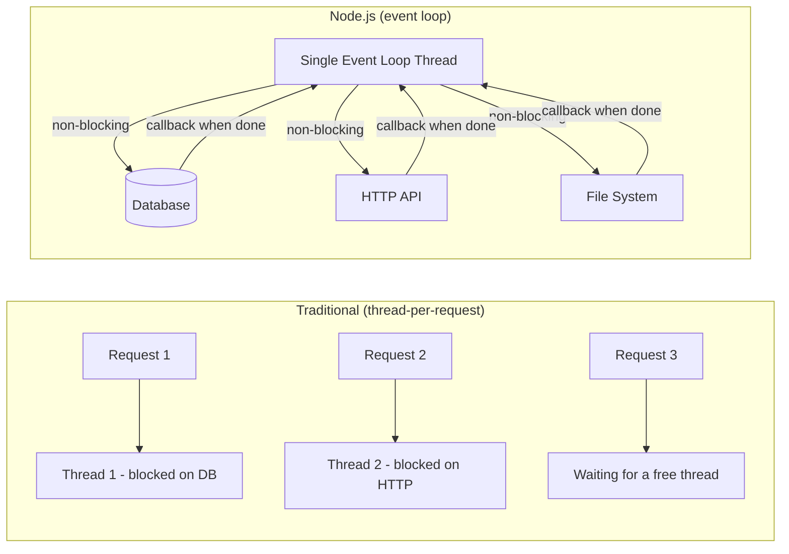
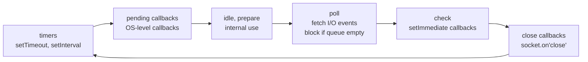

# Fundamentals

Node.js is not just JavaScript on the server. It is a runtime built on two core components: **V8** (Google's JavaScript engine that compiles JS to machine code) and **libuv** (a C library that provides the event loop, non-blocking I/O, and thread pool). Together they enable Node.js's defining property: single-threaded concurrent execution through the event loop.

---

## Why Node.js Is Different

Traditional server models (Apache/PHP, early Java EE) spawn a new thread per request. Each thread consumes ~1 MB of memory and OS context-switching is expensive. Under heavy load, you run out of threads.

Node.js takes a different approach: **one thread, never block, use callbacks/promises for I/O**.



Node.js excels at **I/O-bound** workloads: APIs, proxies, real-time apps. It is not the right choice for **CPU-bound** work (image processing, ML inference, cryptography) — those block the single thread and starve all other requests. Use worker threads or offload to a separate service for CPU-bound tasks.

---

## The Event Loop

The event loop is Node's scheduler. It continuously cycles through phases, processing callbacks queued in each phase:



### The three scheduling functions

```javascript
// Runs BEFORE the next event loop iteration (microtask queue)
process.nextTick(() => console.log('1: nextTick'));

// Runs BEFORE the next event loop iteration (Promise microtask)
Promise.resolve().then(() => console.log('2: Promise'));

// Runs IN the check phase of THIS or NEXT event loop iteration
setImmediate(() => console.log('3: setImmediate'));

// Runs IN the timers phase AFTER at least 0ms
setTimeout(() => console.log('4: setTimeout 0'), 0);

console.log('5: synchronous');

// Output order: 5, 1, 2, 4, 3 (setTimeout vs setImmediate varies outside I/O)
// Inside an I/O callback: 5, 1, 2, 3, 4 (setImmediate always beats setTimeout)
```

> **Rule of thumb:** `process.nextTick` > Promise microtasks > `setImmediate` > `setTimeout(0)`. `nextTick` runs after the current operation completes, before any I/O. Overuse can starve the event loop.

---

## CommonJS vs ESM

| | CommonJS (CJS) | ES Modules (ESM) |
|---|---|---|
| **Syntax** | `require()` / `module.exports` | `import` / `export` |
| **Loading** | Synchronous, dynamic | Asynchronous, static (analysed at parse time) |
| **File extension** | `.js` (default) | `.mjs` or `.js` with `"type": "module"` |
| **`__dirname`** | Available | Not available — use `import.meta.url` |
| **Top-level await** | Not supported | Supported |
| **Tree-shaking** | Poor (dynamic imports prevent static analysis) | Excellent |

```javascript
// CommonJS
const express = require('express');
const { readFile } = require('fs/promises');
module.exports = { startServer };

// ESM
import express from 'express';
import { readFile } from 'fs/promises';
export { startServer };

// ESM equivalent of __dirname
import { fileURLToPath } from 'url';
import { dirname, join } from 'path';
const __dirname = dirname(fileURLToPath(import.meta.url));
```

**Recommendation:** new projects should use ESM (`"type": "module"` in `package.json`). The ecosystem has largely migrated. Most frameworks (Fastify, Hono, Nest.js) fully support ESM.

---

## package.json Structure

```json
{
  "name": "order-service",
  "version": "1.0.0",
  "type": "module",
  "engines": {
    "node": ">=20.0.0",
    "pnpm": ">=8.0.0"
  },
  "scripts": {
    "start":   "node dist/index.js",
    "dev":     "tsx watch src/index.ts",
    "build":   "tsc",
    "test":    "vitest run",
    "test:watch": "vitest",
    "lint":    "eslint src --ext .ts",
    "typecheck": "tsc --noEmit"
  },
  "dependencies": {
    "fastify": "^4.26.0",
    "@fastify/postgres": "^5.0.0",
    "zod": "^3.22.0",
    "pino": "^8.18.0"
  },
  "devDependencies": {
    "typescript": "^5.4.0",
    "tsx": "^4.7.0",
    "vitest": "^1.4.0",
    "@types/node": "^20.0.0"
  }
}
```

### npm vs pnpm vs yarn

| | npm | pnpm | yarn |
|---|---|---|---|
| **Storage** | Copies to each `node_modules` | Hard-links from a global store | Copies or plug'n'play |
| **Disk usage** | High (duplication) | Very low (shared store) | Moderate |
| **Speed** | Baseline | ~2x faster than npm | Similar to npm |
| **Workspaces** | Yes (npm 7+) | Yes (best-in-class) | Yes |
| **Default on** | Node.js bundles it | Not bundled | Not bundled |

**pnpm** is the recommended choice for monorepos and CI/CD pipelines due to its speed and disk efficiency.
