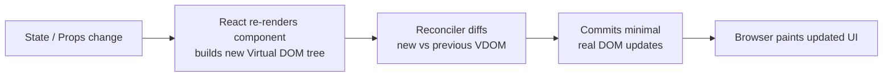

# React Fundamentals

React is a library for building user interfaces from components. Its core insight is simple: instead of manually manipulating the DOM when data changes, you describe what the UI should look like for any given state, and React figures out the minimum changes needed to make the real DOM match. This declarative model makes complex UIs vastly easier to reason about.

---

## How React Works: The Virtual DOM



The Virtual DOM is a lightweight JavaScript object tree that mirrors the real DOM structure. When state changes, React builds a new VDOM, diffs it against the previous one, and applies only the necessary real DOM mutations. This is why React is fast — real DOM operations are expensive; pure JavaScript object comparisons are cheap.

---

## JSX

JSX is syntactic sugar for `React.createElement` calls. Babel transforms it at build time:

```jsx
// JSX you write
const element = (
  <button className="btn" onClick={handleClick} disabled={isLoading}>
    {isLoading ? 'Saving...' : 'Save'}
  </button>
);

// What Babel compiles it to
const element = React.createElement(
  'button',
  { className: 'btn', onClick: handleClick, disabled: isLoading },
  isLoading ? 'Saving...' : 'Save'
);
```

### JSX rules

```jsx
// 1. Must return a single root element — use Fragment to avoid wrapper divs
return (
  <>
    <Header />
    <Main />
    <Footer />
  </>
);

// 2. className, not class; htmlFor, not for (reserved JS words)
<label htmlFor="email" className="label">Email</label>

// 3. Self-close tags that have no children
<Input />
<br />

// 4. Expressions in {}, not statements
<p>{count > 0 ? `${count} items` : 'No items'}</p>

// 5. Lists need unique, stable keys (NOT array index for dynamic lists)
{orders.map(order => (
  <OrderRow key={order.id} order={order} />
))}
```

> **Why do keys matter?** Keys tell React which list items are the same across renders. Without keys (or with index as key), React may re-use the wrong DOM elements when items are reordered or deleted, causing subtle bugs — wrong checkboxes staying checked, wrong inputs retaining values.

---

## Function Components

A function component is a plain JavaScript function that takes props and returns JSX:

```jsx
// Props are destructured in the parameter
function OrderCard({ order, onStatusChange, className = '' }) {
  return (
    <div className={`order-card ${className}`}>
      <h3>Order #{order.id}</h3>
      <p>Status: <strong>{order.status}</strong></p>
      <p>Total: ${order.total.toFixed(2)}</p>
      <button onClick={() => onStatusChange(order.id, 'confirmed')}>
        Confirm
      </button>
    </div>
  );
}

// Usage — props flow down, events bubble up
<OrderCard
  order={selectedOrder}
  onStatusChange={handleStatusChange}
  className="highlighted"
/>
```

### Children prop

```jsx
function Card({ title, children }) {
  return (
    <div className="card">
      <h2 className="card-title">{title}</h2>
      <div className="card-body">{children}</div>
    </div>
  );
}

// Usage
<Card title="Order Summary">
  <p>3 items</p>
  <p>Total: $49.99</p>
</Card>
```

---

## `useState` — Local Component State

```jsx
import { useState } from 'react';

function Counter() {
  const [count, setCount] = useState(0); // [current value, setter]

  // State updates are asynchronous and batched
  // Use the functional form when next state depends on previous state
  const increment = () => setCount(prev => prev + 1); // CORRECT
  const badIncrement = () => setCount(count + 1);     // may be stale in closures

  // Object state — always spread the previous value
  const [form, setForm] = useState({ name: '', email: '' });
  const updateField = (field, value) =>
    setForm(prev => ({ ...prev, [field]: value }));

  return (
    <div>
      <p>Count: {count}</p>
      <button onClick={increment}>+</button>
    </div>
  );
}
```

> **Never mutate state directly.** `state.count++` does not trigger a re-render. Always call the setter with a new value or new object reference.

---

## `useEffect` — Side Effects

`useEffect` runs after the component renders. Use it for data fetching, subscriptions, timers, and DOM interactions.

```jsx
import { useState, useEffect } from 'react';

function OrderDetails({ orderId }) {
  const [order, setOrder] = useState(null);
  const [loading, setLoading] = useState(true);
  const [error, setError] = useState(null);

  useEffect(() => {
    let cancelled = false;  // prevent setting state after unmount

    setLoading(true);
    fetchOrder(orderId)
      .then(data => {
        if (!cancelled) {
          setOrder(data);
          setLoading(false);
        }
      })
      .catch(err => {
        if (!cancelled) {
          setError(err.message);
          setLoading(false);
        }
      });

    // Cleanup function — runs before next effect or on unmount
    return () => { cancelled = true; };

  }, [orderId]); // Re-run whenever orderId changes

  if (loading) return <Spinner />;
  if (error)   return <ErrorMessage message={error} />;
  return <OrderCard order={order} />;
}
```

### Dependency array rules

| Dependency array | Effect runs |
|---|---|
| Omitted | After every render |
| `[]` (empty) | Once after first render (mount) |
| `[a, b]` | After first render + whenever `a` or `b` changes |

---

## `useContext` — Shared State Without Prop Drilling

```jsx
import { createContext, useContext, useState } from 'react';

// 1. Create context with a default value
const AuthContext = createContext(null);

// 2. Provider wraps the tree that needs the context
export function AuthProvider({ children }) {
  const [user, setUser] = useState(null);

  const login = async (email, password) => {
    const user = await authService.login(email, password);
    setUser(user);
  };

  const logout = () => setUser(null);

  return (
    <AuthContext.Provider value={{ user, login, logout }}>
      {children}
    </AuthContext.Provider>
  );
}

// 3. Custom hook — clean consumer API, hides context internals
export function useAuth() {
  const ctx = useContext(AuthContext);
  if (!ctx) throw new Error('useAuth must be used inside AuthProvider');
  return ctx;
}

// 4. Usage anywhere in the tree
function ProfileButton() {
  const { user, logout } = useAuth();
  return user
    ? <button onClick={logout}>{user.name} (Logout)</button>
    : <a href="/login">Login</a>;
}
```

---

## `useRef` — Refs and Mutable Values

`useRef` has two distinct uses: accessing DOM elements and storing mutable values that survive re-renders without triggering them.

```jsx
import { useRef, useEffect } from 'react';

function SearchInput({ autoFocus }) {
  // DOM ref — set ref prop on element, access via .current
  const inputRef = useRef(null);

  useEffect(() => {
    if (autoFocus) inputRef.current.focus();
  }, [autoFocus]);

  return <input ref={inputRef} type="search" placeholder="Search..." />;
}

function Timer() {
  const [seconds, setSeconds] = useState(0);
  // Mutable value — changes don't trigger re-render
  const intervalRef = useRef(null);

  const start = () => {
    intervalRef.current = setInterval(
      () => setSeconds(s => s + 1),
      1000
    );
  };

  const stop = () => clearInterval(intervalRef.current);

  return (
    <div>
      <p>{seconds}s</p>
      <button onClick={start}>Start</button>
      <button onClick={stop}>Stop</button>
    </div>
  );
}
```

---

## Controlled vs Uncontrolled Forms

```jsx
// CONTROLLED — React owns the value via state
function ControlledForm() {
  const [email, setEmail] = useState('');

  const handleSubmit = (e) => {
    e.preventDefault();
    console.log(email); // always up to date
  };

  return (
    <form onSubmit={handleSubmit}>
      <input
        type="email"
        value={email}                          // controlled by React state
        onChange={e => setEmail(e.target.value)}
      />
      <button type="submit">Submit</button>
    </form>
  );
}

// UNCONTROLLED — DOM owns the value, accessed via ref
function UncontrolledForm() {
  const emailRef = useRef(null);

  const handleSubmit = (e) => {
    e.preventDefault();
    console.log(emailRef.current.value); // read from DOM
  };

  return (
    <form onSubmit={handleSubmit}>
      <input type="email" defaultValue="" ref={emailRef} />
      <button type="submit">Submit</button>
    </form>
  );
}
```

| | Controlled | Uncontrolled |
|---|---|---|
| **Value stored in** | React state | DOM |
| **Real-time validation** | Easy | Requires event listeners |
| **Programmatic reset** | `setEmail('')` | `emailRef.current.value = ''` |
| **Best for** | Most forms, validation, dependent fields | Simple forms, file inputs, third-party DOM libs |
