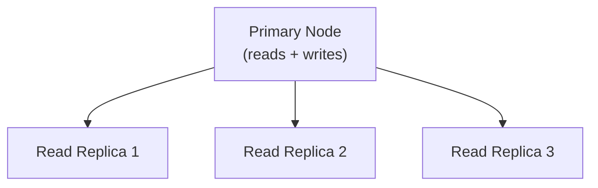
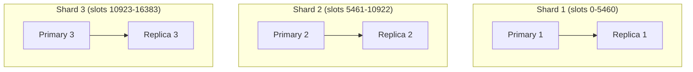

# AWS ElastiCache

Amazon ElastiCache is the fully managed Redis (and Memcached) service from AWS. It handles provisioning, patching, backups, monitoring, automatic failover, and Multi-AZ replication. You interact with ElastiCache exactly like a regular Redis instance — the same client libraries, the same commands — but without managing the underlying infrastructure.

---

## What ElastiCache Manages for You

| What you do self-hosted | ElastiCache handles it |
|---|---|
| Provision EC2 instances and install Redis | Automatic |
| OS patching and Redis version upgrades | Managed — you schedule the maintenance window |
| Multi-AZ replication and automatic failover | Automatic with Multi-AZ enabled |
| Backup and restore | Automated daily snapshots to S3 |
| CloudWatch metrics integration | Automatic |
| Parameter groups (tuning config) | Managed via Parameter Groups |
| Scaling node type (vertical) | Online scaling in newer versions |

**What ElastiCache does not manage:** your data model, key design, TTL strategy, eviction policy, and application-level patterns. Those remain entirely your responsibility.

---

## Cluster Mode Disabled vs Enabled

ElastiCache for Redis offers two cluster configurations with very different capabilities.

### Cluster mode disabled (replication group)

A single shard with one primary and up to 5 read replicas. Equivalent to a standalone Redis with Sentinel-style failover.



- **Full Redis command support** — no cross-slot limitations, MGET/MSET work on any keys
- **Automatic failover** — AWS promotes a replica if the primary fails
- **Vertical scaling only** — increase node type to add memory/CPU
- **Single node throughput ceiling** — all writes go to one primary

### Cluster mode enabled (sharded cluster)

Multiple shards, each with a primary and optional replicas. Each shard owns a range of the 16,384 hash slots.



- **Horizontal write scaling** — writes distributed across shards
- **Higher total memory** — N shards × node memory
- **Cross-slot limitations** — same as Redis Cluster: MGET/MSET only work with hash tags
- **Online shard scaling** — add or remove shards without downtime (ElastiCache handles resharding)

| | Cluster mode disabled | Cluster mode enabled |
|---|---|---|
| **Shards** | 1 | 1 to 500 |
| **Max nodes** | 1 primary + 5 replicas | Up to 500 shards × 6 nodes |
| **Multi-key ops** | Full support | Hash tags required |
| **Write scaling** | No | Yes |
| **Best for** | < 400 GB dataset, need full command support | > 400 GB or high write throughput |

---

## Creating an ElastiCache Cluster

```bash
# Cluster mode disabled — replication group
aws elasticache create-replication-group \
  --replication-group-id prod-redis \
  --replication-group-description "Production Redis" \
  --cache-node-type cache.r7g.xlarge \
  --engine redis \
  --engine-version 7.1 \
  --num-cache-clusters 3 \
  --automatic-failover-enabled \
  --multi-az-enabled \
  --security-group-ids sg-xxxxxx \
  --subnet-group-name prod-redis-subnet-group \
  --at-rest-encryption-enabled \
  --transit-encryption-enabled \
  --auth-token "<strong-token>"

# Get the primary endpoint
aws elasticache describe-replication-groups \
  --replication-group-id prod-redis \
  --query 'ReplicationGroups[0].NodeGroups[0].PrimaryEndpoint'
```

---

## Connecting from AWS Services

### Connecting from EC2 / ECS

ElastiCache nodes live in a VPC subnet. Clients must be in the same VPC or a peered VPC. A security group rule must allow the Redis port (6379 / 6380 for TLS).

```java
// application.properties — cluster mode disabled
// spring.data.redis.host=prod-redis.xxxxxx.0001.use1.cache.amazonaws.com
// spring.data.redis.port=6380
// spring.data.redis.password=<auth-token>
// spring.data.redis.ssl.enabled=true

// application.properties — cluster mode enabled
// spring.data.redis.cluster.nodes=prod-redis.cluster.xxxxxx.use1.cache.amazonaws.com:6380
// spring.data.redis.password=<auth-token>
// spring.data.redis.ssl.enabled=true

@Configuration
public class ElastiCacheConfig {

    @Bean
    public LettuceConnectionFactory redisConnectionFactory(
            @Value("${spring.data.redis.host}") String host,
            @Value("${spring.data.redis.port}") int port,
            @Value("${spring.data.redis.password}") String password) {
        RedisStandaloneConfiguration config = new RedisStandaloneConfiguration(host, port);
        config.setPassword(password);
        LettuceClientConfiguration clientConfig =
            LettuceClientConfiguration.builder().useSsl().build();
        return new LettuceConnectionFactory(config, clientConfig);
    }
}

// Inject and use as normal:
@Autowired private StringRedisTemplate redisTemplate;
```

### Connecting from Lambda

Lambda functions in a VPC can connect directly. Functions **outside** a VPC cannot reach ElastiCache. Use a VPC-attached Lambda with the appropriate security group.

```java
// Spring Boot Lambda (Spring Cloud Function / AWS Serverless Java Container)
// Spring manages the bean lifecycle — the bean is created once per container
// warm-start and reused across Lambda invocations in the same execution environment.

@Component
public class RedisLambdaHandler
        implements Function<APIGatewayProxyRequestEvent, APIGatewayProxyResponseEvent> {

    // Injected once at container startup — reused across warm invocations
    @Autowired
    private StringRedisTemplate redisTemplate;

    @Override
    public APIGatewayProxyResponseEvent apply(APIGatewayProxyRequestEvent event) {
        String value = redisTemplate.opsForValue().get("my-key");
        // process and return response
    }
}
```

> **Lambda connection pool:** Lambda freezes execution contexts between invocations. Initialise the Redis connection outside the handler function to reuse it across warm invocations.

---

## Parameter Groups

Parameter groups configure Redis settings for an ElastiCache cluster. You create a custom group, set properties, and associate it with the cluster.

```bash
aws elasticache create-cache-parameter-group \
  --cache-parameter-group-name prod-redis-params \
  --cache-parameter-group-family redis7 \
  --description "Production Redis 7 parameters"

aws elasticache modify-cache-parameter-group \
  --cache-parameter-group-name prod-redis-params \
  --parameter-name-values \
    ParameterName=maxmemory-policy,ParameterValue=allkeys-lru \
    ParameterName=activerehashing,ParameterValue=yes \
    ParameterName=lazyfree-lazy-eviction,ParameterValue=yes
```

Commonly tuned parameters:

| Parameter | Production recommendation |
|---|---|
| `maxmemory-policy` | `allkeys-lru` for pure cache; `volatile-lru` for mixed |
| `lazyfree-lazy-eviction` | `yes` — async eviction avoids latency spikes |
| `lazyfree-lazy-expire` | `yes` — async expiry deletion |
| `slowlog-log-slower-than` | `10000` (10ms) |
| `tcp-keepalive` | `300` |

---

## Global Datastore

Global Datastore replicates an ElastiCache cluster across AWS regions with sub-second lag, enabling low-latency reads close to users globally and active-passive disaster recovery.

```bash
aws elasticache create-global-replication-group \
  --global-replication-group-id-suffix prod-global \
  --primary-replication-group-id prod-redis

# Add a secondary region
aws elasticache create-replication-group \
  --replication-group-id prod-redis-eu \
  --global-replication-group-id global:prod-global \
  --replication-group-description "EU secondary" \
  --region eu-west-1
```

- Writes go to the primary region; the secondary region is read-only
- Typical replication lag < 500ms
- For active-active (writes in multiple regions), you need to manage conflict resolution at the application layer — Global Datastore does not provide it

---

## ElastiCache vs Self-Hosted Redis

| Dimension | ElastiCache | Self-hosted on EC2 / Kubernetes |
|---|---|---|
| **Ops burden** | Low — AWS handles patching, failover, backups | High — you manage everything |
| **Redis version** | Lags behind upstream by 6–12 months typically | Latest version immediately |
| **Configuration** | Limited to parameter groups — some options unavailable | Full redis.conf access |
| **Cost** | ~20–30% premium over equivalent EC2 cost | Lower raw cost; higher ops cost |
| **Failover speed** | ~30–60s for automatic failover | Depends on Sentinel config |
| **Multi-region** | Global Datastore (active-passive) | MirrorMaker or manual replication |
| **Compliance** | AWS-managed encryption, CloudTrail audit trail | You implement and audit |
| **Time to production** | Minutes | Hours to days |

**Use ElastiCache when:**
- Your team lacks Redis operations experience
- You are already deeply invested in AWS tooling (IAM, CloudWatch, VPC)
- Compliance requirements benefit from managed encryption and audit trails
- Scale is moderate — ElastiCache pricing becomes significant at very high throughput

**Use self-hosted when:**
- You need Redis configurations that parameter groups do not expose
- You need the latest Redis version features (e.g., Bloom Filter modules, RedisSearch)
- You need multi-cloud or on-premise deployment
- Raw infrastructure cost at high scale justifies the ops overhead

---

## Security

### In-transit and at-rest encryption

```bash
# Both enabled at cluster creation
aws elasticache create-replication-group \
  --at-rest-encryption-enabled \
  --transit-encryption-enabled \
  --auth-token "<strong-token>"
```

- **In-transit encryption:** TLS between client and ElastiCache nodes; connect on port 6380
- **At-rest encryption:** data encrypted on the underlying EBS volumes using AWS-managed keys

### VPC and security groups

ElastiCache nodes have no public IP. Network isolation is the primary security layer:

```bash
# Security group rule — allow Redis port only from app servers
aws ec2 authorize-security-group-ingress \
  --group-id sg-elasticache \
  --protocol tcp \
  --port 6380 \
  --source-group sg-app-servers
```

### AUTH tokens and IAM authentication

- **AUTH token:** a password passed in the `--auth-token` parameter. All connections must supply it.
- **Redis 6 ACLs:** ElastiCache supports Redis ACL users via parameter groups — create users with per-command and per-key-pattern permissions
- **IAM authentication (preview/limited):** some ElastiCache configurations support IAM-based token authentication; check the current AWS docs for the latest availability

### CloudWatch metrics

Key metrics to monitor and alert on:

| Metric | Alert threshold | Why it matters |
|---|---|---|
| `DatabaseMemoryUsagePercentage` | > 80% | Memory pressure approaching eviction |
| `CacheMisses` | Rising trend | Cache effectiveness degrading |
| `CacheHits` | Falling trend | Cache effectiveness degrading |
| `ReplicationLag` | > 10s | Replica too far behind for reliable failover |
| `EngineCPUUtilization` | > 70% | Redis event loop approaching saturation |
| `Evictions` | > 0 sustained | Memory is full and data is being dropped |
| `CurrConnections` | Near limit | Connection pool exhaustion approaching |
