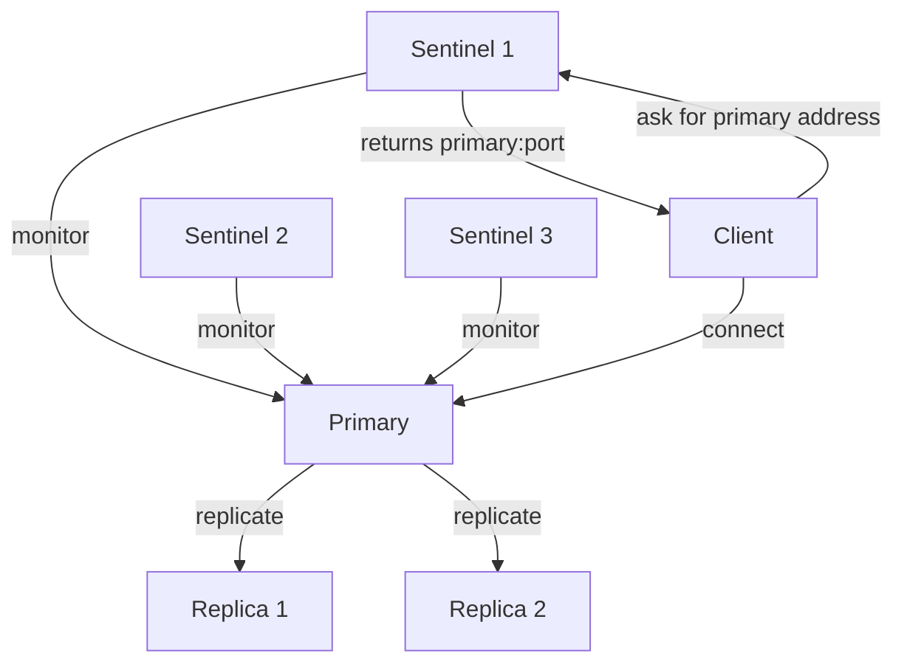
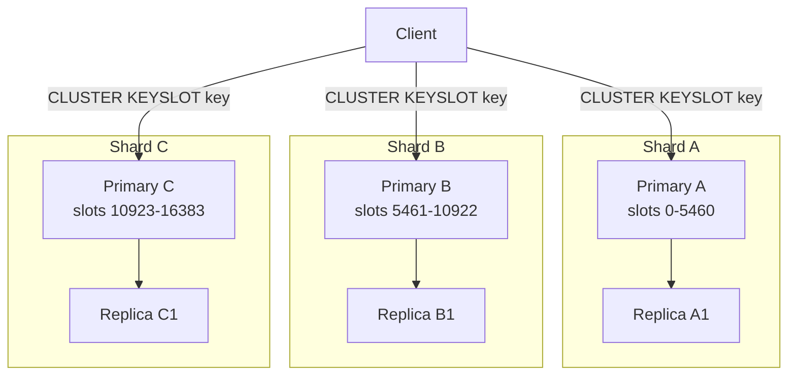

# Deployment

Redis ships as a single binary but supports three deployment topologies: a standalone instance for simplicity, Sentinel for automatic failover and high availability, and Cluster for horizontal sharding across multiple nodes. Choosing the right topology is one of the most consequential early decisions in a Redis deployment.

---

## Standalone

A standalone Redis instance is a single `redis-server` process with a primary/replica setup managed externally. It is the right starting point for most teams.

### Production configuration

```conf
# /etc/redis/redis.conf

# Networking
bind 127.0.0.1 10.0.1.5        # bind only to specific interfaces, not 0.0.0.0
protected-mode yes              # refuse connections outside the bound addresses
port 6379
tcp-backlog 511
tcp-keepalive 300               # send keepalive probes every 300s

# Memory
maxmemory 8gb
maxmemory-policy allkeys-lru

# Persistence
appendonly yes
appendfsync everysec
aof-use-rdb-preamble yes

# Security
requirepass <strong-password>
rename-command FLUSHALL ""      # disable dangerous commands in production
rename-command FLUSHDB ""
rename-command CONFIG ""
rename-command DEBUG ""

# Slow log
slowlog-log-slower-than 10000  # log commands slower than 10ms
slowlog-max-len 128

# Misc
daemonize yes
loglevel notice
logfile /var/log/redis/redis.log
```

### Read replicas

A replica is configured in the replica's `redis.conf`:

```conf
replicaof 10.0.1.5 6379
masterauth <primary-password>
replica-read-only yes           # replicas reject write commands
```

Replicas receive the full dataset on first connect (initial sync via RDB), then stream command increments. Use replicas for read-heavy workloads or as warm standbys.

### Standalone limitations

- **No automatic failover** — if the primary fails, a human or external tool must promote a replica
- **Single-node throughput ceiling** — everything runs on one instance
- **Single-point-of-failure** unless Sentinel is added

---

## Redis Sentinel

Sentinel is a distributed supervision system that monitors Redis instances and performs automatic failover when the primary becomes unavailable. It also provides service discovery — clients ask Sentinel for the current primary address rather than hardcoding it.



### Quorum and failover

Sentinel requires a **quorum** — a minimum number of Sentinels that must agree a primary is down before triggering failover. With 3 Sentinels and quorum=2:

1. Sentinel 1 marks primary as `subjectively down` (SDOWN) after `down-after-milliseconds`
2. Sentinels 1 and 2 agree → primary is `objectively down` (ODOWN) — quorum reached
3. Sentinels elect a leader among themselves
4. The leader promotes the best replica (most up-to-date)
5. All other replicas reconfigure to follow the new primary

Minimum recommended Sentinel count: **3** (quorum=2). An even number creates split-brain risks.

### Sentinel configuration

```conf
# /etc/redis/sentinel.conf  (same file on all 3 Sentinel nodes)

port 26379
sentinel monitor mymaster 10.0.1.5 6379 2    # monitor "mymaster" at IP:port, quorum=2
sentinel auth-pass mymaster <primary-password>
sentinel down-after-milliseconds mymaster 30000   # 30s to declare SDOWN
sentinel failover-timeout mymaster 180000          # max 3 min to complete failover
sentinel parallel-syncs mymaster 1                 # replicas to sync simultaneously
```

```bash
redis-server /etc/redis/sentinel.conf --sentinel
```

### Client-side discovery

Clients must query Sentinel for the current primary instead of hardcoding the primary IP:

```java
// application.properties
// spring.data.redis.sentinel.master=mymaster
// spring.data.redis.sentinel.nodes=10.0.1.10:26379,10.0.1.11:26379,10.0.1.12:26379
// spring.data.redis.password=<pass>

@Configuration
public class RedisConfig {

    @Bean
    public LettuceConnectionFactory redisConnectionFactory() {
        RedisSentinelConfiguration config =
            new RedisSentinelConfiguration("mymaster",
                Set.of("10.0.1.10:26379", "10.0.1.11:26379", "10.0.1.12:26379"));
        config.setPassword(RedisPassword.of("<pass>"));
        return new LettuceConnectionFactory(config);
    }
}

// Spring auto-routes writes to primary; inject StringRedisTemplate as usual
@Autowired StringRedisTemplate redisTemplate;

redisTemplate.opsForValue().set("key", "value");
String val = redisTemplate.opsForValue().get("key");
```

The client library handles reconnection and re-discovery automatically when failover happens.

### Sentinel limitations

- **No sharding** — still a single-primary write bottleneck
- **Failover takes 30+ seconds** depending on configuration — brief downtime during promotion
- **Clients must support Sentinel protocol** — not all Redis libraries do

---

## Redis Cluster

Redis Cluster shards data across multiple primary nodes using a fixed hash-slot mechanism. It provides both **horizontal write scaling** and **automatic failover** without Sentinel.



### Hash slots

Redis Cluster divides the keyspace into **16,384 hash slots**. Every key maps to exactly one slot via `CRC16(key) % 16384`. Each primary node owns a contiguous range of slots.

```redis
CLUSTER KEYSLOT user:42        -- returns the slot number for a key
CLUSTER INFO                   -- overall cluster health
CLUSTER NODES                  -- all nodes, their roles and slot ranges
```

### Cluster configuration

Minimum viable cluster: **3 primaries + 3 replicas** (one replica per primary).

```conf
# redis.conf (same structure for all 6 nodes, different ports/IPs)
port 7001
cluster-enabled yes
cluster-config-file nodes-7001.conf   # auto-managed by Redis
cluster-node-timeout 15000            # ms before a node is considered down
appendonly yes
```

```bash
# Start all 6 nodes, then create the cluster
redis-cli --cluster create \
  10.0.1.1:7001 10.0.1.2:7002 10.0.1.3:7003 \
  10.0.1.4:7004 10.0.1.5:7005 10.0.1.6:7006 \
  --cluster-replicas 1
```

### Cross-slot limitations

The most important constraint in Redis Cluster: **multi-key commands fail if the keys map to different slots**.

```redis
MGET user:1 user:2           -- fails if user:1 and user:2 are in different slots
SUNION set1 set2             -- fails if in different slots
```

**Solution — hash tags:** force multiple keys to the same slot by wrapping a common substring in `{}`:

```redis
SET {user:42}:profile <data>   -- slot = CRC16("user:42") % 16384
SET {user:42}:sessions <data>  -- same slot as above
MGET {user:42}:profile {user:42}:sessions   -- works — same slot
```

### Resharding

To add capacity, create new nodes and move slots:

```bash
redis-cli --cluster add-node 10.0.1.7:7007 10.0.1.1:7001   # add new node
redis-cli --cluster reshard 10.0.1.1:7001                   # interactive resharding
```

### Node failure and automatic failover

When a primary fails, the cluster promotes its replica automatically within `cluster-node-timeout * 2` (default 30 seconds). No Sentinel required.

The cluster enters a **partial availability** state (writes to the failed primary's slots fail) until the replica is promoted.

### Cluster vs Sentinel: choosing the right model

| | Standalone + Sentinel | Redis Cluster |
|---|---|---|
| **Write scaling** | No — single primary | Yes — multiple primaries |
| **Data capacity** | Single node RAM limit | N × single node RAM |
| **Failover** | ~30–60s automatic via Sentinel | ~15–30s automatic via cluster |
| **Multi-key ops** | Full support | Cross-slot limitations |
| **Client complexity** | Sentinel-aware client needed | Cluster-aware client needed |
| **Min nodes** | 1 primary + 2 replicas + 3 Sentinels | 6 (3 primary + 3 replica) |
| **Best for** | < 50 GB dataset, moderate write rate | > 50 GB or write-heavy, need to scale horizontally |
