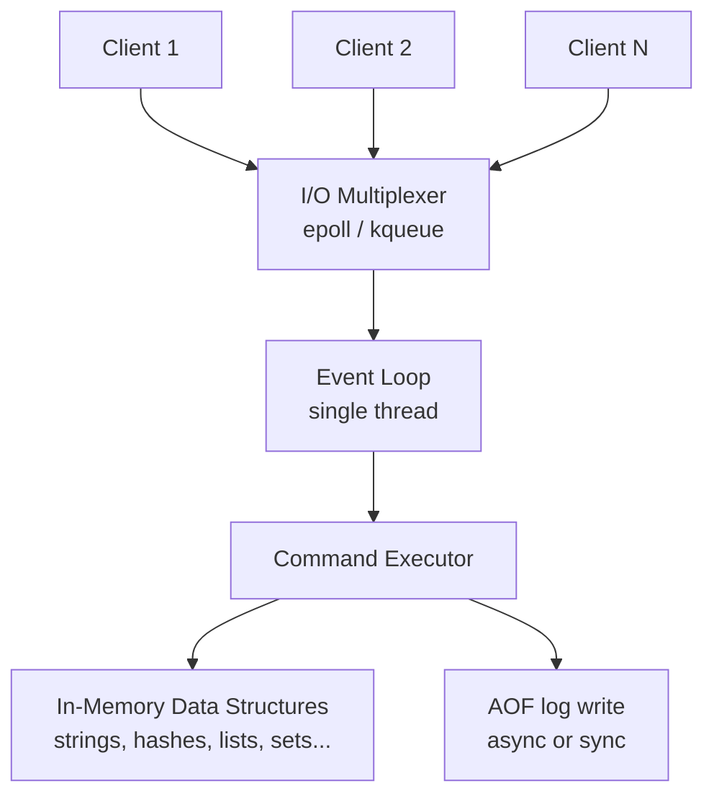

# Fundamentals

Redis is an in-memory data structure server. That one phrase contains its three most important properties: the data lives in RAM so reads and writes are measured in microseconds; it is a server so many applications share one instance over a network; and it stores rich data structures rather than just opaque byte blobs. Those properties combine to make Redis the most widely deployed caching, session, rate-limiting, and real-time data layer in production software.

Redis was created by Salvatore Sanfilippo in 2009 to solve a real scalability problem — a log-ingestion system that a relational database could not keep up with. It has been open-source ever since and is now maintained by Redis Ltd.

---

## What Redis Is Used For

Redis is not a single-purpose cache. Its data structures enable a wide range of production use cases:

| Use case | Redis feature used |
|---|---|
| **Application cache** | Strings with TTL — store serialised objects or query results |
| **Session store** | Hashes — per-user session fields with a sliding-window TTL |
| **Rate limiting** | Sorted sets or Lua scripts — sliding window counters |
| **Leaderboards** | Sorted sets — instant rank queries by score |
| **Pub/Sub** | Pub/Sub or Streams — fan-out of real-time events |
| **Distributed locks** | Strings with NX+EX — acquire-or-fail atomic operations |
| **Job queues** | Lists — reliable FIFO with BRPOPLPUSH patterns |
| **Feature flags** | Bitmaps — per-user flag state in sub-kilobyte structures |
| **Unique visitor counts** | HyperLogLogs — approximate cardinality in 12 KB |
| **Event log / stream** | Streams — ordered, consumer-group-aware event log |

---

## Architecture: Why Redis Is Fast

The counterintuitive truth about Redis is that it is single-threaded for command execution — yet it routinely handles **1 million operations per second** on a single instance. Understanding why requires understanding the architecture.

### Single-threaded event loop

Redis uses a single thread for command execution. When a command arrives:

1. The I/O multiplexer (`epoll` on Linux) collects all readable sockets without blocking
2. The event loop picks each ready socket and reads the full command
3. The command executor runs the operation against the in-memory data structures
4. The response is written back immediately

Because there is only one thread touching the data structures, there are no locks, no mutexes, no contention. An `INCR` is literally an integer increment in memory — no disk, no locking, no coordination.

> **Why single-threaded beats multi-threaded for pure cache workloads:** lock contention between threads has a measurable cost. Redis eliminates it entirely. Network I/O and kernel time dominate the latency budget, not CPU time on simple key lookups.

Since Redis 6.0, **I/O threads** (not command threads) run in parallel to handle network reading and writing, giving better throughput on high-connection workloads without changing the single-threaded command model.

### Memory model

Redis stores all data in RAM. It allocates memory through `jemalloc` and tracks usage precisely. The key implications:

- Every key has metadata overhead (roughly 50–100 bytes) in addition to the value
- Redis uses internal encodings to compact small values: a sorted set with fewer than 128 members uses a `listpack` instead of a `skiplist`, saving significant memory
- When `maxmemory` is reached, Redis either refuses new writes or evicts existing keys depending on the configured eviction policy

### Persistence is optional

Redis can operate as a pure in-memory store with no durability, or with periodic snapshots (RDB), an append-only log (AOF), or both. This is covered in depth in the Operations page. The key point architecturally is that **persistence is an add-on**, not the default I/O path — which is why Redis can be so fast.

---

## Redis vs Alternatives

### Redis vs Memcached

Memcached is the original distributed memory cache. Both are fast, but they solve different problems.

| | Redis | Memcached |
|---|---|---|
| **Data model** | Rich: strings, hashes, lists, sets, sorted sets, streams | Strings only |
| **Persistence** | RDB, AOF, or both | None |
| **Replication** | Built-in primary/replica | External only |
| **Clustering** | Redis Cluster (built-in) | Client-side sharding only |
| **Atomic operations** | INCR, LPUSH, ZADD, Lua scripts | CAS only |
| **Pub/Sub** | Yes | No |
| **Memory efficiency** | Slightly higher overhead per key | Marginally lower overhead for simple strings |
| **Best for** | Any use case that needs more than a string store | Simple shared string cache where Memcached is already deployed |

> **Rule of thumb:** If you are starting fresh, choose Redis. Memcached's only remaining advantage is marginally lower memory overhead for pure string caches — rarely decisive.

### Redis vs DynamoDB with TTL

DynamoDB is often used as a "cache with TTL" for session data or token storage. It works, but the comparison is stark:

| | Redis | DynamoDB + TTL |
|---|---|---|
| **Read latency** | < 1 ms (sub-millisecond) | 1–10 ms (single-digit ms) |
| **Cost model** | Fixed per instance | Pay per request / provisioned capacity |
| **Data structures** | Rich (sorted sets, streams, etc.) | Key-value document only |
| **TTL precision** | Millisecond (PEXPIRE) | Second granularity, background deletion |
| **Ops burden** | You manage it (or use ElastiCache) | Fully managed, zero ops |
| **Best for** | Any latency-sensitive use case | Teams already using DynamoDB who want managed infrastructure |

### Redis vs Hazelcast

Hazelcast is an in-memory data grid primarily used in the JVM ecosystem.

| | Redis | Hazelcast |
|---|---|---|
| **Language** | Polyglot — clients in every language | JVM-first, other clients are secondary |
| **Deployment** | Standalone server process | Embedded in the application JVM or standalone |
| **Data structures** | Rich key-value structures | Maps, queues, topics, plus near-cache |
| **Distributed compute** | Limited (Lua scripts, Streams) | First-class: distributed jobs, EntryProcessors |
| **Ecosystem maturity** | Massive — ubiquitous in every stack | Strong in enterprise Java, less universal |
| **Best for** | General-purpose cache, session, pub-sub in any language | Enterprise Java applications needing embedded distributed compute |

---

## When to Use Redis

**Redis is the right choice when:**
- You need sub-millisecond read and write latency — DynamoDB and relational databases cannot match it
- You need a data structure beyond a simple string — leaderboards (sorted sets), queues (lists), or feature flags (bitmaps)
- You need atomic operations that require consistency — `INCR` for counters, `SETNX` for locks, Lua scripts for compound operations
- You need pub/sub or event streaming at moderate scale — Redis Pub/Sub and Streams cover most use cases
- You are building on a polyglot stack — Redis clients exist for every major language and framework

**Redis is not the right choice when:**
- You need durable ACID transactions with rollback — use a relational database; Redis transactions are not ACID
- Your dataset exceeds available RAM and you cannot shard — Redis Cluster helps but eventually you need disk-backed storage
- You need rich query capabilities (joins, aggregations, full-text search) — Redis is not a query engine
- You need zero operational overhead and can absorb slightly higher latency — managed options like DynamoDB or ElastiCache may simplify operations
