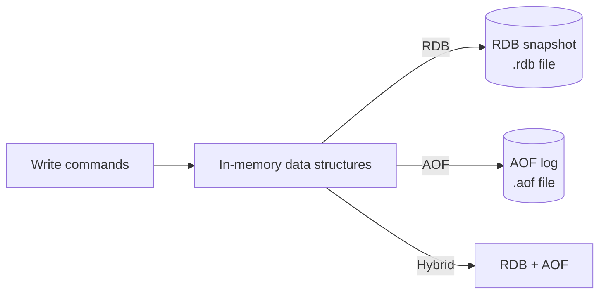
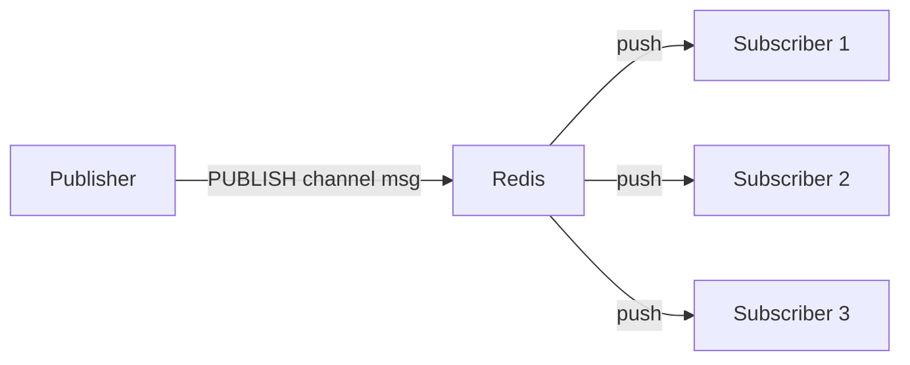
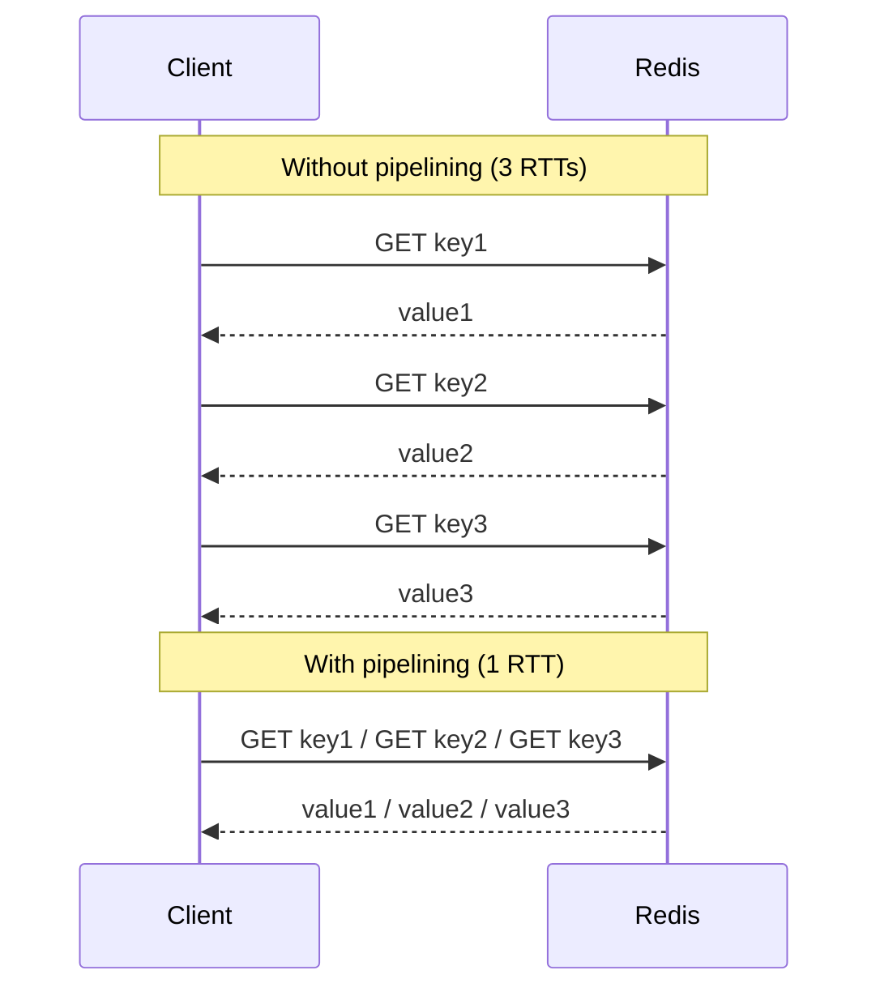

# Operations

Beyond storing data, Redis gives you fine-grained control over how long data lives, what happens when memory is full, how changes survive restarts, and how to execute multiple commands atomically. This page covers the six operational building blocks you need to run Redis reliably.

---

## Persistence

Redis is in-memory first, but it offers three persistence strategies. Choosing the right one is one of the most important Redis deployment decisions.



### RDB — Point-in-time snapshots

RDB creates a compact binary snapshot of the entire dataset at configured intervals.

```conf
# redis.conf
save 3600 1      # snapshot if >=1 key changed in 3600s
save 300 100     # snapshot if >=100 keys changed in 300s
save 60 10000    # snapshot if >=10000 keys changed in 60s
dbfilename dump.rdb
dir /var/lib/redis
```

Redis uses `fork()` to create a child process that writes the snapshot while the parent continues serving requests. The child gets a copy-on-write view of memory — actual data pages are only duplicated when the parent modifies them.

| Aspect | Detail |
|---|---|
| **File size** | Very compact — binary format, no command history |
| **Recovery time** | Fast — load one file at startup |
| **Data loss risk** | Up to the configured interval — e.g., up to 60 seconds |
| **Fork overhead** | Brief latency spike during fork on large datasets (GB+) |
| **Best for** | Backup, disaster recovery, or use cases where some data loss is acceptable |

### AOF — Append-Only File

AOF logs every write command as it executes. On restart, Redis replays the log to reconstruct the dataset.

```conf
appendonly yes
appendfilename "appendonly.aof"

# fsync policy — the critical tradeoff
appendfsync always      # fsync after every command — safest, slowest
appendfsync everysec    # fsync every second — good default (at most 1s data loss)
appendfsync no          # OS decides when to flush — fastest, highest risk
```

AOF files grow over time. Redis rewrites them in the background:

```conf
auto-aof-rewrite-percentage 100   # rewrite when AOF doubles from last rewrite
auto-aof-rewrite-min-size 64mb
```

| Aspect | Detail |
|---|---|
| **Data loss risk** | At most 1 second with `everysec`; zero with `always` |
| **File size** | Larger than RDB — grows continuously until rewrite |
| **Recovery time** | Slower than RDB on large datasets — replays all commands |
| **Best for** | Durability-critical use cases: session data, locks, counters |

### Hybrid (RDB + AOF) — Recommended for production

Since Redis 4.0, hybrid mode combines both: the AOF file starts with an embedded RDB snapshot, then appends only the commands since the snapshot.

```conf
appendonly yes
aof-use-rdb-preamble yes          # enabled by default in Redis 5+
```

- **Recovery:** fast (load RDB preamble) + minimal replay (AOF tail)
- **Durability:** at most 1 second data loss with `appendfsync everysec`
- **Recommended default** for most production deployments

### No persistence

For a pure ephemeral cache where data loss is acceptable on restart:

```conf
save ""          # disable RDB
appendonly no    # disable AOF
```

All data is lost on restart or crash. This is the configuration for a pure L2 cache in front of a database.

---

## Expiry and Eviction

### TTL mechanics

Redis tracks expiry per key with millisecond precision. When a key expires, it is removed lazily (on access) and periodically by a background scan.

```redis
SET  key value EX 300          -- expire in 300 seconds
SET  key value PX 300000       -- expire in 300 milliseconds
EXPIRE    key seconds
PEXPIRE   key milliseconds
EXPIREAT  key unix-timestamp
PEXPIREAT key unix-ms-timestamp
TTL   key                       -- seconds remaining; -1 = no TTL; -2 = key gone
PTTL  key                       -- milliseconds remaining
PERSIST key                     -- remove TTL, make key permanent
```

Redis uses two mechanisms to delete expired keys:
1. **Lazy expiry:** check and delete when the key is accessed
2. **Active expiry:** background scan cycles through random samples of keys with TTLs, deleting expired ones — runs ~10 times per second

### Eviction policies

When `maxmemory` is reached, Redis applies the eviction policy before refusing new writes:

```conf
maxmemory 4gb
maxmemory-policy allkeys-lru    # evict any key using LRU approximation
```

| Policy | Behaviour | Best for |
|---|---|---|
| `noeviction` | Return error on write when full | When data loss is unacceptable (durable stores) |
| `allkeys-lru` | Evict least-recently-used from all keys | General-purpose cache — keeps hot data in memory |
| `allkeys-lfu` | Evict least-frequently-used from all keys | Workloads with stable hot keys accessed repeatedly |
| `allkeys-random` | Evict random key from all keys | When access pattern is genuinely uniform |
| `volatile-lru` | LRU eviction from keys with TTL only | Preserve keys without TTL (permanent data) |
| `volatile-lfu` | LFU eviction from keys with TTL only | Same as volatile-lru with frequency tracking |
| `volatile-random` | Random eviction from keys with TTL only | When all TTL keys are equally expendable |
| `volatile-ttl` | Evict the key with the shortest TTL first | Cache where soonest-to-expire is least valuable |

> **Production recommendation:** use `allkeys-lru` for pure caches. Use `volatile-lru` if your Redis instance mixes permanent data (no TTL) with cached data (with TTL) — this protects the permanent data from eviction.

---

## Pub/Sub

Redis Pub/Sub implements a fire-and-forget message fan-out. Publishers send messages to a channel; all current subscribers receive it instantly.

```redis
-- Subscriber terminal
SUBSCRIBE notifications:user:42
-- or wildcard
PSUBSCRIBE notifications:*

-- Publisher terminal
PUBLISH notifications:user:42 '{"type":"message","text":"Hello"}'
```

### Fan-out behaviour

When a message is published to a channel, Redis immediately delivers it to all connected subscribers. There is no buffering, no persistence, and no acknowledgement.



### Pub/Sub vs Streams

| | Pub/Sub | Streams |
|---|---|---|
| **Durability** | None — message lost if no subscriber connected | Persistent in memory (configurable MAXLEN) |
| **Replay** | No | Yes — read from any past ID |
| **Consumer groups** | No | Yes — multiple independent groups |
| **Delivery guarantee** | At-most-once | At-least-once with XACK |
| **Best for** | Real-time UI pushes, live notifications where loss is tolerable | Reliable async processing, audit logs |

> **Use Streams instead of Pub/Sub** when: subscribers can be offline, you need delivery guarantees, or you need replay. Pub/Sub is only appropriate for ephemeral real-time fan-out.

---

## Transactions

Redis transactions execute a batch of commands atomically — no other client's commands can interleave within a MULTI/EXEC block.

```redis
MULTI                           -- start transaction
SET balance:alice 900
SET balance:bob 1100
EXEC                            -- execute atomically
```

### WATCH — Optimistic locking

`WATCH` marks keys to monitor. If any watched key is modified before `EXEC`, the transaction is aborted (returns nil).

```redis
WATCH balance:alice
val = GET balance:alice         -- read current value
if val < 100:
    DISCARD                     -- abort if insufficient
    return "insufficient funds"
MULTI
DECRBY balance:alice 100
INCRBY balance:bob  100
result = EXEC                   -- nil if someone else modified balance:alice
if result == nil:
    retry()                     -- retry the whole optimistic loop
```

### What Redis transactions are NOT

Redis transactions are **not ACID** in the relational-database sense:

| Property | Redis transaction |
|---|---|
| **Atomicity** | Yes — all commands execute or none (if DISCARD); but NOT if a command has a runtime error (e.g., wrong type) — partial execution happens |
| **Consistency** | Application-defined — Redis does not enforce constraints |
| **Isolation** | Yes — no interleaving with other clients during EXEC |
| **Durability** | Depends on persistence config — not guaranteed without AOF |

> **Prefer Lua scripts over transactions** when you need atomic compound operations with conditional logic. Lua scripts are atomic, avoid the WATCH/retry loop, and have better error handling.

---

## Pipelining

Pipelining batches multiple commands in a single network round-trip, dramatically reducing latency for bulk operations.

```java
// Without pipelining — N round trips
for (String userId : userIds) {
    redisTemplate.opsForValue().increment("visits:" + userId);
}

// With pipelining — 1 round trip
redisTemplate.executePipelined((RedisCallback<Object>) connection -> {
    for (String userId : userIds) {
        connection.stringCommands().incr(
            ("visits:" + userId).getBytes()
        );
    }
    return null;
});
```



### Pipeline vs MULTI/EXEC

| | Pipelining | MULTI/EXEC |
|---|---|---|
| **Atomicity** | No — commands may interleave with other clients | Yes — atomic block |
| **Latency** | 1 RTT for entire batch | 1 RTT (if pipelined together) |
| **Error handling** | Each command returns its own result | EXEC returns array of results |
| **Use when** | Speed matters, order not critical | Atomicity required |

> Pipelining and MULTI/EXEC can be combined — `MULTI` through `EXEC` in one pipeline call — for both speed and atomicity.

---

## Lua Scripting

Lua scripts execute atomically on the Redis server. The entire script runs without interruption, making complex conditional operations safe without the WATCH/retry pattern.

```redis
EVAL script numkeys key [key ...] arg [arg ...]
EVALSHA sha1 numkeys key [key ...]
SCRIPT LOAD script          -- cache script, returns SHA1
SCRIPT EXISTS sha1 [sha1 ...]
SCRIPT FLUSH                -- clear script cache
```

### Atomic rate-limiter example

```lua
-- KEYS[1] = rate limit key (e.g., "rl:user:123")
-- ARGV[1] = window in seconds
-- ARGV[2] = max requests
local current = redis.call('INCR', KEYS[1])
if current == 1 then
    redis.call('EXPIRE', KEYS[1], tonumber(ARGV[1]))
end
if current > tonumber(ARGV[2]) then
    return 0  -- rejected
end
return 1      -- allowed
```

```redis
EVAL <script> 1 rl:user:123 60 100
```

This atomically increments, sets TTL on first call, and checks the limit — impossible to do safely with a WATCH/MULTI/EXEC loop under high concurrency.

### When to use Lua scripts

- **Atomic check-and-act:** check a condition and act on it without another client changing state between the two operations
- **Complex rate limiting:** token bucket or sliding-window logic that requires multiple data structure operations
- **Transactional inventory decrement:** check stock > 0, decrement, return result — all atomic
- **Custom eviction logic:** inspect multiple keys and conditionally clean up

> **Performance note:** Lua scripts block all other commands while running. Keep scripts short and fast — avoid loops over large datasets or external calls inside a script.
