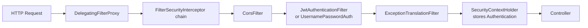

# Security

Spring Security is a filter-based security framework. Every request passes through a chain of security filters before reaching your controllers. The configuration has changed significantly in Spring Security 6 — `WebSecurityConfigurerAdapter` is gone, replaced by `SecurityFilterChain` beans.

---

## Spring Security Architecture



**`SecurityContextHolder`** stores the current user's `Authentication` object per-thread:

```java
// Anywhere in your application — get the current user
Authentication auth = SecurityContextHolder.getContext().getAuthentication();
String username = auth.getName();
Collection<? extends GrantedAuthority> roles = auth.getAuthorities();

// In a controller method
@GetMapping("/me")
public UserResponse getCurrentUser(@AuthenticationPrincipal UserDetails user) {
    return UserResponse.from(user);
}
```

---

## SecurityFilterChain Configuration

```java
@Configuration
@EnableWebSecurity
@EnableMethodSecurity  // enables @PreAuthorize, @PostAuthorize, @Secured
public class SecurityConfig {

    @Bean
    public SecurityFilterChain securityFilterChain(HttpSecurity http) throws Exception {
        return http
            .csrf(csrf -> csrf.disable())                     // stateless API: no CSRF
            .cors(cors -> cors.configurationSource(corsConfig()))
            .sessionManagement(s -> s
                .sessionCreationPolicy(SessionCreationPolicy.STATELESS))
            .headers(h -> h
                .httpStrictTransportSecurity(hsts -> hsts.maxAgeInSeconds(31536000))
                .frameOptions(frame -> frame.deny())           // X-Frame-Options: DENY
                .contentTypeOptions(Customizer.withDefaults()) // X-Content-Type-Options: nosniff
                .xssProtection(Customizer.withDefaults()))
            .authorizeHttpRequests(auth -> auth
                .requestMatchers("/api/v1/auth/**").permitAll()
                .requestMatchers("/actuator/health/**").permitAll()
                .requestMatchers(HttpMethod.GET, "/api/v1/products/**").permitAll()
                .requestMatchers("/api/v1/admin/**").hasRole("ADMIN")
                .requestMatchers("/api/v1/orders/**").hasAnyRole("USER", "ADMIN")
                .anyRequest().authenticated())
            .addFilterBefore(jwtAuthFilter, UsernamePasswordAuthenticationFilter.class)
            .exceptionHandling(ex -> ex
                .authenticationEntryPoint((req, res, e) ->
                    res.sendError(401, "Unauthorized"))
                .accessDeniedHandler((req, res, e) ->
                    res.sendError(403, "Forbidden")))
            .build();
    }

    @Bean
    public AuthenticationManager authManager(AuthenticationConfiguration cfg) throws Exception {
        return cfg.getAuthenticationManager();
    }

    @Bean
    public PasswordEncoder passwordEncoder() {
        return new BCryptPasswordEncoder(12);  // strength 12 = current recommended minimum
    }
}
```

---

## JWT Authentication Filter

```java
@Component
public class JwtAuthenticationFilter extends OncePerRequestFilter {

    private final JwtService jwtService;
    private final UserDetailsService userDetailsService;

    @Override
    protected void doFilterInternal(HttpServletRequest req, HttpServletResponse res,
                                    FilterChain chain) throws ServletException, IOException {
        String header = req.getHeader(HttpHeaders.AUTHORIZATION);
        if (header == null || !header.startsWith("Bearer ")) {
            chain.doFilter(req, res);
            return;
        }

        String token = header.substring(7);
        String username;
        try {
            username = jwtService.extractUsername(token);
        } catch (JwtException e) {
            chain.doFilter(req, res);
            return;
        }

        if (username != null && SecurityContextHolder.getContext().getAuthentication() == null) {
            UserDetails user = userDetailsService.loadUserByUsername(username);
            if (jwtService.isTokenValid(token, user)) {
                var auth = new UsernamePasswordAuthenticationToken(
                    user, null, user.getAuthorities());
                auth.setDetails(new WebAuthenticationDetailsSource().buildDetails(req));
                SecurityContextHolder.getContext().setAuthentication(auth);
            }
        }
        chain.doFilter(req, res);
    }
}
```

---

## JWT Service

```java
@Service
public class JwtService {

    @Value("${app.jwt.secret}")
    private String secretKey;

    @Value("${app.jwt.expiration-ms:86400000}")  // 24h default
    private long expirationMs;

    @Value("${app.jwt.refresh-expiration-ms:604800000}")  // 7d default
    private long refreshExpirationMs;

    public String generateToken(UserDetails user) {
        return buildToken(user, expirationMs);
    }

    public String generateRefreshToken(UserDetails user) {
        return buildToken(user, refreshExpirationMs);
    }

    private String buildToken(UserDetails user, long ttl) {
        return Jwts.builder()
            .claims(Map.of(
                "roles", user.getAuthorities().stream()
                    .map(GrantedAuthority::getAuthority).toList()
            ))
            .subject(user.getUsername())
            .issuedAt(new Date())
            .expiration(new Date(System.currentTimeMillis() + ttl))
            .signWith(getSigningKey(), Jwts.SIG.HS256)
            .compact();
    }

    public String extractUsername(String token) {
        return extractClaims(token).getSubject();
    }

    public boolean isTokenValid(String token, UserDetails user) {
        return extractUsername(token).equals(user.getUsername())
            && !extractClaims(token).getExpiration().before(new Date());
    }

    private Claims extractClaims(String token) {
        return Jwts.parser()
            .verifyWith(getSigningKey()).build()
            .parseSignedClaims(token).getPayload();
    }

    private SecretKey getSigningKey() {
        return Keys.hmacShaKeyFor(Decoders.BASE64.decode(secretKey));
    }
}

// Refresh token endpoint
@PostMapping("/api/v1/auth/refresh")
public TokenResponse refresh(@RequestHeader("Authorization") String bearerToken) {
    String refreshToken = bearerToken.substring(7);
    String username = jwtService.extractUsername(refreshToken);
    UserDetails user = userDetailsService.loadUserByUsername(username);
    if (!jwtService.isTokenValid(refreshToken, user)) {
        throw new InvalidTokenException("Refresh token expired or invalid");
    }
    return new TokenResponse(
        jwtService.generateToken(user),
        jwtService.generateRefreshToken(user)
    );
}
```

---

## UserDetailsService

```java
@Service
public class UserDetailsServiceImpl implements UserDetailsService {

    private final UserRepository userRepo;

    @Override
    public UserDetails loadUserByUsername(String email) throws UsernameNotFoundException {
        return userRepo.findByEmail(email)
            .map(user -> User.withUsername(user.getEmail())
                .password(user.getPasswordHash())
                .authorities(user.getRoles().stream()
                    .map(r -> new SimpleGrantedAuthority("ROLE_" + r.name()))
                    .toArray(GrantedAuthority[]::new))
                .accountExpired(!user.isActive())
                .credentialsExpired(user.isPasswordExpired())
                .disabled(!user.isEnabled())
                .build())
            .orElseThrow(() -> new UsernameNotFoundException("User not found: " + email));
    }
}
```

---

## Method-Level Security

```java
@Service
public class OrderService {

    @PreAuthorize("hasRole('ADMIN') or @orderSecurity.isOwner(#id, authentication.name)")
    public Order findById(UUID id) { ... }

    @PreAuthorize("hasRole('ADMIN')")
    public void delete(UUID id) { ... }

    @PreAuthorize("hasAnyRole('USER', 'ADMIN')")
    @PostAuthorize("returnObject.customerId == authentication.name or hasRole('ADMIN')")
    public Order create(CreateOrderRequest req) { ... }
}

// Custom SpEL component for @PreAuthorize
@Component("orderSecurity")
public class OrderSecurityExpression {
    private final OrderRepository repo;

    public boolean isOwner(UUID orderId, String email) {
        return repo.findById(orderId)
            .map(o -> o.getCustomerEmail().equals(email))
            .orElse(false);
    }
}
```

---

## OAuth2 Resource Server

```java
// Validate JWT tokens from an external OAuth2 provider (Keycloak, Auth0, Cognito)
@Bean
public SecurityFilterChain resourceServer(HttpSecurity http) throws Exception {
    return http
        .oauth2ResourceServer(oauth2 -> oauth2
            .jwt(jwt -> jwt
                .decoder(JwtDecoders.fromIssuerLocation("https://auth.example.com"))
                .jwtAuthenticationConverter(jwtToAuthConverter())))
        .authorizeHttpRequests(auth -> auth.anyRequest().authenticated())
        .build();
}

@Bean
public JwtAuthenticationConverter jwtToAuthConverter() {
    JwtGrantedAuthoritiesConverter conv = new JwtGrantedAuthoritiesConverter();
    conv.setAuthoritiesClaimName("roles");  // claim name in your JWT
    conv.setAuthorityPrefix("ROLE_");

    JwtAuthenticationConverter jwtConv = new JwtAuthenticationConverter();
    jwtConv.setJwtGrantedAuthoritiesConverter(conv);
    return jwtConv;
}
```

---

## Testing with Spring Security

```java
@WebMvcTest(OrderController.class)
@Import(SecurityConfig.class)  // include security config
class OrderControllerTest {

    @Autowired MockMvc mockMvc;
    @MockBean  OrderService orderService;

    // Test as a specific user
    @Test
    @WithMockUser(username = "alice@example.com", roles = {"USER"})
    void getOrder_returnsOrder() throws Exception {
        when(orderService.findById(any())).thenReturn(Optional.of(mockOrder));
        mockMvc.perform(get("/api/v1/orders/{id}", UUID.randomUUID()))
               .andExpect(status().isOk());
    }

    // Test with custom UserDetails
    @Test
    @WithUserDetails("alice@example.com")  // loads from UserDetailsService
    void createOrder_succeeds() throws Exception { ... }

    // Test unauthenticated access
    @Test
    void getOrder_withoutAuth_returns401() throws Exception {
        mockMvc.perform(get("/api/v1/orders/{id}", UUID.randomUUID()))
               .andExpect(status().isUnauthorized());
    }

    // Test forbidden (wrong role)
    @Test
    @WithMockUser(roles = "USER")
    void deleteOrder_asUser_returns403() throws Exception {
        mockMvc.perform(delete("/api/v1/admin/orders/{id}", UUID.randomUUID()))
               .andExpect(status().isForbidden());
    }
}
```
