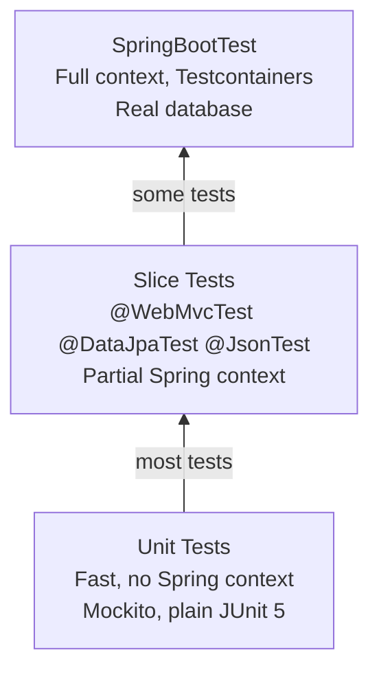

# Testing

Spring Boot provides testing support at every layer. The key principle: test each layer with the minimum Spring context needed. `@SpringBootTest` starts the full application — only use it for true integration tests.

---

## The Testing Pyramid



---

## JUnit 5 and Mockito

```java
@ExtendWith(MockitoExtension.class)
class OrderServiceTest {

    @Mock OrderRepository orderRepo;
    @Mock PaymentService paymentService;
    @Mock ApplicationEventPublisher eventPublisher;
    @InjectMocks OrderService orderService;

    @Captor ArgumentCaptor<Order> orderCaptor;   // captures argument passed to mock
    @Captor ArgumentCaptor<OrderCreatedEvent> eventCaptor;

    @Test
    void placeOrder_savesAndPublishesEvent() {
        // Arrange
        var req = new PlaceOrderRequest("cust-1", List.of(item()));
        var saved = order(UUID.randomUUID(), OrderStatus.PENDING);
        when(orderRepo.save(any())).thenReturn(saved);

        // Act
        orderService.placeOrder(req);

        // Assert — capture what was passed to save()
        verify(orderRepo).save(orderCaptor.capture());
        Order captured = orderCaptor.getValue();
        assertThat(captured.getCustomerId()).isEqualTo("cust-1");
        assertThat(captured.getStatus()).isEqualTo(OrderStatus.PENDING);

        // Assert event was published
        verify(eventPublisher).publishEvent(eventCaptor.capture());
        assertThat(eventCaptor.getValue().orderId()).isEqualTo(saved.getId());
    }

    @Test
    void placeOrder_throwsWhenNoItems() {
        var req = new PlaceOrderRequest("cust-1", List.of());
        assertThatThrownBy(() -> orderService.placeOrder(req))
            .isInstanceOf(InvalidOrderException.class)
            .hasMessageContaining("items");
    }

    @Test
    void placeOrder_rollsBackOnPaymentFailure() {
        when(orderRepo.save(any())).thenReturn(mockOrder);
        doThrow(new PaymentException("Card declined"))
            .when(paymentService).charge(any(), any());

        assertThatThrownBy(() -> orderService.placeOrder(validReq()))
            .isInstanceOf(PaymentException.class);
    }

    @ParameterizedTest
    @CsvSource({"1, 9.99, 9.99", "5, 9.99, 49.95", "10, 9.99, 99.90"})
    void calculateTotal(int qty, BigDecimal price, BigDecimal expected) {
        assertThat(orderService.calculateTotal(price, qty)).isEqualByComparingTo(expected);
    }

    @ParameterizedTest
    @EnumSource(value = OrderStatus.class, names = {"SHIPPED", "DELIVERED"})
    void confirm_throwsWhenAlreadyFinalised(OrderStatus status) {
        Order order = order(UUID.randomUUID(), status);
        assertThatThrownBy(() -> orderService.confirm(order))
            .isInstanceOf(IllegalStateException.class);
    }

    @ParameterizedTest
    @MethodSource("invalidRequests")
    void placeOrder_throwsOnInvalidInput(PlaceOrderRequest req) {
        assertThatThrownBy(() -> orderService.placeOrder(req));
    }
    static Stream<PlaceOrderRequest> invalidRequests() {
        return Stream.of(
            new PlaceOrderRequest(null, List.of(item())),   // null customer
            new PlaceOrderRequest("", List.of(item())),    // blank customer
            new PlaceOrderRequest("cust-1", List.of())     // empty items
        );
    }

    // Spy: wraps real object but allows overriding specific methods
    @Test
    void usingSpyToStubOneMethod() {
        OrderService spiedService = spy(new OrderService(orderRepo, paymentService, eventPublisher));
        doReturn(BigDecimal.TEN).when(spiedService).calculateDiscount(any());
        // Rest of methods use real implementation
    }
}
```

### AssertJ — fluent assertions

```java
// String assertions
assertThat(order.getId().toString()).startsWith("order").hasSize(36);

// Collection assertions
assertThat(orders)
    .hasSize(3)
    .extracting(Order::getStatus)
    .containsOnly(OrderStatus.CONFIRMED);

assertThat(orders)
    .filteredOn(o -> o.getTotal().compareTo(BigDecimal.valueOf(100)) > 0)
    .hasSize(2);

// Exception assertions
assertThatThrownBy(() -> service.delete(nonExistentId))
    .isInstanceOf(ResourceNotFoundException.class)
    .hasMessageContaining(nonExistentId.toString())
    .hasNoCause();

// Soft assertions (collect all failures, report at once)
SoftAssertions softly = new SoftAssertions();
softly.assertThat(order.getId()).isNotNull();
softly.assertThat(order.getStatus()).isEqualTo(OrderStatus.PENDING);
softly.assertThat(order.getTotal()).isGreaterThan(BigDecimal.ZERO);
softly.assertAll();  // throws if any assertion failed
```

---

## `@WebMvcTest` — Controller Slice

Starts only the web layer. Service layer must be mocked with `@MockBean`.

```java
@WebMvcTest(OrderController.class)
@WithMockUser(roles = "USER")  // default security context for all tests
class OrderControllerTest {

    @Autowired MockMvc mockMvc;
    @Autowired ObjectMapper objectMapper;
    @MockBean  OrderService orderService;

    @Test
    void getOrder_returnsOrder() throws Exception {
        var id = UUID.randomUUID();
        when(orderService.findById(id)).thenReturn(Optional.of(mockOrder(id)));

        mockMvc.perform(get("/api/v1/orders/{id}", id)
                        .accept(MediaType.APPLICATION_JSON))
               .andExpect(status().isOk())
               .andExpect(content().contentType(MediaType.APPLICATION_JSON))
               .andExpect(jsonPath("$.id").value(id.toString()))
               .andExpect(jsonPath("$.status").value("PENDING"))
               .andExpect(jsonPath("$.items").isArray())
               .andExpect(jsonPath("$.items.length()").value(2));
    }

    @Test
    void createOrder_withInvalidBody_returns400() throws Exception {
        var req = new CreateOrderRequest(null, List.of(), null, null);

        mockMvc.perform(post("/api/v1/orders")
                        .contentType(MediaType.APPLICATION_JSON)
                        .content(objectMapper.writeValueAsString(req)))
               .andExpect(status().isBadRequest())
               .andExpect(jsonPath("$.title").value("Validation Failed"))
               .andExpect(jsonPath("$.errors").isArray());
    }

    @Test
    @WithMockUser(roles = "ADMIN")
    void deleteOrder_asAdmin_returns204() throws Exception {
        mockMvc.perform(delete("/api/v1/orders/{id}", UUID.randomUUID()))
               .andExpect(status().isNoContent());
        verify(orderService).delete(any(UUID.class));
    }
}
```

---

## `@DataJpaTest` — Repository Slice

Starts only JPA layer with an embedded H2 database. For real DB tests, use Testcontainers.

```java
@DataJpaTest
@TestPropertySource(properties = "spring.jpa.hibernate.ddl-auto=create-drop")
class OrderRepositoryTest {

    @Autowired OrderRepository orderRepo;
    @Autowired TestEntityManager em;

    @Test
    void findByCustomerId_returnsOnlyThatCustomersOrders() {
        UUID cid1 = UUID.randomUUID();
        UUID cid2 = UUID.randomUUID();
        em.persist(order(cid1, PENDING));
        em.persist(order(cid1, CONFIRMED));
        em.persist(order(cid2, PENDING));  // different customer
        em.flush();

        List<Order> result = orderRepo.findByCustomerId(cid1);

        assertThat(result).hasSize(2)
            .extracting(Order::getCustomerId)
            .containsOnly(cid1);
    }

    @Test
    void findHighValueRecent_filtersCorrectly() {
        Instant cutoff = Instant.now().minus(7, ChronoUnit.DAYS);
        em.persist(order(UUID.randomUUID(), CONFIRMED, BigDecimal.valueOf(500), Instant.now()));
        em.persist(order(UUID.randomUUID(), CONFIRMED, BigDecimal.valueOf(50),  Instant.now()));    // too cheap
        em.persist(order(UUID.randomUUID(), CONFIRMED, BigDecimal.valueOf(500), cutoff.minus(1, DAYS))); // too old
        em.flush();

        List<Order> result = orderRepo.findHighValueRecent(cutoff, BigDecimal.valueOf(100));

        assertThat(result).hasSize(1);
    }
}
```

---

## `@JsonTest` — JSON Serialisation Slice

Tests Jackson serialisation/deserialisation in isolation:

```java
@JsonTest
class OrderResponseJsonTest {

    @Autowired JacksonTester<OrderResponse> json;

    @Test
    void serialise_includesAllFields() throws Exception {
        var response = new OrderResponse(UUID.randomUUID(), "CONFIRMED", BigDecimal.valueOf(99.99));

        var result = json.write(response);

        assertThat(result).hasJsonPathStringValue("$.id");
        assertThat(result).extractingJsonPathStringValue("$.status").isEqualTo("CONFIRMED");
        assertThat(result).doesNotHaveJsonPath("$.internalField");  // must be excluded
    }

    @Test
    void deserialise_handlesSnakeCaseFields() throws Exception {
        String raw = """
            { "order_id": "123", "customer_id": "abc", "total_amount": 49.99 }
            """;

        assertThat(json.parseObject(raw).customerId()).isEqualTo("abc");
    }
}
```

---

## `@SpringBootTest` — Full Integration Tests

```java
@SpringBootTest(webEnvironment = SpringBootTest.WebEnvironment.RANDOM_PORT)
// WebEnvironment options:
// MOCK (default) — mock servlet environment, use MockMvc
// RANDOM_PORT    — real server on random port, use TestRestTemplate or WebTestClient
// DEFINED_PORT   — real server on server.port
// NONE           — no web layer
@ActiveProfiles("test")
@Testcontainers
class OrderIntegrationTest {

    @Container
    static PostgreSQLContainer<?> postgres =
        new PostgreSQLContainer<>("postgres:16-alpine")
            .withDatabaseName("orders_test")
            .withUsername("test").withPassword("test");

    @DynamicPropertySource
    static void configure(DynamicPropertyRegistry registry) {
        registry.add("spring.datasource.url",      postgres::getJdbcUrl);
        registry.add("spring.datasource.username", postgres::getUsername);
        registry.add("spring.datasource.password", postgres::getPassword);
    }

    @Autowired TestRestTemplate restTemplate;  // available with RANDOM_PORT
    @Autowired OrderRepository orderRepo;

    @Test
    @Sql("/test-data/orders.sql")             // populate test data
    void getOrder_endToEnd() {
        ResponseEntity<OrderResponse> response =
            restTemplate.withBasicAuth("user", "password")
                        .getForEntity("/api/v1/orders/{id}", OrderResponse.class, knownId);

        assertThat(response.getStatusCode()).isEqualTo(HttpStatus.OK);
        assertThat(response.getBody().status()).isEqualTo("CONFIRMED");
    }
}
```

---

## `@MockBean` vs `@SpyBean`

| | `@MockBean` | `@SpyBean` |
|---|---|---|
| **Creates** | Mockito mock replacing the bean | Mockito spy wrapping the real bean |
| **Default behaviour** | All methods return null/0/false | Delegates to real implementation |
| **Use when** | Stub all interactions | Stub one method, use real logic elsewhere |

---

## Asynchronous Testing with Awaitility

```java
@Test
void asyncOrder_eventuallyConfirmed() throws InterruptedException {
    UUID id = orderService.submitAsync(validRequest());

    // Don't Thread.sleep() — use Awaitility
    await()
        .atMost(Duration.ofSeconds(5))
        .pollInterval(Duration.ofMillis(100))
        .untilAsserted(() -> {
            Order order = orderRepo.findById(id).orElseThrow();
            assertThat(order.getStatus()).isEqualTo(OrderStatus.CONFIRMED);
        });
}
```
