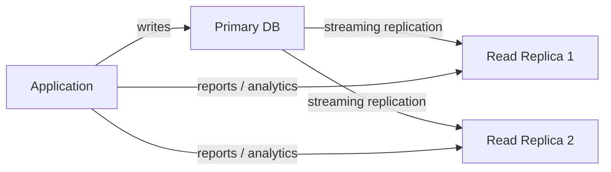

# Design Patterns

Good schema design prevents performance problems before they appear. Poor design forces expensive migrations and workarounds later. This page covers the structural patterns that matter most in production relational databases.

---

## Schema Design Principles

### Immutable events, mutable state

Store events (things that happened) and state (current view) separately:

```sql
-- Mutable state table
CREATE TABLE order_status (
    order_id   UUID PRIMARY KEY REFERENCES orders(id),
    status     VARCHAR(20) NOT NULL,
    updated_at TIMESTAMPTZ DEFAULT NOW()
);

-- Immutable event log
CREATE TABLE order_events (
    id         UUID PRIMARY KEY DEFAULT gen_random_uuid(),
    order_id   UUID NOT NULL REFERENCES orders(id),
    event_type VARCHAR(50) NOT NULL,  -- 'created', 'confirmed', 'shipped'
    payload    JSONB,
    created_at TIMESTAMPTZ DEFAULT NOW()
);
CREATE INDEX idx_order_events_order ON order_events (order_id, created_at);
```

### Soft deletes

```sql
-- Instead of DELETE, set deleted_at
ALTER TABLE products ADD COLUMN deleted_at TIMESTAMPTZ;

-- Partial unique index: enforce uniqueness only on active rows
CREATE UNIQUE INDEX idx_products_sku_active
ON products (sku)
WHERE deleted_at IS NULL;

-- All queries should filter deleted rows
SELECT * FROM products WHERE deleted_at IS NULL;
-- Use a view to make this automatic:
CREATE VIEW active_products AS
    SELECT * FROM products WHERE deleted_at IS NULL;
```

### JSONB for flexible attributes

```sql
-- Store variable product attributes without schema changes
ALTER TABLE products ADD COLUMN attributes JSONB DEFAULT '{}';

-- Electronics: { "voltage": "220V", "wattage": 60 }
-- Clothing:    { "material": "cotton", "sizes": ["S","M","L"] }
UPDATE products
SET attributes = '{"voltage": "220V", "wattage": 60}'
WHERE id = 'electronics-product-id';

-- Query JSONB fields
SELECT * FROM products
WHERE attributes->>'material' = 'cotton';

-- GIN index makes JSONB queries fast
CREATE INDEX idx_products_attrs ON products USING GIN (attributes);
```

---

## Denormalisation Trade-offs

Normalisation eliminates redundancy. Denormalisation deliberately introduces redundancy to avoid expensive JOINs. The right balance depends on your read/write ratio.

```sql
-- Normalised: requires JOIN to get customer email on every order query
SELECT o.id, c.email FROM orders o JOIN customers c ON c.id = o.customer_id;

-- Denormalised: customer_email stored in orders
-- Faster reads, but email updates must update orders too
ALTER TABLE orders ADD COLUMN customer_email VARCHAR(320);

-- Common denormalisation: pre-computed order total stored on the order
-- Instead of summing order_items.quantity * unit_price every time
ALTER TABLE orders ADD COLUMN total NUMERIC(12, 2) NOT NULL DEFAULT 0;
-- Maintain via trigger or application code on every item change
```

| Denormalisation | When it is appropriate |
|---|---|
| Snapshot at transaction time | Store unit_price on order_items (price may change later) |
| Cached aggregates | Store total on orders (avoid summing items every read) |
| Redundant lookup columns | Store customer_email on orders (audit trail, faster queries) |
| Materialised views | Pre-computed reports for dashboards |

---

## Table Partitioning

Partitioning splits a large table into smaller physical partitions by a key, while presenting one logical table to queries:

```sql
-- Range partitioning by date (common for time-series data)
CREATE TABLE orders (
    id         UUID NOT NULL,
    created_at TIMESTAMPTZ NOT NULL,
    customer_id UUID NOT NULL,
    total      NUMERIC(12,2)
) PARTITION BY RANGE (created_at);

CREATE TABLE orders_2025 PARTITION OF orders
    FOR VALUES FROM ('2025-01-01') TO ('2026-01-01');
CREATE TABLE orders_2026 PARTITION OF orders
    FOR VALUES FROM ('2026-01-01') TO ('2027-01-01');

-- PostgreSQL routes queries to the right partition automatically
-- WHERE created_at >= '2026-01-01' only scans orders_2026

-- Hash partitioning: evenly distribute writes
CREATE TABLE events (
    id          UUID NOT NULL,
    user_id     UUID NOT NULL,
    event_type  TEXT NOT NULL,
    created_at  TIMESTAMPTZ
) PARTITION BY HASH (user_id);

CREATE TABLE events_0 PARTITION OF events FOR VALUES WITH (MODULUS 4, REMAINDER 0);
CREATE TABLE events_1 PARTITION OF events FOR VALUES WITH (MODULUS 4, REMAINDER 1);
CREATE TABLE events_2 PARTITION OF events FOR VALUES WITH (MODULUS 4, REMAINDER 2);
CREATE TABLE events_3 PARTITION OF events FOR VALUES WITH (MODULUS 4, REMAINDER 3);
```

---

## Read Replicas

Read replicas receive a continuous stream of changes from the primary and serve read-only queries. Route heavy analytics or reports to replicas to offload the primary.



**Important:** replicas have replication lag (milliseconds to seconds). Never read your own writes from a replica immediately after writing to the primary.

---

## Connection Pooling with PgBouncer

PostgreSQL connections are expensive (each is a full OS process). PgBouncer pools connections between your application and the database:

```ini
; pgbouncer.ini
[databases]
orders_db = host=db-primary.internal dbname=orders

[pgbouncer]
listen_port = 6432
listen_addr = *
auth_type = scram-sha-256
pool_mode = transaction   ; best for stateless apps; connection returned to pool after each transaction
max_client_conn = 1000    ; max app connections to PgBouncer
default_pool_size = 25    ; max real DB connections per (db, user) pair
min_pool_size = 5
```

| Pool mode | Connection returned to pool | Use when |
|---|---|---|
| `session` | When client disconnects | Apps using session-level features (SET, temp tables) |
| `transaction` | After COMMIT/ROLLBACK | Stateless apps — best throughput |
| `statement` | After each statement | Only for simple SELECT apps; breaks multi-statement transactions |
