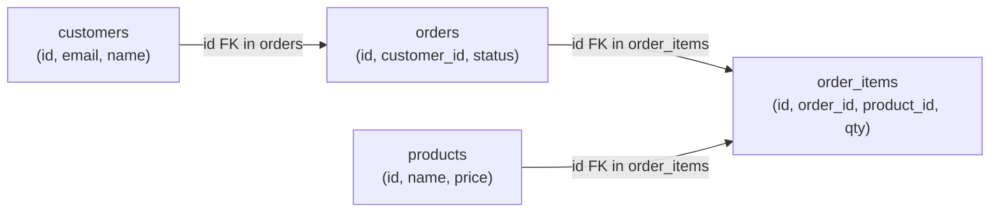

# Fundamentals

A relational database organises data into tables with rows and columns, and enforces relationships between tables through keys and constraints. This structure — invented by E.F. Codd in 1970 — remains the dominant model for transactional data because it provides strong consistency guarantees, a mature query language (SQL), and decades of operational tooling.

---

## The Relational Model

Every piece of data lives in exactly one place (a single table, a single row), and other tables reference it by key rather than duplicating it. This is the foundation of data integrity: update a customer's email in one row and every order, invoice, and log entry that references that customer automatically sees the new value.



---

## Tables, Columns, and Data Types

```sql
CREATE TABLE customers (
    id          UUID        PRIMARY KEY DEFAULT gen_random_uuid(),
    email       VARCHAR(320) NOT NULL UNIQUE,
    name        VARCHAR(200) NOT NULL,
    phone       VARCHAR(20),
    created_at  TIMESTAMPTZ NOT NULL DEFAULT NOW(),
    is_active   BOOLEAN     NOT NULL DEFAULT TRUE
);
```

### Common PostgreSQL types

| Type | Use for |
|---|---|
| `UUID` | Surrogate primary keys (globally unique, safe to expose in URLs) |
| `SERIAL` / `BIGSERIAL` | Auto-incrementing integer keys (simpler, but reveals record counts) |
| `VARCHAR(n)` | Bounded strings (email, name, status codes) |
| `TEXT` | Unbounded strings (descriptions, markdown content) |
| `INTEGER` / `BIGINT` | Whole numbers; use BIGINT for anything that could exceed ~2 billion |
| `NUMERIC(p,s)` | Exact decimal arithmetic — always use for money, never `FLOAT` |
| `BOOLEAN` | True/false flags |
| `DATE` | Calendar date without time |
| `TIMESTAMPTZ` | Timestamp with timezone — store all timestamps in UTC |
| `JSONB` | Structured semi-schema data; indexed, binary-stored, queryable |
| `ARRAY` | Homogeneous list (tags, permissions) |

> **Never use `FLOAT` or `DOUBLE` for money.** Floating-point cannot represent most decimal fractions exactly. `0.1 + 0.2 = 0.30000000000000004` in floating-point. Use `NUMERIC(19, 4)` for financial values.

---

## Primary and Foreign Keys

```sql
-- Surrogate primary key (UUID)
CREATE TABLE orders (
    id          UUID PRIMARY KEY DEFAULT gen_random_uuid(),
    customer_id UUID NOT NULL REFERENCES customers(id) ON DELETE RESTRICT,
    status      VARCHAR(20) NOT NULL DEFAULT 'pending',
    total       NUMERIC(12, 2) NOT NULL,
    created_at  TIMESTAMPTZ DEFAULT NOW()
);

-- Composite primary key
CREATE TABLE order_items (
    order_id   UUID REFERENCES orders(id)   ON DELETE CASCADE,
    product_id UUID REFERENCES products(id) ON DELETE RESTRICT,
    quantity   INTEGER NOT NULL CHECK (quantity > 0),
    unit_price NUMERIC(10, 2) NOT NULL,
    PRIMARY KEY (order_id, product_id)
);
```

### ON DELETE behaviour

| Action | What happens when parent row is deleted |
|---|---|
| `RESTRICT` | Block the delete if children exist |
| `CASCADE` | Delete all child rows automatically |
| `SET NULL` | Set the FK column to NULL in child rows |
| `NO ACTION` | Like RESTRICT but deferred (checked at end of transaction) |

---

## Constraints

```sql
CREATE TABLE products (
    id           UUID PRIMARY KEY DEFAULT gen_random_uuid(),
    sku          VARCHAR(50) NOT NULL UNIQUE,            -- unique constraint
    name         VARCHAR(200) NOT NULL,
    price        NUMERIC(10, 2) NOT NULL CHECK (price >= 0),  -- check constraint
    stock        INTEGER NOT NULL DEFAULT 0 CHECK (stock >= 0),
    category     VARCHAR(50) NOT NULL,
    deleted_at   TIMESTAMPTZ                             -- nullable = optional
);

-- Named constraint (easier to reference in error messages)
ALTER TABLE products
ADD CONSTRAINT chk_price_positive CHECK (price > 0);
```

---

## Normalization

Normalization eliminates redundancy by organising data so each fact is stored exactly once. The goal is to prevent **update anomalies** (changing a customer's name in 47 order rows) and **insert anomalies** (not being able to add a product until it has at least one order).

### 1NF — Atomic values, no repeating groups

```sql
-- VIOLATES 1NF: phone numbers in a single column
-- customer: { id, name, phones: "555-1234, 555-5678" }

-- 1NF: separate table for multi-valued attribute
CREATE TABLE customer_phones (
    customer_id UUID REFERENCES customers(id),
    phone       VARCHAR(20) NOT NULL,
    type        VARCHAR(10) NOT NULL, -- 'mobile', 'home', 'work'
    PRIMARY KEY (customer_id, phone)
);
```

### 2NF — No partial dependencies (all non-key columns depend on the whole PK)

```sql
-- VIOLATES 2NF: product_name depends only on product_id, not the full PK
CREATE TABLE order_items_bad (
    order_id     UUID,
    product_id   UUID,
    product_name TEXT,   -- depends only on product_id, not on (order_id, product_id)
    quantity     INT,
    PRIMARY KEY (order_id, product_id)
);

-- 2NF: product_name belongs in products table
CREATE TABLE order_items (
    order_id   UUID,
    product_id UUID REFERENCES products(id),
    quantity   INT,
    unit_price NUMERIC(10,2), -- snapshot of price at time of order (OK here)
    PRIMARY KEY (order_id, product_id)
);
```

### 3NF — No transitive dependencies

```sql
-- VIOLATES 3NF: zip_code → city (city depends on zip, not directly on customer id)
CREATE TABLE customers_bad (
    id       UUID PRIMARY KEY,
    zip_code VARCHAR(10),
    city     VARCHAR(100)   -- transitively dependent: id → zip → city
);

-- 3NF: normalise zip codes
CREATE TABLE zip_codes (
    zip_code VARCHAR(10) PRIMARY KEY,
    city     VARCHAR(100) NOT NULL,
    state    VARCHAR(2) NOT NULL
);
CREATE TABLE customers (
    id       UUID PRIMARY KEY,
    zip_code VARCHAR(10) REFERENCES zip_codes(zip_code)
);
```

---

## PostgreSQL vs MySQL

| | PostgreSQL | MySQL |
|---|---|---|
| **Compliance** | Most SQL-standard compliant RDBMS | Good; some deviations from standard |
| **JSON support** | JSONB (binary, indexed, fully queryable) | JSON (text-based, limited indexing) |
| **Window functions** | Full support | Full support (MySQL 8+) |
| **CTEs** | Fully materialised + optimised | Full support (MySQL 8+) |
| **Replication** | Logical + streaming replication | Binary log replication |
| **Partitioning** | Declarative (range, list, hash) | Range, list, hash, key |
| **Extensions** | PostGIS, pg_trgm, pgcrypto, TimescaleDB | Limited |
| **Default isolation** | READ COMMITTED | REPEATABLE READ |
| **Best for** | Complex queries, JSONB, geospatial, analytics | High-write OLTP, simple web apps, wide hosting support |

> **For new projects:** PostgreSQL is the default recommendation. It is stricter, more standards-compliant, and has better support for complex queries and extensions.
