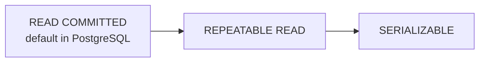

# Transactions & Concurrency

A transaction is a sequence of SQL operations that executes as an atomic unit. Either all succeed and are committed, or all are rolled back. Transactions are what make databases reliable in the face of crashes, network failures, and concurrent access.

---

## ACID Properties

| Property | Meaning | Example |
|---|---|---|
| **Atomicity** | All operations succeed or none do | Transferring money: debit and credit happen together or neither does |
| **Consistency** | Transaction moves DB from one valid state to another | Constraints, FK integrity, CHECK constraints still hold after commit |
| **Isolation** | Concurrent transactions do not interfere | Two users booking the last seat don't both succeed |
| **Durability** | Committed data survives crashes | WAL ensures committed transactions survive power failure |

---

## Transaction Lifecycle

```sql
BEGIN;  -- or START TRANSACTION

  UPDATE accounts SET balance = balance - 500 WHERE id = 'alice';
  UPDATE accounts SET balance = balance + 500 WHERE id = 'bob';
  INSERT INTO transfers (from_id, to_id, amount) VALUES ('alice', 'bob', 500);

COMMIT;  -- make permanent

-- If anything goes wrong:
ROLLBACK;  -- undo everything since BEGIN

-- Savepoints for partial rollback
BEGIN;
  INSERT INTO orders ...; 
  SAVEPOINT before_items;
  INSERT INTO order_items ...;   -- may fail
  -- if items fail, roll back to savepoint but keep the order
  ROLLBACK TO SAVEPOINT before_items;
  -- handle the error, try again or continue
COMMIT;
```

---

## Isolation Levels

Isolation defines how much one transaction sees of other concurrent transactions. Higher isolation = fewer anomalies = more locking overhead.



| Isolation Level | Dirty Read | Non-repeatable Read | Phantom Read |
|---|---|---|---|
| READ UNCOMMITTED | Possible | Possible | Possible |
| READ COMMITTED | Not possible | Possible | Possible |
| REPEATABLE READ | Not possible | Not possible | Possible |
| SERIALIZABLE | Not possible | Not possible | Not possible |

### Anomaly definitions

**Dirty read:** reading data written by another transaction that has NOT yet committed. If that transaction rolls back, you read data that never officially existed.

**Non-repeatable read:** reading the same row twice in one transaction and getting different values because another transaction modified and committed it in between.

**Phantom read:** running the same query twice in one transaction returns different sets of rows because another transaction inserted or deleted rows in between.

```sql
-- Set isolation level for a session
SET SESSION CHARACTERISTICS AS TRANSACTION ISOLATION LEVEL REPEATABLE READ;

-- Set for a single transaction
BEGIN ISOLATION LEVEL SERIALIZABLE;
  -- complex multi-step business logic
COMMIT;
```

---

## Row-Level Locking

`SELECT FOR UPDATE` acquires an exclusive lock on selected rows, preventing other transactions from modifying them until your transaction commits.

```sql
-- Inventory reservation pattern
BEGIN;

  SELECT stock FROM products
  WHERE id = 'product-123'
  FOR UPDATE;  -- lock this row
  -- other transactions trying to SELECT FOR UPDATE on same row will wait

  -- Now safely check and update
  UPDATE products
  SET stock = stock - 1
  WHERE id = 'product-123'
    AND stock > 0;

  -- If no rows updated, stock was 0 — rollback
COMMIT;

-- FOR SHARE: allows other readers but blocks writers
SELECT * FROM products WHERE id = 'product-123' FOR SHARE;

-- NOWAIT: fail immediately if lock not available (no waiting)
SELECT * FROM orders WHERE id = 'order-123' FOR UPDATE NOWAIT;

-- SKIP LOCKED: skip rows that are already locked (queue worker pattern)
SELECT * FROM job_queue
WHERE status = 'pending'
ORDER BY created_at
LIMIT 10
FOR UPDATE SKIP LOCKED;
```

### The queue worker pattern with SKIP LOCKED

```sql
-- Multiple workers can safely pull unique jobs without locking each other
-- Worker 1 picks job rows 1-10 (locked), Worker 2 skips them and picks 11-20
UPDATE job_queue
SET status = 'processing', worker_id = $1, started_at = NOW()
WHERE id IN (
    SELECT id FROM job_queue
    WHERE status = 'pending'
    ORDER BY priority DESC, created_at ASC
    LIMIT 1
    FOR UPDATE SKIP LOCKED
)
RETURNING *;
```

---

## MVCC — Multi-Version Concurrency Control

PostgreSQL uses MVCC to provide read/write concurrency without readers blocking writers or vice versa. Every row has hidden `xmin` (created by transaction X) and `xmax` (deleted/updated by transaction X) columns.

When you read a row, PostgreSQL checks the transaction IDs to determine which version of the row is visible to your transaction. This means:
- **Readers never block writers**
- **Writers never block readers**
- Each transaction sees a consistent snapshot of data as of its start time

---

## Deadlocks

A deadlock occurs when two transactions each hold a lock the other needs:

```
Transaction A: locks row 1, tries to lock row 2
Transaction B: locks row 2, tries to lock row 1
```

PostgreSQL detects deadlocks automatically and rolls back one transaction with:
`ERROR: deadlock detected. DETAIL: Process X waits for ShareLock on transaction Y`

### Prevention strategies

```sql
-- Strategy 1: Always lock rows in the same order
-- BAD: T1 locks alice then bob; T2 locks bob then alice
-- GOOD: both transactions lock in alphabetical/ID order

-- Strategy 2: Use advisory locks for application-level coordination
SELECT pg_advisory_xact_lock(hashtext('order:' || order_id::text));
-- Lock is released automatically at transaction end

-- Strategy 3: Single statement updates (no separate SELECT FOR UPDATE needed)
UPDATE products
SET stock = stock - $1
WHERE id = $2 AND stock >= $1
RETURNING stock;
-- If returned stock is NULL, the update failed (insufficient stock)
```
