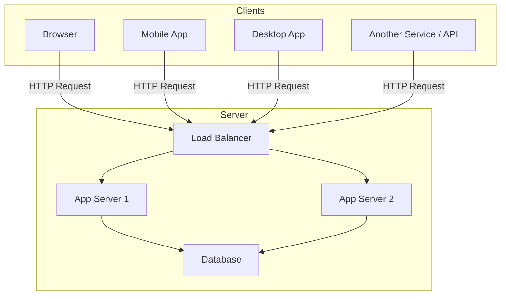
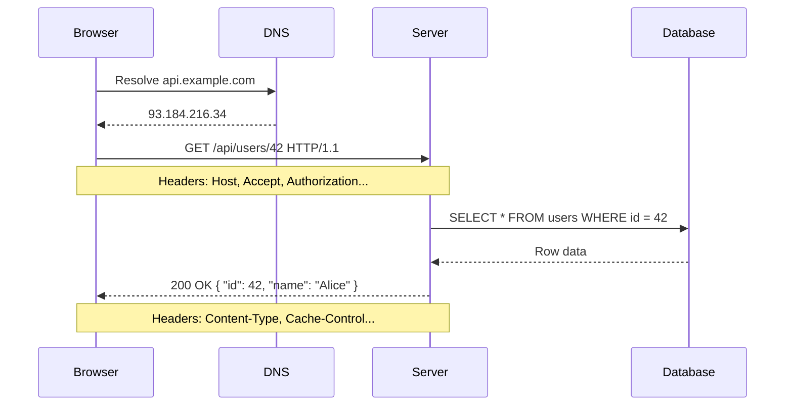
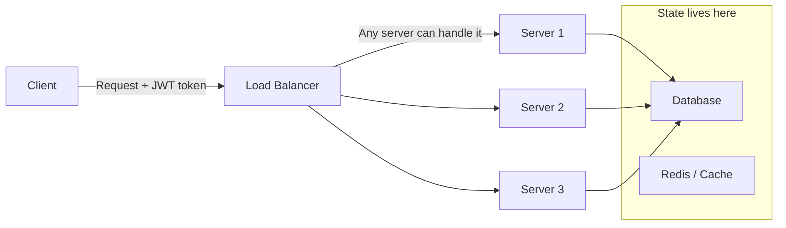
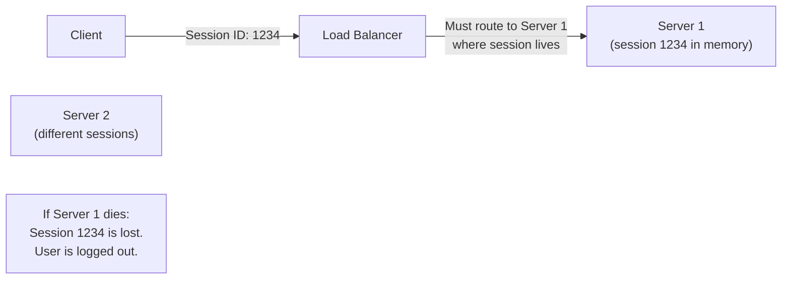
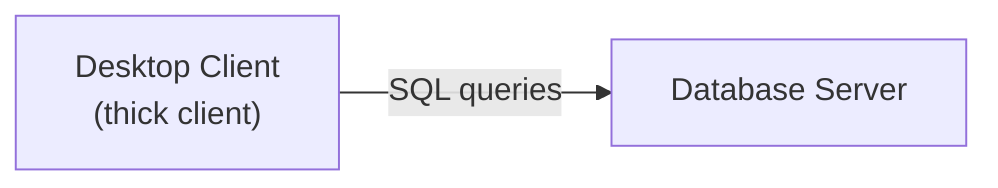
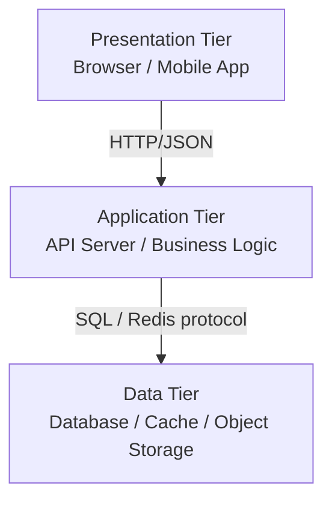
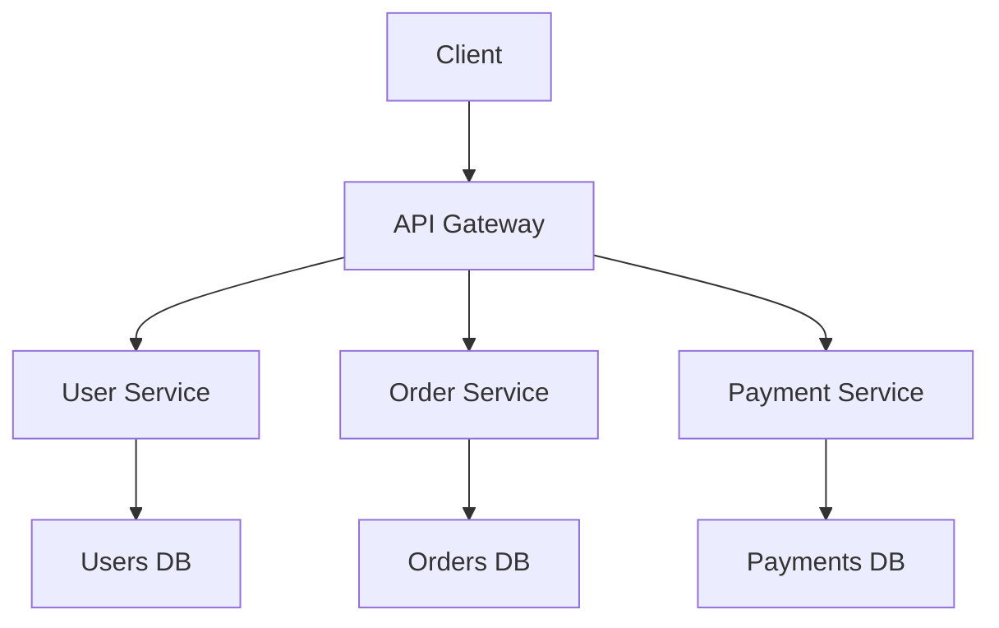
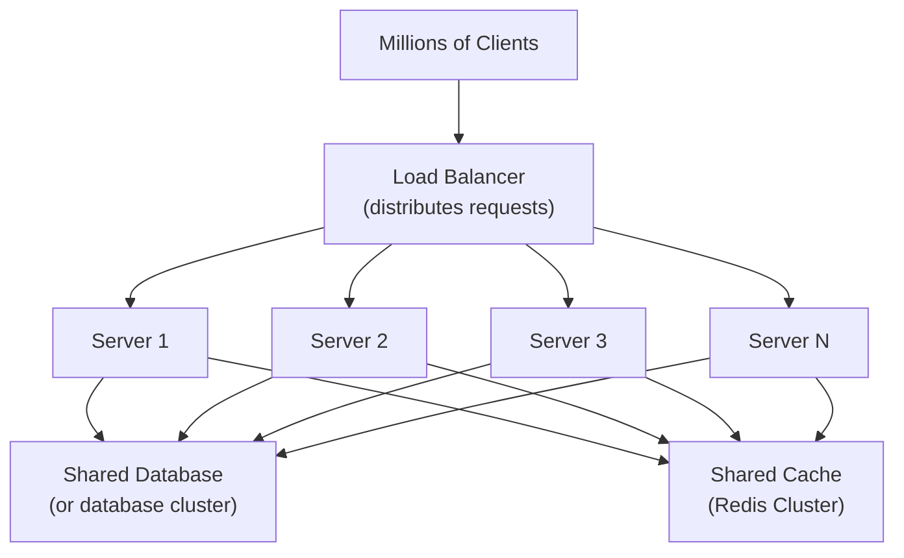

# Client-Server Architecture

Client-Server is the foundational architectural pattern of the modern internet. A **client** requests a service or resource, and a **server** responds by providing it. This two-tier separation — separating the consumer of data from the provider — is the organizing principle behind every website, mobile app, API, and database system you interact with.

> **Why this matters in interviews:** Client-server is the baseline. Every distributed system design you draw in an interview is client-server at its core. Understanding its mechanics — request/response lifecycle, statelessness, connection management, and scaling boundaries — gives you the vocabulary to describe every subsequent architectural pattern clearly.

---

## The Core Model

**Key properties:**

- **Asymmetric roles:** Clients initiate; servers wait and respond
- **Request/response:** Every interaction is a pair — one request, one response
- **Stateless protocol (HTTP):** Each request carries all the context needed — server doesn't remember the previous request
- **Many-to-one:** Many clients share one server (or cluster of servers)

---

## The Request/Response Lifecycle

**What happens in each step:**

1. **DNS resolution** — Domain name → IP address (cached aggressively)
2. **TCP connection** — 3-way handshake establishes reliable connection (or reused via keep-alive)
3. **TLS handshake** — Cryptographic negotiation for HTTPS (adds ~1 RTT)
4. **HTTP request** — Client sends method, path, headers, optional body
5. **Server processing** — Auth, validation, business logic, data fetch
6. **HTTP response** — Status code, headers, body

---

## Stateless vs. Stateful Servers

This distinction is crucial for scaling.

### Stateless Server (The Goal)

Each request contains all context needed (auth token, parameters). Any server can handle any request. **You can add/remove servers freely** — horizontal scaling with zero coordination.

### Stateful Server (The Problem)

State in server memory means **sticky sessions** (routing client to the same server always), which breaks horizontal scaling and creates a SPOF.

**The rule:** Push state to shared external systems (database, Redis, JWT tokens). Keep application servers stateless.

---

## Tiers: 2-Tier, 3-Tier, N-Tier

### 2-Tier: Client talks directly to DB

Used in: legacy enterprise apps, internal tools. Risky because clients have direct DB access — no application layer for business logic or security.

### 3-Tier: The Standard Web Stack

Each tier has a distinct responsibility and can be scaled independently. This is the foundation of every web application today.

### N-Tier / Microservices

Services communicate via APIs. Each is independently deployable. This is the natural evolution of 3-tier at scale.

---

## Connection Management: Short-Lived vs. Persistent

| Model                      | HTTP Version | Behavior                                       | Use Case         |
| -------------------------- | ------------ | ---------------------------------------------- | ---------------- |
| **Short-lived**            | HTTP/1.0     | New TCP connection per request                 | Simple, legacy   |
| **Keep-Alive**             | HTTP/1.1     | Reuse TCP connection, one request at a time    | Standard web     |
| **Multiplexed**            | HTTP/2       | Multiple concurrent requests on one connection | Modern APIs      |
| **Persistent (WebSocket)** | Any          | Bi-directional, always-open connection         | Real-time apps   |
| **QUIC**                   | HTTP/3       | UDP-based, no head-of-line blocking            | Low-latency apps |

HTTP/1.1 keep-alive reduced connection overhead dramatically. HTTP/2 multiplexing eliminated head-of-line blocking — a single connection streams dozens of concurrent requests, making it ideal for SPAs that fetch many resources in parallel.

---

## Scaling the Server Side

Client-server has a natural bottleneck: the server. As clients grow, you must scale the server tier.

### Vertical Scaling (Scale Up)

Give the server more CPU/RAM. Simple but limited — there's a ceiling, and it requires downtime. Used as a first step and for databases that are hard to shard.

### Horizontal Scaling (Scale Out)

Add more servers behind a load balancer. Requires stateless servers. The database often becomes the next bottleneck — addressed with read replicas, sharding, and caching.

---

## Client-Server vs. Peer-to-Peer

| Dimension       | Client-Server                 | Peer-to-Peer                   |
| --------------- | ----------------------------- | ------------------------------ |
| **Control**     | Centralized                   | Decentralized                  |
| **Scaling**     | Server is the bottleneck      | Scales with participants       |
| **Reliability** | Server SPOF unless replicated | No single point of failure     |
| **Consistency** | Easier to enforce             | Hard to coordinate             |
| **Latency**     | Round-trip to central server  | Can be local to peers          |
| **Examples**    | Every website, REST API       | BitTorrent, blockchain, WebRTC |

---

## Real-World Systems

**Netflix:** Client (app) → CDN (for video) → API servers (for metadata/auth) → databases. The "client" here is the Netflix app; the "server" is a massive fleet of edge and origin servers. HTTP/2 for API calls; optimized protocols for video streaming.

**Stripe API:** A pure client-server API. Merchants are clients; Stripe's servers process payments. The entire interaction is a single HTTP POST — idempotent, authenticated, and stateless from the server's perspective (state lives in the database).

**GitHub:** Browser client → GitHub's Rails/Go API servers → PostgreSQL/MySQL databases + object storage (Git blobs in GCS). The browser never touches the database — the application tier enforces access control.

---

## Interview Talking Points

**1. What makes client-server architecture scale well?**

> "The key is statelessness. If application servers hold no user-specific state in memory, any server can handle any request — you just add more servers behind a load balancer. State moves to shared external systems: the database for durable data, Redis for session/cache, and JWTs for client-side auth tokens. The database then becomes the scaling bottleneck, addressed with read replicas, sharding, and caching layers."

**2. What is the difference between 2-tier, 3-tier, and N-tier architectures?**

> "In 2-tier, the client talks directly to the database — used in legacy thick-client apps but dangerous because clients get raw DB access with no business logic layer. 3-tier adds an application server between client and database: presentation tier, application tier, data tier. Each can scale independently. N-tier (microservices) decomposes the application tier into independent services, each with its own database — enabling independent deployability and team autonomy, at the cost of distributed systems complexity."

**3. How does HTTP/2 improve on HTTP/1.1 for client-server communication?**

> "HTTP/1.1 with keep-alive reuses a TCP connection but is serial — request 2 must wait for request 1's response. HTTP/2 introduces multiplexing: multiple requests are in-flight simultaneously on a single TCP connection using streams. This eliminates head-of-line blocking at the HTTP layer, reduces latency for parallel resource fetches (critical for SPAs), and adds header compression (HPACK). HTTP/3 goes further by using QUIC over UDP, eliminating TCP-level head-of-line blocking entirely."

**4. When would you choose something other than client-server architecture?**

> "For content distribution at massive scale, a pure client-server model can't work — CDNs push content to edge nodes so clients get data from nearby servers, which is still technically client-server but geographically distributed. For real-time collaboration or file sharing where you want to reduce central server load, P2P (like WebRTC for video calls) lets clients communicate directly after an initial server-mediated handshake. For extremely high-throughput event processing, event-driven architecture decouples producers from consumers."

---

## Key Takeaways

- Client-server separates **request initiator** (client) from **resource provider** (server) — the organizing principle of the internet
- **Stateless servers** are the key to horizontal scaling — push state to the database, cache, or client-side tokens
- The standard web stack is **3-tier**: presentation → application → data
- HTTP/1.1 keep-alive → HTTP/2 multiplexing → HTTP/3 QUIC is the evolution of connection efficiency
- The server tier is the natural **scaling bottleneck** — addressed with load balancing, caching, and database replicas
- Client-server trades **centralized control and consistency** for the need to scale a single point
