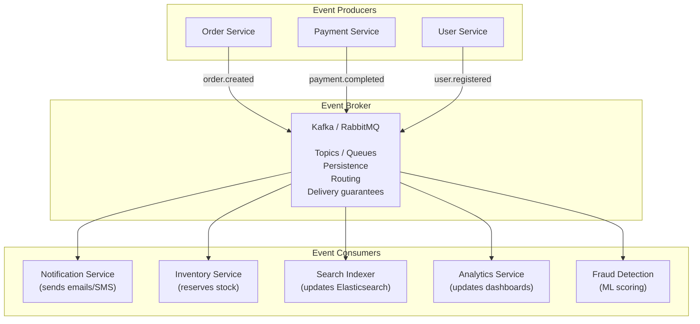
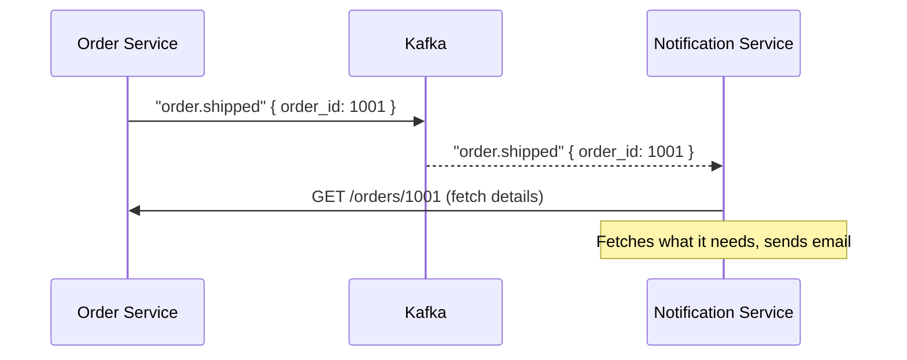
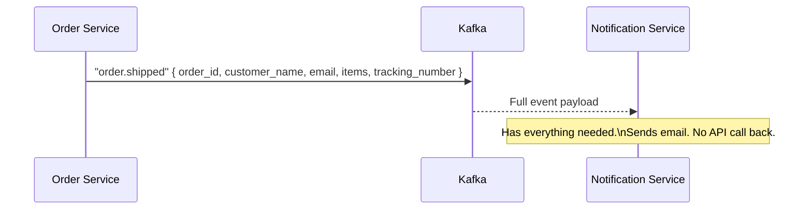
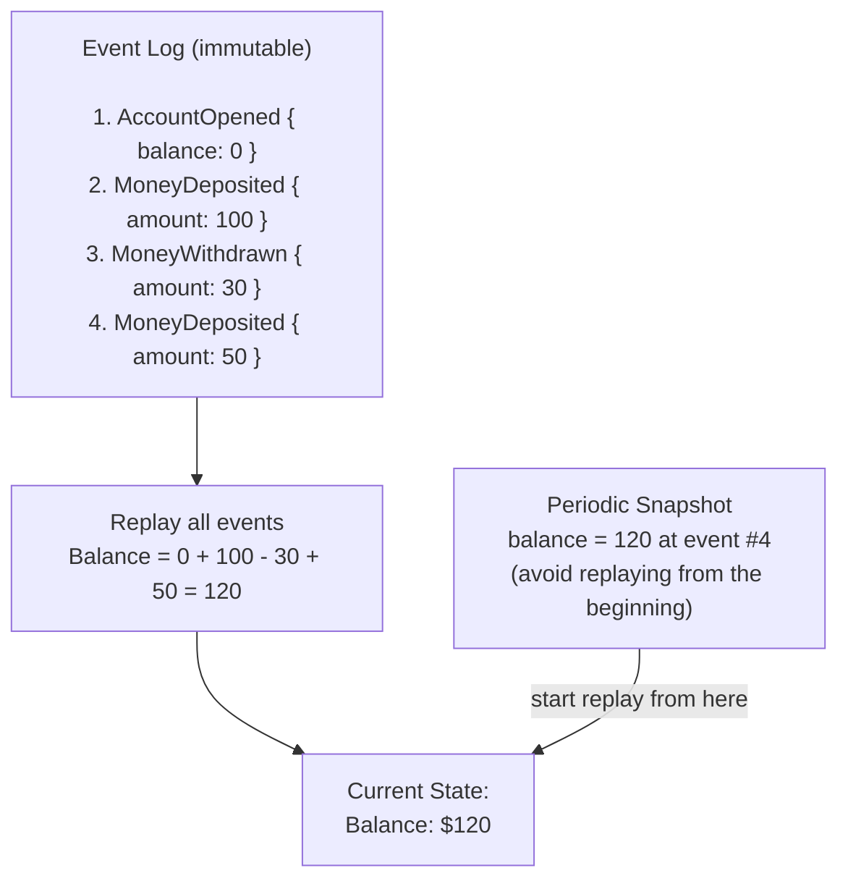
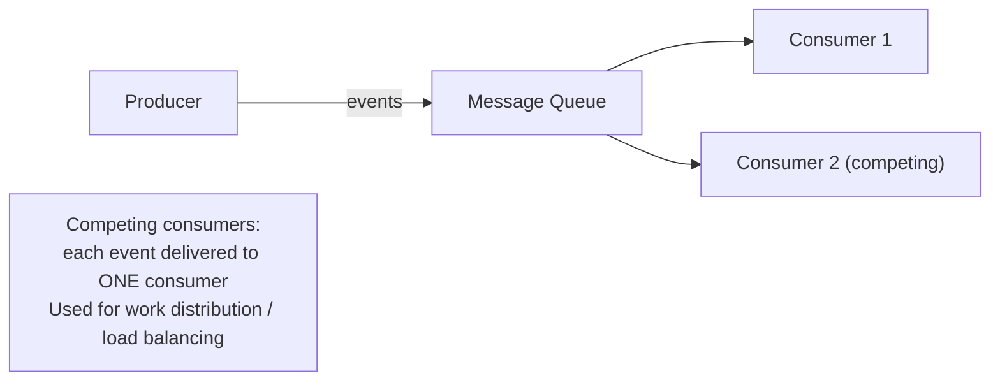
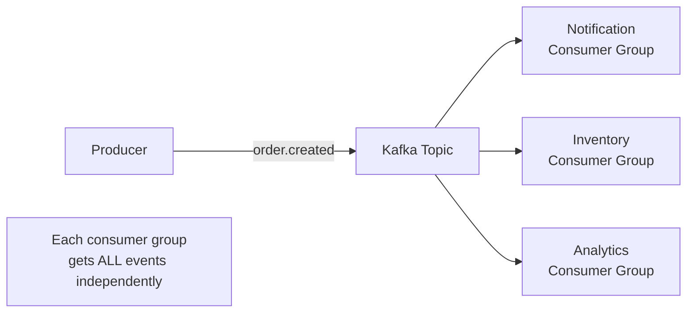
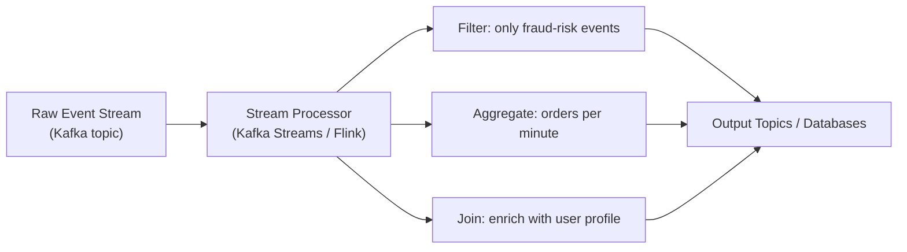
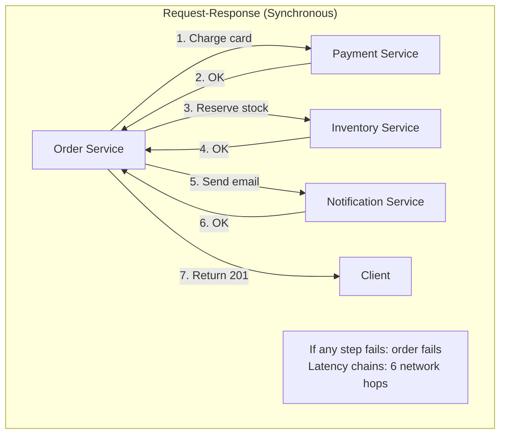
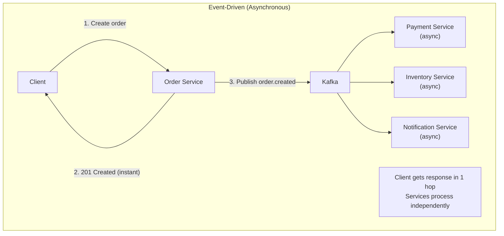

# Event-Driven Architecture

Event-Driven Architecture (EDA) is a design paradigm where the flow of the program is determined by **events** — significant changes in state. Components communicate by producing and consuming events rather than making direct calls to each other. The producer doesn't know who's listening; consumers don't know who published. This loose coupling is the defining characteristic of EDA.

> **Why this matters in interviews:** Event-driven thinking comes up in almost every system design involving real-time features, async processing, notifications, audit trails, or microservices communication. Questions about notification systems, activity feeds, order processing, and fraud detection all have event-driven solutions at their core. Understanding events, event brokers, and the tradeoffs between sync and async is table stakes for senior-level design interviews.

---

## What Is an Event?

An event is an **immutable record of something that happened** — a fact. It represents a state change in the past tense.

```
Good event names (past tense, facts):
  ✅ order.created
  ✅ payment.failed
  ✅ user.email_verified
  ✅ inventory.stock_depleted

Bad event names (commands, not facts):
  ❌ create_order
  ❌ send_email
  ❌ process_payment
```

A well-designed event payload:

```json
{
  "event_id": "evt_01HK7X2P9ZNBFM4CJGQ3V8D5R",
  "event_type": "order.created",
  "timestamp": "2024-01-15T10:30:00Z",
  "version": "1.0",
  "producer": "order-service",
  "data": {
    "order_id": "ord_42",
    "user_id": "usr_17",
    "items": [{ "product_id": "prod_99", "quantity": 2 }],
    "total_cents": 4998
  }
}
```

Events are **immutable** — once published, they never change. The history of events is the source of truth.

---

## The Core Architecture



**The key insight:** Order Service publishes `order.created` and immediately moves on. It has no knowledge of Notification Service, Inventory Service, or Analytics. When you need to add Fraud Detection, you add a new consumer — zero changes to Order Service.

---

## Event Patterns: Three Styles

### 1. Event Notification

The simplest form. Producer sends a "something happened" signal. Consumers react. The event carries minimal data — just enough to trigger action.



**Pro:** Small events, easy to produce.
**Con:** Consumers must make additional API calls to get the data they need ("chattiness").

### 2. Event-Carried State Transfer

The event carries all relevant state — consumers don't need to call back.



**Pro:** Consumers are autonomous — no API call back to the producer. Producer outage doesn't block consumers.
**Con:** Larger events. Consumer must handle schema evolution.

### 3. Event Sourcing

**The event log IS the database.** Instead of storing current state, you store the full sequence of events. Current state is computed by replaying events.



**Benefits:** Complete audit trail (every state change is recorded), time travel (replay to any point in time), projections (rebuild any read model from the same event log).

**Where it's used:** Stripe's payment ledger, Git (commits are events), bank account systems, inventory tracking.

---

## EDA Topology Patterns

### Simple Event Queue



Each event is processed by exactly one consumer (competing consumers). Used for task distribution, job queues.

### Publish-Subscribe (Fan-out)



Each subscriber gets every event independently. Used when multiple systems care about the same event.

### Event Stream Processing



Events are processed continuously as they arrive — filtered, aggregated, joined with other streams, and written to output topics or databases. Used for real-time analytics, fraud detection, recommendation systems.

---

## EDA vs. Request-Response





| Dimension             | Request-Response              | Event-Driven                                   |
| --------------------- | ----------------------------- | ---------------------------------------------- |
| **Coupling**          | Tight (caller knows callee)   | Loose (no knowledge of consumers)              |
| **Latency**           | Accumulates across hops       | Client gets fast response; processing is async |
| **Failure isolation** | One failure cascades          | Independent; failures queue                    |
| **Consistency**       | Easier (call returned = done) | Eventual (processing happens later)            |
| **Discoverability**   | Easy (API docs)               | Harder (who publishes what?)                   |
| **Backpressure**      | Natural (caller waits)        | Requires queue sizing and consumer scaling     |

---

## Real-World EDA Systems

**Uber:** Every ride request, location update, pricing calculation, and driver assignment is an event. The "location.updated" event from a driver's phone triggers map updates, ETA recalculations, and surge pricing adjustments — all independently.

**LinkedIn:** The entire newsfeed is event-driven. When you post, an `activity.created` event triggers fan-out to your followers' feeds, notification delivery, analytics recording, and search indexing — all via Kafka.

**Netflix:** Video encoding pipeline is event-driven. When a new video is uploaded, `video.uploaded` triggers multiple parallel encoding jobs (different resolutions/codecs), QA checks, thumbnail generation, and metadata indexing. Kafka handles billions of events per day.

**Stripe:** Every payment attempt publishes events to a Kafka-like system. Consumers handle fraud scoring, webhook delivery to merchants, balance updates, and reporting — all decoupled from the payment API itself.

---

## Challenges in EDA

### Eventual Consistency

After publishing `order.created`, the inventory service may not have processed it yet. A user querying order status might see "processing" while inventory is still reserving. Design your UX and data models to handle this gracefully — show optimistic state, use read models, or poll for completion.

### Event Ordering

Kafka guarantees ordering within a partition. If two events for the same order land in different partitions, a consumer might see `order.cancelled` before `order.created`. Use a consistent partition key (e.g., `order_id`) to ensure all events for one entity go to the same partition.

### Schema Evolution

Consumers are deployed independently and may be running old code when a new event schema is published. Use **Avro with Schema Registry** or **Protobuf** to enforce backward/forward compatibility. Never remove fields; only add new optional fields.

### Debugging is Hard

Tracing a business operation across dozens of async consumers requires distributed tracing (correlation IDs in every event) and centralized log aggregation. Adding a `correlation_id` field that flows from the initial request through all derived events is essential.

---

## Interview Talking Points

**1. When would you choose event-driven architecture over direct API calls?**

> "When you need temporal decoupling — where the producer and consumer don't need to be available simultaneously. For example, sending order confirmation emails: if the notification service is down, you don't want the order to fail — queue the event and process when it recovers. When you need fan-out — one event triggers multiple independent reactions (inventory, fraud, analytics, notifications), and you don't want to hardcode all those consumers into the order service. And when you need an audit trail — the event log becomes your system of record for what happened and when."

**2. What is event sourcing and how does it differ from regular event-driven architecture?**

> "Regular EDA uses events for communication between services — events are the messages. Event sourcing uses events as the storage model — the event log IS the database. Instead of storing current state, you store every state-changing event. Current state is derived by replaying events. This gives you: a complete audit trail for free (every change is recorded), time travel (replay to any point to see historical state), and the ability to build new projections (read models) by replaying the same event history with different logic. Git is conceptually event sourcing: commits are events, and the current working tree is derived by replaying all commits."

**3. How do you handle failures in an event-driven system? What if a consumer fails mid-processing?**

> "At-least-once delivery: the broker (Kafka, RabbitMQ) holds the event until the consumer acknowledges processing. If the consumer crashes, the event is redelivered. This means consumers must be idempotent — processing the same event twice should have the same effect as processing it once (use event IDs with a deduplication store). For events that fail repeatedly, use a Dead Letter Queue — after N retry attempts, route to a DLQ for human inspection. Design compensating events for multi-step processes: if step 2 fails, publish a compensation event that triggers undoing step 1."

**4. How do you ensure event ordering in a distributed system?**

> "Kafka guarantees ordering within a partition. The key is choosing the right partition key. For order events, partition by order_id — all events for a single order go to the same partition, delivered in order to the same consumer. Different orders can be processed in parallel across partitions. Cross-entity ordering (e.g., all events for user X and all events for order Y, in global order) is generally not achievable without a single partition, which eliminates parallelism. Design your system to not require global ordering — per-entity ordering (same partition key) is almost always sufficient."

---

## Key Takeaways

- Events are **immutable records of things that happened** — past tense facts, not commands
- EDA **decouples producers and consumers** — neither knows about the other; add new consumers without touching producers
- Three event patterns: **event notification** (minimal data), **event-carried state transfer** (full data), **event sourcing** (events as the database)
- EDA enables **fast client responses** — publish event, return 201, process asynchronously
- **Failure isolation** is EDA's key operational benefit — one consumer failing doesn't affect others or the producer
- Challenges: eventual consistency, event ordering (partition keys), schema evolution (Avro/Protobuf), distributed debugging (correlation IDs)
- **Kafka** is the dominant event streaming platform — durable, ordered-within-partition, consumer group model, replayable
- EDA shines in: notification systems, activity feeds, real-time analytics, audit trails, and microservice choreography
