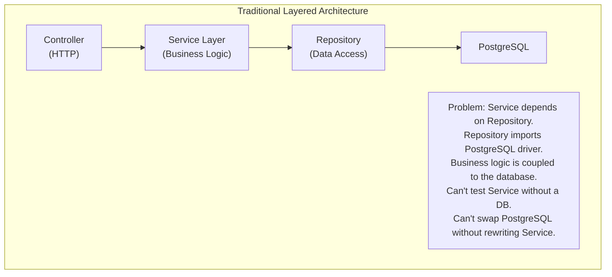
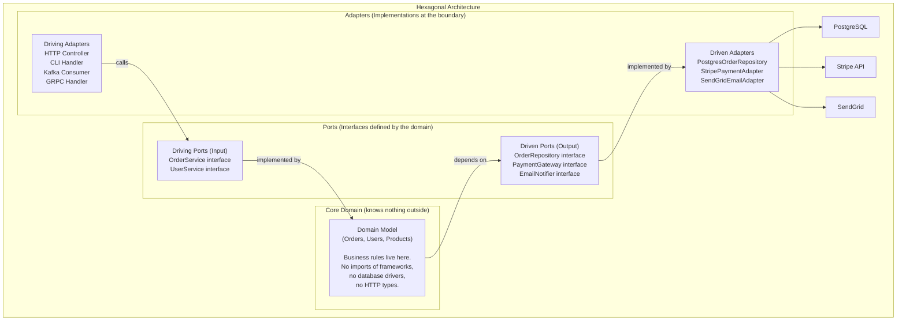
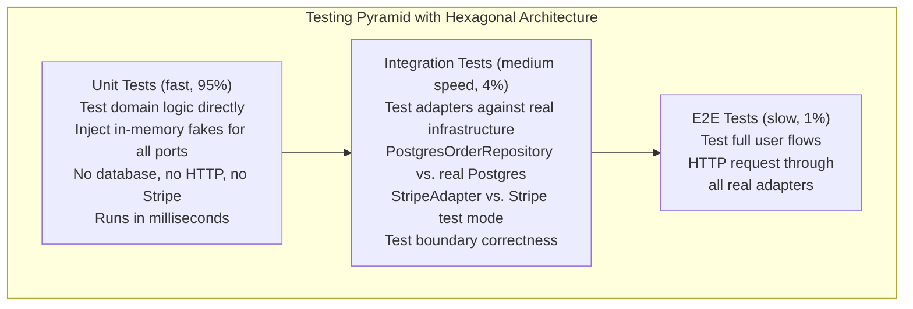
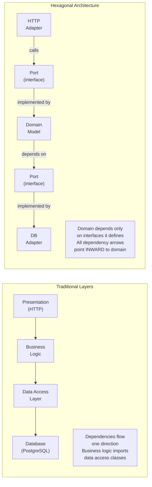

# Hexagonal Architecture

Hexagonal Architecture — also called **Ports and Adapters** — is an architectural pattern that isolates the core business logic of an application from external systems. The domain model sits in the center, completely oblivious to how it's invoked (HTTP, CLI, message queue) or what it talks to (PostgreSQL, Redis, Stripe). These concerns are pushed to the boundary through a set of **ports** (interfaces) and **adapters** (implementations).

> **Why this matters in interviews:** Hexagonal architecture is the underlying structure of well-designed microservices. When an interviewer asks "how do you ensure your service is testable?" or "how would you swap PostgreSQL for DynamoDB without rewriting your business logic?" — the answer is ports and adapters. It also underpins Domain-Driven Design (DDD), Clean Architecture, and Onion Architecture — all variations of the same idea.

---

## The Core Problem

Traditional layered architecture creates a hidden coupling problem:



The business logic (Service layer) has an implicit dependency on the database. If you want to test order processing logic, you need a database. If you want to switch from PostgreSQL to DynamoDB, you rewrite service code.

---

## The Hexagonal Model



The **domain is in the center**. It defines ports (interfaces) for what it needs from the outside world. Adapters implement those interfaces. The domain never imports from adapters — dependency arrows always point inward.

---

## Ports: Driving vs. Driven

### Driving Ports (Input Ports) — "How the World Calls Us"

These are interfaces that **represent the domain's use cases** — what the application can do. Driving adapters (HTTP controllers, CLI commands, test code, message consumers) call these interfaces.

```typescript
// Driving Port: Defined by the domain
export interface OrderService {
  placeOrder(command: PlaceOrderCommand): Promise<OrderId>;
  cancelOrder(orderId: OrderId, reason: string): Promise<void>;
  getOrder(orderId: OrderId): Promise<Order>;
}

// PlaceOrderCommand is a pure value object — no HTTP, no database
export interface PlaceOrderCommand {
  customerId: CustomerId;
  items: Array<{ productId: ProductId; quantity: number }>;
  shippingAddress: Address;
}
```

### Driven Ports (Output Ports) — "How We Call the World"

These are interfaces that the **domain defines for its dependencies** — persistence, external services, messaging. The domain calls these interfaces without knowing (or caring) how they're implemented.

```typescript
// Driven Port: Defined by the domain, implemented by adapters
export interface OrderRepository {
  save(order: Order): Promise<void>;
  findById(id: OrderId): Promise<Order | null>;
  findByCustomer(customerId: CustomerId): Promise<Order[]>;
}

export interface PaymentGateway {
  charge(amount: Money, card: PaymentMethod): Promise<PaymentResult>;
  refund(paymentId: PaymentId, amount: Money): Promise<void>;
}

export interface InventoryService {
  checkAvailability(productId: ProductId, quantity: number): Promise<boolean>;
  reserve(productId: ProductId, quantity: number): Promise<ReservationId>;
}
```

### The Domain Implementation

```typescript
// Domain: The business logic — depends only on interfaces it defines
export class OrderServiceImpl implements OrderService {
  constructor(
    private readonly orderRepo: OrderRepository, // Driven port
    private readonly paymentGateway: PaymentGateway, // Driven port
    private readonly inventory: InventoryService, // Driven port
    private readonly eventBus: DomainEventBus, // Driven port
  ) {}

  async placeOrder(command: PlaceOrderCommand): Promise<OrderId> {
    // Pure business logic — no HTTP, no SQL, no Stripe SDK
    for (const item of command.items) {
      const available = await this.inventory.checkAvailability(
        item.productId,
        item.quantity,
      );
      if (!available) throw new InsufficientInventoryError(item.productId);
    }

    const order = Order.create(command);
    const payment = await this.paymentGateway.charge(
      order.total,
      command.paymentMethod,
    );
    order.markPaid(payment.id);

    await this.orderRepo.save(order);
    await this.eventBus.publish(new OrderPlacedEvent(order));

    return order.id;
  }
}
```

---

## Adapters: Driving vs. Driven

### Driving Adapters — "External Callers Translated to Domain Calls"

```typescript
// HTTP Adapter: Translates HTTP → Domain
@Controller("/orders")
export class OrderController {
  constructor(private readonly orderService: OrderService) {}

  @Post("/")
  async createOrder(@Body() dto: CreateOrderDto): Promise<OrderResponse> {
    // Translate HTTP DTO → domain command
    const command: PlaceOrderCommand = {
      customerId: new CustomerId(dto.customerId),
      items: dto.items.map((i) => ({
        productId: new ProductId(i.productId),
        quantity: i.quantity,
      })),
      shippingAddress: Address.fromDto(dto.shippingAddress),
    };

    const orderId = await this.orderService.placeOrder(command);
    return { orderId: orderId.value };
  }
}

// Kafka Adapter: Translates Kafka event → Domain call
export class OrderKafkaConsumer {
  async onOrderRetryRequested(message: KafkaMessage): Promise<void> {
    const event = JSON.parse(message.value.toString());
    const command = PlaceOrderCommand.fromEvent(event);
    await this.orderService.placeOrder(command);
  }
}
```

### Driven Adapters — "Domain Calls Translated to External Systems"

```typescript
// PostgreSQL Adapter: Implements domain's OrderRepository interface
export class PostgresOrderRepository implements OrderRepository {
  constructor(private readonly db: Pool) {}

  async save(order: Order): Promise<void> {
    await this.db.query(
      `INSERT INTO orders (id, customer_id, status, total_cents, created_at)
       VALUES ($1, $2, $3, $4, $5)
       ON CONFLICT (id) DO UPDATE SET status = $3, total_cents = $4`,
      [
        order.id.value,
        order.customerId.value,
        order.status,
        order.total.cents,
        order.createdAt,
      ],
    );
  }

  async findById(id: OrderId): Promise<Order | null> {
    const rows = await this.db.query("SELECT * FROM orders WHERE id = $1", [
      id.value,
    ]);
    if (rows.rowCount === 0) return null;
    return Order.fromRow(rows.rows[0]); // Mapping in the adapter
  }
}

// Stripe Adapter: Implements domain's PaymentGateway interface
export class StripePaymentAdapter implements PaymentGateway {
  constructor(private readonly stripe: Stripe) {}

  async charge(amount: Money, card: PaymentMethod): Promise<PaymentResult> {
    const charge = await this.stripe.charges.create({
      amount: amount.cents,
      currency: amount.currency.toLowerCase(),
      source: card.token,
    });
    return new PaymentResult(charge.id, charge.status === "succeeded");
  }
}
```

---

## The Testing Superpower

Hexagonal architecture's most immediately practical benefit:



```typescript
// Unit test: No database, no network, no framework
describe("OrderService", () => {
  let orderService: OrderService;
  let orderRepo: InMemoryOrderRepository; // In-memory fake
  let paymentGateway: FakePaymentGateway; // Controllable fake
  let inventory: FakeInventoryService;

  beforeEach(() => {
    orderRepo = new InMemoryOrderRepository();
    paymentGateway = new FakePaymentGateway();
    inventory = new FakeInventoryService();
    orderService = new OrderServiceImpl(
      orderRepo,
      paymentGateway,
      inventory,
      new FakeEventBus(),
    );
  });

  it("should reject order when inventory is insufficient", async () => {
    inventory.setAvailability("prod_1", 0); // Fake: simulate out-of-stock

    const command = buildPlaceOrderCommand({
      productId: "prod_1",
      quantity: 1,
    });
    await expect(orderService.placeOrder(command)).rejects.toThrow(
      InsufficientInventoryError,
    );
    expect(orderRepo.savedOrders).toHaveLength(0); // No order persisted
  });

  it("should publish OrderPlacedEvent after successful order", async () => {
    paymentGateway.setNextResult({ success: true });
    const command = buildPlaceOrderCommand();

    await orderService.placeOrder(command);

    // Verify domain events — no HTTP, no DB
    expect(fakeEventBus.publishedEvents).toContainEqual(
      expect.objectContaining({ type: "OrderPlaced" }),
    );
  });
});
```

These tests run in milliseconds and test every branch of business logic without any infrastructure.

---

## Hexagonal vs. Traditional Layered Architecture



| Dimension          | Traditional Layers                          | Hexagonal Architecture                    |
| ------------------ | ------------------------------------------- | ----------------------------------------- |
| **Testability**    | ❌ Need real DB to test business logic      | ✅ Inject fakes, test in isolation        |
| **Flexibility**    | ❌ Swapping DB means rewriting service      | ✅ Implement new adapter, swap in DI      |
| **Clarity**        | ❌ Business rules mixed with infrastructure | ✅ Business rules are explicitly isolated |
| **Complexity**     | ✅ Simple, familiar                         | ❌ More abstractions, more files          |
| **Boilerplate**    | ✅ Minimal                                  | ❌ Interface + implementation + mapping   |
| **Learning curve** | ✅ Low                                      | ❌ Requires understanding DI, interfaces  |

---

## Related Architectures

Hexagonal Architecture is one version of a family of "clean" architectures:

| Architecture                     | Author                   | Key Idea                                                         |
| -------------------------------- | ------------------------ | ---------------------------------------------------------------- |
| **Hexagonal / Ports & Adapters** | Alistair Cockburn (2005) | Ports = interfaces; Adapters = implementations; Domain in center |
| **Onion Architecture**           | Jeffrey Palermo (2008)   | Concentric rings; domain at center; infrastructure at edge       |
| **Clean Architecture**           | Robert C. Martin (2012)  | Entities → Use Cases → Interface Adapters → Frameworks           |
| **DDD Layered**                  | Eric Evans (2003)        | Domain layer isolated; infrastructure concerns in outer layers   |

All share the **Dependency Rule:** source code dependencies can only point inward. Inner circles don't know about outer circles.

---

## Real-World Usage

**Netflix:** Uses a hexagonal approach for their service internals. Business logic modules don't import Cassandra clients directly — they program against repository interfaces, and the Cassandra implementation is injected.

**Spotify:** Uses ports and adapters to keep their recommendation engine logic independent of data sources. The same ML model can be tested against in-memory data, integrated against Postgres, or deployed against BigQuery.

**Amazon:** Domain logic in checkout services is separated from infrastructure. The "charge card" operation is a port; the Stripe or internal payment system implementation is an adapter. Swapping payment processors doesn't touch order logic.

---

## Interview Talking Points

**1. What is Hexagonal Architecture and why is it useful?**

> "Hexagonal Architecture, or Ports and Adapters, isolates domain business logic from infrastructure by defining explicit interfaces — ports — for everything the domain needs from or provides to the outside world. The domain depends on these interfaces, never on concrete implementations. Adapters implement the interfaces: one adapter for HTTP, another for PostgreSQL, another for Stripe. The benefit is that the domain can be tested in pure isolation using in-memory fakes — no database, no network, no framework. You can swap PostgreSQL for DynamoDB by writing a new adapter without touching any business logic."

**2. What is the difference between a Driving adapter and a Driven adapter?**

> "Driving adapters (also called primary or input adapters) call into the domain — they're on the 'left side' of the hexagon. HTTP controllers, CLI commands, Kafka consumers, and test code are all driving adapters. They translate external representations (HTTP requests, Kafka messages) into domain commands and call the domain's input ports. Driven adapters (secondary or output adapters) are called by the domain — they're on the 'right side.' They implement the domain's output port interfaces: PostgresOrderRepository implements OrderRepository, StripeAdapter implements PaymentGateway. The domain defines the interface; the adapter provides the implementation."

**3. How does Hexagonal Architecture improve testability?**

> "The domain defines interfaces for all its dependencies — repository, payment gateway, email service. In tests, you implement those interfaces with simple in-memory fakes that you control: InMemoryOrderRepository stores orders in a list, FakePaymentGateway returns whatever you configure it to return. The OrderServiceImpl is wired with fakes via constructor injection. Tests run in milliseconds, cover every business logic branch, and fail only when domain logic is wrong — not because of database connection issues or network timeouts. This is the testing pyramid in practice: 95% unit tests (fast, domain-only), 4% integration tests (adapter against real infrastructure), 1% E2E tests."

**4. What is the Dependency Rule in clean architecture?**

> "The Dependency Rule states that source code dependencies can only point inward — toward the domain/core. The domain knows nothing about adapters, frameworks, or databases. It defines interfaces (ports) and implementations of those interfaces live in the outer adapter layer. This is enforced by compile-time dependencies: the domain module has zero imports from infrastructure modules. Infrastructure modules import from domain (to implement ports). If you ever find yourself importing a PostgreSQL driver or an HTTP framework into your domain classes, you've violated the dependency rule. The practical enforcement mechanism is the Dependency Inversion Principle: depend on abstractions (interfaces), not concretions."

---

## Key Takeaways

- Hexagonal Architecture places the **domain model at the center**, surrounded by ports (interfaces) and adapters (implementations)
- **Driving ports** define the domain's use cases — what the application can do (called by HTTP, Kafka, CLI)
- **Driven ports** define the domain's dependencies — what it needs (implemented by DB, payment gateway, email adapters)
- The **Dependency Rule:** all source code dependencies point inward; the domain imports nothing from infrastructure
- The killer feature: **pure domain unit tests** — inject in-memory fakes, test business logic in milliseconds without any infrastructure
- Swap implementations without touching domain: change from PostgreSQL to DynamoDB = write new adapter
- Related patterns: **Onion Architecture, Clean Architecture, DDD** — all variations of the same isolation principle
- The tradeoff: **more abstractions and boilerplate** — worth it for complex domains; overkill for simple CRUD services
