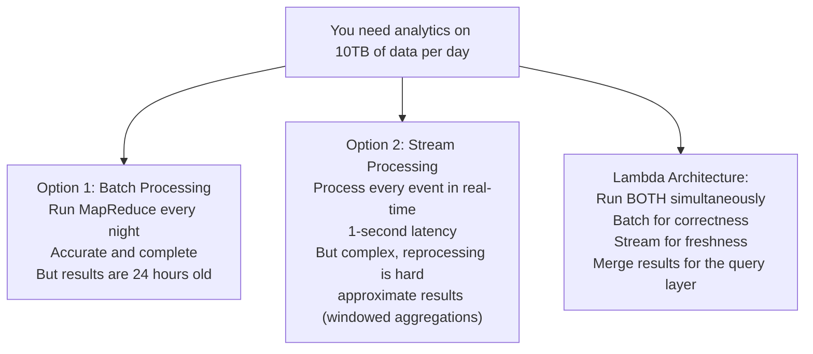
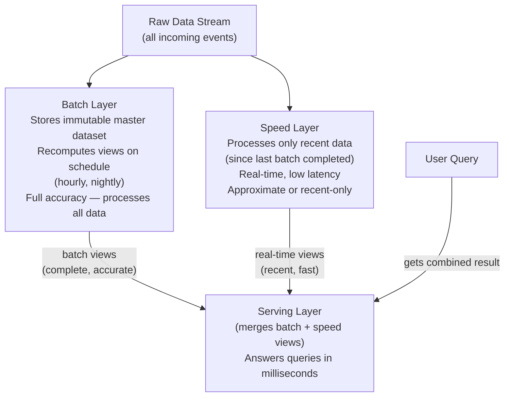
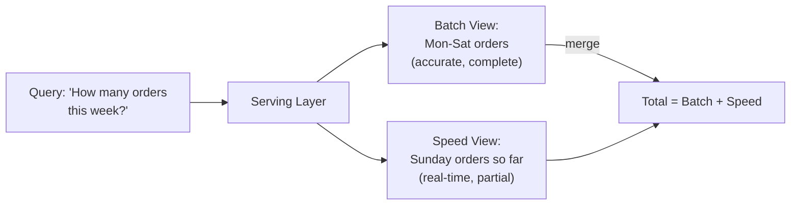
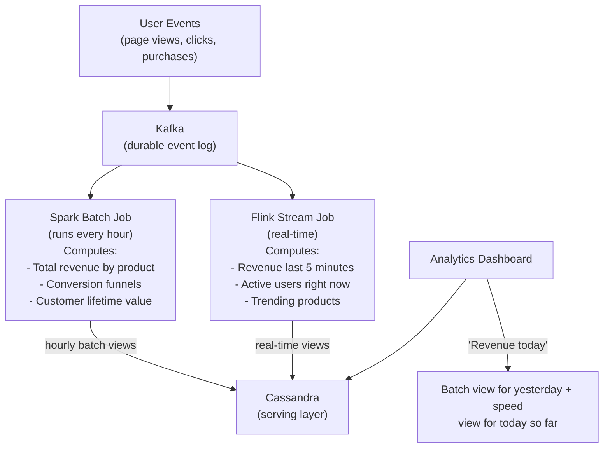
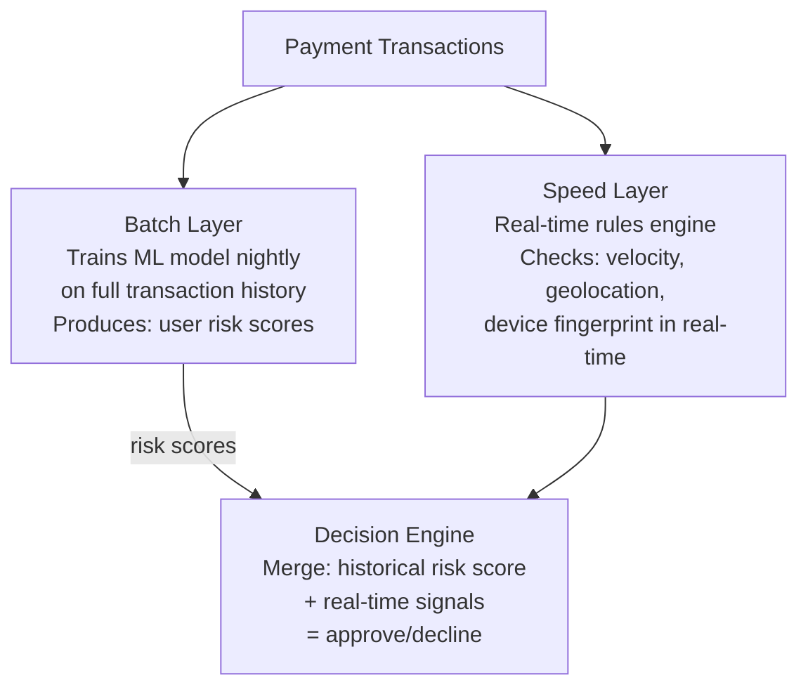
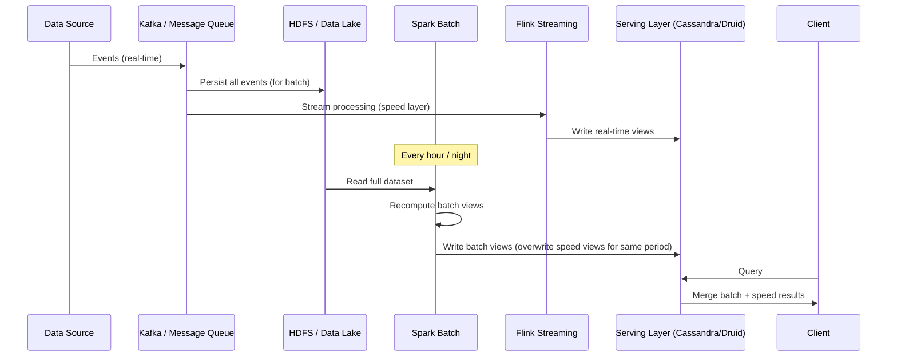
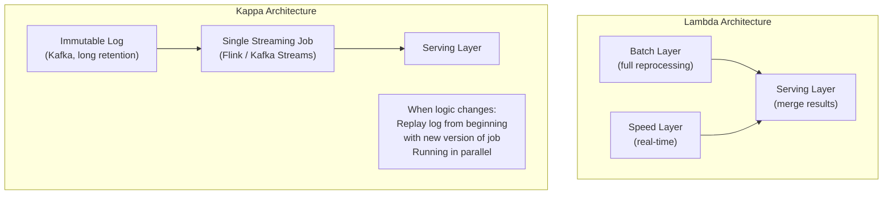

# Lambda Architecture

Lambda Architecture is a data processing architecture designed to handle **massive quantities of data** by providing both low-latency real-time results and accurate, comprehensive batch-processed results simultaneously. It was coined by Nathan Marz (creator of Apache Storm) and addresses the fundamental tension between speed and accuracy in large-scale data systems.

> **Why this matters in interviews:** Lambda architecture appears in questions about analytics dashboards, recommendation systems, fraud detection, and reporting systems — anywhere you need both real-time insights and historically accurate views of large datasets. Understanding its tradeoffs and the newer Kappa Architecture alternative demonstrates mature data systems thinking.

---

## The Core Problem Lambda Solves



Lambda doesn't choose between accuracy and latency — it provides both by running two parallel processing systems and merging their outputs.

---

## The Three Layers



### Layer 1: Batch Layer

The ground truth. Stores the **complete, immutable master dataset** — every event ever received. Periodically recomputes **batch views** by processing the entire dataset:

```
Technology: HDFS (storage) + Spark / MapReduce (processing)
Schedule: Every 1–24 hours
Output: Pre-computed views stored in a database (HBase, Cassandra)
Accuracy: 100% — processes every event
Latency: Hours
```

If a bug is discovered in a batch job, you fix the code and rerun the job on the immutable master dataset — the correct results replace the wrong ones.

### Layer 2: Speed Layer

Compensates for the batch layer's high latency. Processes **only the data that arrived since the last batch completed**, producing low-latency views:

```
Technology: Kafka Streams / Apache Storm / Spark Streaming / Flink
Latency: Seconds to minutes
Output: Real-time views (time-to-live views that expire when batch covers them)
Accuracy: Approximate or recent-only
```

The speed layer is intentionally disposable. Once the batch layer catches up and covers a time window, the speed layer's views for that window are discarded.

### Layer 3: Serving Layer

Merges batch and speed views to answer queries. For any time range:

- Recent period (not yet covered by batch): Use speed layer view
- Older period (covered by batch): Use batch view



---

## Lambda Architecture in Practice

### Example: E-commerce Analytics Dashboard



### Example: Fraud Detection



---

## Lambda Architecture Workflow



---

## The Fundamental Problem with Lambda: Code Duplication

Lambda's greatest weakness is that you implement the same business logic **twice** — once in the batch layer (Spark/MapReduce) and once in the speed layer (Storm/Flink). They must produce consistent results.

```
Batch job (Spark/Scala):
  df.groupBy("product_id")
    .agg(sum("revenue").alias("total_revenue"))

Stream job (Flink/Java):
  stream.keyBy("product_id")
        .window(TumblingEventTimeWindows.of(Time.hours(1)))
        .aggregate(new RevenueAggregator())
```

Two different codebases, different languages, different frameworks — but they must agree on what "revenue" means, how to handle refunds, what events to include, and how to handle late-arriving events. When a business rule changes, you must update both and ensure they're consistent. **This is expensive and error-prone.**

---

## Kappa Architecture: The Simplification

Jay Kreps (founder of Kafka) proposed Kappa Architecture as a response to Lambda's complexity:



**Kappa Architecture key insight:** A streaming job can reprocess historical data by replaying the event log from the beginning. You don't need a separate batch layer — you just re-run the streaming job on the full historical log. One codebase, one set of business logic.

### Lambda vs. Kappa Comparison

| Dimension                     | Lambda                            | Kappa                                    |
| ----------------------------- | --------------------------------- | ---------------------------------------- |
| **Accuracy**                  | ✅ Batch layer is fully accurate  | ✅ Same (reprocessing from full log)     |
| **Latency**                   | ✅ Real-time via speed layer      | ✅ Real-time                             |
| **Code duplication**          | ❌ Two codebases (batch + stream) | ✅ One codebase                          |
| **Consistency risk**          | ❌ Batch and stream may diverge   | ✅ One version of truth                  |
| **Operational complexity**    | ❌ Two processing stacks          | ✅ Simpler                               |
| **Reprocessing**              | ✅ Batch naturally reprocesses    | ⚠️ Replay from Kafka (works, but slower) |
| **Late-arriving events**      | ✅ Batch captures everything      | ⚠️ Depends on log retention              |
| **When batch > stream speed** | ✅ Batch layer handles it         | ❌ Streaming must keep up                |

**When to still choose Lambda over Kappa:**

- Streaming framework can't reprocess historical data fast enough (very large datasets)
- You need the batch layer's ability to run complex non-streaming algorithms (graph algorithms, ML training)
- Your data sources don't all go through a replayable log (some batch files, some streaming)

---

## Real-World Lambda Architectures

**Netflix:** Uses Lambda Architecture for viewing history analytics. Batch layer computes complete viewing patterns for recommendations (Spark on S3). Speed layer gives real-time signals (what's trending right now). Serving layer merges both for the recommendation API.

**LinkedIn:** Kafka is the backbone. Batch (Hadoop/Spark) processes historical data for analytics. Samza (LinkedIn's streaming framework) handles real-time processing. Both write to Espresso (LinkedIn's database) for serving.

**Twitter:** Hadoop batch jobs compute follower graphs and engagement metrics nightly. Storm processes real-time tweet streams for trending topics. Both inform the timeline ranking system.

---

## Interview Talking Points

**1. What problem does Lambda Architecture solve and what are its main components?**

> "Lambda Architecture addresses the tension between low-latency results and fully accurate results at scale. Batch processing (MapReduce, Spark) is accurate but slow — results take hours. Stream processing is fast but historically approximate or limited to recent data. Lambda runs both simultaneously: a batch layer processes the complete immutable dataset on a schedule, a speed layer processes recent data in real-time, and a serving layer merges both views. Users get fresh data for recent periods (from the speed layer) and accurate historical data (from the batch layer)."

**2. What is the biggest criticism of Lambda Architecture?**

> "Code duplication. You implement the same business logic twice — once as a batch job (Spark, MapReduce) and once as a streaming job (Storm, Flink). They must produce consistent results, but they're different frameworks, different languages, different execution models. When a business rule changes, you update both, and subtle divergences can cause inconsistencies between the historical and real-time views. This maintenance burden is the core motivation for Kappa Architecture, which eliminates the batch layer and uses a replayable event log with a single streaming codebase."

**3. When would you choose Lambda Architecture over Kappa Architecture?**

> "Lambda when: (1) your batch processing layer is doing things that can't be efficiently expressed as streaming — ML training, complex graph algorithms, full table scans that don't map cleanly to windowed streams; (2) your historical dataset is so large that even with the best streaming framework, replaying from scratch would take longer than a batch window; (3) your data sources are heterogeneous — some are streaming, some are legacy batch files — and you can't put everything through a replayable log. Kappa when: your logic can be expressed as streaming computations, you want operational simplicity, and your event log (Kafka) retains data long enough for full reprocessing."

**4. How does the serving layer in Lambda Architecture answer a query?**

> "The serving layer stores pre-computed views from both the batch and speed layers. For a given time range, it knows which time windows have been covered by the most recent batch run. For those windows, it uses batch views. For time windows not yet covered by the batch (i.e., recent data), it uses speed layer views. These are merged to produce a complete answer. For example, a query for 'total orders this week' would sum the batch view (Mon-Fri, covered by last night's batch) with the speed layer view (Saturday so far, real-time). When tonight's batch run completes and covers Saturday, the serving layer uses the batch view for Saturday and discards the speed view."

---

## Key Takeaways

- Lambda Architecture provides **low-latency AND accurate results** by running batch and streaming processing in parallel
- **Batch layer:** Immutable master dataset + scheduled recomputation = complete accuracy
- **Speed layer:** Real-time processing of recent data = low latency
- **Serving layer:** Merges batch and speed views to answer queries
- The core weakness: **code duplication** — same logic implemented twice in different frameworks
- **Kappa Architecture** simplifies by eliminating the batch layer — single streaming codebase, reprocessing by replaying the event log
- Choose Lambda when: batch algorithms can't be expressed as streams, datasets are too large for replay, or data sources are heterogeneous
- Choose Kappa when: streaming can express all logic, and operational simplicity matters more than batch capabilities
- Real-world users: Netflix, LinkedIn, Twitter — all have moved toward unified stream processing (Kappa-like) as streaming frameworks matured
