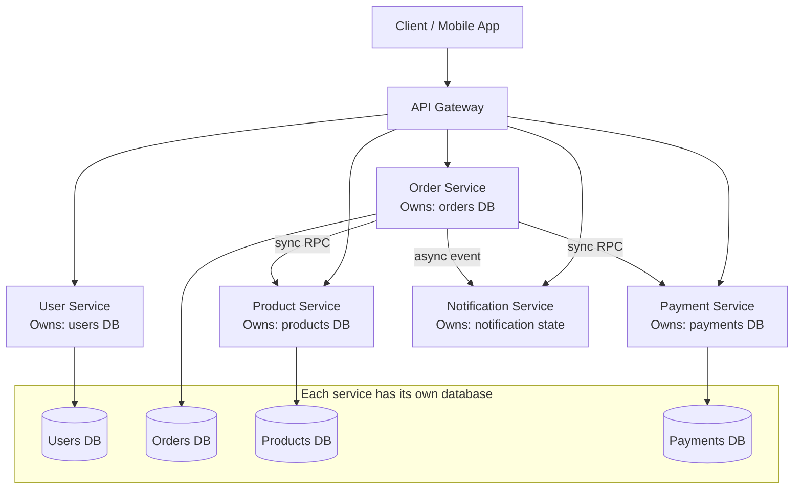
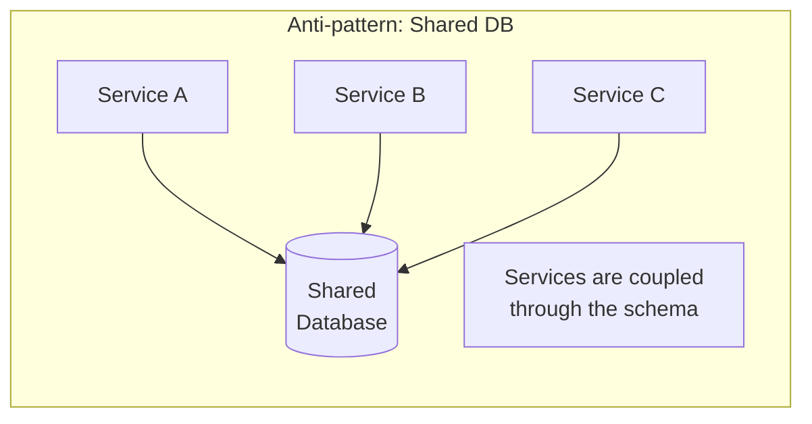
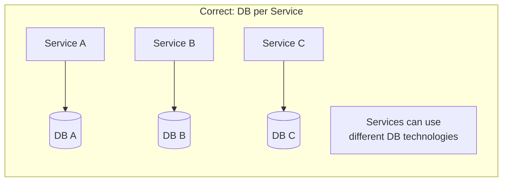
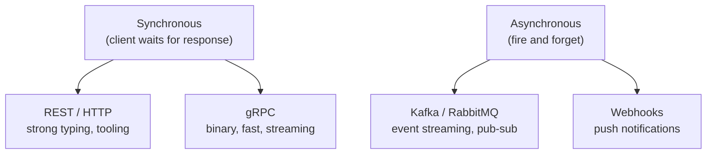
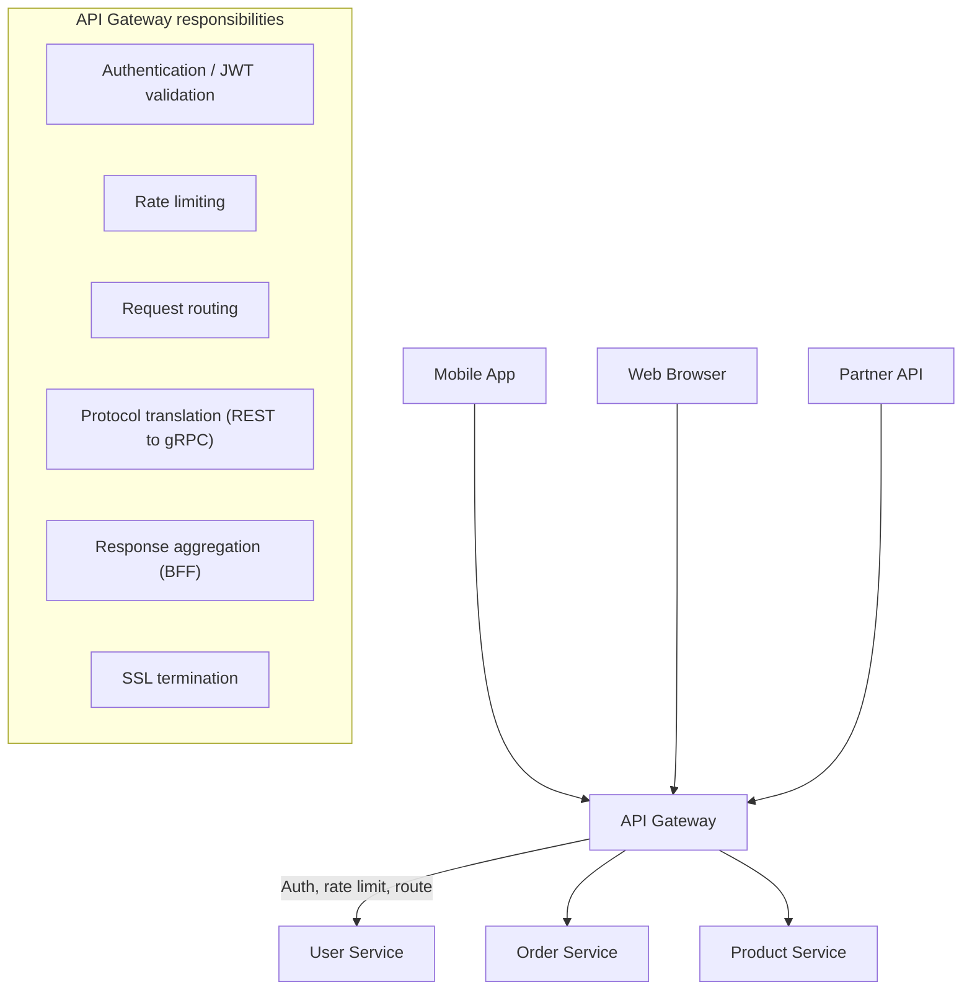
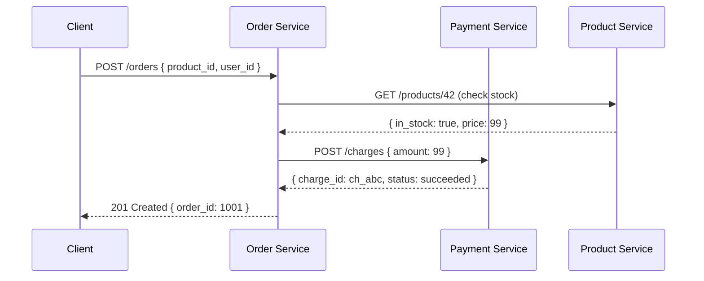
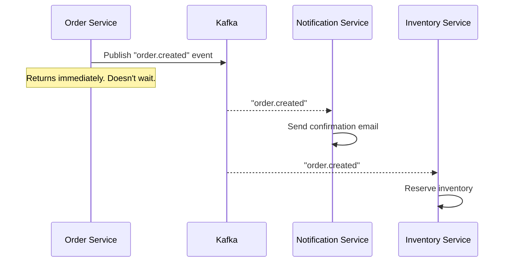
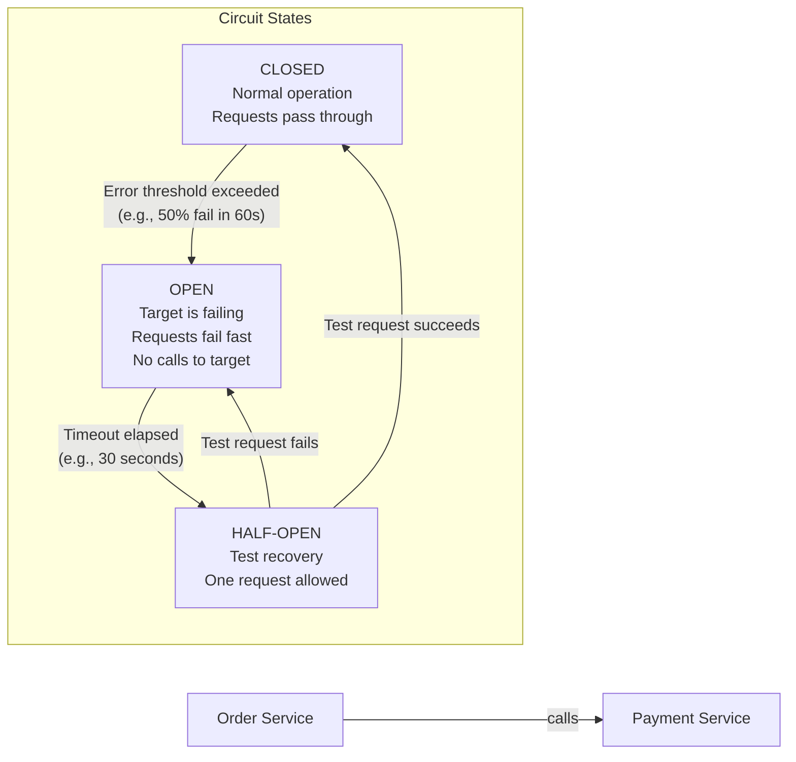
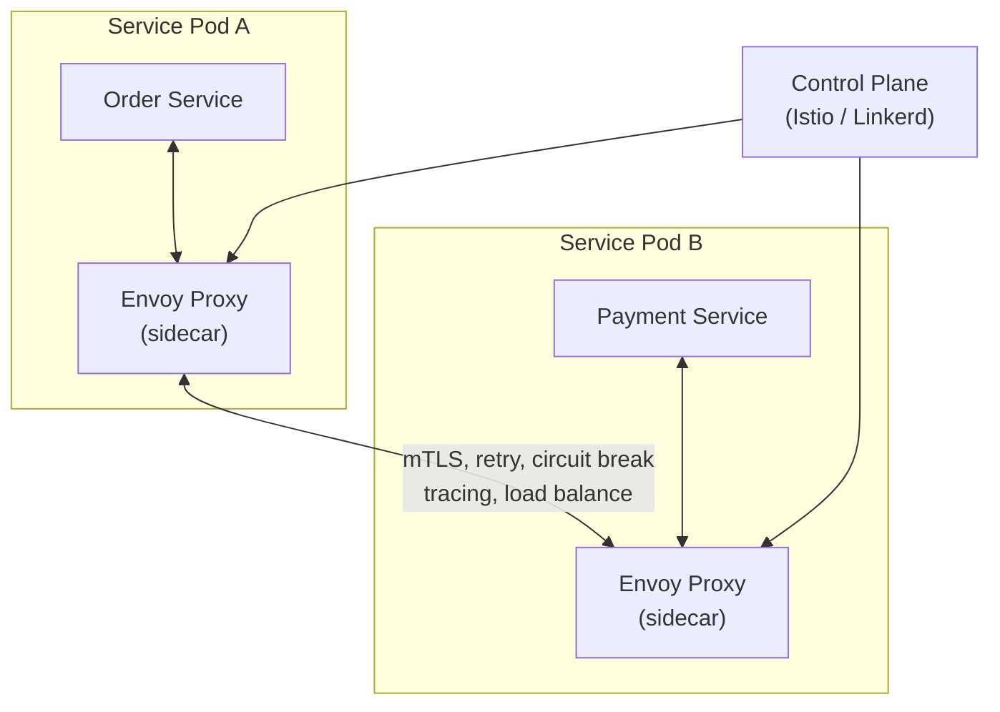
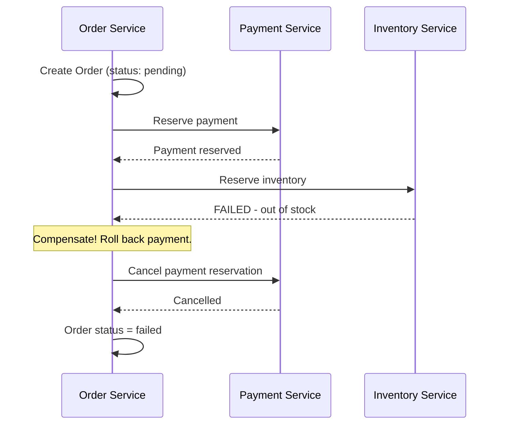

# Microservices Architecture

Microservices is an architectural style where an application is built as a suite of **small, independently deployable services**, each running in its own process and communicating over a network. Each service owns its data, is responsible for a bounded domain, and can be deployed, scaled, and restarted without touching any other service.

> **Why this matters in interviews:** Microservices is the dominant architecture for large-scale systems at companies like Netflix, Uber, Airbnb, and Amazon. Almost every system design question at a senior level implicitly assumes a microservices context. Understanding the benefits, the failure modes, and the operational requirements is essential.

---

## The Core Idea: Decompose by Business Domain

**The fundamental rule: each service owns its data.** No service reaches into another service's database. All cross-service data access goes through the owning service's API. This is what makes services truly independent.

---

## Key Principles

### 1. Single Responsibility / Bounded Context

Each service does one thing and does it well, corresponding to a **bounded context** from Domain-Driven Design. The "user service" owns everything about users — profile, preferences, authentication. It knows nothing about orders.

Sizing heuristics:

- **Too small:** "Nano-service" — a service for a single CRUD operation. Network overhead and operational cost outweigh the benefits.
- **Too large:** Becoming a monolith again.
- **Just right:** Can be understood by one small team, can be rebuilt in 2–4 weeks if needed.

### 2. Database per Service

With database per service, you gain: schema freedom, independent evolution, technology choice (Postgres for relational, MongoDB for documents, Redis for cache), and fault isolation (Service A's DB going down doesn't affect Service B).

### 3. Communicate via APIs and Events

**Synchronous calls** couple services in time — Service B must be up for Service A to succeed. Use for reads and operations where the caller needs the result immediately.

**Asynchronous events** decouple services — Order Service publishes `order.created`; Notification Service subscribes and sends an email. If Notification is down, the event queues and the order still succeeds.

---

## The API Gateway Pattern

Clients talk to one gateway; the gateway knows how to route to the right service. This keeps clients decoupled from the internal service topology — adding, splitting, or moving services doesn't require client changes.

---

## Service Communication Patterns

### Synchronous: Request/Response

**Problem:** If PaySvc has a 500ms latency spike, OrderSvc is blocked for 500ms. Latency cascades. Mitigated with timeouts, circuit breakers, and retries with exponential backoff.

### Asynchronous: Event-Driven

Order Service publishes one event; multiple services react independently. Adding a new consumer (e.g., Fraud Detection) requires zero changes to Order Service. **Temporal decoupling:** services don't need to be up simultaneously.

---

## Resiliency Patterns

### Circuit Breaker

Without a circuit breaker, a slow Payment Service causes Order Service threads to pile up waiting, eventually exhausting the thread pool and crashing Order Service — **cascading failure**. The circuit breaker detects failure and short-circuits calls, returning an error immediately. Target service gets a recovery window.

### Service Mesh (Sidecar Pattern)

A service mesh adds a proxy (sidecar) to every service pod. The proxy handles: mTLS encryption, retry policies, circuit breaking, load balancing, distributed tracing — without any application code changes. The control plane configures all sidecars.

---

## Data Consistency Challenges

When data spans multiple services, ACID transactions are impossible. You use eventual consistency and **sagas**:

### The Saga Pattern

Each step has a **compensating transaction** (undo). If step N fails, steps N-1 through 1 are compensated in reverse. This achieves eventual consistency without distributed transactions.

---

## Microservices vs. Monolith Tradeoffs

| Dimension                     | Microservices                        | Monolith                               |
| ----------------------------- | ------------------------------------ | -------------------------------------- |
| **Independent deployability** | ✅ Any service, any time             | ❌ All or nothing                      |
| **Independent scaling**       | ✅ Scale only hot services           | ❌ Scale entire app                    |
| **Tech diversity**            | ✅ Right tool per job                | ❌ One stack                           |
| **Development simplicity**    | ❌ Distributed complexity            | ✅ One repo, one debug session         |
| **ACID transactions**         | ❌ Saga pattern needed               | ✅ Native                              |
| **Operational overhead**      | ❌ High (K8s, service mesh, tracing) | ✅ Low                                 |
| **Team autonomy**             | ✅ Teams own services end-to-end     | ❌ Teams coordinate on shared codebase |
| **Latency**                   | ❌ Network hops between services     | ✅ In-process function calls           |

---

## Real-World Microservices

**Netflix:** ~700 microservices. Every feature (recommendation, streaming, billing, search) is a separate service. They invented or popularized: Hystrix (circuit breaker), Eureka (service discovery), Zuul (API gateway), Ribbon (client-side load balancing).

**Uber:** Moved from a monolith to microservices around 2014. Now has thousands of services. Domains like rider, driver, maps, pricing, payments, safety are completely separate service groups.

**Amazon:** The "two-pizza team" rule — if a team can't be fed by two pizzas, it's too large. Each team owns one or a few services end-to-end. This org structure directly produced the microservices architecture — and AWS S3, EC2, etc. are themselves exposed as independent services.

---

## Interview Talking Points

**1. How do you decompose a monolith into microservices? Where do you draw the service boundaries?**

> "I use Domain-Driven Design bounded contexts to find service boundaries. Each bounded context is a natural candidate for a service — it represents a domain concept with clear ownership and a well-defined interface to the outside world. Practically: look at your database schema and see which tables are always queried together vs. which are queried separately. Look at your teams — Conway's Law means your services will end up mirroring your org structure anyway, so align boundaries with team ownership. Avoid slicing by technical layer (a 'data access service') — slice by business capability (a 'user service')."

**2. How do services communicate in a microservices architecture, and when do you use sync vs. async?**

> "Synchronous (REST/gRPC) for operations where the caller needs an immediate result — reading user data to display a profile, charging a payment and needing confirmation before confirming an order. Asynchronous (Kafka/RabbitMQ events) for operations where you can decouple: sending emails, updating search indexes, propagating state changes to multiple consumers. The key async benefit is temporal decoupling — if the notification service is down, events queue up and process when it recovers; the order still succeeds. Async also removes the cascading failure risk of synchronous chains."

**3. What is a circuit breaker and why is it essential in microservices?**

> "A circuit breaker wraps outbound calls to a dependency. When the error rate exceeds a threshold, the circuit 'opens' — subsequent calls fail immediately without contacting the dependency. This serves two purposes: it prevents the caller from wasting threads waiting for a slow/dead dependency (avoiding thread pool exhaustion and cascading failure), and it gives the dependency a recovery window without being hammered by retries. After a timeout, the circuit goes 'half-open' — one test request is allowed through. If it succeeds, the circuit closes. Netflix's Hystrix, Resilience4j, and service mesh sidecars all implement this pattern."

**4. How do you handle data consistency across microservices without distributed transactions?**

> "The saga pattern. Each operation in a multi-service workflow has a corresponding compensating transaction (an 'undo'). If step 3 fails, you execute compensating transactions for steps 2 and 1. The system reaches eventual consistency. Orchestration sagas use a central orchestrator that calls services and drives compensation. Choreography sagas use events — each service reacts to events and publishes new events, with compensation triggered by failure events. The key insight is accepting that you can't have strict ACID across services — you design for eventual consistency and make each step idempotent so retries are safe."

---

## Key Takeaways

- Microservices decompose an application into **independent, deployable services** aligned with business domains
- **Database per service** is non-negotiable — shared databases couple services at the schema level
- The **API gateway** provides a single entry point, handling auth, routing, rate limiting, and protocol translation
- **Circuit breakers** prevent cascading failures — fail fast when a dependency is struggling
- **Sagas** replace distributed transactions — compensating transactions achieve eventual consistency
- Service meshes (Istio/Linkerd) handle cross-cutting concerns (mTLS, retries, tracing) without application code
- Microservices require **significant operational maturity** — Kubernetes, service mesh, distributed tracing, centralized logging
- Start with a monolith; extract microservices along domain boundaries when team size and scale justify the operational overhead
