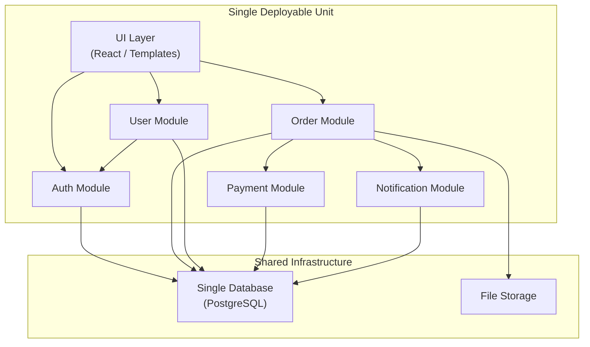
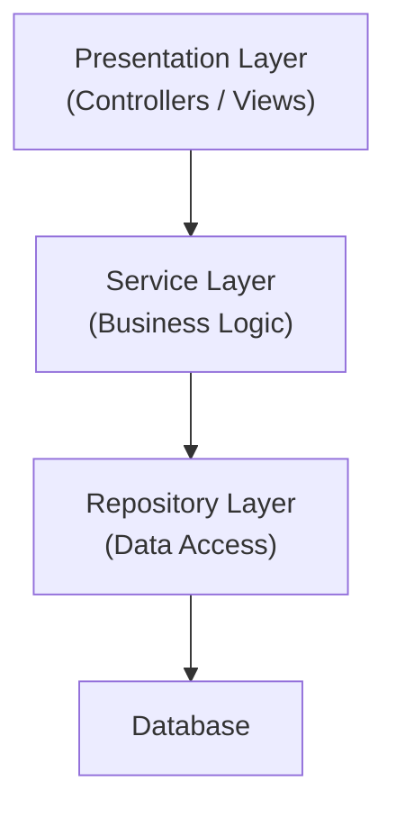
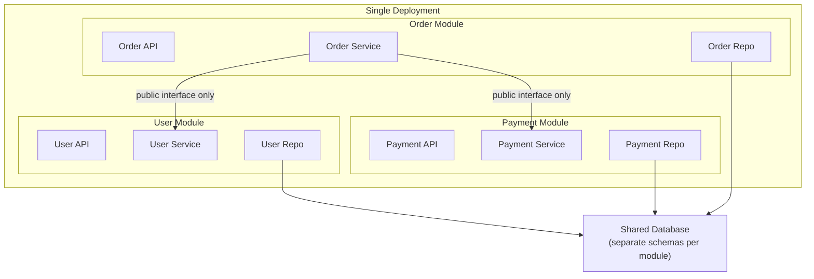
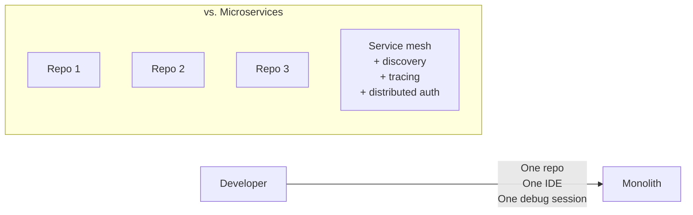
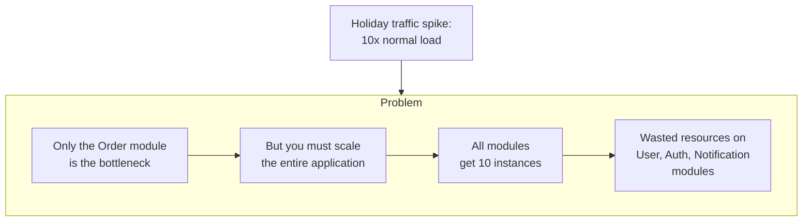
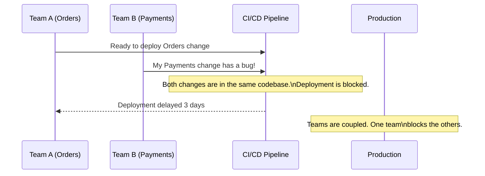
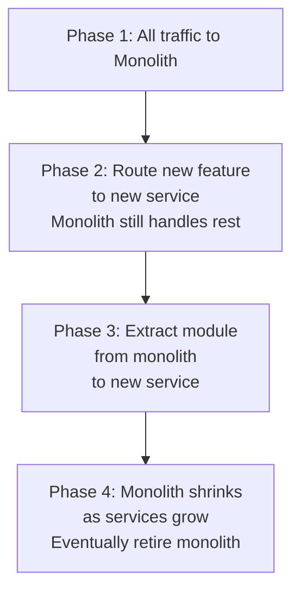

# Monolithic Architecture

A **monolithic application** is deployed as a single unit — one codebase, one build artifact, one process. The entire application (user interface, business logic, data access layer) is bundled together and deployed together. Despite being the default choice for decades, monoliths are frequently misunderstood — they're not inherently bad, and for many systems they're the right choice.

> **Why this matters in interviews:** Every system starts as a monolith. The decision of _when_ to break a monolith into microservices — and _why_ — is one of the most important architectural decisions you'll discuss in system design interviews. Understanding what a monolith is, what problems it solves, and what problems it creates is prerequisite knowledge.

---

## What a Monolith Looks Like

All modules share the same process, the same memory, the same database connection pool, and the same deployment pipeline. An `OrderService` can call `PaymentService` directly — it's just a function call within the same JVM/process.

---

## Types of Monoliths

Not all monoliths are the same. The difference between a "big ball of mud" and a "modular monolith" is enormous:

### 1. The Big Ball of Mud

Everything depends on everything. No clear module boundaries. Database is accessed from anywhere. Changing one thing breaks something else unpredictably. **This is what people mean when they say "monolith" disparagingly.**

### 2. The Layered Monolith

Classic MVC-style structure. Clean separation between layers, but all layers are in one deployment unit. Common in Rails, Django, Spring MVC apps.

### 3. The Modular Monolith

Modules have strict internal ownership and communicate only through defined public interfaces — no cross-module direct database access. This is the **best of both worlds**: operational simplicity of a monolith, code organization of microservices. Shopify operates this way.

---

## The Monolith's Genuine Advantages

### Simplicity of Development

A developer can run the entire application locally with a single command. Debugging spans the whole system in one stack trace — no distributed tracing required. Refactoring is safe because the compiler/IDE catches cross-module breaks instantly.

### Simplicity of Operations

| Concern                   | Monolith                          | Microservices                           |
| ------------------------- | --------------------------------- | --------------------------------------- |
| **Deployment**            | One artifact, one pipeline        | Dozens of pipelines, versioned APIs     |
| **Monitoring**            | Single log stream                 | Distributed tracing, log aggregation    |
| **Debugging**             | One stack trace                   | Trace spans across services             |
| **Local dev**             | `rails server` or `./gradlew run` | Docker Compose with 10 containers       |
| **Database transactions** | Trivial (ACID)                    | Distributed transactions (saga pattern) |

### ACID Transactions Across Operations

In a monolith, `createOrder()` and `chargePayment()` and `sendNotification()` can all happen in a single database transaction — atomic, consistent, isolated, durable. If the payment fails, the order is rolled back automatically.

In microservices, this requires the **saga pattern** — a choreography of compensating transactions across services. It's correct, but it's complex and bugs are subtle.

---

## Where Monoliths Break Down

### The Scaling Problem

You can't scale individual modules independently. If only the order processing module is under load, you still scale the whole monolith — including the low-traffic notification module. Resource efficiency suffers.

### The Deployment Coupling Problem

Any bug in any module blocks deployment for all teams. At scale (dozens of teams), this becomes a serious bottleneck. Release trains, feature flags, and branching strategies help but don't fully solve it.

### The Technology Lock-In

Every module must use the same language, the same runtime, the same framework version. You can't write the compute-intensive image processing module in Rust while keeping the rest in Ruby.

---

## Monolith vs. Microservices: When to Use Each

| Situation                               | Recommendation                                                  |
| --------------------------------------- | --------------------------------------------------------------- |
| **Early-stage startup, < 10 engineers** | Monolith — move fast, don't pay distributed systems tax         |
| **Domain boundaries not yet clear**     | Monolith — premature decomposition creates wrong service cuts   |
| **Strong ACID requirements**            | Monolith (or modular monolith) — avoid saga complexity          |
| **Large org, independent teams**        | Microservices — Conway's Law: org structure drives architecture |
| **Need to scale specific modules 100x** | Microservices — extract the hot path                            |
| **Operational maturity lacking**        | Monolith — microservices require DevOps sophistication          |

> **Conway's Law:** "Organizations which design systems are constrained to produce designs which are copies of the communication structures of those organizations." — If your org has 5 teams, you'll end up with a 5-service architecture whether you plan for it or not.

---

## The Strangler Fig Pattern — Migrating Out of a Monolith

Named after the strangler fig tree that grows around a host tree and eventually replaces it. New functionality is built as services; old functionality is extracted piece by piece. The monolith never gets a big-bang rewrite — it shrinks incrementally. This is how Netflix, Amazon, and Airbnb migrated.

---

## Real-World Monolith Success Stories

**Shopify:** The world's largest Rails monolith. Powers 10%+ of US e-commerce. They chose a **modular monolith** architecture with strict module boundaries. A team of hundreds works in one Rails codebase. They run thousands of instances but deploy as one unit.

**Stack Overflow:** Serves millions of requests per day from a small number of powerful servers running a .NET monolith. They've written about getting extraordinary performance from a well-optimized monolith without the distributed systems complexity.

**Basecamp (37signals):** Deliberately moved _back_ to a monolith after extracting services, finding the operational overhead wasn't worth the complexity for their scale.

---

## Interview Talking Points

**1. Is a monolith always bad? When is it the right choice?**

> "Absolutely not. A monolith is the right default choice for teams of under 10-15 engineers, when domain boundaries aren't yet understood, when strong transactional consistency is required, or when the team lacks the operational maturity for microservices. Shopify runs one of the largest e-commerce platforms in the world on a Rails monolith. The question isn't monolith vs. microservices — it's finding the right level of decomposition for your team size, domain clarity, and scale requirements."

**2. What is a modular monolith and how does it differ from a 'big ball of mud'?**

> "A modular monolith organizes code into distinct modules with strict ownership and well-defined public interfaces — no cross-module direct database access, no internal class imports across boundaries. Communication between modules goes through the same interfaces you'd use between microservices. It deploys as one unit but has the code organization of microservices. It's the best path when teams are growing: you get the operational simplicity of a monolith while maintaining the ability to extract services later along already-clean boundaries."

**3. What specific problems cause teams to break a monolith apart?**

> "Three main pain points: First, deployment coupling — when dozens of teams all deploy from the same codebase, any team's bug blocks everyone's release. Second, scaling — you can't scale a hot module (e.g., order processing) without scaling the whole app, wasting resources. Third, technology constraints — every team must use the same language and framework, even when a different technology is clearly better for a specific problem. When these problems become significant operational costs, that's when decomposition makes sense."

**4. How do you migrate from a monolith to microservices safely?**

> "The Strangler Fig pattern: never do a big-bang rewrite. Add an API gateway or proxy in front of the monolith. When building new features, build them as new services — the proxy routes new feature traffic there. When a module needs to be extracted, refactor it to a clean interface boundary first (while still inside the monolith), then extract it to a service and update the proxy routing. The monolith shrinks over time as services multiply. This approach maintains a working production system throughout the migration."

---

## Key Takeaways

- A monolith is a **single deployable unit** — one codebase, one build, one process
- **Not all monoliths are equal:** big-ball-of-mud vs. modular monolith is the difference between chaos and a well-architected system
- Monoliths win on: **simplicity of development, operations, and ACID transactions**
- Monoliths struggle with: **independent scaling, deployment coupling at team scale, and technology heterogeneity**
- The **modular monolith** is the best starting point — clean boundaries inside one deployment
- Migrate with the **Strangler Fig pattern** — incremental extraction, never a big-bang rewrite
- Conway's Law: your architecture will reflect your organization's communication structure
