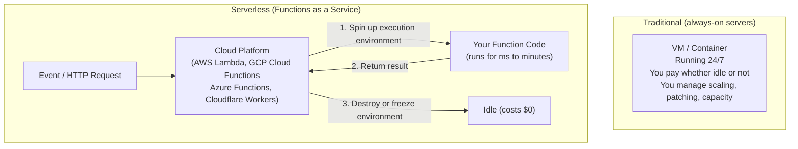
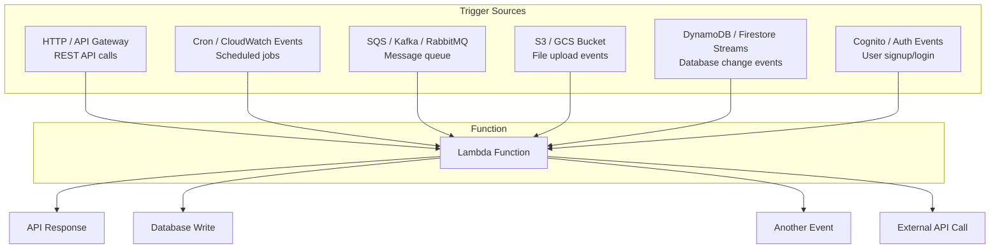
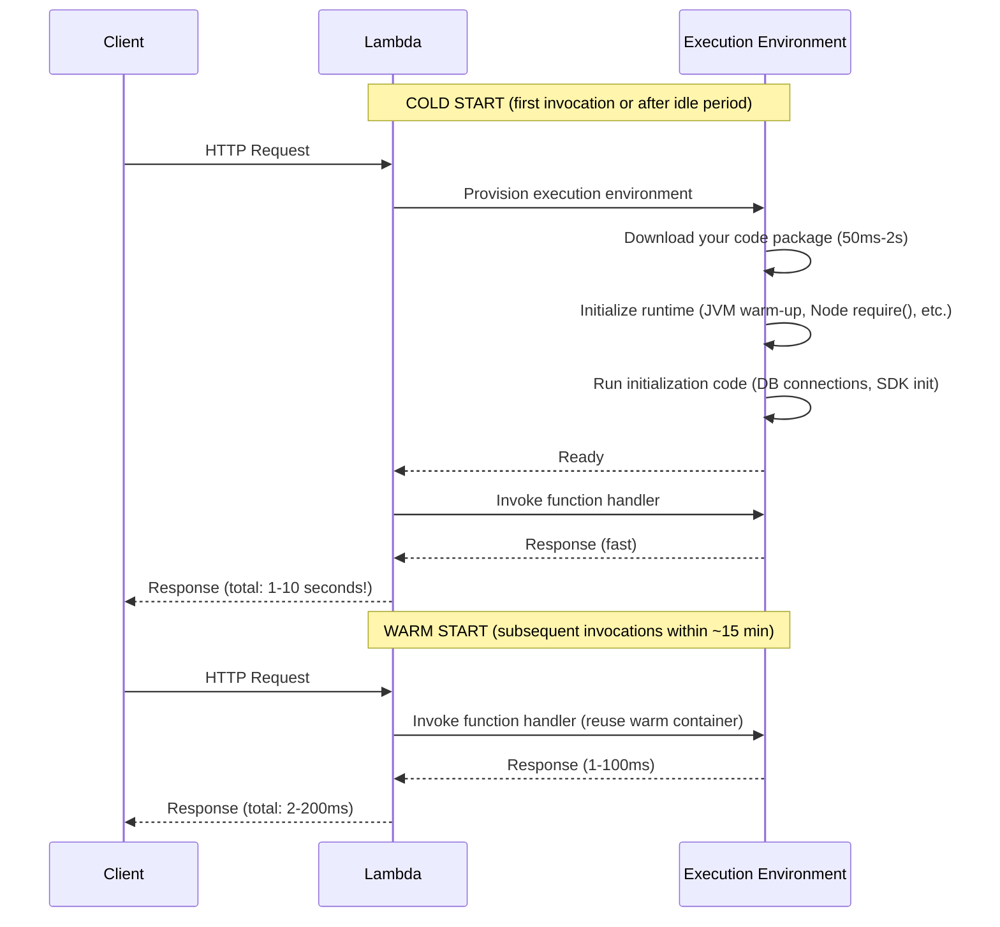
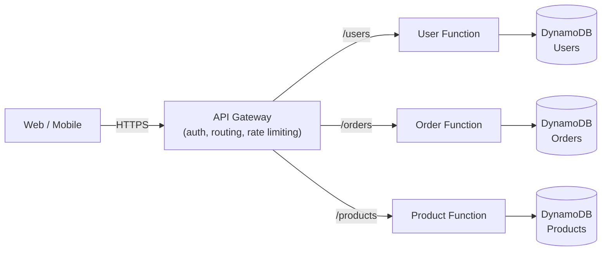
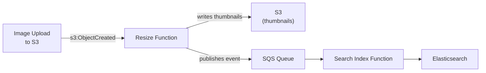
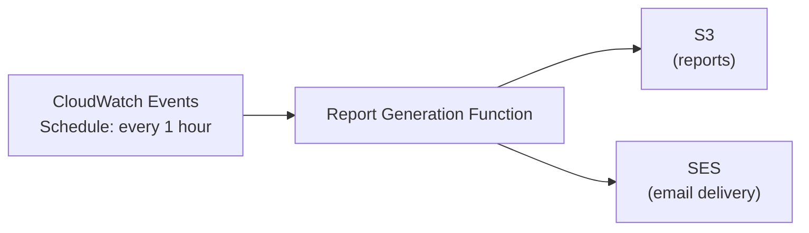
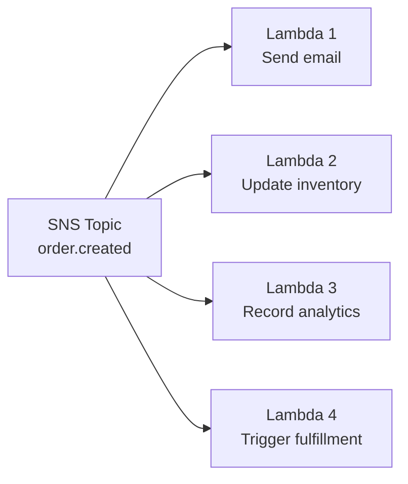

# Serverless Architecture

Serverless architecture lets you run code **without managing servers**. You write functions, deploy them to a cloud provider, and they execute on demand — scaling from zero to millions of invocations automatically. You pay only for the compute time actually used. The "serverless" name is a misnomer: there are still servers, you just don't see, provision, or manage them.

> **Why this matters in interviews:** Serverless appears in two key interview contexts: (1) as a component of a larger system design (event triggers, data processing pipelines, webhook handlers), and (2) as an architecture choice to evaluate against containers/VMs. Knowing when serverless is the right fit — and when cold starts, cost at scale, and vendor lock-in make it the wrong fit — demonstrates production experience.

---

## The Core Model: Functions as a Service

**Key properties of a serverless function:**

- **Stateless:** No in-memory state between invocations; each call is independent
- **Short-lived:** Execution time limits (15 min for Lambda, 60 min for Cloud Run)
- **Event-triggered:** HTTP requests, scheduled events, message queue messages, file uploads
- **Auto-scaling:** From 0 to thousands of concurrent instances automatically
- **Pay-per-use:** Billed in milliseconds of execution + number of invocations

---

## Serverless Triggers: How Functions Are Invoked

The trigger model makes serverless naturally event-driven. A Lambda function triggered by an S3 file upload can process the file and write results to a database — all without any always-on infrastructure.

---

## The Cold Start Problem

The most important technical challenge in serverless:

**Cold start factors:**

- **Language:** Python/Node.js (~100ms) vs. Java/Kotlin (~1-5s for JVM warmup)
- **Package size:** Larger deployment packages take longer to download
- **Initialization code:** DB connections, SDK initialization in module scope

**Cold start mitigations:**

- **Provisioned concurrency** (AWS): Keep N instances pre-warmed — you pay for them even when idle
- **Minimum instances** (Google Cloud Run): Same concept
- **Lightweight runtimes:** Use Python, Node.js, or Go (low startup) over Java for latency-sensitive functions
- **Slim packages:** Remove unused dependencies, use Lambda Layers
- **Keep-alive pings:** Schedule a cron every 5 minutes to ping your function (hacky but effective)

---

## Serverless Architecture Patterns

### API Backend Pattern

One Lambda function per route (or small group of routes). API Gateway handles auth (JWT validation), rate limiting, and request routing. Scales from 0 to millions of requests without provisioning servers.

**Best for:** CRUD APIs with variable traffic, internal tools, startup MVPs

### Event Processing Pipeline

S3 upload triggers image processing, which triggers search indexing. The entire pipeline is serverless — no infrastructure to manage, scales with the volume of uploads.

**Best for:** Media processing, data transformation, ETL pipelines

### Scheduled Jobs (Cron Replacement)

Replace always-on cron servers with scheduled Lambda functions. Zero cost between executions.

**Best for:** Report generation, cleanup jobs, data sync, health checks

### Fan-Out Pattern

One event triggers multiple independent Lambda functions in parallel. Each scales independently; one failing doesn't affect others.

---

## Serverless Cost Model

The economics are completely different from traditional servers:

| Model                  | Cost Structure                 | Best When                       |
| ---------------------- | ------------------------------ | ------------------------------- |
| **EC2 / VM**           | Hourly, always-on              | Steady, predictable high load   |
| **Container / ECS**    | By CPU/memory usage + hours    | Medium-to-high load             |
| **Lambda / Functions** | Per invocation + per GB-second | Variable, spiky, or low traffic |

**Lambda pricing example (AWS):**

- $0.20 per 1 million invocations
- $0.0000166667 per GB-second

For a function that runs 1M times/month at 100ms with 128MB:

- Compute: 1M × 0.1s × 0.125GB × $0.0000166667 = **$0.21/month**
- Invocations: 1M × $0.20/1M = **$0.20/month**
- Total: **~$0.41/month**

**But at scale:** If you're running 1 billion invocations/month, serverless often costs more than equivalent containers. The inflection point depends on request rate and function duration.

---

## Serverless Limitations

### 1. Cold Start Latency (Covered Above)

Not acceptable for user-facing APIs requiring sub-100ms P99 latency. Acceptable for batch processing, async jobs, and low-traffic APIs.

### 2. Execution Time Limits

AWS Lambda: 15 minutes max. Not suitable for long-running jobs (video encoding, ML training). Use containers, AWS Batch, or Fargate for those.

### 3. Statelessness Requirement

Functions must be stateless — no in-memory state between calls. External state (database, Redis, S3) required. This is a feature (makes functions scalable) but requires different thinking.

### 4. Vendor Lock-In

AWS Lambda code often uses AWS-specific SDKs (SQS, DynamoDB, SES). Moving to GCP Cloud Functions requires rewriting integrations. Frameworks like Serverless Framework or AWS SAM help but don't eliminate lock-in.

### 5. Observability Gaps

Each invocation is an isolated execution. Traditional APM tools don't apply directly. Requires purpose-built observability: AWS X-Ray, Datadog Lambda, or OpenTelemetry Lambda layers. Distributed tracing across Lambda chains is significantly more complex than tracing monolithic services.

### 6. Concurrency Limits

AWS Lambda default: 1,000 concurrent executions per region per account. A sudden spike to 10,000 concurrent requests will throttle. Request limit increases in advance for expected traffic spikes.

---

## When to Use Serverless vs. Containers

| Use Case                             | Serverless                  | Container                      |
| ------------------------------------ | --------------------------- | ------------------------------ |
| **Spiky, variable traffic**          | ✅ Auto-scales to zero      | ❌ Idle containers waste money |
| **Event-driven processing**          | ✅ Natural fit for triggers | ❌ Polling loops needed        |
| **Sub-100ms P99 latency**            | ❌ Cold starts              | ✅ Always warm                 |
| **Long-running operations (>15min)** | ❌ Time limits              | ✅ No limit                    |
| **Large memory workloads (>10GB)**   | ❌ Limited                  | ✅ EC2 with TB+ RAM            |
| **Startup / prototype**              | ✅ Zero ops overhead        | ❌ Dockerfile, K8s, CI/CD      |
| **Predictable high throughput**      | ❌ Can be costly            | ✅ More economical             |
| **Custom runtime / OS config**       | ❌ Limited                  | ✅ Full control                |

---

## Real-World Serverless

**Netflix:** Uses Lambda for file processing and event-triggered encoding pipeline stages. Not for the core streaming CDN — that's purpose-built infrastructure.

**Airbnb:** Serverless for image processing — when a host uploads a photo, Lambda resizes it to multiple resolutions, detects content, and generates thumbnails.

**Coca-Cola:** Replaced a vending machine transaction backend — traditional server cost $13,000/year. Lambda-based solution: $4,490/year, handling 50M transactions.

**Zalando:** Used serverless for their infrastructure "glue" — connecting events between systems, running scheduled data quality checks, triggering ETL jobs.

---

## Interview Talking Points

**1. What is the cold start problem and how do you mitigate it?**

> "When a Lambda function hasn't been invoked recently, the cloud provider must provision a new execution environment, download your code, initialize the runtime, and run your initialization code — this can take 1–10 seconds, which is unacceptable for user-facing APIs. Mitigations: provisioned concurrency (AWS keeps N warm instances ready, at a cost), choosing fast-starting runtimes (Python, Node.js, Go instead of JVM languages), minimizing package size, and moving heavy initialization (DB connections, SDK clients) into the module scope so they're reused across warm invocations. For truly latency-sensitive paths, containers with minimum instances or always-on servers are more appropriate."

**2. When would you NOT use serverless architecture?**

> "Several scenarios: operations requiring consistent sub-100ms latency (cold starts kill you), long-running computations exceeding 15 minutes, applications with very high sustained throughput where serverless unit pricing exceeds container pricing, workloads needing custom OS configuration or specific hardware, and cases where vendor lock-in is a hard constraint. Also, if you're debugging complex distributed interactions across 20 Lambda functions, the observability overhead can exceed the operational savings from not managing servers."

**3. How does serverless fit into a microservices architecture?**

> "Serverless functions are a great implementation choice for certain microservices — specifically event-driven ones. A notification service that sends emails in response to events is a perfect Lambda function: event-triggered, stateless, variable load. But a core service like an orders API that needs consistent low latency and predictable scaling often runs better on containers. In practice, most modern architectures are hybrid: containers for always-on, latency-sensitive services; serverless functions for event processing, scheduled jobs, and glue code."

**4. What is the difference between AWS Lambda and AWS Fargate?**

> "Lambda is true Functions-as-a-Service: you deploy code (not a container), it runs in Amazon-managed execution environments, you have no control over the runtime beyond language/version, and you're limited to 15 minutes and specific resource configs. Fargate is Container-as-a-Service: you deploy a Docker container, it runs on Amazon-managed infrastructure, you have full control over the runtime and can run for hours, and you pay by CPU/memory per second. Lambda is more 'serverless' (zero infrastructure thinking), but Fargate is better for longer-running, larger, or more customized workloads. Both eliminate EC2 management."

---

## Key Takeaways

- Serverless = **Functions as a Service** — deploy code, not servers; cloud manages scaling, patching, capacity
- Functions are **stateless, short-lived, and event-triggered** — scale from 0 to millions automatically
- **Cold starts** are the primary latency challenge — mitigate with provisioned concurrency, fast runtimes, and small packages
- **Pay-per-use** economics are excellent for variable/spiky workloads; containers win at sustained high throughput
- Natural fit for: **event processing, API backends, scheduled jobs, fan-out pipelines, glue code**
- Not suitable for: **sub-100ms P99 latency, >15min jobs, very high sustained throughput, custom runtime requirements**
- **Vendor lock-in** is real — use abstraction layers (Serverless Framework) and pure function code where possible
- Most production systems are **hybrid**: containers for core services, serverless for event-driven periphery
