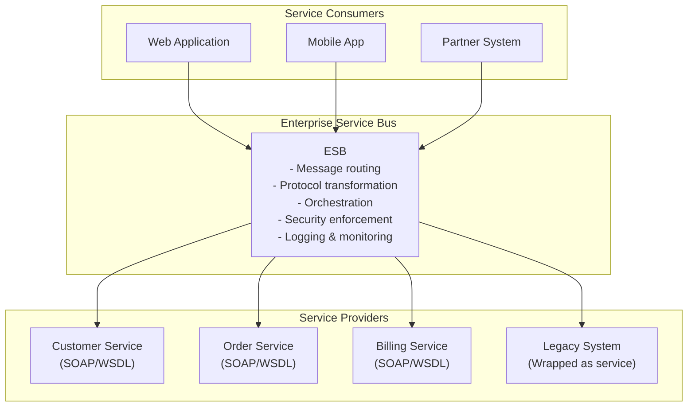
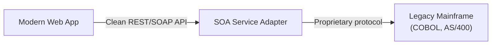
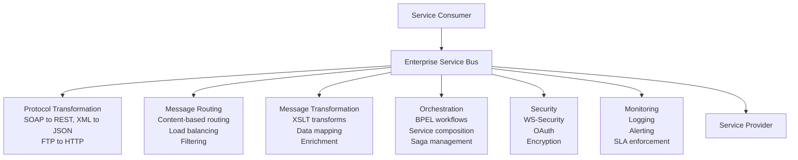
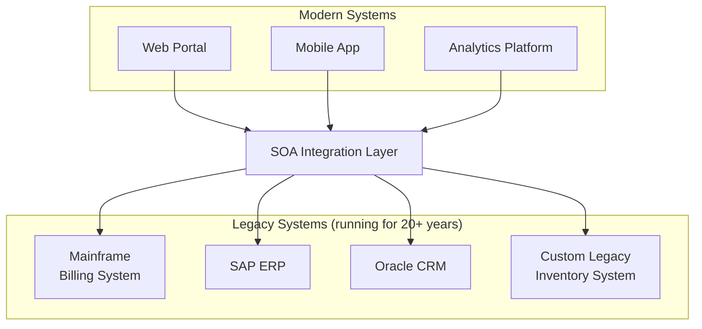

# Service-Oriented Architecture (SOA)

Service-Oriented Architecture (SOA) is an architectural pattern where software components — called **services** — are designed to communicate with each other over a network using standardized interfaces and protocols. SOA was the dominant enterprise architecture pattern of the 2000s and is the conceptual ancestor of modern microservices.

> **Why this matters in interviews:** SOA and microservices are frequently confused and sometimes used interchangeably. Understanding the distinction — ESB vs. API gateway, shared infrastructure vs. service autonomy, enterprise contracts vs. bounded contexts — demonstrates architectural maturity. Many large enterprises still run SOA, and the patterns you'll encounter in integration work directly derive from SOA thinking.

---

## The SOA Mental Model



The **Enterprise Service Bus (ESB)** is the heart of SOA. It's the central integration hub that handles message routing, protocol translation, transformation, orchestration, and security. All services communicate through it.

---

## Core SOA Principles

### 1. Standardized Service Contracts

Services expose their capabilities through formal contracts — in SOA's golden era, **WSDL** (Web Services Description Language) for SOAP services. The contract describes:

- What operations are available
- What input/output message formats are required
- What transport protocol is used
- What security policies apply

```xml
<!-- WSDL service contract fragment -->
<wsdl:portType name="OrderServicePort">
  <wsdl:operation name="createOrder">
    <wsdl:input message="tns:CreateOrderRequest"/>
    <wsdl:output message="tns:CreateOrderResponse"/>
  </wsdl:operation>
  <wsdl:operation name="getOrderStatus">
    <wsdl:input message="tns:GetOrderStatusRequest"/>
    <wsdl:output message="tns:GetOrderStatusResponse"/>
  </wsdl:operation>
</wsdl:portType>
```

Contracts are versioned and published to a **service registry** (like UDDI) where consumers can discover available services.

### 2. Loose Coupling

Services shouldn't know about each other's internal implementation. They communicate only through the contract. You can change a service's database, language, or internal logic without breaking consumers — as long as the contract stays the same.

### 3. Abstraction

Services hide implementation details. A `CustomerService` might wrap a 20-year-old COBOL mainframe system, exposing a clean modern interface to the rest of the enterprise.



This **legacy wrapping** is one of SOA's greatest practical strengths — it allows enterprises to modernize incrementally without replacing working systems.

### 4. Reusability

A `CustomerService` built once is reused by the web app, the mobile app, the call center system, and the partner portal. Enterprise-wide consistency in how customer data is accessed.

### 5. Composability

Complex business processes are composed from simpler services. A `PlaceOrder` business process might orchestrate calls to CustomerService, InventoryService, PricingService, and OrderService.

---

## The ESB: Capabilities and Problems

The ESB is what distinguishes SOA from microservices:

### What the ESB Does



### The ESB Problem

The ESB accumulates business logic. Over time:

- Routing rules encode business decisions
- Transformation logic implements data mappings that belong to services
- Orchestration in the ESB means the ESB must be changed when business processes change
- The ESB becomes a **bottleneck** — all traffic flows through it
- The ESB becomes a **single point of failure**
- ESB team becomes a coordination bottleneck ("smart pipe, dumb endpoints" gets inverted)

Martin Fowler summarized this as: SOA uses "smart pipes, dumb endpoints." Microservices inverts this: "smart endpoints, dumb pipes."

---

## SOA vs. Microservices: The Critical Distinctions

| Dimension              | SOA                                      | Microservices                               |
| ---------------------- | ---------------------------------------- | ------------------------------------------- |
| **Scope**              | Enterprise-wide integration              | Single application decomposition            |
| **Communication**      | ESB (centralized broker)                 | Direct service-to-service or lightweight MQ |
| **Protocol**           | SOAP, WS-\*, XML                         | REST, gRPC, JSON, async events              |
| **Granularity**        | Coarser-grained services                 | Finer-grained, single-responsibility        |
| **Data**               | Often shared enterprise database         | Database per service                        |
| **Governance**         | Central IT governance, contracts         | Team autonomy, loose coupling               |
| **Deployment**         | Coordinated enterprise releases          | Independent, continuous deployment          |
| **Technology**         | Vendor platforms (IBM, Oracle, MuleSoft) | Open source, cloud-native                   |
| **Legacy integration** | Core strength                            | Not the primary focus                       |

---

## SOA in Practice: When It Shines

### Legacy System Integration



Banks, insurance companies, airlines, and government agencies run systems from the 1970s–1990s that cannot be replaced. SOA wraps these systems in modern interfaces, allowing new applications to be built on top without touching the legacy code.

### Enterprise-Wide Business Process Orchestration

Complex multi-system workflows — like processing an insurance claim (validate policy, check fraud, calculate payout, notify customer, update accounting) — are naturally expressed as SOA orchestrations. **BPEL** (Business Process Execution Language) was designed exactly for this.

---

## WS-\* Standards: The SOA Protocol Stack

SOA came with a rich set of standards for enterprise concerns:

| Standard                 | Purpose                              |
| ------------------------ | ------------------------------------ |
| **SOAP**                 | Message format (XML envelope)        |
| **WSDL**                 | Service contract definition          |
| **UDDI**                 | Service registry/discovery           |
| **WS-Security**          | Message-level encryption and signing |
| **WS-ReliableMessaging** | Guaranteed message delivery          |
| **WS-AtomicTransaction** | Distributed transactions             |
| **BPEL**                 | Business process orchestration       |

These standards were comprehensive but heavyweight. The XML parsing overhead and verbose message formats were significant performance costs — a factor in SOA's decline in favor of REST-based microservices.

---

## Modern SOA: The ESB Has Evolved

Modern integration platforms have taken SOA principles and modernized them:

**MuleSoft, Apache Camel, WSO2, Azure Service Bus** — these provide ESB-like capabilities with modern protocols (REST, GraphQL, Kafka) and cloud-native deployment. They're used in exactly the enterprise integration scenarios where SOA excelled.

The **API Management** category (Kong, Apigee, AWS API Gateway) provides SOA-style governance (auth, rate limiting, versioning, monitoring) for REST APIs.

---

## Interview Talking Points

**1. What is the difference between SOA and microservices?**

> "Both decompose applications into services, but with different philosophies. SOA is about enterprise-wide integration, connecting disparate systems (including legacy) through a centralized ESB. The ESB handles routing, transformation, and orchestration — 'smart pipe, dumb endpoints.' Microservices is about decomposing a single application into small, independently deployable services with direct communication — 'smart endpoints, dumb pipes.' SOA services are coarser-grained, share more infrastructure, and are governed centrally. Microservices services are fine-grained, each owns its own data, and teams have autonomy. SOA was never really 'replaced' by microservices — it solves a different, enterprise integration problem."

**2. What is an ESB and what are its limitations?**

> "An Enterprise Service Bus is a centralized messaging infrastructure that handles routing, protocol translation, transformation, and orchestration between services. Its strength is integration — it can connect SOAP services, REST APIs, FTP systems, and mainframes through a common bus. Its limitation is that it becomes a 'god' component over time: business logic leaks in through routing rules and transformations, it becomes a deployment bottleneck (all traffic flows through it), and the ESB team becomes a coordination bottleneck since every integration change requires their involvement. This 'smart pipe' becoming smarter over time is the core ESB anti-pattern."

**3. Where does SOA still make sense today?**

> "SOA principles still dominate enterprise integration scenarios: connecting legacy mainframes (banking, insurance, airlines) to modern applications, orchestrating complex multi-system business processes, enforcing enterprise-wide governance and security policies, and providing a unified interface over heterogeneous systems. Modern platforms like MuleSoft, Apache Camel, and cloud API gateways implement SOA-style integration with modern protocols. The ESB as a heavyweight vendor product (IBM WebSphere MQ, Oracle SOA Suite) is declining, but the pattern of mediated integration is not."

**4. What is the 'smart endpoints, dumb pipes' principle?**

> "This is the key philosophical difference between microservices and SOA. In SOA, the pipe (ESB) is smart — it routes, transforms, and orchestrates. Services are relatively dumb endpoints that receive already-processed messages. In microservices, the pipes are dumb — they're just HTTP or Kafka, moving bytes from A to B. Services are smart — they contain all the business logic, handle their own routing decisions, and implement their own transformations. The benefit of dumb pipes is simplicity: there's no central infrastructure that becomes a bottleneck, and teams can evolve services without coordinating with an ESB team."

---

## Key Takeaways

- SOA organizes software as **network-accessible services** with standardized contracts, designed for enterprise-wide integration
- The **ESB** is SOA's core component — central routing, transformation, and orchestration hub
- SOA's greatest strength: **wrapping legacy systems** and providing enterprise-wide reuse and governance
- SOA's greatest weakness: the ESB becomes a **bottleneck and single point of failure** as business logic accumulates
- SOA uses **"smart pipes, dumb endpoints"**; microservices inverts to **"smart endpoints, dumb pipes"**
- SOAP/WSDL/WS-\* are SOA's protocol stack; REST/gRPC/Kafka are microservices' protocols
- SOA is still relevant in **large enterprises** with heterogeneous, legacy-heavy landscapes
- Modern integration platforms (MuleSoft, Camel, API gateways) are SOA principles adapted for the cloud era
