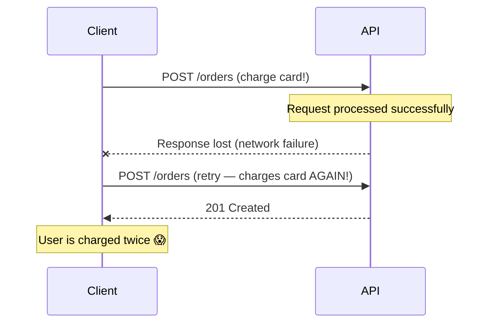
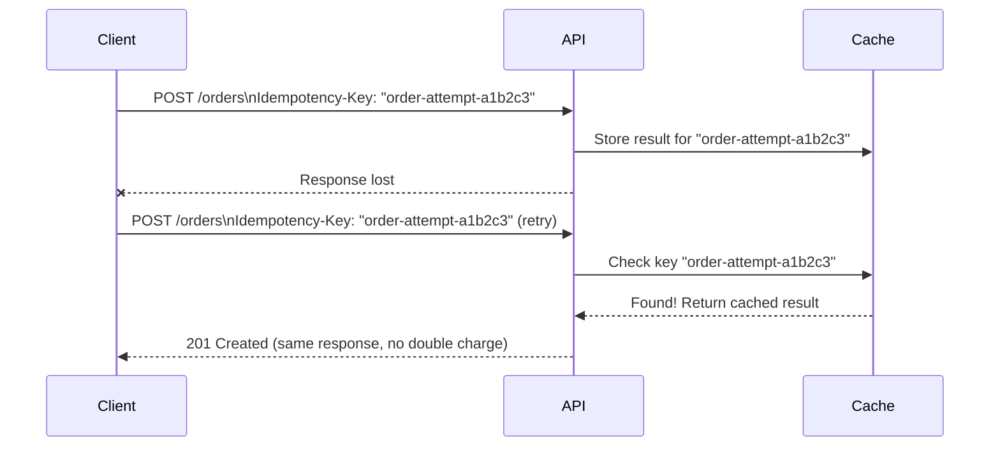
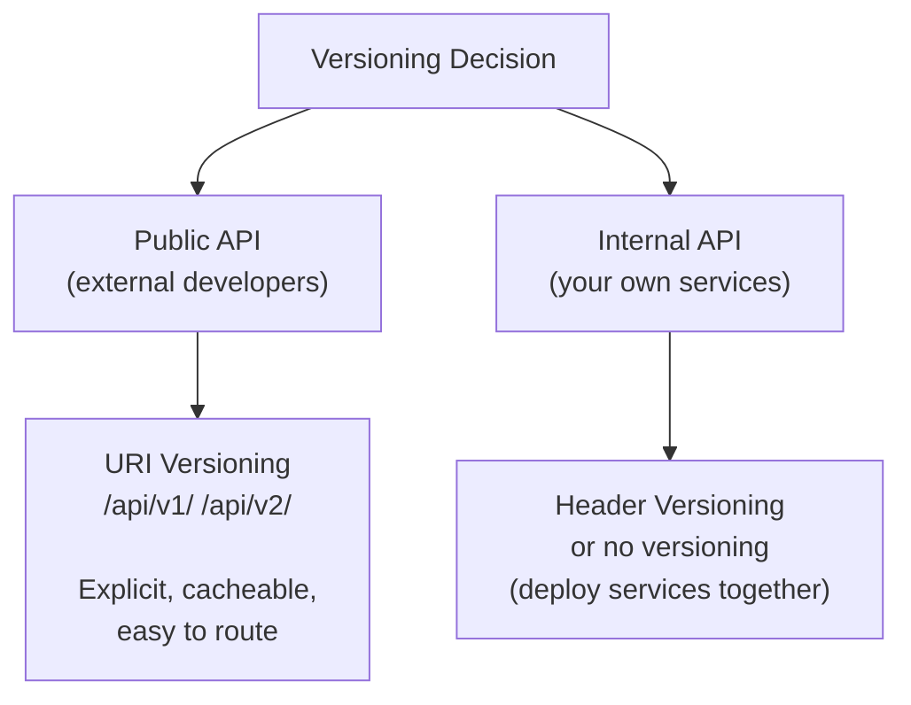
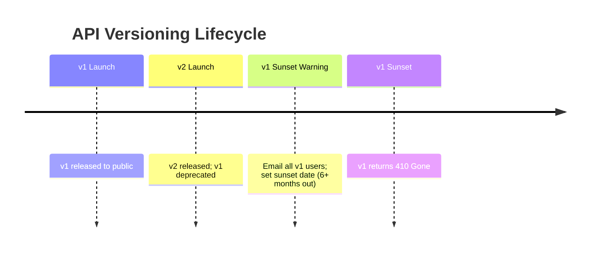
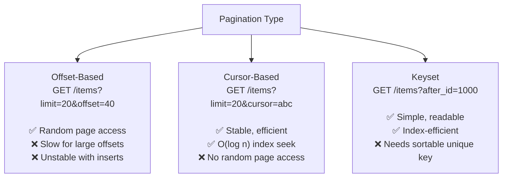

# API Design

Good API design is not about following a checklist — it's about building a contract that other engineers find intuitive, that evolves gracefully over years, and that protects your system while empowering your consumers. A bad API is one of the most expensive technical debts: once clients depend on it, every breaking change is a migration project.

> **"A good API is easier to use correctly than incorrectly."** — Joshua Bloch. The best API design anticipates how developers will misuse or misunderstand the API, and steers them toward correct usage by making the right thing the easy thing.

---

## Principles of Great API Design

### 1. Intuitive (Principle of Least Surprise)

Developers should be able to guess how your API works before reading the docs:

```
# Intuitive: follows conventions
GET    /users/42           # Get user 42
GET    /users/42/orders    # Get orders belonging to user 42
POST   /orders             # Create an order
DELETE /orders/1001        # Delete order 1001

# Surprising: breaks expectations
GET    /fetchUserById?userId=42  # Verb in URL, query param for ID
POST   /orders/delete            # DELETE action via POST
GET    /user_Orders              # Mixed naming convention
```

**Convention beats invention.** Use what your language/framework community already expects.

### 2. Consistent

Consistency within your API matters more than perfect design in isolation:

```
# Inconsistent (breaks trust)
GET  /users/42          # Uses ID in path
GET  /orders?orderId=1  # Uses ID in query param
GET  /products/fetch/3  # Verb + path ID

GET  /users → returns { users: [...] }
GET  /orders → returns [...]           # Different envelope
GET  /products → returns { data: { items: [...] } }  # Different again

# Consistent
GET /users/42           → { id, name, email }
GET /orders/1001        → { id, user_id, total }
GET /products/99        → { id, sku, price }

# All lists use same envelope
{ "data": [...], "meta": { "total": 100, "cursor": "..." } }
```

### 3. Stable (Additive Changes Only)

```
# Safe changes within a version:
+ Add a new optional field to a response: { ..., "avatar": "..." }
+ Add a new optional query parameter: GET /users?include_deleted=true
+ Add a new endpoint: POST /users/42/verify-email
+ Add a new status code variant you didn't return before

# Breaking changes (require a new version):
- Remove a field from a response
- Change a field's type (string → integer)
- Change URL structure
- Change error response format
- Make a previously optional parameter required
```

### 4. Documented

An undocumented API might as well not exist:

```yaml
# OpenAPI 3.0 spec example
paths:
  /users/{user_id}:
    get:
      summary: Get a user by ID
      parameters:
        - name: user_id
          in: path
          required: true
          schema:
            type: string
            example: "usr_4xK9mP2"
      responses:
        "200":
          description: User found
          content:
            application/json:
              schema:
                $ref: "#/components/schemas/User"
              example:
                id: "usr_4xK9mP2"
                name: "Alice Smith"
                email: "alice@example.com"
        "404":
          $ref: "#/components/responses/NotFound"
```

**Minimum documentation:**

- OpenAPI/Swagger spec (machine-readable → auto-generates docs + SDK)
- At least one working example per endpoint
- Error codes and what they mean
- Rate limit information
- Authentication guide

---

## Naming Conventions

```
# Resources: plural nouns, lowercase, hyphens not underscores
/users           ✅
/user            ❌ (singular)
/Users           ❌ (uppercase)
/user_orders     ❌ (underscore — use hyphen or nesting)
/user-orders     ✅ (hyphen for compound resources)

# Actions that don't fit CRUD — use sub-resources or verbs as exceptions
POST /users/42/activate      ✅ (sub-resource action)
POST /payments/1001/refund   ✅
GET  /users/42/export        ✅ (returns a file)

# Query parameters: snake_case
?sort_by=created_at&order=desc&include_deleted=true
```

---

## Request and Response Design

### Request Body

```json
// Use snake_case for JSON field names (JavaScript convention: camelCase is also common)
// Be consistent — pick one and don't mix
{
  "user_id": "usr_42",
  "payment_method_id": "pm_xyz",
  "items": [
    {
      "sku": "SHOE-42",
      "quantity": 1,
      "unit_price_cents": 9999
    }
  ],
  "shipping_address": {
    "line1": "123 Main St",
    "city": "New York",
    "country_code": "US",
    "postal_code": "10001"
  }
}
```

**Design principles:**

- **Cents over floats for money** — floating point arithmetic is imprecise; `9999` cents beats `99.99` dollars
- **ISO codes over free text** — `"US"` not `"United States"`; `"2024-01-15T10:30:00Z"` not `"Jan 15 2024"`
- **Enums over magic booleans** — `"status": "pending"` beats `"is_pending": true`

### Response Body

```json
// Consistent envelope pattern
{
  "data": {                      // Primary data always under "data"
    "id": "ord_1001",
    "status": "pending",
    "total_cents": 9999,
    "created_at": "2024-01-15T10:30:00Z"
  },
  "meta": {                      // Metadata (pagination, rate limit info)
    "request_id": "req_4xK9mP2"
  }
}

// List response
{
  "data": [ ... ],
  "meta": {
    "total": 1000,
    "cursor": "eyJpZCI6MTAwMX0=",
    "has_more": true
  }
}
```

---

## Error Design

Errors are API events too — design them as carefully as success responses:

```json
// RFC 7807 Problem Details (standard format)
{
  "type": "https://api.example.com/errors/validation-error",
  "title": "Validation Error",
  "status": 422,
  "detail": "The request body failed validation",
  "instance": "/orders",
  "errors": [
    {
      "field": "items[0].quantity",
      "code": "min_value",
      "message": "Quantity must be at least 1",
      "received": 0
    },
    {
      "field": "shipping_address.country_code",
      "code": "invalid_enum",
      "message": "Country code must be a valid ISO 3166-1 alpha-2 code",
      "received": "ZZZ"
    }
  ],
  "request_id": "req_4xK9mP2"
}
```

**Error design rules:**

- Machine-readable `code` (clients switch on this, not `message`)
- Human-readable `message` (for developer debugging)
- Field-level errors for validation failures
- `request_id` in every error — essential for support tickets and log correlation

---

## Idempotency in API Design

**Non-idempotent POST** is dangerous: network failures, retries, and client bugs cause duplicate operations.



**Fix: Idempotency Keys**



**Implementation:**

```
Client sends:   Idempotency-Key: 550e8400-e29b-41d4-a716-446655440000
Server stores:  hash(key + user_id) → response (in Redis, TTL = 24h)
On retry:       Return stored response immediately, no re-execution
```

> Full idempotency patterns covered in [Idempotency](./idempotency.md).

---

## Versioning Strategy



**Versioning lifecycle:**



**Deprecation headers:**

```
HTTP/1.1 200 OK
Deprecation: true
Sunset: Sat, 01 Jan 2025 00:00:00 GMT
Link: <https://api.example.com/v2/users>; rel="successor-version"
```

---

## Rate Limiting Design

Rate limits should be:

- **Per consumer** (by API key or user ID), not global
- **Communicated** in response headers
- **Tiered** (free: 100/hr, pro: 10K/hr, enterprise: unlimited)

```
# Response headers for rate-limited resources
X-RateLimit-Limit: 1000
X-RateLimit-Remaining: 873
X-RateLimit-Reset: 1716825600   ← Unix timestamp when limit resets
X-RateLimit-Window: 3600        ← Window size in seconds

# When exceeded:
HTTP/1.1 429 Too Many Requests
Retry-After: 127                ← Seconds until limit resets
X-RateLimit-Limit: 1000
X-RateLimit-Remaining: 0
```

---

## Pagination Design



**Default recommendation:** Cursor-based for production lists. Offset-based for admin tools where random page access matters.

---

## Security in API Design

```
Authentication layer:
├── Every endpoint requires authentication (except auth endpoints)
├── Use short-lived tokens (JWT exp < 1 hour)
└── Rotate API keys without downtime (support 2 keys simultaneously)

Authorization layer:
├── Check ownership: user can only access their own data
├── Scope-based: API keys have limited scopes (read-only, write, admin)
└── Never trust client input for IDs (IDOR: user sends id=1 to access admin)

Input validation:
├── Validate at the API boundary (before any processing)
├── Reject unexpected fields (don't silently ignore extra fields)
├── Sanitize before storage (SQL injection, XSS)
└── Validate business rules (not just data types)

Output filtering:
├── Never return more fields than the requester is authorized to see
├── Strip internal/sensitive fields (hash IDs, hide internal metadata)
└── Use allow-lists for field selection (not block-lists)
```

**OWASP API Security Top 10 areas:**

1. **BOLA (Broken Object Level Authorization):** Verify every request can access the specific resource — don't trust client-provided IDs
2. **Broken Authentication:** Use strong token validation; check expiry, signature, and audience
3. **Excessive Data Exposure:** Return only what's needed; never expose internal fields
4. **Rate Limiting:** Every public endpoint must be rate-limited

---

## API Design Checklist

Before shipping any API:

```
Naming
☐ Resources are plural nouns
☐ Consistent naming convention (snake_case or camelCase, not both)
☐ No verbs in URLs (except action sub-resources)

HTTP Semantics
☐ Correct HTTP methods (GET for reads, POST for creates, etc.)
☐ Correct status codes (201 for creates, 204 for deletes, etc.)
☐ Idempotency keys for non-idempotent POSTs

Responses
☐ Consistent response envelope
☐ ISO 8601 dates (2024-01-15T10:30:00Z)
☐ Cents/integers for monetary values
☐ request_id in every response

Errors
☐ Machine-readable error codes
☐ Field-level validation errors
☐ No stack traces in production responses

Pagination
☐ All list endpoints paginated
☐ max limit enforced (not user-controlled)

Security
☐ All endpoints require auth (except /health, /login)
☐ IDOR protection (verify ownership, not just auth)
☐ Rate limiting on all public endpoints

Documentation
☐ OpenAPI spec
☐ At least one example per endpoint
☐ Error codes documented
```

---

## Interview Talking Points

**1. What are the most important principles when designing an API?**

> "Consistency and stability. Consistency means every resource follows the same patterns — naming, error format, pagination, status codes — so developers can predict behavior without reading docs for each endpoint. Stability means additive-only changes within a version: add new fields, never remove or rename existing ones. These two principles reduce the 'surprise' developers encounter, which is the primary source of bugs and support tickets."

**2. How do you handle breaking changes in a public API?**

> "I version the API using URI versioning (v1, v2). I release v2 with the breaking changes, keep v1 running, notify all v1 users of the deprecation date (at least 6 months out for external APIs), and add `Deprecation` and `Sunset` response headers. I monitor v1 traffic — when it drops to near zero or the sunset date passes, I return `410 Gone` and retire the routes. The goal is zero surprises for API consumers."

**3. How do you design error responses?**

> "I follow RFC 7807 (Problem Details). Every error has a machine-readable `code` field (clients switch on this, not the message string which can change), a human-readable `message`, field-level error details for validation failures, and a `request_id` that correlates to server logs. The status code is always correct — 422 for validation, 404 for not found, 401 for missing auth, 403 for insufficient permissions. Never 200 with an error in the body."

---

## Key Takeaways

- **Consistency beats perfection** — a consistently mediocre convention is better than inconsistently excellent design
- **Use ISO standards** — ISO 8601 dates, ISO 4217 currency, ISO 3166 country codes — not free-text fields
- **Design errors as carefully as success responses** — machine-readable codes, field-level details, request IDs
- **Idempotency keys** on state-changing POST operations prevent double-billing, double-submission
- **Cursor-based pagination** is the production standard — stable, efficient, index-friendly
- **Never expose internals** — strip internal IDs, metadata, and implementation details from responses
- **Ship a deprecation timeline** with any breaking change — minimum 6 months for public APIs
- **OpenAPI spec is not optional** — it's the source of truth, auto-generates docs, and enables code generation
