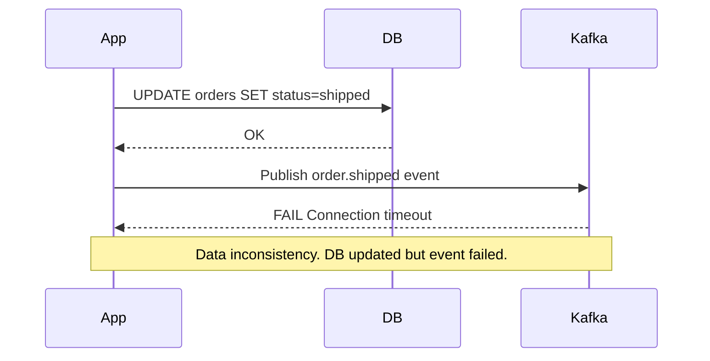
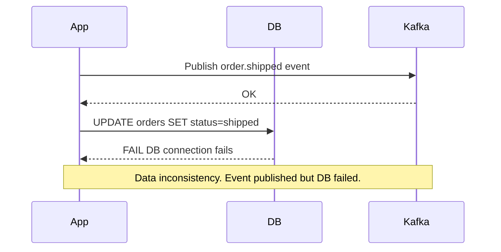
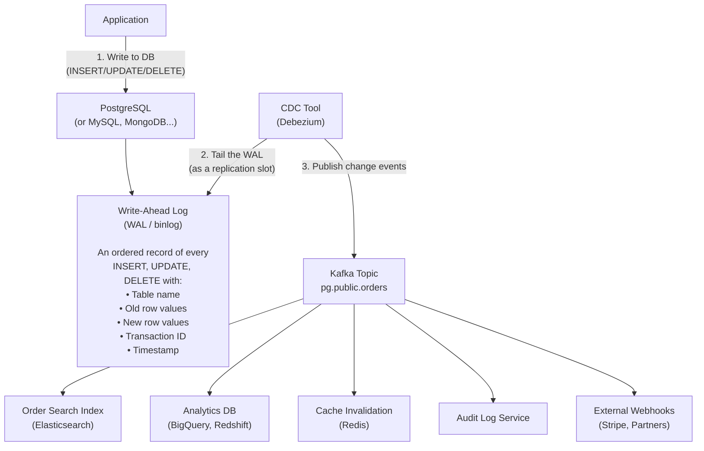
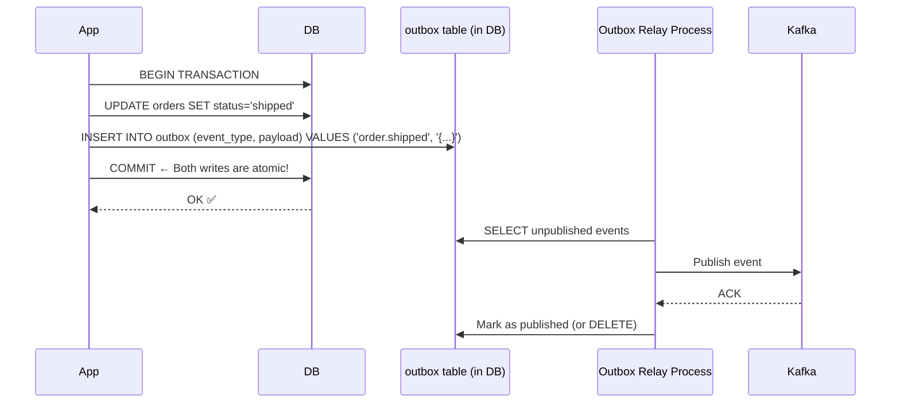
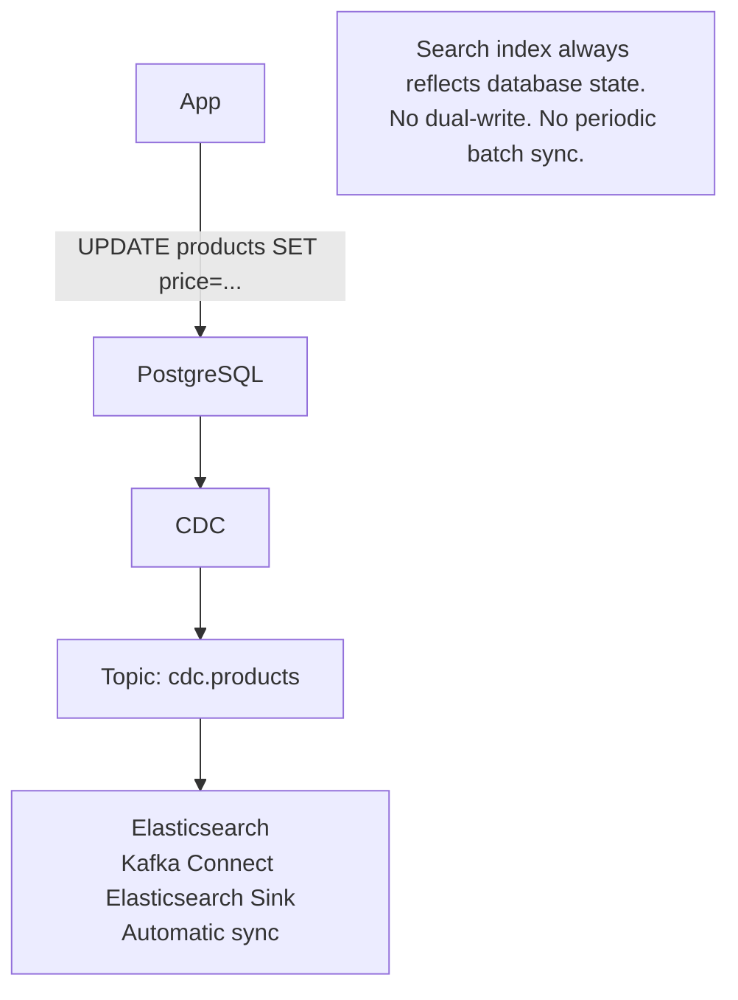
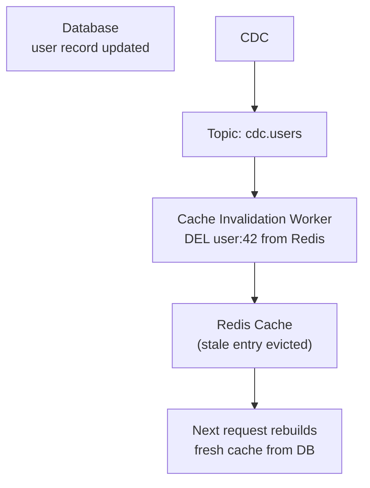
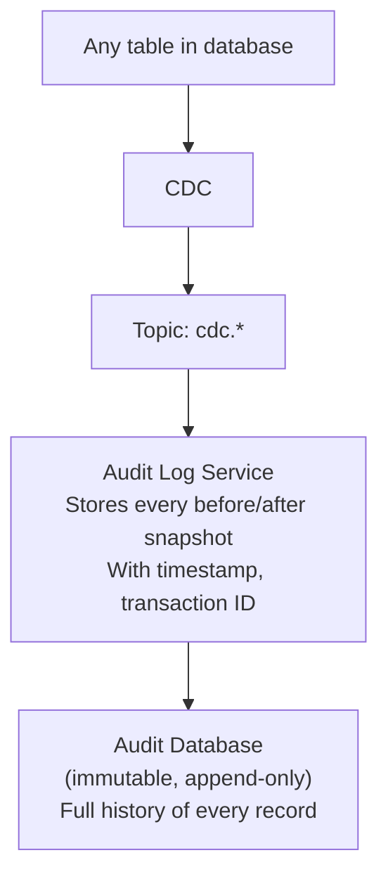
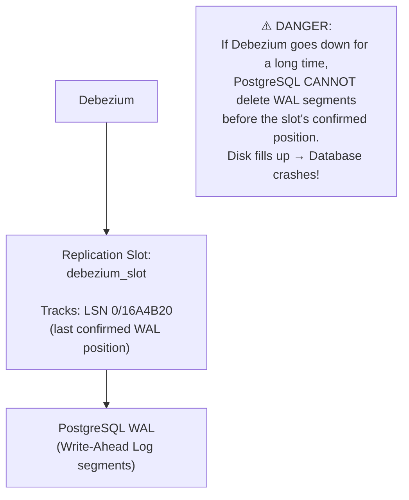

# Change Data Capture (CDC)

Change Data Capture is the process of detecting and capturing changes made to data in a database — inserts, updates, and deletes — and streaming those changes to other systems in real-time. CDC treats the **database transaction log** as the primary event source, rather than requiring application code to explicitly publish events.

> **CDC solves the dual-write problem.** In microservices, when you want to update your database AND publish an event to Kafka, you face a dangerous choice: if you do both in sequence, one can fail while the other succeeds. CDC eliminates this by reading from the database's own commit log — the database IS the event source. You write once; CDC publishes the change for you.

---

## The Dual-Write Problem



**Option 2 (reverse order) is equally broken:**



**CDC solves this by making the database the only system you write to.** The event is derived automatically from the commit log.

---

## How CDC Works — The Transaction Log

Every database maintains a **transaction log** (WAL in PostgreSQL, binlog in MySQL, redo log in Oracle) for crash recovery. This log is an ordered, immutable record of every change. CDC reads this log:



**What a CDC event looks like (Debezium format):**

```json
{
  "before": {
    "order_id": 1001,
    "status": "pending",
    "updated_at": "2024-01-15T10:00:00Z"
  },
  "after": {
    "order_id": 1001,
    "status": "shipped",
    "updated_at": "2024-01-15T10:30:00Z"
  },
  "source": {
    "db": "mydb",
    "table": "orders",
    "ts_ms": 1705312200000,
    "lsn": 24054912, // PostgreSQL WAL position
    "txId": 4837
  },
  "op": "u", // u=update, c=create, d=delete, r=read (snapshot)
  "ts_ms": 1705312201234 // When Debezium processed this event
}
```

---

## Debezium — The Standard CDC Tool

Debezium is the most widely used open-source CDC tool. It runs as Kafka Connect connectors that read database logs and publish change events to Kafka.

### PostgreSQL CDC Setup

```yaml
# Debezium PostgreSQL connector config
{ "name": "postgres-cdc-connector", "config": {
      "connector.class": "io.debezium.connector.postgresql.PostgresConnector",
      "database.hostname": "postgres",
      "database.port": "5432",
      "database.user": "debezium",
      "database.password": "debezium",
      "database.dbname": "mydb",
      "database.server.name": "pg",
      "plugin.name": "pgoutput", # PostgreSQL 10+ logical replication
      "table.include.list": "public.orders,public.users",
      "slot.name": "debezium_slot", # Replication slot name
      "publication.name": "debezium_pub", # PostgreSQL publication

      # Transform: route each table to its own Kafka topic
      "transforms": "route",
      "transforms.route.type": "org.apache.kafka.connect.transforms.RegexRouter",
      "transforms.route.regex": "([^.]+)\\.([^.]+)\\.([^.]+)",
      "transforms.route.replacement": "cdc.$3", # Topic: cdc.orders, cdc.users
    } }
```

**PostgreSQL prerequisites:**

```sql
-- Enable logical replication
ALTER SYSTEM SET wal_level = logical;
-- Restart required

-- Create publication (which tables to capture)
CREATE PUBLICATION debezium_pub FOR TABLE orders, users, payments;

-- Debezium creates the replication slot automatically
-- Or manually: SELECT * FROM pg_create_logical_replication_slot('debezium_slot', 'pgoutput');
```

### MySQL CDC Setup

MySQL CDC uses the binary log (`binlog`):

```sql
-- Enable binary logging in my.cnf:
-- [mysqld]
-- log_bin = mysql-bin
-- binlog_format = ROW          ← Required for CDC (not STATEMENT or MIXED)
-- server_id = 1

-- Grant Debezium user replication permissions:
GRANT SELECT, RELOAD, SHOW DATABASES, REPLICATION SLAVE, REPLICATION CLIENT ON *.* TO 'debezium'@'%';
```

---

## Outbox Pattern — CDC Without a Log Tailer

When you don't want to run a CDC tool (or can't access the database log), the **transactional outbox pattern** achieves the same result:



**Why this works:** The order update and the outbox insert are in the **same transaction**. Either both commit or neither does — atomic. The relay process can safely retry publishing because outbox events are idempotent (include a unique event ID).

```sql
-- Outbox table schema
CREATE TABLE outbox (
    id              UUID PRIMARY KEY DEFAULT gen_random_uuid(),
    aggregate_type  TEXT NOT NULL,    -- e.g., 'order'
    aggregate_id    TEXT NOT NULL,    -- e.g., '1001'
    event_type      TEXT NOT NULL,    -- e.g., 'order.shipped'
    payload         JSONB NOT NULL,
    created_at      TIMESTAMPTZ DEFAULT NOW(),
    published_at    TIMESTAMPTZ,      -- NULL = not yet published
    published       BOOLEAN DEFAULT FALSE
);

-- Relay query: find unpublished events
SELECT * FROM outbox
WHERE published = FALSE
ORDER BY created_at
LIMIT 100
FOR UPDATE SKIP LOCKED;  -- Skip locked rows (concurrent relay instances)
```

---

## CDC Use Cases

### 1. Keeping Search Indexes in Sync



### 2. Cache Invalidation



### 3. Data Warehouse Sync (ETL Replacement)

Traditional ETL: run a batch job every night, fetch changed records (based on `updated_at`), load to warehouse.

CDC replaces this: stream every insert/update/delete to the warehouse in real-time:

```
DB changes → Kafka (CDC events) → Kafka Connect BigQuery/Redshift Sink → Warehouse
```

**Benefits over ETL:**

- Real-time (minutes vs. overnight batch)
- Captures hard-to-detect changes (deletes!)
- No need to maintain `updated_at` columns or track watermarks

### 4. Audit Trail



A complete audit trail with zero application code changes — just subscribe to CDC events.

---

## Replication Slots — The Critical Operational Detail

In PostgreSQL, Debezium uses a **logical replication slot** to read the WAL. This has an important operational implication:



**Mitigation:**

- Monitor replication slot lag (`pg_replication_slots.confirmed_flush_lsn`)
- Set `wal_keep_size` as a backup
- Drop the slot if Debezium will be offline for extended periods (and rebuild from a snapshot)

---

## CDC vs. Polling-Based Sync

| Approach                                       | Latency | Captures Deletes | CPU/IO Impact          | Complexity               |
| ---------------------------------------------- | ------- | ---------------- | ---------------------- | ------------------------ |
| **Timestamp polling** (`WHERE updated_at > ?`) | Minutes | ❌ (hard)        | High (full table scan) | Low                      |
| **Dual-write** (app code + event publish)      | Seconds | ✅               | Low                    | Medium (dual-write risk) |
| **CDC (log tailing)**                          | Seconds | ✅               | Very Low               | Medium (infrastructure)  |
| **Outbox pattern**                             | Seconds | ✅               | Low                    | Medium                   |

**The key win of CDC over timestamp polling:** capturing **deletes**. Deleted rows have no `updated_at` — polling-based sync silently misses them. CDC captures every delete event from the log.

---

## Interview Talking Points

**1. What is the dual-write problem and how does CDC solve it?**

> "Dual-write: you update the database and publish an event — both must succeed, but they're separate operations with no atomicity. If the DB succeeds and Kafka fails, data is updated but downstream is never notified. CDC solves this by reading from the database's own transaction log (WAL/binlog). You only write to the database; CDC derives the event from the log and publishes it to Kafka. There's only one write to manage, eliminating the consistency gap."

**2. What is the outbox pattern and when would you use it instead of CDC?**

> "The outbox pattern writes events to an `outbox` table in the same transaction as the business write — using the database's ACID guarantee for atomicity. A relay process then reads unpublished outbox events and publishes to Kafka. Use it when you don't have access to the database replication log (managed databases with restrictions), when you need application-level control over which events are published (not every column change), or when you want simpler infrastructure than running a full CDC tool."

**3. What happens if the CDC tool goes down for several days?**

> "In PostgreSQL, the replication slot tracks the last WAL position Debezium confirmed. While Debezium is down, PostgreSQL retains all WAL segments since that position — it can't delete them. If Debezium is down for days, WAL can fill the disk and crash the database. Mitigation: monitor replication slot lag aggressively, set alerts when lag exceeds a few GB, and if Debezium needs extended downtime, drop the slot and rebuild from a full snapshot when it comes back."

**4. Why is CDC better than timestamp-based polling for sync?**

> "Three reasons: deletes (polling `WHERE updated_at > ?` never sees deleted rows — there's nothing to query); latency (polling is batched on a schedule; CDC is near-real-time, seconds behind); and correctness (a row can be updated multiple times between polls — polling sees only the final state; CDC captures every intermediate change, which matters for event sourcing and audit trails)."

---

## Key Takeaways

- CDC reads the **database transaction log** (WAL/binlog) — the database write IS the event, no dual-write needed
- **Debezium** is the standard CDC tool — runs as Kafka Connect connectors for PostgreSQL, MySQL, MongoDB, and others
- The **outbox pattern** achieves CDC semantics without log tailing — transactional outbox + relay process
- CDC captures **deletes** — the critical advantage over timestamp-based polling
- **Replication slot lag** in PostgreSQL is a production risk — monitor it or the disk fills up
- Use CDC for: search index sync, cache invalidation, real-time ETL to warehouses, audit trails, event-driven microservices
- CDC events carry **before/after** row state — complete audit trail with zero application code changes
