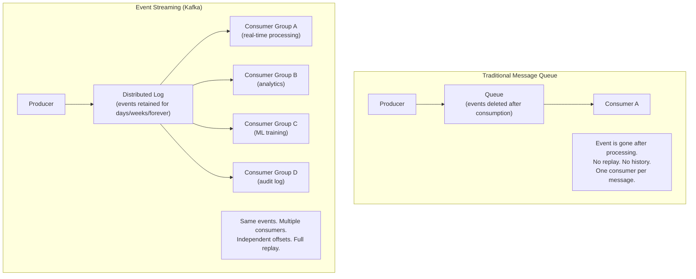
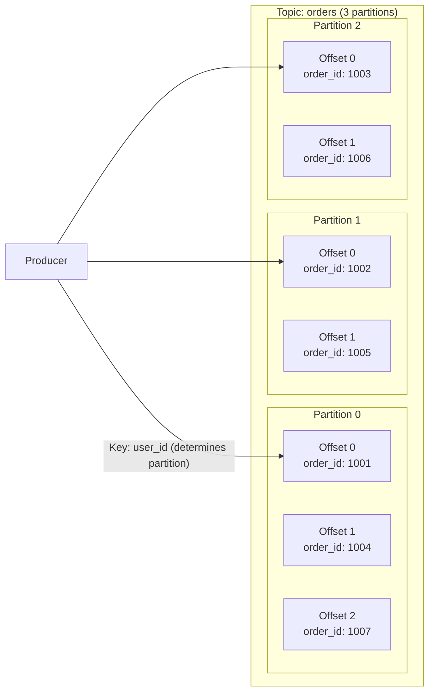
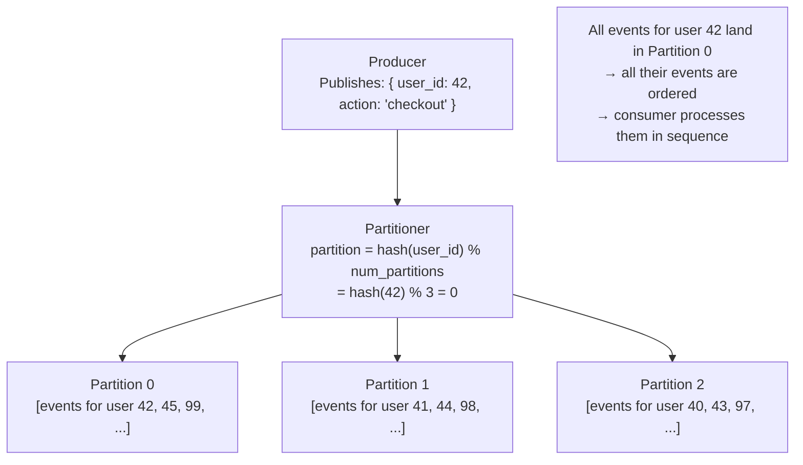
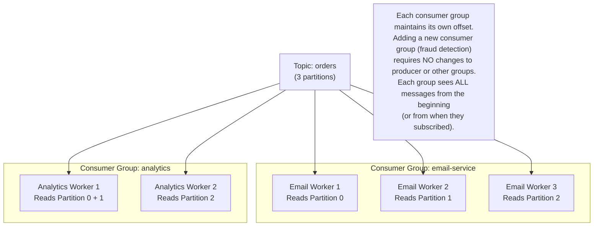
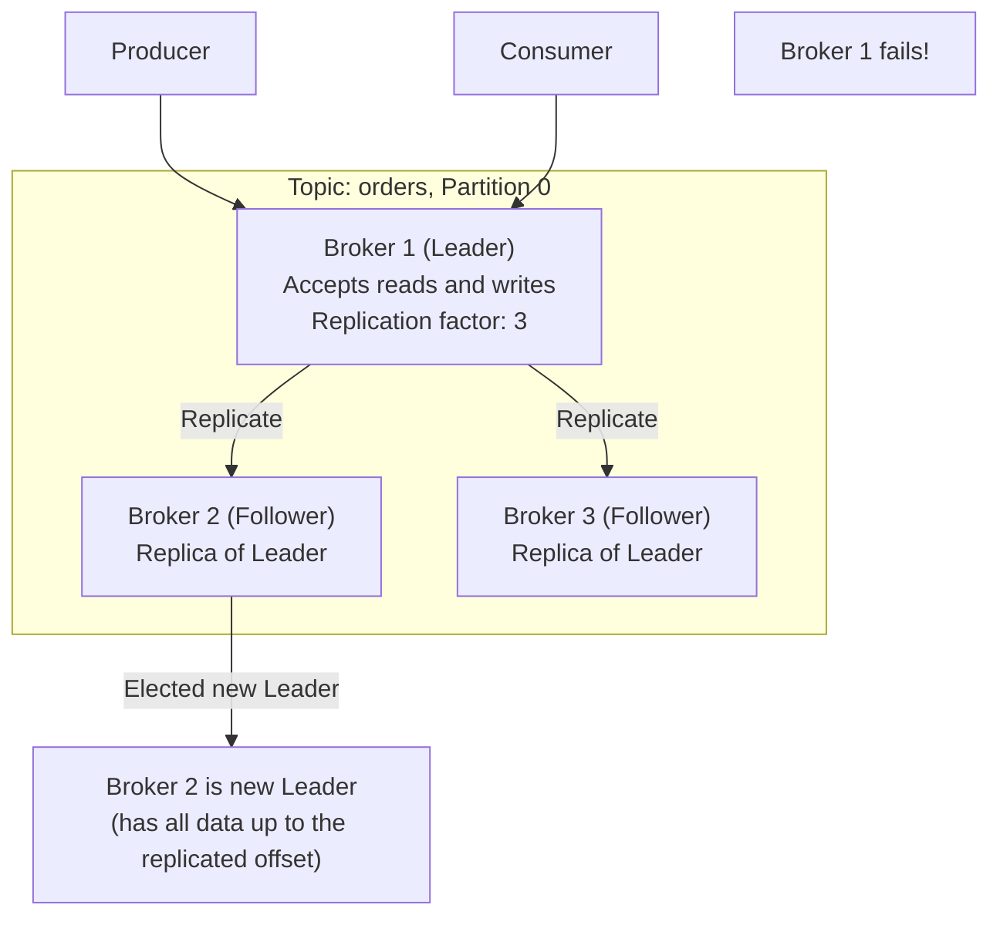
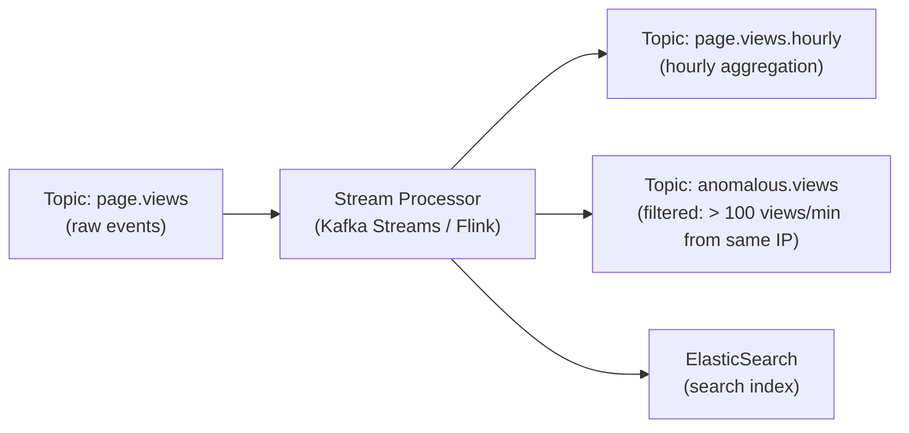
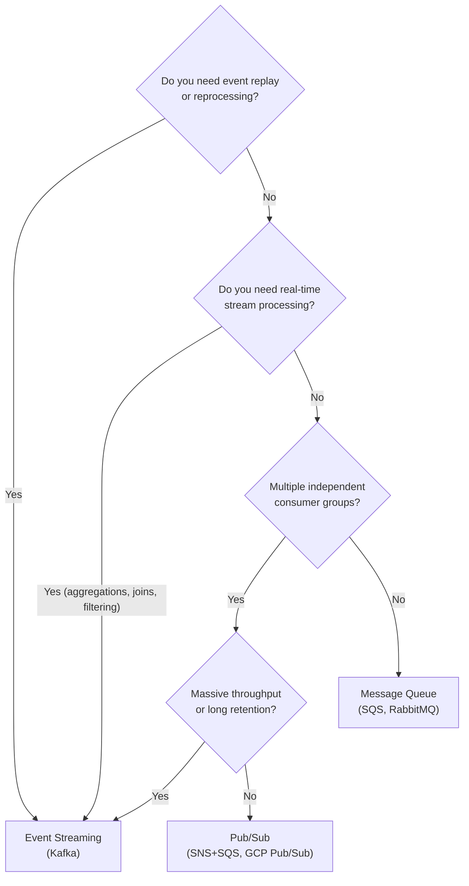

# Event Streaming

Event streaming is the practice of capturing data changes or domain events as an **immutable, ordered, and persistent log** — and processing that log in real-time or by replay. Apache Kafka is the dominant implementation. Event streaming is not just a messaging system; it's a data architecture that treats the event log as the source of truth.

> **"The log is the database."** — Martin Kleppmann. In event streaming, the immutable event log is the authoritative record. All databases, caches, and search indexes are **derived** from that log. This is a fundamental shift from treating the database as the source of truth.

---

## Why Event Streaming Is Different



---

## Apache Kafka Architecture

Kafka is a **distributed, partitioned, replicated, fault-tolerant commit log**. Every architectural choice flows from this description.

### The Commit Log



**Key properties of the log:**

- **Append-only:** New events are always appended at the end — never modified or deleted
- **Ordered within a partition:** Events in partition 0 are always in the order they were written
- **Partitioned for parallelism:** N partitions = N consumers can read in parallel
- **Retained:** Events stay on disk for the configured retention period (default 7 days; can be forever)

---

## Topics, Partitions, and Consumer Groups

### Topics

A topic is a named log for a specific category of events:

```
topics:
  orders          # All order events
  payments        # All payment events
  user.events     # All user lifecycle events
  page.views      # All page view events
```

### Partitions and Ordering



**Partition key determines ordering.** Events with the same key go to the same partition — order is guaranteed for that key. Events across partitions may be reordered.

### Consumer Groups



**The key insight:** A consumer group is an independent cursor through the log. Each group reads the full log independently. Groups don't interfere with each other.

---

## Consumer Offsets — The State of Where You Are

Each consumer group tracks its position in each partition via an **offset** (sequential integer):

```
Topic: orders, Partition 0:
Offset: 0  1  2  3  4  5  6  7  8  9  10
Events: o1 o2 o3 o4 o5 o6 o7 o8 o9 o10

email-service consumer group: committed_offset = 7
(has processed offsets 0-6, next to process: 7)

analytics consumer group: committed_offset = 3
(has processed offsets 0-2, next to process: 3)
```

**Commit offset = processed.** Kafka only deletes messages based on retention policy, not on consumption.

### Offset Commit Strategies

```python
# Auto-commit (every 5 seconds, default) — at-most-once or at-least-once
# Risky: if consumer crashes, uncommitted offsets re-process or are lost

# Manual commit after processing — at-least-once
consumer = KafkaConsumer('orders', group_id='email-service',
                         enable_auto_commit=False)

for message in consumer:
    try:
        process_order(message.value)          # Do the work first
        consumer.commit()                      # Then commit offset
    except Exception as e:
        log.error(f"Failed to process: {e}")
        # Don't commit → message will be re-delivered on restart
```

---

## Kafka Guarantees

### At-Least-Once (Default)

```
Producer → Kafka → Consumer → commit offset after processing
```

If the consumer crashes after processing but before committing, the message is re-delivered. Consumer must be idempotent.

### Exactly-Once (Kafka Transactions)

```python
producer = KafkaProducer(
    transactional_id='order-processor-1'
)
producer.init_transactions()

with producer.transaction():
    # Read from input topic
    message = consumer.poll()

    # Process and write result atomically
    producer.send('processed-orders', processed_result)

    # Commit consumer offset inside the transaction
    producer.send_offsets_to_transaction(
        consumer.position(),
        'my-consumer-group'
    )

# Either all of this commits or none of it does
```

**Kafka Streams and Kafka Connect** use exactly-once semantics automatically.

---

## Kafka Replication and Durability

Each partition is replicated across multiple brokers:



**Producer durability config:**

```python
# acks=all → wait for leader + ALL replicas to acknowledge (strongest durability)
# acks=1  → wait for leader only (faster, risk of loss if leader fails before replica sync)
# acks=0  → fire and forget (fastest, some loss acceptable)
producer = KafkaProducer(
    acks='all',
    retries=3,
    enable_idempotence=True  # Producer dedup for exactly-once at-broker level
)
```

---

## Stream Processing

The real power of event streaming: processing and transforming events as they arrive, in real-time.



### Kafka Streams (Java)

```java
// Count page views per page, per hour (windowed aggregation)
KStream<String, PageView> views = builder.stream("page.views");

KTable<Windowed<String>, Long> hourlyCounts = views
    .groupBy((key, view) -> view.getPageUrl())
    .windowedBy(TimeWindows.ofSizeWithNoGrace(Duration.ofHours(1)))
    .count();

hourlyCounts.toStream()
    .map((windowedUrl, count) -> KeyValue.pair(
        windowedUrl.key(),
        new HourlyCount(windowedUrl.window().start(), count)
    ))
    .to("page.views.hourly");
```

### Apache Flink

For stateful stream processing at massive scale (billions of events/day):

- Windowing: tumbling, sliding, session windows
- Stateful joins: join stream A with stream B within a time window
- Exactly-once processing with distributed snapshots (Chandy-Lamport)

---

## Kafka vs. RabbitMQ vs. SQS

| Feature                | Kafka                             | RabbitMQ                  | SQS                    |
| ---------------------- | --------------------------------- | ------------------------- | ---------------------- |
| **Model**              | Distributed log                   | Traditional queue         | Managed queue          |
| **Retention**          | Configurable (forever)            | Until consumed + ACKed    | Until consumed + ACKed |
| **Replay**             | ✅ (seek to any offset)           | ❌                        | ❌                     |
| **Multiple consumers** | ✅ (independent groups)           | Manual (fan-out exchange) | Manual (SNS+SQS)       |
| **Throughput**         | Millions/sec per partition        | Hundreds of thousands/sec | High (managed scaling) |
| **Ordering**           | Per partition                     | Per queue                 | SQS FIFO: per group    |
| **Stream processing**  | Native (Kafka Streams)            | External                  | External (Lambda)      |
| **Operations**         | Complex (ZooKeeper/KRaft)         | Medium                    | Zero (managed)         |
| **Best for**           | Event sourcing, stream processing | Complex routing, legacy   | Serverless, AWS-native |

---

## When to Use Event Streaming



---

## Real-World Kafka Usage

**LinkedIn:** Invented Kafka. Processes 7+ trillion messages per day. Powers activity feeds, notifications, analytics, and metrics across all LinkedIn services.

**Uber:** `300 billion events/day` via Kafka. Surge pricing (real-time fare calculation from ride request events), driver/rider matching, fraud detection.

**Netflix:** Kafka for all operational data monitoring, recommendations pipeline, and log aggregation. Studio processing pipelines are Kafka Streams.

**Airbnb:** Search index updates (when a listing changes → Kafka event → Elasticsearch update via Kafka Connect sink connector), pricing, fraud detection.

**The New York Times:** Published their full content archive (1.5 million articles) as a Kafka topic. All new articles flow through it in real-time to power the website, apps, and analytics.

---

## Interview Talking Points

**1. When would you use Kafka over a traditional message queue?**

> "Three scenarios: when you need replay — read the log from the beginning to rebuild a derived view, recover from bugs, or bootstrap a new service; when you need multiple independent consumer groups — each service reads the full event log without affecting others; and when you need stream processing — real-time aggregations, joins, and transformations over event windows. For simple task distribution (process this job once), SQS or RabbitMQ is simpler and cheaper. Kafka's operational complexity is only worth it when you need its unique capabilities."

**2. How does Kafka guarantee ordering?**

> "Kafka guarantees ordering within a partition. Events with the same partition key go to the same partition in order. If you partition by `user_id`, all events for user 42 are in partition 0, always in the order they were produced — the consumer sees them in that order. Events across different partitions may arrive out of relative order. To get total global ordering, use a single partition — but that eliminates parallelism. The design tradeoff: choose a partition key that achieves the ordering guarantee you need for correctness while maximizing parallelism."

**3. What is a consumer group and why does it matter?**

> "A consumer group is an independent cursor through the Kafka log. Each group maintains its own committed offset per partition. Multiple groups can read the same topic simultaneously without interfering — each group sees all messages. Within a group, each partition is assigned to exactly one consumer, enabling parallel processing. Adding a new consumer group (say, a new fraud detection service) requires zero changes to the producer or existing groups. This is Kafka's version of Pub/Sub fan-out combined with queue-based work distribution."

**4. How does Kafka handle broker failures?**

> "Kafka replicates each partition across multiple brokers (configured replication factor — typically 3). One broker is the leader (handles reads and writes); others are followers (replicate from leader). If the leader fails, a follower with all committed data is elected leader (by the controller) — typically in seconds. Producers with `acks=all` get durability guarantees: a write is confirmed only after the leader and all in-sync replicas (ISR) have acknowledged it, so even with a leader failure, no committed data is lost."

---

## Key Takeaways

- Kafka is a **distributed, partitioned, replicated commit log** — events are retained, not deleted after consumption
- **Partitions** provide parallelism and ordering — same-key events always go to the same partition in order
- **Consumer groups** are independent cursors — each group reads all events, multiple groups don't interfere
- **Offset commit** is the consumer's progress marker — manual commit after processing guarantees at-least-once
- **Replay** is Kafka's superpower — seek to any offset and reprocess the entire history
- **Kafka Streams and Flink** enable stateful real-time processing: windowing, aggregations, joins over the event log
- Choose Kafka when you need **replay, multiple consumer groups, or stream processing** — not for simple task distribution
