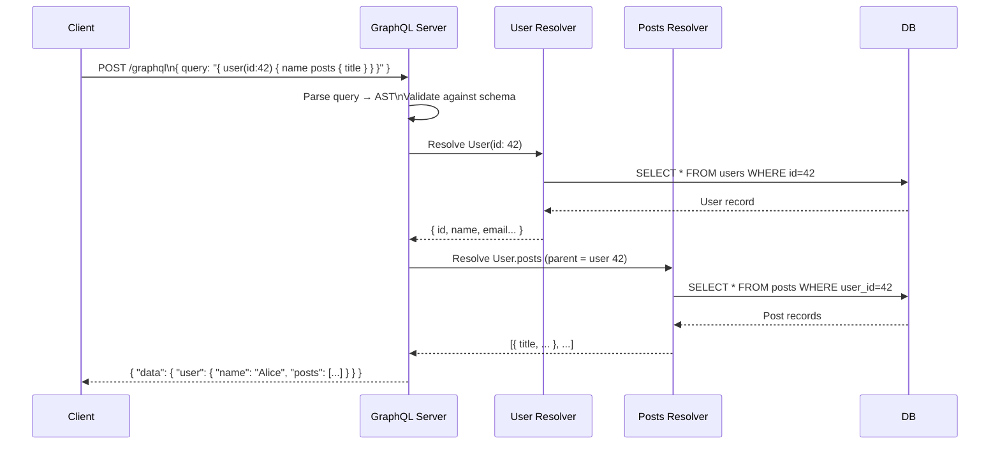
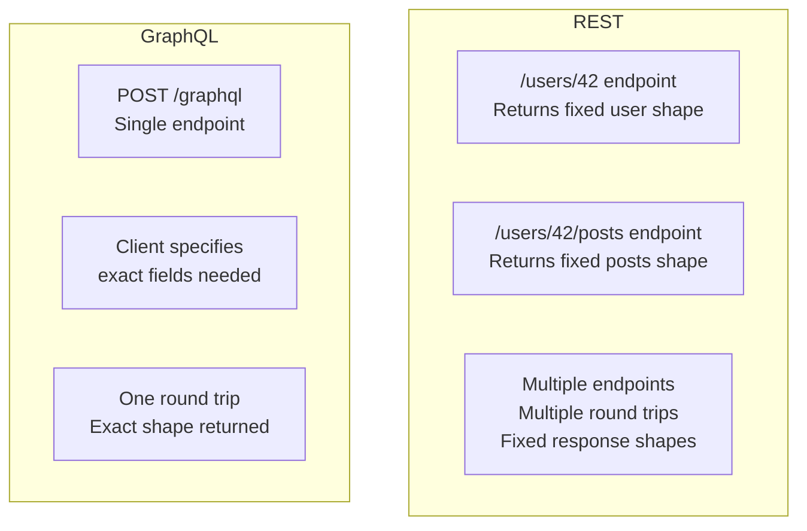
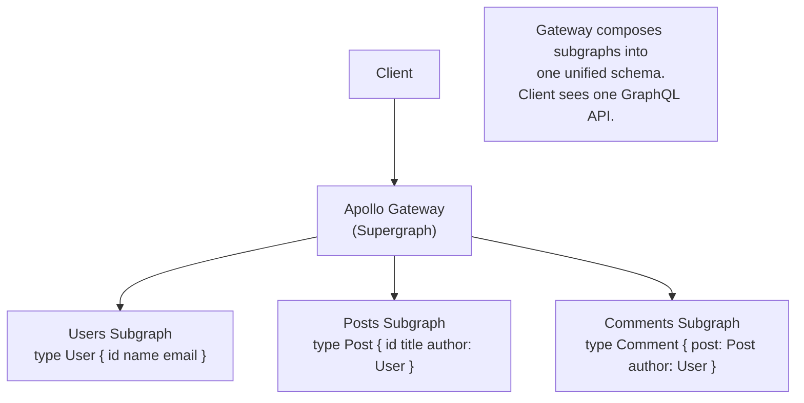

# GraphQL

GraphQL is a query language for APIs and a runtime for executing those queries, developed by Facebook in 2012 and open-sourced in 2015. Instead of fixed endpoints returning fixed data shapes, GraphQL exposes a single endpoint where clients specify exactly what data they want — no more, no less.

> **The core problem GraphQL solves:** REST APIs over-fetch (return fields the client doesn't need) or under-fetch (require multiple round trips to get all needed data). GraphQL eliminates both by letting the client declare the exact shape of the response in the query itself.

---

## The Over-Fetching and Under-Fetching Problem

### Over-Fetching (REST)

```
GET /users/42
→ { id, name, email, phone, address, bio, avatar, preferences, createdAt, lastLogin, ... }
# Mobile app only needed: name, avatar
# 80% of the payload is wasted bandwidth
```

### Under-Fetching (REST — N+1 Round Trips)

```
# To show a user's profile page with their posts and each post's comments:
GET /users/42              # 1 request
GET /users/42/posts        # 1 request → returns [post_1, post_2, post_3]
GET /posts/1/comments      # 1 request per post
GET /posts/2/comments      # 1 request
GET /posts/3/comments      # 1 request
# Total: 5 requests, multiple round trips
```

### GraphQL Solution (One Request)

```graphql
query {
  user(id: "42") {
    name
    avatar
    posts(last: 3) {
      title
      comments {
        author {
          name
        }
        body
      }
    }
  }
}
```

→ One HTTP request. Exactly the fields requested. Zero wasted bandwidth.

---

## GraphQL Core Concepts

### Schema Definition Language (SDL)

The schema is the contract between client and server. It defines all types, queries, mutations, and subscriptions:

```graphql
# Type definitions
type User {
  id: ID! # ! = non-nullable
  name: String!
  email: String!
  posts: [Post!]! # List of non-nullable Posts, itself non-nullable
}

type Post {
  id: ID!
  title: String!
  body: String
  author: User!
  comments: [Comment!]!
  publishedAt: String
}

type Comment {
  id: ID!
  body: String!
  author: User!
}

# Root types
type Query {
  user(id: ID!): User
  users(limit: Int = 10, offset: Int = 0): [User!]!
  post(id: ID!): Post
}

type Mutation {
  createPost(input: CreatePostInput!): Post!
  updatePost(id: ID!, input: UpdatePostInput!): Post!
  deletePost(id: ID!): Boolean!
}

type Subscription {
  commentAdded(postId: ID!): Comment!
}

input CreatePostInput {
  title: String!
  body: String!
}
```

### Queries

Queries are read operations. They mirror the shape of the data they return:

```graphql
# Named query with variables (production best practice — never interpolate strings!)
query GetUserProfile($userId: ID!, $postLimit: Int = 5) {
  user(id: $userId) {
    id
    name
    avatar
    posts(last: $postLimit) {
      id
      title
      publishedAt
    }
  }
}

# Variables passed separately (not in the query string)
{
  "userId": "42",
  "postLimit": 3
}
```

### Mutations

Mutations change data. They look like queries but use the `mutation` keyword:

```graphql
mutation CreateNewPost($input: CreatePostInput!) {
  createPost(input: $input) {
    id
    title
    publishedAt
    author {
      name
    }
  }
}
```

The client selects which fields of the created post to return — just like a query.

### Subscriptions

Subscriptions are real-time, long-lived operations (typically over WebSocket):

```graphql
subscription WatchComments($postId: ID!) {
  commentAdded(postId: $postId) {
    id
    body
    author {
      name
      avatar
    }
  }
}
```

---

## How GraphQL Executes



**Execution is field-by-field.** Each field in the schema has a **resolver function** that fetches or computes that field's value. The GraphQL runtime orchestrates resolver calls to build the response.

---

## The N+1 Problem in GraphQL

The biggest performance trap in GraphQL: resolvers that make one DB query per item in a list.

```graphql
query {
  posts {
    # 1 query: SELECT * FROM posts (returns 100 posts)
    title
    author {
      # 100 queries: SELECT * FROM users WHERE id=?
      name # One per post!
    }
  }
}
```

This causes **101 database queries** for a simple request.

### DataLoader — The Standard Solution

Facebook's DataLoader batches and caches resolver calls within a single request:

```javascript
// Without DataLoader: 100 separate DB queries for 100 posts' authors
// With DataLoader: 1 batched query

const userLoader = new DataLoader(async (userIds) => {
  // Called once with ALL user IDs that were requested in this tick
  const users = await db.query("SELECT * FROM users WHERE id = ANY($1)", [
    userIds,
  ]);
  // Return in same order as userIds
  return userIds.map((id) => users.find((u) => u.id === id));
});

// In the resolver for Post.author:
const authorResolver = (post) => userLoader.load(post.authorId);
// DataLoader batches: load(1), load(2), load(3) → one query with ids [1,2,3]
```

**Result:** 101 queries → 2 queries (posts + all authors in one IN clause).

---

## GraphQL vs. REST



| Dimension          | REST                    | GraphQL                              |
| ------------------ | ----------------------- | ------------------------------------ |
| **Endpoints**      | Many (one per resource) | One (`/graphql`)                     |
| **Data shape**     | Fixed by server         | Defined by client                    |
| **Over-fetching**  | Common                  | Eliminated                           |
| **Under-fetching** | Common (N+1 requests)   | Eliminated                           |
| **Versioning**     | Required (v1, v2)       | Schema evolution (additive)          |
| **Caching**        | HTTP cache by URL       | Complex (queries change per request) |
| **Introspection**  | Requires external docs  | Built-in (clients query the schema)  |
| **Learning curve** | Low                     | Medium                               |
| **File upload**    | Native (multipart)      | Requires workarounds                 |

---

## Schema Evolution (No Versioning Needed)

GraphQL schemas evolve additively — you add fields and types, rarely remove them:

```graphql
# v1 schema
type User {
  id: ID!
  name: String!
  email: String!
}

# v2 schema — additive change, no version bump needed
type User {
  id: ID!
  name: String!
  email: String!
  avatar: String # New: optional, old clients ignore it
  preferences: UserPreferences # New type
}

# Deprecating old fields (instead of removing)
type User {
  id: ID!
  name: String! @deprecated(reason: "Use displayName instead")
  displayName: String!
}
```

**Why this works:** Clients query only the fields they ask for. Adding new fields doesn't break existing queries. Removing fields does — deprecate first, monitor usage, then remove.

---

## GraphQL Caching Challenges

HTTP caching (CDN, browser cache) works on URL + headers. GraphQL's single endpoint (`POST /graphql`) with query in the body breaks URL-based caching.

**Solutions:**

1. **Persisted Queries:** Pre-register queries on the server. Client sends a hash instead of the full query body. CDN can cache by hash.

```
# Client sends:
POST /graphql
{ "extensions": { "persistedQuery": { "sha256Hash": "abc123..." } } }

# Server looks up abc123 → full query, executes it
# CDN can cache responses by hash
```

2. **GET requests for queries:** GraphQL allows queries (not mutations) via GET:

```
GET /graphql?query={user(id:42){name}}&variables={}
# URL-based → CDN can cache
```

3. **Apollo Client normalized cache:** Client-side caching keyed by `__typename + id`. When mutation returns updated fields, cache updates automatically — no cache invalidation needed for already-loaded data.

---

## Real-World GraphQL Adoption

**GitHub:** GitHub's v4 API is GraphQL. The primary motivation: their REST v3 API required 10+ round trips to build a typical developer dashboard. GraphQL let clients fetch exactly what they need.

**Shopify:** Storefront API and Admin API are GraphQL. Allows third-party apps to fetch product, inventory, and order data in custom shapes without Shopify serving dozens of specialized endpoints.

**Twitter/X:** Migrated internal APIs to GraphQL for mobile apps — reduced mobile data usage by fetching only needed fields.

**Netflix:** Uses GraphQL Federation — multiple teams own separate GraphQL services (subgraphs) that compose into one unified schema.

---

## GraphQL Federation (for Microservices)

Instead of one monolithic GraphQL service, **Federation** lets each microservice own its part of the schema:



**Used by:** Netflix, Walmart, The New York Times — any large org where different teams own different domains.

---

## Interview Talking Points

**1. When would you choose GraphQL over REST?**

> "GraphQL shines when clients have diverse data needs — multiple UI surfaces (mobile, web, desktop) need different shapes of the same data. It eliminates the round-trip multiplication of REST and the wasted bandwidth of over-fetching. I'd choose REST for simple public APIs (easier to cache, wider tooling support), and GraphQL for complex internal or partner APIs with multiple consumers that need custom data shapes."

**2. What is the N+1 problem in GraphQL and how do you solve it?**

> "The N+1 problem: fetching a list of N posts triggers N additional queries for each post's author — one query per resolver invocation. The standard solution is DataLoader: it batches all `user.load(id)` calls within a single event loop tick into one query with an IN clause, then maps results back. This reduces N+1 to 2 queries. DataLoader also caches within a request so loading the same user twice returns the cached result."

**3. How do you handle caching with GraphQL?**

> "HTTP caching doesn't work directly with POST /graphql. Solutions: use persisted queries (client sends a hash, server looks up the full query — CDN can cache by hash); send queries as GET requests (URL-based caching); use client-side normalized caching (Apollo Client caches by `__typename + id` — mutations that return the updated object automatically update the cache without a refetch)."

**4. What are the downsides of GraphQL?**

> "Three main downsides: performance — deeply nested queries can cause expensive N+1 database hits (solved by DataLoader but requires discipline); complexity — more moving parts than REST (schema, resolvers, DataLoader, federation); caching — HTTP layer caching doesn't work out of the box. Also, file uploads, rate limiting (by query cost, not by request count), and query depth limiting require extra tooling. For simple CRUD APIs, REST is often more appropriate."

---

## Key Takeaways

- GraphQL lets clients **query exactly the data they need** — eliminates over-fetching and under-fetching
- **One endpoint** (`/graphql`) replaces dozens of REST endpoints — simplifies API surface
- **Schema as contract** — strongly typed, introspectable, self-documenting
- **N+1 is the primary performance trap** — always use DataLoader in production
- **Schema evolution is additive** — add fields and types; deprecate before removing; no version bumps needed
- **Caching requires special handling** — persisted queries or GET for cacheable queries
- **GraphQL Federation** allows microservices to each own a subgraph, composing into one unified schema
- Best fit: complex, multi-consumer internal APIs. **Not a replacement for REST in all cases**
