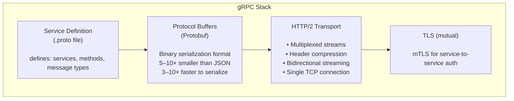
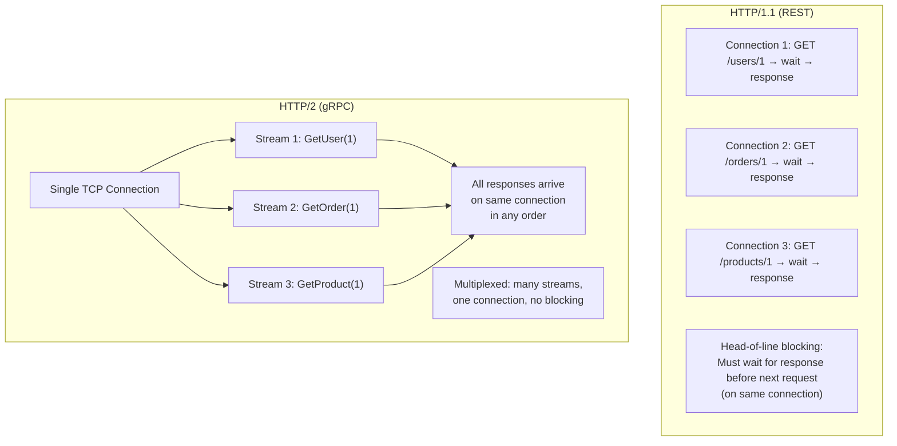
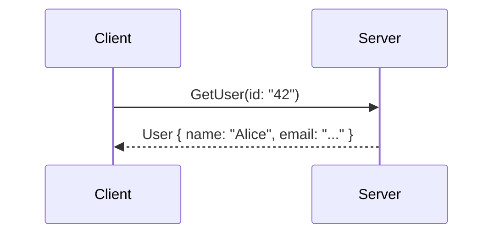
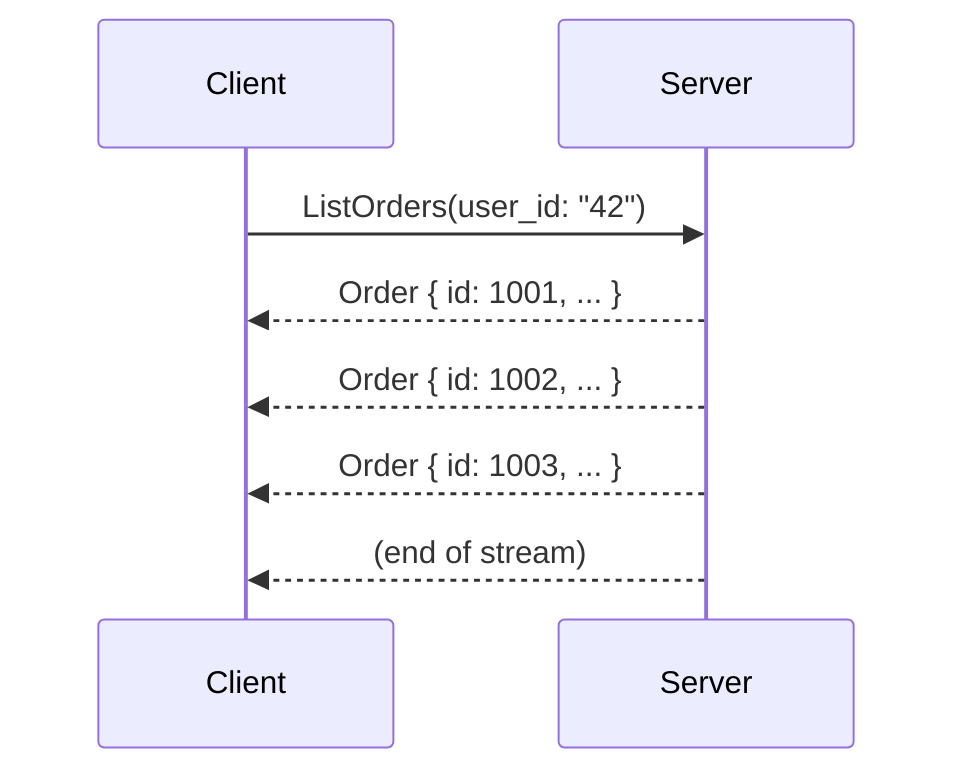
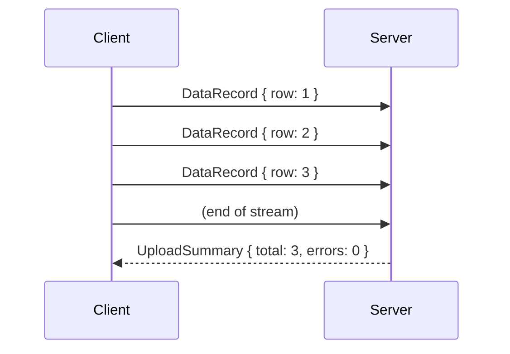
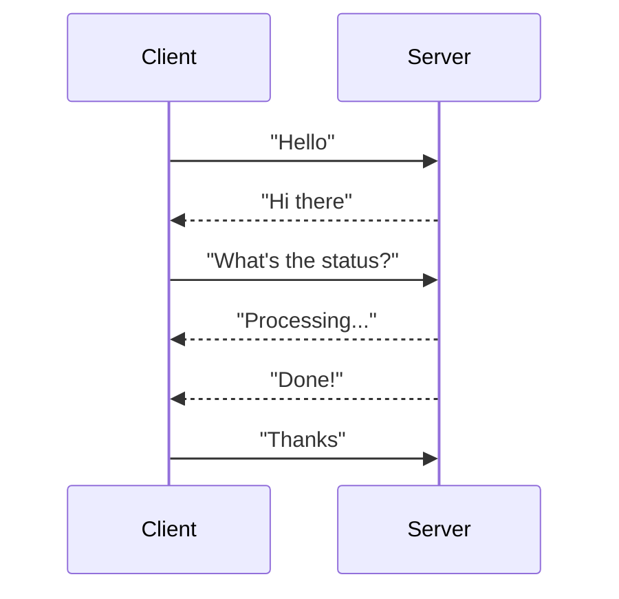
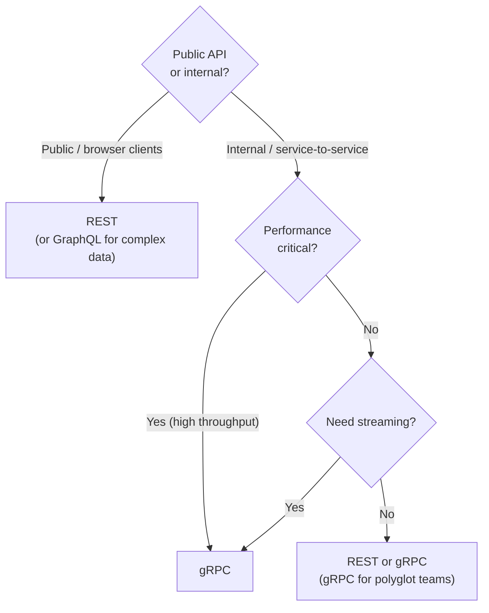
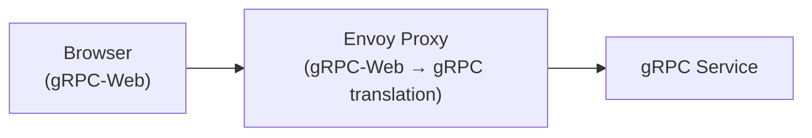

# gRPC

gRPC (Google Remote Procedure Call) is a high-performance, open-source RPC framework developed by Google. It uses **Protocol Buffers** (Protobuf) as its interface definition language and wire format, and runs over **HTTP/2** for transport. gRPC lets you call methods on a remote service as if they were local function calls.

> **gRPC is the backbone of modern microservices.** Where REST uses generic HTTP verbs on URLs, gRPC defines strongly-typed service interfaces with generated client and server code. If REST is a restaurant where you browse a menu and order by name, gRPC is a vending machine — you press a specific button and get exactly what's described.

---

## The Core Stack



---

## Protocol Buffers — The Wire Format

Protobuf is a language-neutral, platform-neutral binary serialization format. You define message types in `.proto` files, then generate client/server code for any language.

```protobuf
// user.proto
syntax = "proto3";

package user;

option go_package = "github.com/example/user/pb";

// Message types (data structures)
message User {
  string id         = 1;   // Field numbers, not names, are on the wire
  string name       = 2;
  string email      = 3;
  int64  created_at = 4;   // Unix timestamp
  repeated string roles = 5;  // List field
}

message GetUserRequest {
  string user_id = 1;
}

message CreateUserRequest {
  string name  = 1;
  string email = 2;
}

// Service definition
service UserService {
  rpc GetUser(GetUserRequest) returns (User);
  rpc CreateUser(CreateUserRequest) returns (User);
  rpc ListUsers(ListUsersRequest) returns (stream User);  // Server streaming
  rpc BulkCreateUsers(stream CreateUserRequest) returns (CreateUsersResponse);  // Client streaming
  rpc UserChat(stream ChatMessage) returns (stream ChatMessage);  // Bidirectional
}
```

**Generate code:**

```bash
protoc --go_out=. --go-grpc_out=. user.proto
# Generates: user.pb.go (message types) + user_grpc.pb.go (client/server stubs)
```

### Why Protobuf is Faster than JSON

```
JSON (text-based):
{ "id": "42", "name": "Alice Smith", "email": "alice@example.com" }
→ 62 bytes (field names repeated every time, human-readable overhead)

Protobuf (binary):
<field 1><string 42><field 2><string Alice Smith><field 3><string alice@example.com>
→ ~35 bytes (field numbers, not names; varint encoding; no whitespace)
```

**Benchmark (typical):**

- Serialization: 3–10× faster than JSON
- Wire size: 2–10× smaller than JSON
- Deserialization: 3–7× faster than JSON

---

## HTTP/2 Advantages

gRPC's use of HTTP/2 gives it fundamental advantages over REST/HTTP/1.1:



**HTTP/2 benefits for gRPC:**

- **Multiplexing:** Many requests/responses on one connection — no connection-per-request overhead
- **Header compression (HPACK):** Repeated headers (`:method`, `content-type`, `authorization`) compressed — huge savings for many small calls
- **Server push:** Server can proactively send data (rarely used in gRPC)
- **Streaming:** Native support for long-lived streams in both directions

---

## The Four Communication Patterns

gRPC supports four distinct communication patterns:

### 1. Unary RPC (Classic Request/Response)

```protobuf
rpc GetUser(GetUserRequest) returns (User);
```



Identical to REST semantics. Use this for most operations.

### 2. Server Streaming

```protobuf
rpc ListOrders(ListOrdersRequest) returns (stream Order);
```



Server sends a stream of messages in response to one client request. Use for: large result sets (avoid loading all into memory), live data feeds (push records as they're processed).

### 3. Client Streaming

```protobuf
rpc BulkUpload(stream DataRecord) returns (UploadSummary);
```



Client streams many messages; server responds once. Use for: bulk data ingestion, file uploads in chunks, telemetry reporting.

### 4. Bidirectional Streaming

```protobuf
rpc Chat(stream ChatMessage) returns (stream ChatMessage);
```



Both sides stream independently. Use for: real-time bidirectional communication, collaborative editing, interactive sessions.

---

## gRPC vs. REST — When to Use Which

| Dimension               | REST                       | gRPC                          |
| ----------------------- | -------------------------- | ----------------------------- |
| **Protocol**            | HTTP/1.1 (usually)         | HTTP/2                        |
| **Payload format**      | JSON (human-readable)      | Protobuf (binary, compact)    |
| **Performance**         | Baseline                   | 5–10× faster, smaller payload |
| **Type safety**         | None (JSON is dynamic)     | Strong (generated stubs)      |
| **Streaming**           | Workarounds (SSE, chunked) | Native (4 patterns)           |
| **Browser support**     | Native                     | Requires grpc-web proxy       |
| **API discoverability** | OpenAPI/Swagger            | Protobuf reflection           |
| **Code generation**     | Optional                   | Built-in, required            |
| **Learning curve**      | Low                        | Medium                        |
| **Best for**            | Public APIs, browsers      | Internal microservices        |

**Decision rule:**



---

## Error Handling in gRPC

gRPC has a richer status code model than HTTP:

```
Status codes:
OK (0)                  Request succeeded
CANCELLED (1)           Client cancelled the request
UNKNOWN (2)             Unknown error
INVALID_ARGUMENT (3)    Bad input (like HTTP 400)
NOT_FOUND (5)           Resource not found (like HTTP 404)
ALREADY_EXISTS (6)      Resource already exists (like HTTP 409)
PERMISSION_DENIED (7)   Authorized but not permitted (like HTTP 403)
RESOURCE_EXHAUSTED (8)  Rate limited (like HTTP 429)
FAILED_PRECONDITION (9) System not in required state
UNAVAILABLE (14)        Service unavailable (like HTTP 503)
UNAUTHENTICATED (16)    No credentials (like HTTP 401)
```

**Rich error details with google.rpc.Status:**

```protobuf
// Return detailed error info with a NOT_FOUND status
Status {
  code: NOT_FOUND
  message: "User not found"
  details: [
    BadRequest {
      field_violations: [
        { field: "user_id", description: "User 42 does not exist" }
      ]
    }
  ]
}
```

---

## Interceptors (Middleware)

gRPC interceptors are the equivalent of HTTP middleware — they wrap RPC calls for cross-cutting concerns:

```go
// Go: Unary server interceptor for authentication
func authInterceptor(
    ctx context.Context,
    req interface{},
    info *grpc.UnaryServerInfo,
    handler grpc.UnaryHandler,
) (interface{}, error) {
    // Extract token from metadata
    md, _ := metadata.FromIncomingContext(ctx)
    token := md["authorization"][0]

    // Validate JWT
    claims, err := validateToken(token)
    if err != nil {
        return nil, status.Error(codes.Unauthenticated, "invalid token")
    }

    // Inject user into context
    ctx = context.WithValue(ctx, "user", claims)

    // Call the actual handler
    return handler(ctx, req)
}
```

Common interceptor patterns: **auth**, **logging**, **metrics** (Prometheus), **tracing** (OpenTelemetry), **rate limiting**, **retry with backoff**.

---

## gRPC in Production — Real World

**Google:** Uses gRPC everywhere internally. Over 10 billion gRPC calls per second across Google's infrastructure.

**Netflix:** Uses gRPC for internal service communication. Moved from Thrift to gRPC for better polyglot support and tooling.

**Kubernetes:** The kube-apiserver communicates with etcd, kubelet, and other components via gRPC.

**Uber:** Uses gRPC for their internal microservices. The streaming capabilities are used for real-time location updates.

**Cockroach Labs:** CockroachDB nodes communicate internally using gRPC for replication and distributed query execution.

---

## gRPC-Web — For Browsers

Browsers can't use HTTP/2's low-level framing directly, so gRPC over browser requires a proxy:



**gRPC-Web** is a subset of gRPC that works over HTTP/1.1 or HTTP/2 using a JavaScript client. It doesn't support client streaming or bidirectional streaming (only unary and server streaming). For full bidirectional streaming in browsers, use WebSocket or SSE instead.

---

## Interview Talking Points

**1. Why would you use gRPC instead of REST for microservice communication?**

> "Three reasons: performance (Protobuf binary format is 5–10x smaller and faster to serialize than JSON; HTTP/2 multiplexing means fewer connections and lower latency), type safety (Protobuf schema is the contract — generated stubs catch mismatches at compile time, not at runtime), and native streaming (4 communication patterns including bidirectional streaming that REST can't do efficiently). The downside is browser incompatibility — gRPC-Web is a workaround. For internal service-to-service calls, gRPC is often the right choice."

**2. What is Protobuf and why does it outperform JSON?**

> "Protocol Buffers is a binary serialization format. The schema (`.proto` file) defines field numbers, not names — only the numbers go on the wire, not the field names. Fields are encoded as tag-value pairs using variable-length integers. This makes messages 2–10x smaller than equivalent JSON and 3–10x faster to serialize/deserialize. The trade-off: binary is not human-readable, requires schema files to interpret, and schema changes must be backward-compatible (field numbers are permanent)."

**3. Explain gRPC streaming patterns and when to use each.**

> "gRPC has four patterns: unary (one request, one response — same as REST, most common), server streaming (one request, multiple responses — for large result sets or live feeds), client streaming (multiple requests, one response — for bulk uploads or telemetry), and bidirectional streaming (both sides send independently — for real-time chat, collaborative editing, interactive sessions). Streaming is native over HTTP/2 — no polling or long-polling hacks needed."

**4. How do you handle schema evolution in Protobuf without breaking clients?**

> "Protobuf evolution rules: never reuse field numbers (they identify fields on the wire), add new fields as optional (old clients ignore unknown fields, new clients get the value), never change the type of an existing field, mark deprecated fields with `[deprecated=true]` but don't remove them. This makes Protobuf schemas naturally backward-compatible — old clients continue working when new fields are added to messages."

---

## Key Takeaways

- gRPC = **Protobuf** (binary format) + **HTTP/2** (multiplexed transport) + **code generation** (type-safe stubs)
- **5–10× performance improvement** over REST/JSON for service-to-service calls
- **Four streaming patterns** — unary, server streaming, client streaming, bidirectional — all native over HTTP/2
- **Interceptors** are the middleware layer — use for auth, logging, tracing, rate limiting
- **Field numbers** (not names) are on the wire — never reuse them; schema evolution is safe by adding fields
- **Browser incompatible** out of the box — use gRPC-Web + Envoy proxy, or choose REST/GraphQL for browser clients
- **Best fit:** Internal polyglot microservice communication where performance and type safety matter
