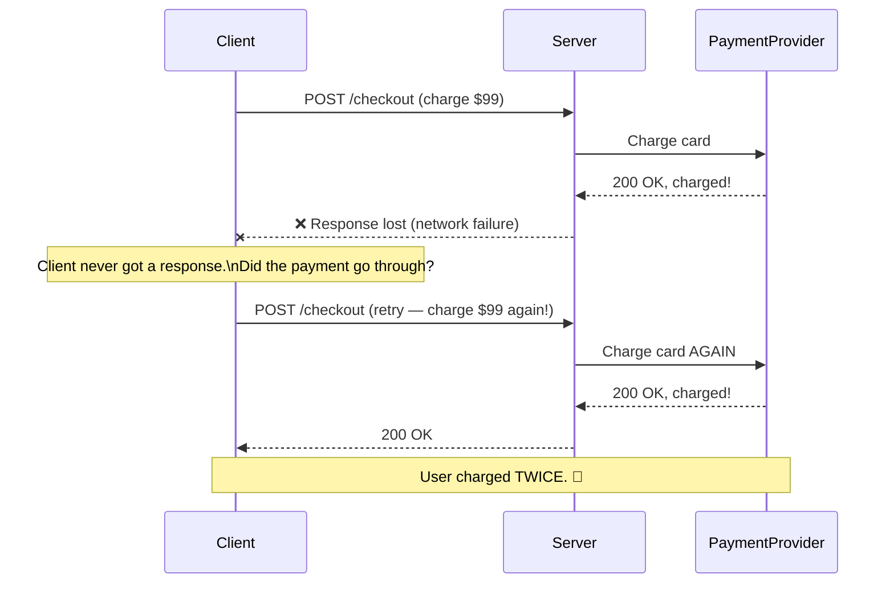
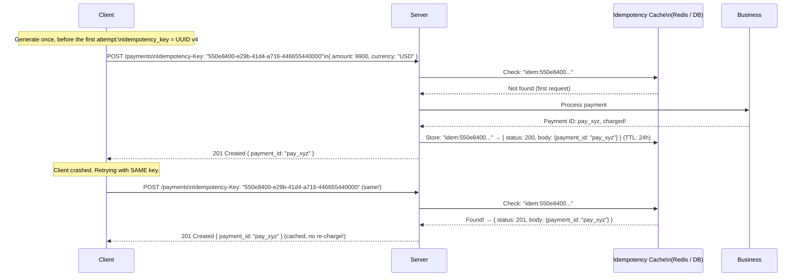
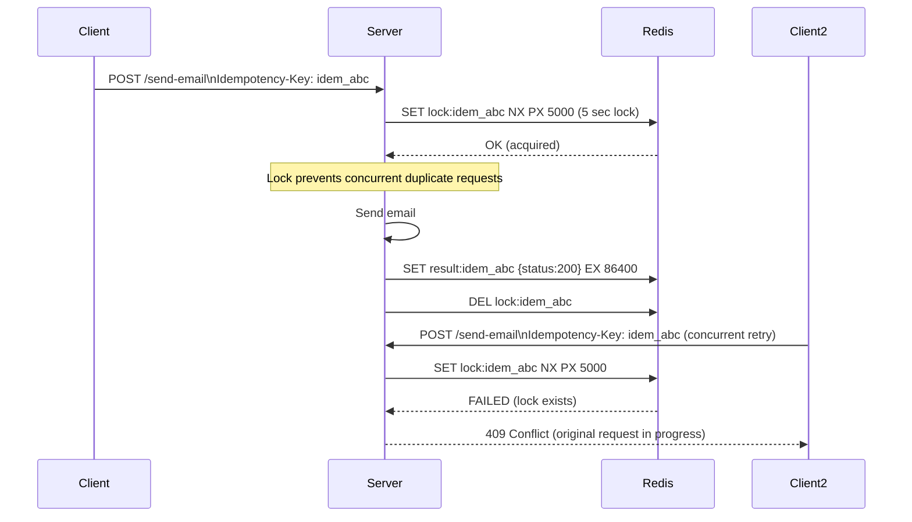
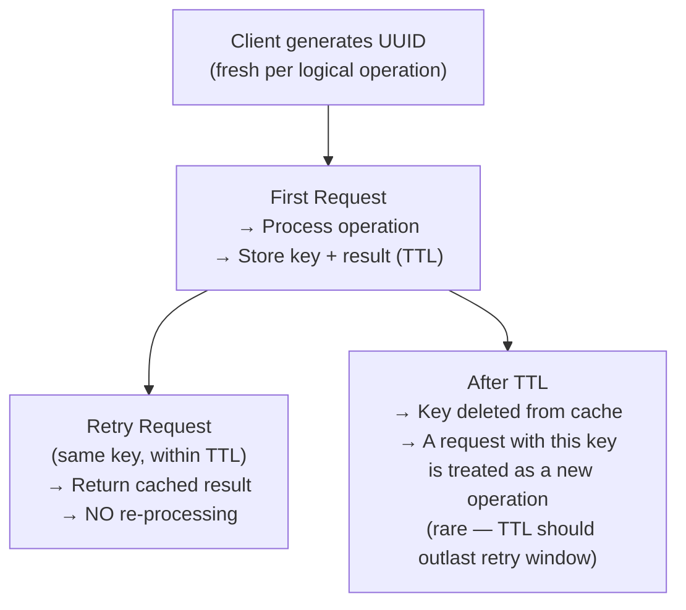

# Idempotency

An operation is **idempotent** if performing it multiple times produces the same result as performing it once. In distributed systems, idempotency is not an optimization — it's a correctness requirement. Networks fail, clients retry, and at-least-once delivery is the reality. Without idempotency, retries cause duplicate charges, duplicate emails, and corrupted state.

> **Idempotency is what separates systems that survive retries from systems that don't.** At-least-once delivery is the guaranteed behavior of virtually every distributed messaging system and HTTP client. The question is not "will my endpoint be called multiple times?" but "have I designed it to handle being called multiple times?"

---

## Why Idempotency Is Necessary



**The fundamental problem:** The client cannot distinguish "the request was received and processed" from "the request was never received." The safe assumption for a client is to retry. The safe behavior for a server is to deduplicate.

---

## Idempotency in HTTP Methods

HTTP methods have defined idempotency semantics:

| Method     | Idempotent? | Meaning                                                            |
| ---------- | ----------- | ------------------------------------------------------------------ |
| **GET**    | ✅ Yes      | Read-only; calling N times returns the same result                 |
| **HEAD**   | ✅ Yes      | Same as GET, headers only                                          |
| **PUT**    | ✅ Yes      | Replace resource; doing it twice = same final state                |
| **DELETE** | ✅ Yes      | First call deletes; second call gets 404 or 204 — same end state   |
| **PATCH**  | ❌ No\*     | Partial update may not be idempotent (`INCREMENT quantity` is not) |
| **POST**   | ❌ No       | Each call may create a new resource                                |

\* PATCH can be made idempotent by design (set-value vs. increment-by operations).

**DELETE idempotency note:** The resource is gone after the first call. The second call may return `404 Not Found` — but the end state (resource doesn't exist) is the same. This is the correct behavior. Don't return `500` for the second delete.

---

## Idempotency Keys — The Standard Pattern

For non-idempotent operations (POST), the **idempotency key** pattern lets clients safely retry:



**Client rules:**

1. Generate a **new** idempotency key for each **logical operation** (not per request)
2. Use the **same key** for all retries of the same operation
3. Use a cryptographically random UUID — not a predictable sequence

**Server rules:**

1. Check the cache before processing
2. If found: return the cached response exactly
3. If not found: process, then cache the response
4. Cache key = `hash(idempotency_key + user_id)` — include user ID to prevent one user from using another's key

---

## Server-Side Implementation

```python
import hashlib, json
from functools import wraps

def idempotent(ttl_seconds=86400):  # 24 hour default
    """Decorator that makes a POST endpoint idempotent."""
    def decorator(func):
        @wraps(func)
        async def wrapper(request, *args, **kwargs):
            idem_key = request.headers.get("Idempotency-Key")
            if not idem_key:
                raise HTTPException(400, "Idempotency-Key header required")

            # Scope key to user to prevent cross-user key collisions
            cache_key = f"idem:{hashlib.sha256(f'{idem_key}:{request.user.id}'.encode()).hexdigest()}"

            # Check cache first
            cached = await redis.get(cache_key)
            if cached:
                stored = json.loads(cached)
                # Return EXACTLY the same response as the first time
                return JSONResponse(
                    content=stored["body"],
                    status_code=stored["status"],
                    headers={"X-Idempotent-Replayed": "true"}
                )

            # Not in cache — process the request
            response = await func(request, *args, **kwargs)

            # Store the response (status + body)
            await redis.setex(
                cache_key,
                ttl_seconds,
                json.dumps({"status": response.status_code, "body": response.body})
            )

            return response
        return wrapper
    return decorator

@app.post("/payments")
@idempotent(ttl_seconds=86400)
async def create_payment(request: Request):
    # This function is only called once per idempotency key
    charge = await stripe.charge_card(...)
    return JSONResponse({"payment_id": charge.id}, status_code=201)
```

---

## Database-Level Idempotency

For operations that must be idempotent at the database level:

### Unique Constraint on Business Key

```sql
-- Prevent duplicate order creation per checkout session
CREATE TABLE orders (
    id                 UUID PRIMARY KEY DEFAULT gen_random_uuid(),
    checkout_session_id TEXT NOT NULL UNIQUE,  -- Business-level idempotency key
    user_id            UUID NOT NULL,
    amount_cents       INTEGER NOT NULL,
    created_at         TIMESTAMPTZ DEFAULT NOW()
);

-- First insert: succeeds
INSERT INTO orders (checkout_session_id, user_id, amount_cents)
VALUES ('session_abc', 'user_42', 9900);

-- Duplicate (retry): fails with unique constraint violation
INSERT INTO orders (checkout_session_id, user_id, amount_cents)
VALUES ('session_abc', 'user_42', 9900);
-- → ERROR: duplicate key value violates unique constraint "orders_checkout_session_id_key"
```

**Handle the constraint violation gracefully:**

```python
try:
    order = await db.create_order(session_id=session_id, ...)
    return order
except UniqueViolationError:
    # Already exists — return the existing record
    return await db.get_order_by_session(session_id=session_id)
```

### INSERT ON CONFLICT (Upsert)

```sql
-- PostgreSQL UPSERT: insert or do nothing if already exists
INSERT INTO processed_events (event_id, processed_at, result)
VALUES ('evt_1234', NOW(), '{"status": "ok"}')
ON CONFLICT (event_id) DO NOTHING;

-- Or update with newer data:
INSERT INTO order_status (order_id, status, updated_at)
VALUES (1001, 'shipped', NOW())
ON CONFLICT (order_id) DO UPDATE
SET status = EXCLUDED.status,
    updated_at = EXCLUDED.updated_at
WHERE EXCLUDED.updated_at > order_status.updated_at;  -- Only update if newer
```

---

## Message Queue / Event Consumer Idempotency

At-least-once delivery means your consumer will receive the same message more than once. Every consumer must be idempotent:

```python
def process_order_shipped(message: dict):
    order_id = message["order_id"]
    event_id = message["event_id"]    # Unique per event from the producer

    # Check if already processed
    if redis.exists(f"processed:{event_id}"):
        logger.info(f"Skipping duplicate event {event_id}")
        return  # Already processed — safe to skip

    # Mark as in-progress (with TTL to handle crashes during processing)
    redis.setex(f"processed:{event_id}", 3600, "processing")

    try:
        # Idempotent operation: UPDATE WHERE status != 'shipped'
        rows_updated = db.execute("""
            UPDATE orders
            SET status = 'shipped', shipped_at = NOW()
            WHERE order_id = %s AND status != 'shipped'
        """, [order_id])

        if rows_updated == 0:
            logger.info(f"Order {order_id} already shipped")

        # Mark as done
        redis.setex(f"processed:{event_id}", 7 * 24 * 3600, "done")

    except Exception as e:
        redis.delete(f"processed:{event_id}")  # Allow retry
        raise
```

**Key patterns for idempotent consumers:**

1. **Event ID deduplication:** Store processed event IDs; skip if seen
2. **Conditional updates:** `UPDATE ... WHERE status != 'already_processed_state'`
3. **Database unique constraints:** Let the DB enforce idempotency at the storage layer
4. **Natural idempotency:** Some operations are naturally idempotent — setting a value (not incrementing), marking a flag

---

## Idempotency in Different Contexts

### Stripe's Idempotency Model

Stripe is the gold standard. Every state-changing API call accepts an `Idempotency-Key` header:

```
POST /v1/charges
Idempotency-Key: 550e8400-e29b-41d4-a716-446655440000

Stripe stores: idempotency_key → response (for 24 hours)
Second call with same key → returns cached response, no re-charge
```

Stripe's documentation: "If the original request is still in flight and you make a request with the same key, Stripe will return a 409 Conflict, indicating the original is still processing. When it finishes, subsequent requests with the same key will return the cached response."

### Distributed Locks + Idempotency



---

## Common Idempotency Mistakes

### Mistake 1: Using a Predictable Key

```
❌ BAD: Idempotency-Key: order-1001  (predictable, static per order)
         → If client reuses key for a new payment on same order: gets old response!

✅ GOOD: Idempotency-Key: 550e8400-e29b-41d4-a716-446655440000 (random UUID per attempt)
```

### Mistake 2: Not Including User Context in Cache Key

```python
❌ BAD: cache_key = f"idem:{idempotency_key}"
         → User B could use User A's idempotency key and get User A's response!

✅ GOOD: cache_key = f"idem:{sha256(idempotency_key + user_id)}"
```

### Mistake 3: TTL Too Short

```python
❌ BAD: redis.setex(cache_key, 60, response)   # 60 seconds — too short
         → Stripe retries over 24 hours; key expires before retry window ends

✅ GOOD: redis.setex(cache_key, 86400, response)  # 24 hours — matches retry window
```

### Mistake 4: Storing Only "Success" Responses

```python
❌ BAD: Only store when the operation succeeds
         → If payment fails with 402, retry gets re-processed as a new attempt

✅ GOOD: Store EVERY terminal response (200, 201, 400, 402, 409...)
         → Retry of a 402 gets back the same 402 — not re-charged
```

---

## Idempotency Key Lifecycle



---

## Interview Talking Points

**1. What is idempotency and why does it matter in distributed systems?**

> "An operation is idempotent if calling it multiple times has the same effect as calling it once. In distributed systems, at-least-once delivery and network retries mean operations will be attempted more than once. Without idempotency, retries cause duplicate charges, duplicate emails, or corrupted data. Every state-changing endpoint that clients might retry must be idempotent — and clients should always retry on transient failures, so virtually every POST endpoint needs idempotency."

**2. How do you implement idempotency for a payment API?**

> "The client generates a UUID before the first attempt and sends it as an `Idempotency-Key` header. On the server, I cache the response keyed by `hash(idempotency_key + user_id)` in Redis with a TTL matching the retry window (24 hours for Stripe). Before processing, I check the cache — if found, return the cached response immediately with no re-processing. If not found, I process the payment, then cache the result. I scope the key to the user ID to prevent cross-user key collisions."

**3. How do you make a Kafka consumer idempotent?**

> "Store each processed event ID in Redis or the database (with a TTL matching the Kafka retention period). At the start of processing, check if the event ID was already processed — if so, skip it. Use conditional database updates (`WHERE status != 'already_done'`) so that even if the Redis check is missed, the DB update is a no-op. Never commit the Kafka offset until you've successfully processed and stored the result — this way failures cause re-delivery, which your idempotent handler can handle safely."

**4. DELETE /users/42 — the user doesn't exist. Should you return 404 or 204?**

> "Either is defensible, but 204 (No Content) is the more idempotent response — the end state is the same regardless of whether the user existed before: the user doesn't exist now. A client that retries a failed DELETE shouldn't get an error on the retry. However, if knowing whether the user existed matters to the client (for audit or debugging), 404 is informative. Stripe and most production APIs return 404 for not-found resources even on DELETE, accepting that retries will get a different status code but the same outcome."

---

## Key Takeaways

- Idempotency is **necessary** because at-least-once delivery and client retries are unavoidable in distributed systems
- **GET, PUT, DELETE** are naturally idempotent; **POST** is not — requires explicit design
- The **idempotency key pattern**: client generates a UUID, sends as header, server caches response by key
- Cache key must include **user ID** — not just the idempotency key — to prevent cross-user collisions
- **TTL** must outlast the client's retry window — typically 24 hours
- Cache **all terminal responses** (including errors) — not just successes
- **Database unique constraints** are the strongest form of idempotency — the DB enforces it even if the cache fails
- Kafka consumers need event ID deduplication + conditional updates to be safely at-least-once
