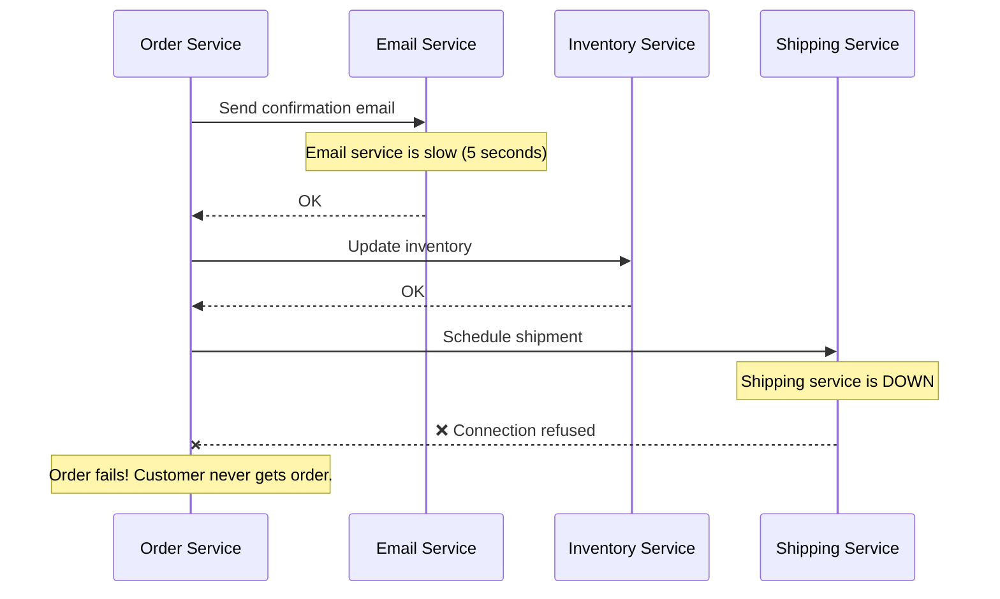
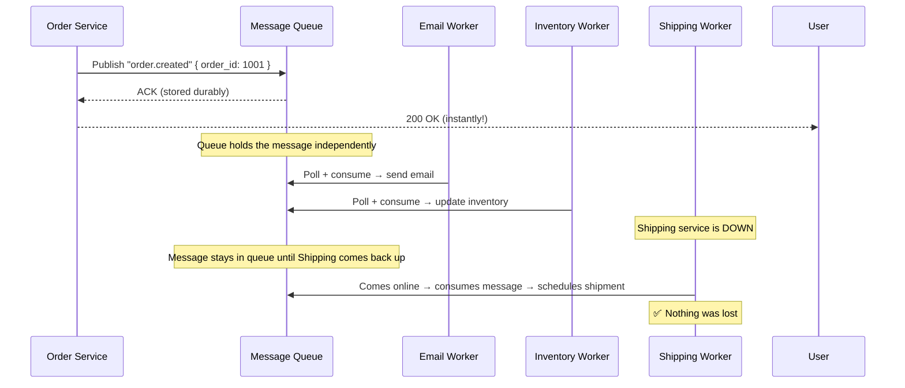
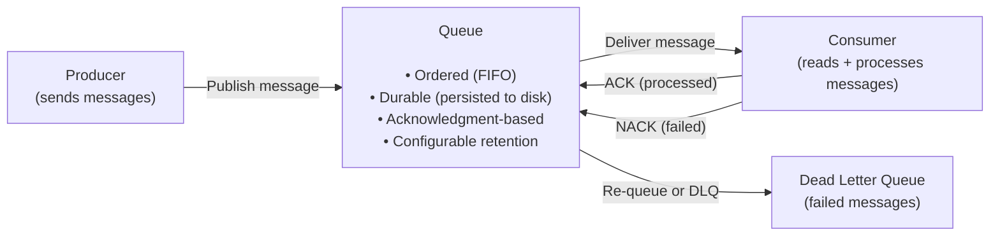
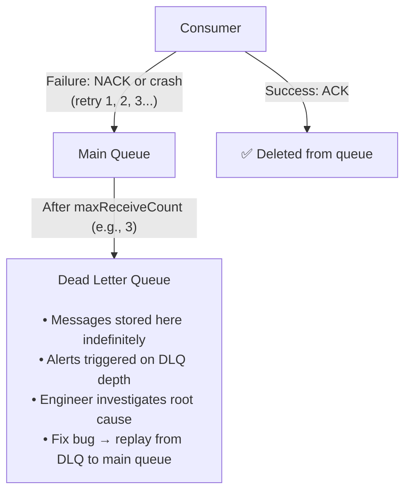
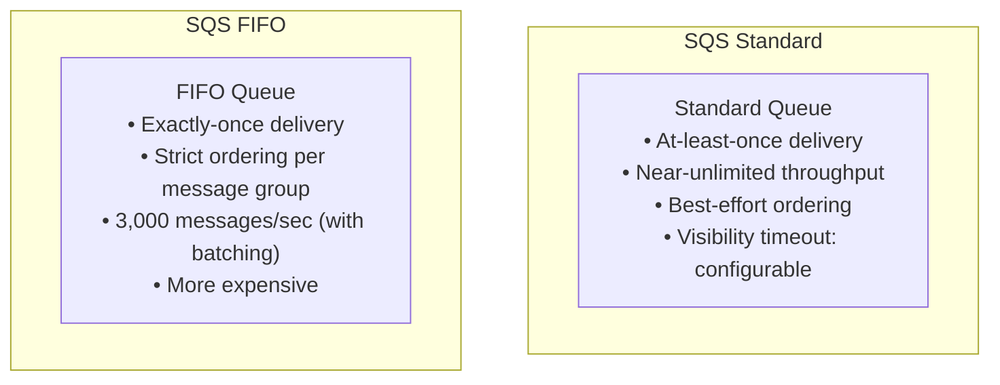
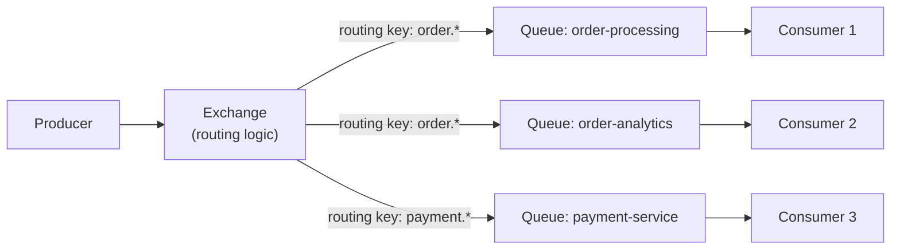
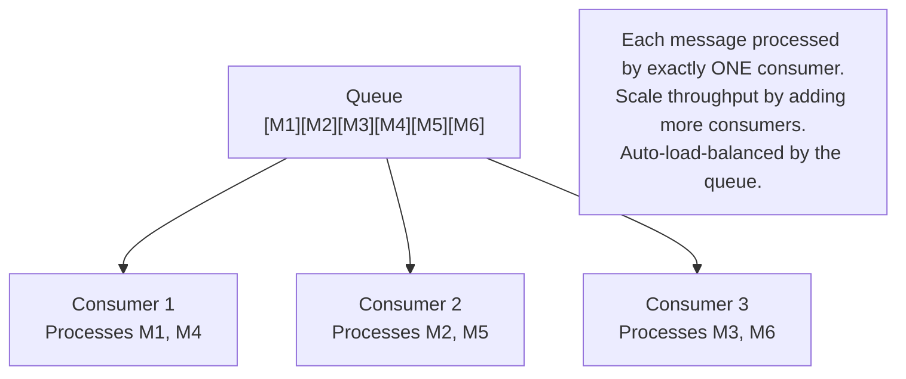
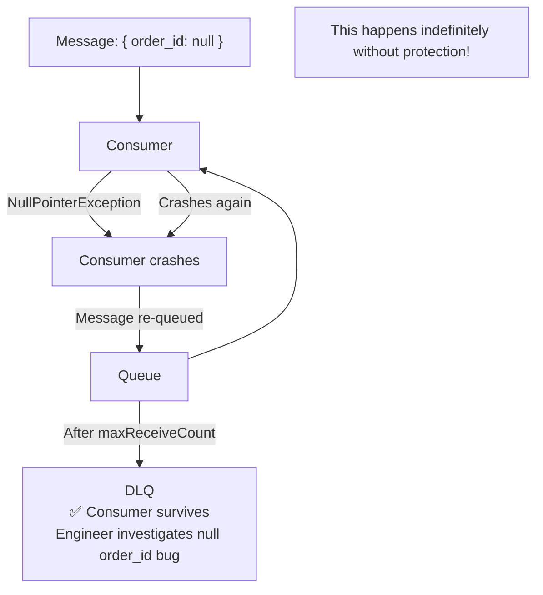

# Message Queues

A message queue is a form of asynchronous service-to-service communication — producers send messages to a queue, and consumers read and process them independently. The queue acts as a buffer, decoupling the sending system from the receiving system in time, throughput, and availability.

> **Message queues are the shock absorbers of distributed systems.** When a flash sale floods your order service with 100× normal traffic, a queue absorbs the spike — orders queue up, workers process at their own pace, and nothing crashes. Without a queue, the order service either scales to 100× (expensive) or falls over (worse).

---

## The Core Problem Message Queues Solve

### Direct Service Calls (Tight Coupling)



### Queue-Based (Loose Coupling)



**Benefits:**

- **Decoupling:** Order service doesn't need to know about Email/Inventory/Shipping
- **Resilience:** Downstream failures don't fail the upstream (orders don't fail because email is slow)
- **Load leveling:** Queue absorbs traffic spikes; workers process at steady rate
- **Independent scaling:** Scale email workers separately from order service

---

## Message Queue Anatomy



**Key concepts:**

- **Durability:** Messages survive queue restarts (written to disk)
- **Acknowledgment:** Consumer explicitly ACKs when done — message is only deleted after ACK
- **Visibility timeout:** Message is hidden from other consumers while being processed
- **Dead Letter Queue (DLQ):** Messages that fail after max retries go here for manual inspection

---

## At-Most-Once vs. At-Least-Once vs. Exactly-Once

This is the fundamental delivery guarantee spectrum:

### At-Most-Once (Fire and Forget)

```
Producer → Queue → Consumer
            ↓
           ACK before processing
```

Message is deleted when delivered to consumer, regardless of whether it was processed successfully. If the consumer crashes mid-processing, the message is lost.

**Use when:** Losing some messages is acceptable (metrics, logs, analytics events). Maximum throughput priority.

### At-Least-Once (Default for Most Queues)

```
Producer → Queue → Consumer → ACK after processing
```

Message is kept until explicitly ACKed by the consumer. If the consumer crashes, the message is re-delivered. **The message may be delivered more than once.**

**Use when:** You cannot afford to lose messages (orders, payments, notifications). Consumer must be **idempotent** — processing the same message twice must be safe.

### Exactly-Once (Hardest to Achieve)

```
Producer → (dedup) → Queue → Consumer → (dedup) → Process
```

Each message processed exactly once. Requires coordination between the queue and the consumer's state — typically implemented with idempotency keys and transactional processing.

**Use when:** Double-processing is catastrophic (charging a card twice, sending duplicate emails).

| Guarantee     | Mechanism                  | Throughput | Complexity |
| ------------- | -------------------------- | ---------- | ---------- |
| At-most-once  | ACK before process         | Highest    | Lowest     |
| At-least-once | ACK after process          | High       | Medium     |
| Exactly-once  | Idempotency + transactions | Lower      | High       |

---

## Dead Letter Queues

Messages that fail processing repeatedly (max retries exhausted) are routed to a DLQ:



**DLQ best practices:**

- Set alerts on DLQ depth > 0 (every DLQ message means something broke)
- Store enough context in the message to debug: which order, which user, what error
- Build a replay mechanism to reprocess DLQ messages after fixing the bug

---

## Popular Message Queue Systems

### Amazon SQS (Standard + FIFO)



**SQS key design:**

- Consumers **poll** (long poll up to 20 seconds)
- **Visibility timeout** hides message from other consumers while processing
- Messages can be retained up to 14 days
- **SQS + Lambda** is the canonical serverless queue pattern

### RabbitMQ

- AMQP protocol — rich routing via **exchanges** (direct, topic, fanout, headers)
- **Push-based** (broker pushes to consumers) vs SQS's pull-based
- **Acknowledgment-based** with per-message or per-channel acks
- Supports **message TTL**, **priority queues**, **delayed messages**



RabbitMQ excels at **complex routing** — multiple consumers getting different messages based on routing keys.

### Apache Kafka

Kafka is often called a "message queue" but is architecturally different — it's a **distributed log** (see Event Streaming). Key differences:

| Feature               | SQS / RabbitMQ                       | Kafka                                                      |
| --------------------- | ------------------------------------ | ---------------------------------------------------------- |
| **Message retention** | Until consumed + ACKed               | Configurable retention (days/weeks/forever)                |
| **Consumer groups**   | Each message consumed once per queue | Independent consumer groups; each group reads all messages |
| **Replay**            | Not possible after ACK               | Yes — seek to any offset and replay                        |
| **Ordering**          | Per-queue (FIFO) or best-effort      | Strict within a partition                                  |
| **Throughput**        | High (millions/day)                  | Extreme (millions/second)                                  |

---

## Consumer Groups — Competing Consumers Pattern

Multiple consumers compete to process messages from the same queue:



**Scale rule:** Add consumers when your queue depth grows consistently. Each consumer handles its share. Remove consumers when queue depth drops.

---

## Message Design

Well-designed messages make your system debuggable and maintainable:

```json
{
  "id": "msg_4xK9mP2abc", // Unique message ID (for deduplication)
  "version": "1.0", // Schema version
  "type": "order.payment.completed",
  "timestamp": "2024-01-15T10:30:00Z",
  "producer": "payment-service", // Who sent this
  "correlation_id": "req_1234", // Traces back to the original HTTP request
  "payload": {
    "order_id": "ord_1001",
    "user_id": "usr_42",
    "amount_cents": 9999,
    "currency": "USD",
    "payment_method": "card_visa"
  },
  "metadata": {
    "retry_count": 0,
    "schema_url": "https://schemas.yourapp.com/order-payment-completed/v1"
  }
}
```

**Always include:**

- **Unique message ID** — enables deduplication (idempotency)
- **Type** — consumers route by type; use dot-separated namespacing (`domain.entity.action`)
- **Timestamp** — when the event occurred (not when it was enqueued)
- **Correlation ID** — traces the message back to the originating request

---

## Poison Messages

A **poison message** is one that repeatedly causes consumer crashes:



**Protection:**

- Always configure a DLQ with a `maxReceiveCount` (e.g., 3–5 retries)
- Validate message schema at the consumer boundary — reject malformed messages to DLQ immediately
- Log the raw message and error for every DLQ delivery

---

## Interview Talking Points

**1. Why use a message queue instead of direct HTTP calls between services?**

> "Two reasons: resilience and load leveling. With direct HTTP calls, if the downstream service is slow or down, the upstream fails too. With a queue, the upstream writes a message and returns immediately — the downstream processes when it can. If it's down, messages queue up safely. Load leveling: during a traffic spike (flash sale), the queue absorbs the burst. Workers process at a steady rate instead of being overwhelmed. The downside is eventual consistency — the response is async, so clients get acknowledged before the work is done."

**2. At-least-once vs. exactly-once delivery — what's the difference and which do you use?**

> "At-least-once: the queue guarantees delivery but may deliver duplicates if the consumer crashes after processing but before ACKing. Exactly-once requires coordination between the queue and consumer state — typically idempotency keys and transactional writes. In practice, I use at-least-once with idempotent consumers. Making the consumer idempotent (check if you've seen this message ID before) is simpler and cheaper than exactly-once infrastructure. True exactly-once is only worth the overhead in financial systems where double-processing is catastrophic."

**3. What is a dead letter queue and why is it critical?**

> "A DLQ receives messages that have failed processing more than `maxReceiveCount` times. It's critical for two reasons: it prevents poison messages (malformed or buggy messages that crash consumers) from blocking the queue forever, and it preserves failed messages for debugging instead of losing them. I set alerts on DLQ depth > 0 — every message there means something is broken. After fixing the bug, I replay messages from the DLQ back to the main queue."

---

## Key Takeaways

- Message queues **decouple producers from consumers** — both operate independently in time and throughput
- **Durability** + **acknowledgment** = messages survive crashes and aren't lost until explicitly processed
- **At-least-once** is the production default — make consumers **idempotent** (deduplicate by message ID)
- **Dead Letter Queues** are mandatory — they catch poison messages and preserve failures for debugging
- **Visibility timeout** prevents other consumers from processing a message while one is processing it
- **Scale throughput** by adding consumers (competing consumers pattern) — queue load-balances automatically
- Design messages with an **id**, **type**, **timestamp**, and **correlation_id** — traceability is essential at scale
