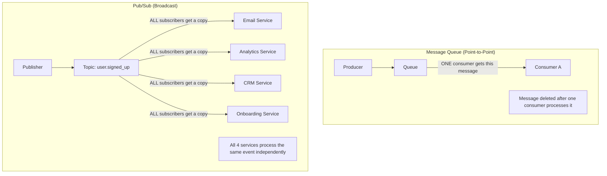
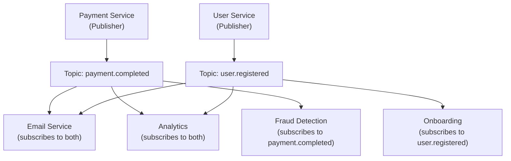
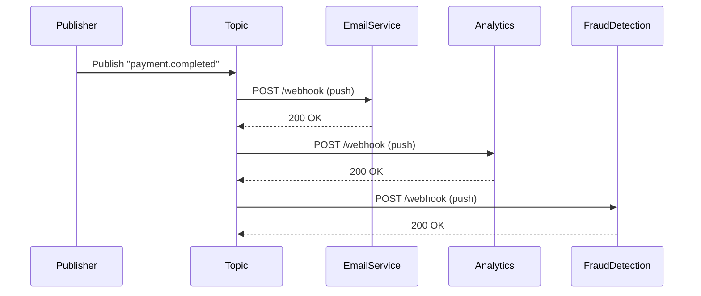
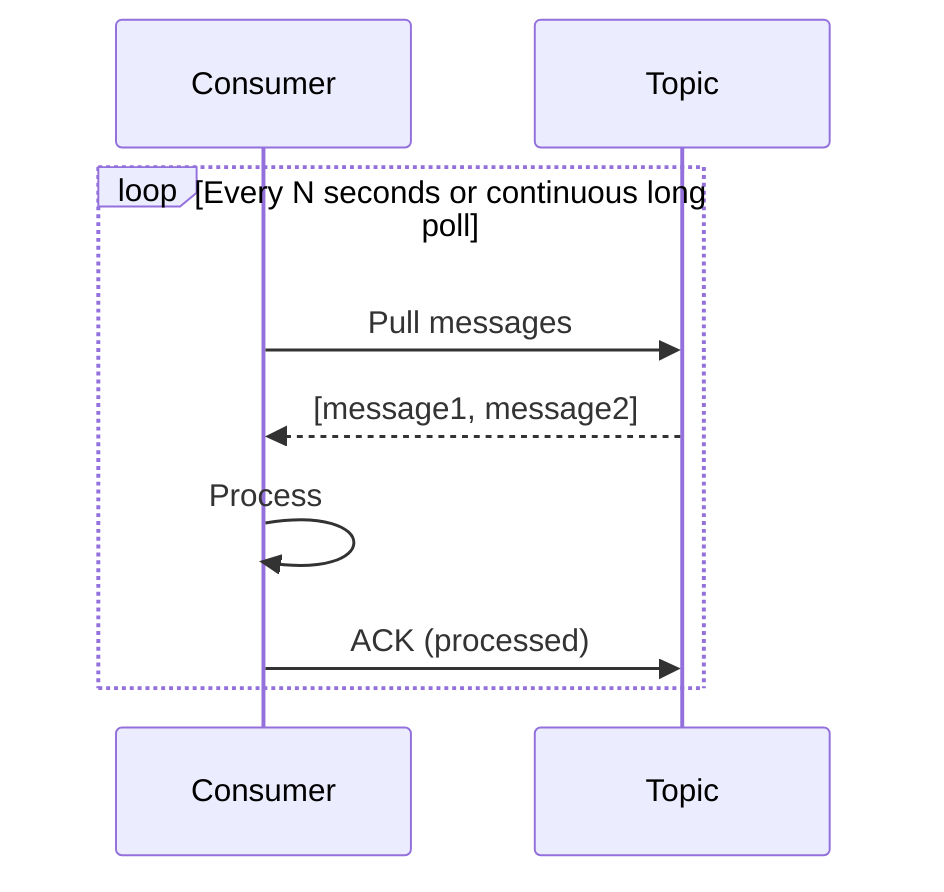
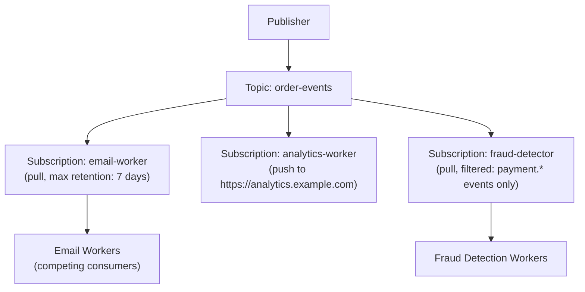
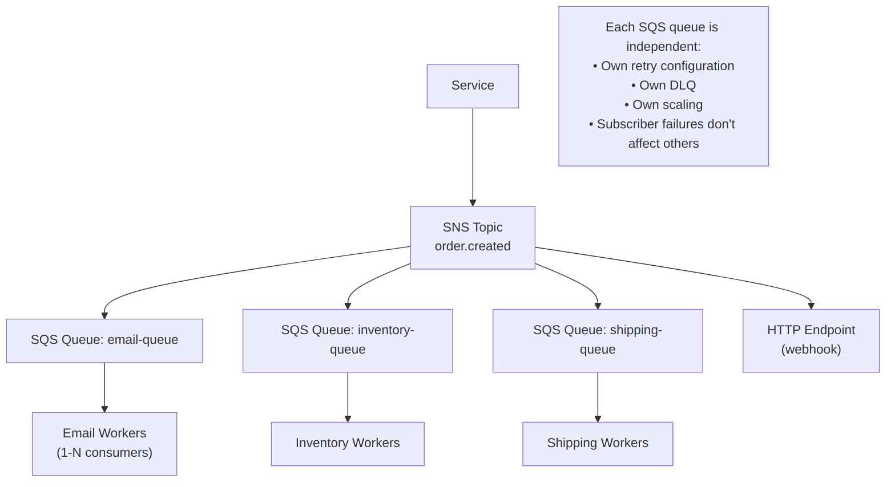

# Pub-Sub Systems

Publish-Subscribe (Pub/Sub) is a messaging pattern where **publishers** send messages to named channels called **topics**, and **subscribers** receive messages from the topics they've subscribed to — without any direct knowledge of each other. The publisher doesn't know who will receive the message; the subscriber doesn't know who sent it.

> **Pub/Sub is the event broadcast model.** Where a message queue delivers each message to exactly one consumer, Pub/Sub delivers each message to all interested subscribers. One event ("user signed up") can simultaneously trigger an email welcome, an analytics record, a CRM sync, and an onboarding workflow — without the publishing service knowing about any of them.

---

## Queue vs. Pub/Sub — The Key Difference



| Dimension    | Message Queue                  | Pub/Sub                               |
| ------------ | ------------------------------ | ------------------------------------- |
| **Fan-out**  | One consumer per message       | All subscribers get every message     |
| **Coupling** | Producer knows queue name      | Producer knows topic; not subscribers |
| **Use case** | Task distribution, work queues | Event broadcast, integration          |
| **Ordering** | Per-queue                      | Per-topic (depends on system)         |
| **Examples** | SQS Standard, RabbitMQ queue   | SNS, Redis Pub/Sub, Google Pub/Sub    |

---

## Pub/Sub Architecture



**The critical property:** Payment Service doesn't import, call, or know about Email Service, Analytics, Fraud Detection, or any subscriber. Adding a new subscriber (say, a Slack notification service) requires zero changes to the publisher — just subscribe to the topic.

---

## Pub/Sub Delivery Models

### Push Delivery

The Pub/Sub system calls each subscriber's HTTP endpoint when a message arrives:



**Pro:** Low latency — message delivered immediately. No consumer polling needed.  
**Con:** Subscribers must expose HTTP endpoints. Backpressure is harder (fast publisher overwhelms slow subscriber).

### Pull Delivery

Subscribers poll the Pub/Sub system for messages:



**Pro:** Consumer controls its own rate. Works behind firewalls (no inbound HTTP). Easier backpressure.  
**Con:** Slightly higher latency (poll interval).

**Google Cloud Pub/Sub** supports both. **Redis Pub/Sub** is push-only. **Kafka** is pull-only.

---

## Pub/Sub in Redis

Redis Pub/Sub is a simple, in-memory, fire-and-forget implementation:

```bash
# Terminal 1: Subscribe to a channel
SUBSCRIBE notifications:user-42

# Terminal 2: Publish
PUBLISH notifications:user-42 '{"type":"message","text":"You have a new follower"}'

# Terminal 1 receives:
# 1) "message"
# 2) "notifications:user-42"
# 3) "{\"type\":\"message\",\"text\":\"You have a new follower\"}"
```

**Redis Pub/Sub pattern subscriptions:**

```bash
PSUBSCRIBE notifications:*      # Subscribe to all user notification channels
PSUBSCRIBE orders.*             # Subscribe to all order events
```

**Critical limitations of Redis Pub/Sub:**

- **No message persistence** — if a subscriber is disconnected, it misses all messages published while offline
- **No delivery guarantees** — fire-and-forget; no ACKs, no retries
- **Not suitable for durable event streaming** — use Redis Streams (`XADD`/`XREAD`) instead

**Redis Pub/Sub best for:** Real-time notifications, WebSocket fan-out, cache invalidation signals — where losing some messages is acceptable.

---

## Google Cloud Pub/Sub

GCP Pub/Sub is a fully managed, durable, scalable Pub/Sub service:



**Key features:**

- **At-least-once delivery** with ACKs
- **Message retention** up to 7 days (replay if subscriber falls behind)
- **Dead letter topics** for messages that fail delivery
- **Message filtering** — subscribers receive only matching messages
- **Ordering keys** — messages with the same key are delivered in order to the same subscriber

---

## Amazon SNS + SQS Fan-Out Pattern

AWS separates the concerns:

- **SNS (Simple Notification Service):** Pub/Sub topic — delivers to multiple destinations simultaneously
- **SQS (Simple Queue Service):** Message queue — holds messages per-subscriber until processed



**Why SNS + SQS and not SNS alone?**

- SNS push delivery fails if the HTTP endpoint is down — messages are lost
- SQS provides the durability buffer — messages survive consumer downtime
- Each consumer group can scale independently and have its own DLQ

This is the canonical AWS microservices event pattern.

---

## Topic Naming Conventions

Well-designed topic names enable filtering and subscription management:

```
# Domain-based naming (recommended)
{domain}.{entity}.{action}

payment.order.completed
payment.order.refunded
user.account.created
user.account.deleted
inventory.product.out_of_stock
shipment.package.delivered

# Subscribe by pattern:
payment.*          # All payment events
*.account.*        # All account events across domains
shipment.*.delivered  # All delivery events
```

---

## Pub/Sub Filtering

Subscribers can filter to receive only relevant messages:

### GCP Pub/Sub Message Filtering

```python
# Subscription with filter: only payment events with amount > $1000
subscription = {
    "topic": "projects/myproject/topics/order-events",
    "filter": 'attributes.event_type = "payment.completed" AND attributes.amount_cents > 100000',
    "push_config": { "push_endpoint": "https://high-value.example.com/webhook" }
}
```

### Application-Level Filtering (SNS)

```json
// SNS subscription filter policy
{
  "event_type": ["payment.completed", "payment.refunded"],
  "amount_cents": [{ "numeric": [">", 10000] }]
}
```

---

## Pub/Sub vs. Event Streaming (Kafka)

Pub/Sub and Kafka are often confused. The distinction:

| Feature               | Pub/Sub (SNS, GCP, Redis)               | Event Streaming (Kafka)                |
| --------------------- | --------------------------------------- | -------------------------------------- |
| **Message retention** | Consumed then deleted (or short window) | Long-term (days/weeks/forever)         |
| **Replay**            | Limited                                 | Full (seek to any offset)              |
| **Consumer groups**   | Separate subscription per group         | Each group independently reads the log |
| **Ordering**          | Best-effort or per-key                  | Strict within partition                |
| **Throughput**        | High                                    | Extreme (millions/sec)                 |
| **Primary use**       | Event notification, fan-out             | Event sourcing, stream processing      |

**When to use Pub/Sub:** Real-time event notifications to multiple services, webhook fan-out, cache invalidation, lightweight event-driven integration.

**When to use Kafka:** When you need event replay, strict ordering, stream processing (aggregate, filter, join), or event sourcing.

---

## Real-World Pub/Sub Examples

**Uber:** When a driver accepts a ride, a Pub/Sub event `ride.accepted` triggers: notification to rider, ETA calculation, surge pricing recalculation, analytics — all independently.

**LinkedIn:** Feed updates use Pub/Sub. One post triggers fan-out events to all followers' feeds.

**Airbnb:** `booking.confirmed` event triggers payment capture, host notification, calendar blocking, review scheduling, analytics — all via Pub/Sub subscribers.

**Slack:** WebSocket fan-out uses Redis Pub/Sub. When a message is sent to a channel, the Redis channel for that Slack channel is published to. Every WebSocket server subscribed to that channel pushes the message to connected clients.

---

## Interview Talking Points

**1. What is the difference between a message queue and a Pub/Sub system?**

> "A message queue delivers each message to exactly one consumer — it's the point-to-point work distribution model. Pub/Sub delivers every message to all subscribers — it's the broadcast model. If I have 3 instances of an email worker competing to send one email per order, that's a queue. If I want an order event to simultaneously trigger an email, update analytics, and notify fraud detection — all as separate concerns — that's Pub/Sub. In practice, SNS + SQS combines both: SNS broadcasts to multiple SQS queues, and each SQS queue distributes work to its consumer group."

**2. When would you use Redis Pub/Sub vs. Google Cloud Pub/Sub vs. Kafka?**

> "Redis Pub/Sub for in-process real-time fan-out where losing messages on disconnect is acceptable — WebSocket server coordination, cache invalidation. GCP Pub/Sub for durable, managed event notification between services — has ACKs, retention, DLQ, filtering. Kafka for event streaming at massive scale, with replay, strict ordering, and consumer groups that read the same data independently — used for event sourcing and stream processing. The key question is whether you need durability, replay, and ordering — that narrows the choice."

**3. What is the SNS + SQS fan-out pattern and why is it preferred over SNS alone?**

> "SNS pushes to HTTP endpoints — if the endpoint is down, the message is lost. By subscribing SQS queues to an SNS topic instead of HTTP endpoints, each service gets its own durable queue. Messages survive consumer downtime. Each queue has its own retry configuration and DLQ. Consumer groups scale independently. The result: one event reliably fans out to N durable work queues, and each consumer's failures are isolated — email workers being slow doesn't affect inventory workers."

---

## Key Takeaways

- Pub/Sub **broadcasts** events to all subscribers — unlike queues where one consumer gets each message
- Publishers and subscribers are **fully decoupled** — adding a subscriber requires zero changes to the publisher
- **Push delivery** is lower latency; **pull delivery** enables better backpressure and works behind firewalls
- **Redis Pub/Sub** is fire-and-forget (no persistence) — use Redis Streams for durability
- **SNS + SQS** is the AWS canonical pattern: SNS fan-out + SQS durability per subscriber group
- **Topic naming** convention (`domain.entity.action`) enables pattern subscriptions and filtering
- Pub/Sub is for **event notification**; Kafka is for **event streaming** — they solve different problems at different scales
