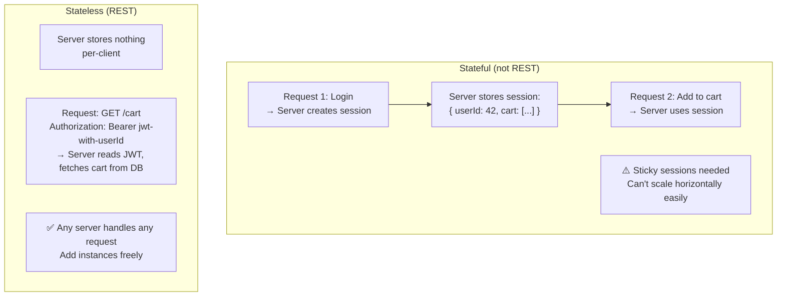
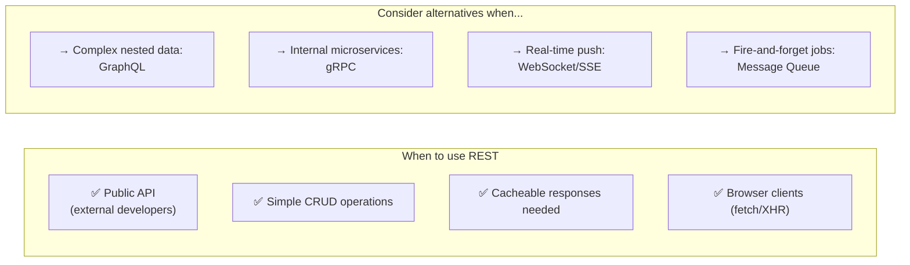

# REST API

REST (Representational State Transfer) is an architectural style for designing networked APIs. It defines a set of constraints — statelessness, resource-orientation, uniform interface — that when followed, produce APIs that are simple, scalable, and interoperable.

> **REST is not a protocol or standard — it's a set of constraints.** An API that uses HTTP but ignores REST constraints (random URLs, verbs in paths, state in the server) is not RESTful. The constraints exist for a reason: each one adds a specific scalability or simplicity property to the system.

---

## REST Constraints — Why Each One Matters

Roy Fielding defined REST in his 2000 PhD dissertation with 6 constraints:

| Constraint            | What It Means                               | System Property It Enables        |
| --------------------- | ------------------------------------------- | --------------------------------- |
| **Client-Server**     | UI and data storage are separated           | Independent evolution             |
| **Stateless**         | No client state stored on the server        | Horizontal scalability            |
| **Cacheable**         | Responses declare cacheability              | Performance, reduced load         |
| **Uniform Interface** | Consistent, predictable API surface         | Simplicity, discoverability       |
| **Layered System**    | Client can't see beyond the immediate layer | Security, scalability (LB, cache) |
| **Code on Demand**    | Server can send executable code (optional)  | Extensibility                     |

**The most important: Statelessness.** Each request must contain all information needed to process it. The server stores no session state between requests.



---

## Resources, Not Actions

REST organizes APIs around **resources** (nouns), not actions (verbs). The HTTP method expresses the action.

**Non-RESTful (RPC-style):**

```
POST /getUser?id=42
POST /createUser
POST /deleteUser?id=42
POST /updateUserEmail
```

**RESTful:**

```
GET    /users/42          # Read user 42
POST   /users             # Create a new user
PUT    /users/42          # Replace user 42 entirely
PATCH  /users/42          # Partial update of user 42
DELETE /users/42          # Delete user 42
```

The resource (`/users/42`) is stable. The verb (HTTP method) changes the operation. This uniformity is what makes REST predictable.

---

## HTTP Methods — Deep Dive

### GET

Retrieve a resource. Must be safe (no side effects) and idempotent (same result every time).

```
GET /orders/789 HTTP/1.1
Host: api.example.com
Authorization: Bearer eyJ...
Accept: application/json
```

**Cacheable by default.** `Cache-Control`, `ETag`, and `Last-Modified` headers control caching behavior.

### POST

Create a new resource. Not idempotent — calling twice creates two resources.

```
POST /orders HTTP/1.1
Content-Type: application/json
Idempotency-Key: 4a8b2c3d-...  ← prevent double-submission

{
  "user_id": 42,
  "items": [{ "sku": "SHOE-42", "qty": 1 }],
  "payment_method_id": "pm_xyz"
}
```

**Response:**

```
HTTP/1.1 201 Created
Location: /orders/1001
Content-Type: application/json

{ "order_id": 1001, "status": "pending" }
```

### PUT vs. PATCH

```
# PUT — replace entire resource (idempotent)
PUT /users/42
{ "name": "Alice Smith", "email": "alice@new.com", "country": "US" }
# All fields required — missing fields are nulled out

# PATCH — partial update (semantically idempotent if well-designed)
PATCH /users/42
{ "email": "alice@new.com" }
# Only the provided fields change
```

**Rule of thumb:** Use PUT for full replacement; PATCH for partial updates. Most real-world APIs lean toward PATCH.

### DELETE

Remove a resource. Idempotent — deleting a non-existent resource should return `404` or `204` (not fail differently each time).

```
DELETE /orders/1001
→ 204 No Content  (success, no body)
→ 404 Not Found   (already deleted or never existed)
```

### HTTP Method Properties

| Method | Safe | Idempotent   | Cacheable |
| ------ | ---- | ------------ | --------- |
| GET    | ✅   | ✅           | ✅        |
| HEAD   | ✅   | ✅           | ✅        |
| POST   | ❌   | ❌           | Rarely    |
| PUT    | ❌   | ✅           | ❌        |
| PATCH  | ❌   | ❌ (usually) | ❌        |
| DELETE | ❌   | ✅           | ❌        |

---

## Status Codes — Use Them Correctly

HTTP status codes communicate machine-readable outcomes. Using them correctly enables clients to handle errors automatically.

### The Families

| Range   | Meaning       | Example                                                                                                                               |
| ------- | ------------- | ------------------------------------------------------------------------------------------------------------------------------------- |
| **1xx** | Informational | `100 Continue`                                                                                                                        |
| **2xx** | Success       | `200 OK`, `201 Created`, `204 No Content`                                                                                             |
| **3xx** | Redirect      | `301 Moved Permanently`, `304 Not Modified`                                                                                           |
| **4xx** | Client error  | `400 Bad Request`, `401 Unauthorized`, `403 Forbidden`, `404 Not Found`, `409 Conflict`, `422 Unprocessable`, `429 Too Many Requests` |
| **5xx** | Server error  | `500 Internal Server Error`, `502 Bad Gateway`, `503 Service Unavailable`                                                             |

### Common Status Code Mistakes

```
# WRONG: Using 200 for everything, errors in body
HTTP/1.1 200 OK
{ "success": false, "error": "User not found" }

# RIGHT: Use the correct status code
HTTP/1.1 404 Not Found
{ "error": "user_not_found", "message": "User 42 does not exist" }
```

```
# WRONG: 401 vs 403 confusion
401 Unauthorized  → Not authenticated (no credentials or invalid token)
403 Forbidden     → Authenticated but not authorized (valid user, wrong permissions)

# Using 401 when credentials are valid but user lacks permission = misleading to clients
```

---

## RESTful URL Design

URLs should be **nouns, lowercase, hyphen-separated, hierarchical**:

```
# Good: Resources are nouns, hierarchy reflects relationships
GET  /users/42/orders              # All orders for user 42
GET  /users/42/orders/1001         # Specific order
POST /users/42/orders              # Create order for user 42
GET  /products?category=shoes&sort=price&limit=20  # Filtering and pagination

# Bad: Verbs in paths, mixed case, underscores
POST /getOrdersByUser
GET  /User_Orders?userId=42
POST /createNewOrder
```

### Nested Resources — How Deep?

```
/users/42/orders/1001/items/3      # 3 levels — acceptable
/users/42/orders/1001/items/3/reviews/99/votes  # Too deep — use separate resource
```

**Rule:** Go no deeper than 2–3 levels. For deeper relationships, use query parameters or separate top-level resources:

```
GET /order-items/3          # Treat as top-level resource
GET /reviews?order_id=1001  # Filter via query param
```

---

## Pagination

Never return unlimited results. Three patterns:

### Offset-Based (Simple)

```
GET /orders?limit=20&offset=40    # Page 3 of results (0-indexed)

Response:
{
  "data": [...],
  "pagination": {
    "total": 1000,
    "limit": 20,
    "offset": 40,
    "next": "/orders?limit=20&offset=60"
  }
}
```

**Pro:** Simple, supports random page access.  
**Con:** Unstable with concurrent inserts (item shifts between pages); slow for large offsets (DB scans then skips).

### Cursor-Based (Production Standard)

```
GET /orders?limit=20&cursor=eyJpZCI6MTAwMX0=  # Opaque cursor (base64-encoded position)

Response:
{
  "data": [...],
  "next_cursor": "eyJpZCI6MTAyMX0=",
  "has_more": true
}
```

**Pro:** Stable (insertions don't affect position), efficient (DB uses index seek, not offset scan).  
**Con:** No random page access; must paginate forward sequentially.

**Used by:** Stripe, Twitter, GitHub, Facebook Graph API.

### Keyset Pagination

Similar to cursor but uses actual column values:

```
GET /orders?after_id=1000&limit=20  # After order ID 1000
```

**Pro:** Human-readable, efficient with index on `id`.  
**Con:** Requires sortable unique key.

---

## HATEOAS — The Ignored Constraint

HATEOAS (Hypermedia As The Engine Of Application State) means responses include links to related actions. Clients discover what they can do next from the response itself.

```json
{
  "order_id": 1001,
  "status": "pending",
  "_links": {
    "self": { "href": "/orders/1001" },
    "cancel": { "href": "/orders/1001/cancel", "method": "POST" },
    "pay": { "href": "/orders/1001/payment", "method": "POST" },
    "items": { "href": "/orders/1001/items" }
  }
}
```

**Reality:** Almost no production API fully implements HATEOAS. It's complex to maintain and clients typically hardcode URLs anyway. The concept is valid for discoverability but rarely worth the overhead in practice. Know it for interviews; don't stress about implementing it.

---

## REST Error Response Design

A consistent, rich error format saves hours of debugging:

```json
{
  "error": {
    "code": "validation_error",
    "message": "Request validation failed",
    "details": [
      {
        "field": "email",
        "code": "invalid_format",
        "message": "Email must be a valid email address"
      },
      {
        "field": "age",
        "code": "out_of_range",
        "message": "Age must be between 0 and 150"
      }
    ],
    "request_id": "req_4xK9mP2..."
  }
}
```

**Always include:**

- Machine-readable error `code` (clients can switch on it)
- Human-readable `message` (for developers)
- Field-level details for validation errors
- `request_id` for tracing in logs

---

## REST vs. Other API Styles



---

## Interview Talking Points

**1. What makes an API truly RESTful?**

> "True REST adheres to Fielding's constraints: statelessness (no server-side session), uniform interface (resources + HTTP verbs), cacheable responses, and client-server separation. The most commonly violated constraint is statelessness — storing session on the server prevents horizontal scaling. In practice, people often say 'REST' to mean 'HTTP + JSON', which misses the constraints that give REST its scalability properties."

**2. PUT vs. PATCH — when do you use each?**

> "PUT is for full replacement — the client sends the complete representation of the resource. Missing fields are nulled or defaulted. PUT is idempotent: sending the same PUT twice produces the same result. PATCH is for partial update — only the provided fields change. For most real-world update operations, PATCH is more practical because clients rarely want to send all fields. I'd use PUT for overwriting entire resources like file uploads."

**3. How do you design pagination for a high-traffic API?**

> "Cursor-based pagination is the production standard. Offset-based (LIMIT/OFFSET) has two problems: it's unstable when records are inserted between pages, and large offsets are slow (the DB still scans rows to skip them). Cursor-based pagination uses an opaque token representing the last seen position — the server decodes it to a WHERE clause on an indexed column, which is an O(log n) index seek regardless of page depth. Stripe, Twitter, and GitHub all use cursor-based pagination."

**4. When would you NOT use REST?**

> "For internal microservice communication where performance matters, I'd use gRPC — Protobuf serialization is 5–10x smaller than JSON, and HTTP/2 multiplexing reduces connection overhead. For complex, nested data queries where clients need different shapes, GraphQL reduces round trips and over-fetching. For real-time bidirectional communication, WebSocket replaces REST because REST requires polling."

---

## Key Takeaways

- REST's power comes from its **constraints** — statelessness is the key to horizontal scalability
- **Resources are nouns; HTTP methods are verbs** — never put actions in URLs
- **Status codes** communicate outcomes — use them correctly; don't return `200 OK` with an error body
- **Cursor-based pagination** is the production standard — offset-based breaks at scale
- **PUT** replaces entirely; **PATCH** updates partially — choose based on the semantics, not familiarity
- Include **`request_id`** in every response and error — essential for distributed tracing
- REST is the right default for public APIs, but gRPC and GraphQL are often better for specific internal use cases
