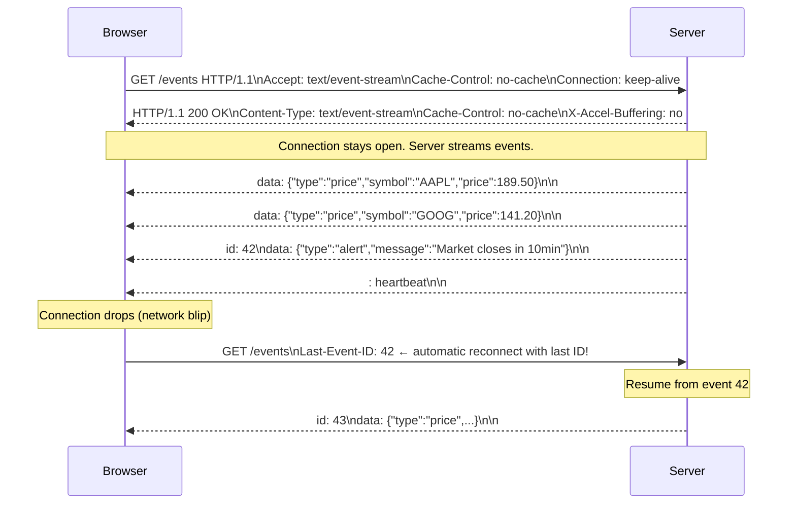
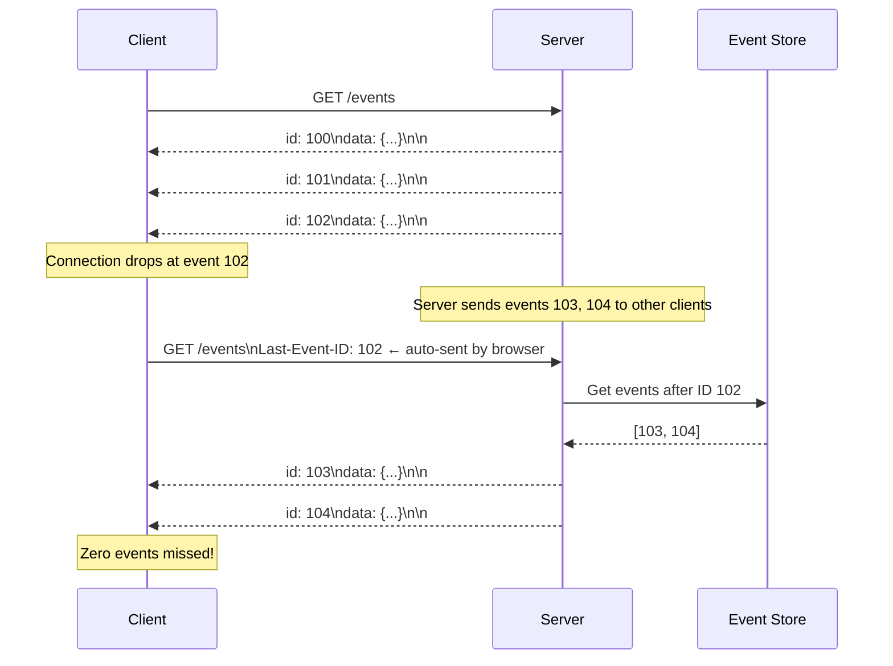
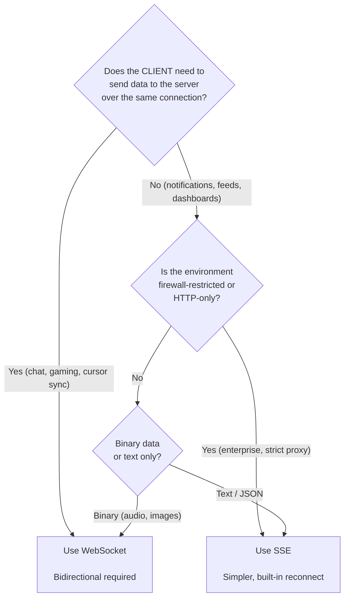

# Server-Sent Events

---

## title: Server-Sent Events

# Server-Sent Events

Server-Sent Events (SSE) is an HTTP-based technology that enables a server to push a stream of events to a client over a single, long-lived HTTP connection. Unlike WebSocket, it's unidirectional — only the server sends; the client receives. Unlike polling, there's no repeated request overhead.

> **SSE is HTTP's native streaming.** It requires no protocol upgrade, no special proxy configuration, no WebSocket handshake. It's just an HTTP response that never ends — events arrive as lines of text, and the browser's `EventSource` API handles reconnection automatically. For server-push-only use cases, SSE is almost always simpler and more correct than WebSocket.

---

## How SSE Works



---

## The SSE Wire Format

SSE uses a simple text-based format over HTTP:

```
# A single event is a block of lines ending with a blank line

# Minimal event (just data):
data: Hello World

                    ← blank line ends the event

# Named event with ID:
id: 42
event: price-update
data: {"symbol":"AAPL","price":189.50}

                    ← blank line ends the event

# Multi-line data (each line prefixed with "data:"):
id: 43
event: article
data: {"title":"Breaking News",
data:  "body":"Lorem ipsum..."}

                    ← blank line ends the event

# Heartbeat / comment (starts with ":"):
: keep-alive

                    ← blank line ends the event

# Retry hint (client reconnect delay):
retry: 3000

                    ← milliseconds between reconnect attempts
```

**Fields:**

- `data:` — The event payload (required)
- `id:` — Event ID; browser remembers last received ID (used for `Last-Event-ID` on reconnect)
- `event:` — Custom event type (default: `"message"`)
- `retry:` — Milliseconds before reconnect on disconnect
- `: comment` — Ignored by client; use for keepalives

---

## Browser EventSource API

```javascript
// Connect to SSE endpoint
const eventSource = new EventSource("/events", {
  withCredentials: true, // Include cookies (for auth)
});

// Listen for generic "message" events
eventSource.onmessage = (event) => {
  const data = JSON.parse(event.data);
  console.log("Received:", data);
};

// Listen for named event types
eventSource.addEventListener("price-update", (event) => {
  const { symbol, price } = JSON.parse(event.data);
  updatePriceTicker(symbol, price);
});

eventSource.addEventListener("alert", (event) => {
  showNotification(JSON.parse(event.data).message);
});

// Handle connection errors
eventSource.onerror = (error) => {
  if (eventSource.readyState === EventSource.CLOSED) {
    // Browser will auto-reconnect with Last-Event-ID header
    console.log("Connection closed, browser will reconnect...");
  }
};

// Clean up when done
function cleanup() {
  eventSource.close();
}
```

**Auto-reconnect is built-in:** If the connection drops, the browser automatically reconnects (with configurable delay via `retry:`) and sends `Last-Event-ID` header so the server can resume the stream from the last delivered event.

---

## Server Implementation

### Node.js / Express

```javascript
app.get("/events", (req, res) => {
  // Required headers
  res.setHeader("Content-Type", "text/event-stream");
  res.setHeader("Cache-Control", "no-cache");
  res.setHeader("Connection", "keep-alive");
  res.setHeader("X-Accel-Buffering", "no"); // Disable NGINX buffering!
  res.flushHeaders(); // Send headers immediately

  const lastEventId = req.headers["last-event-id"];

  // Replay missed events if client reconnects with a Last-Event-ID
  if (lastEventId) {
    const missedEvents = getEventsSince(lastEventId);
    missedEvents.forEach((event) => sendEvent(res, event));
  }

  // Helper to send an event
  function sendEvent(res, { id, type, data }) {
    if (id) res.write(`id: ${id}\n`);
    if (type) res.write(`event: ${type}\n`);
    res.write(`data: ${JSON.stringify(data)}\n\n`);
  }

  // Heartbeat every 30 seconds to prevent proxy timeouts
  const heartbeat = setInterval(() => {
    res.write(": heartbeat\n\n");
  }, 30_000);

  // Subscribe to event source (e.g., Redis Pub/Sub)
  const unsubscribe = eventBus.subscribe(req.user.id, (event) => {
    sendEvent(res, event);
  });

  // Clean up on disconnect
  req.on("close", () => {
    clearInterval(heartbeat);
    unsubscribe();
  });
});
```

### Python / FastAPI

```python
from fastapi import FastAPI, Request
from fastapi.responses import StreamingResponse
import asyncio, json

app = FastAPI()

async def event_stream(request: Request, user_id: str):
    """Generator that yields SSE-formatted events."""
    last_event_id = request.headers.get("last-event-id", "0")
    event_id = int(last_event_id)

    # Replay missed events
    async for missed in get_events_since(user_id, event_id):
        yield f"id: {missed['id']}\ndata: {json.dumps(missed['data'])}\n\n"

    while not await request.is_disconnected():
        event = await get_next_event(user_id)
        if event:
            event_id += 1
            yield f"id: {event_id}\nevent: {event['type']}\ndata: {json.dumps(event['data'])}\n\n"
        else:
            # Heartbeat comment
            yield ": heartbeat\n\n"
            await asyncio.sleep(30)

@app.get("/events")
async def sse_endpoint(request: Request, user_id: str):
    return StreamingResponse(
        event_stream(request, user_id),
        media_type="text/event-stream",
        headers={"Cache-Control": "no-cache", "X-Accel-Buffering": "no"}
    )
```

---

## The Critical Infrastructure Detail: Proxy Buffering

The most common SSE failure in production: **reverse proxies buffer responses**.

NGINX, Apache, and CDNs by default buffer upstream responses before sending to clients. With SSE (a stream that never ends), this means **events never reach the client** — they sit in the buffer forever.

```nginx
# NGINX configuration for SSE endpoints
location /events {
    proxy_pass http://backend;

    # Disable buffering for SSE — CRITICAL
    proxy_buffering off;
    proxy_cache off;

    # Increase timeouts (SSE connections are long-lived)
    proxy_read_timeout 3600s;
    proxy_send_timeout 3600s;

    # Disable GZIP (incompatible with streaming)
    gzip off;
}
```

Or set per-response: `X-Accel-Buffering: no` header (NGINX respects this).

---

## Resumability — The Killer Feature

SSE's `id` field combined with `Last-Event-ID` header makes missed-event recovery automatic:



**Implementation:** Persist events (at minimum for the reconnect window) in an event store (Redis sorted set, database table, Kafka). On reconnect with `Last-Event-ID`, replay from that point.

---

## SSE vs. WebSocket — Decision Guide



| Feature               | SSE                             | WebSocket                   |
| --------------------- | ------------------------------- | --------------------------- |
| **Direction**         | Server → Client only            | Bidirectional               |
| **Protocol**          | HTTP (always)                   | HTTP→WS upgrade             |
| **Auto-reconnect**    | ✅ Built-in                     | ❌ Must implement           |
| **Last-Event-ID**     | ✅ Built-in                     | ❌ Must implement           |
| **Binary support**    | ❌ Text only                    | ✅                          |
| **Firewall friendly** | ✅                              | ⚠️ (port 80/443 usually ok) |
| **Load balancer**     | ✅ Works normally               | ⚠️ Needs sticky sessions    |
| **Browser limit**     | 6 connections/domain (HTTP/1.1) | Unlimited                   |
| **Complexity**        | Low                             | Higher                      |

---

## Real-World SSE Use Cases

**GitHub:** Repository push notifications in the web UI. When someone pushes a commit, the page updates automatically via SSE.

**Twitter/X:** Timeline updates. New tweets appear at the top without page refresh — SSE pushes the new tweet IDs.

**ChatGPT / LLMs:** Token streaming. As the model generates tokens, they're streamed to the client via SSE. Each token is one `data:` event. The browser renders them progressively.

```javascript
// ChatGPT-style token streaming
eventSource.addEventListener("token", (event) => {
  const { token } = JSON.parse(event.data);
  appendToResponse(token);
});

eventSource.addEventListener("done", () => {
  eventSource.close();
});
```

**CI/CD Pipelines (GitHub Actions, Jenkins):** Live build log streaming. Log lines stream as SSE events — you see the build output in real-time without polling.

**Stock Tickers and Dashboards:** Price updates, metric graphs, alert feeds — all push-only, perfect for SSE.

---

## Interview Talking Points

**1. When would you choose SSE over WebSocket?**

> "SSE is the right choice when communication is server-push-only: notifications, live feeds, dashboard updates, AI token streaming. It's pure HTTP — no protocol upgrade, no proxy configuration, built-in auto-reconnect with Last-Event-ID for guaranteed delivery after disconnects. WebSocket is required when the client also needs to send data without the overhead of a new HTTP request — chat, collaborative editing, gaming. If I don't need client-to-server push, SSE is simpler and more reliable."

**2. How does SSE handle reconnections?**

> "Reconnection is automatic and transparent. The browser's EventSource API retries connections after a configurable delay (default 3 seconds, overridable via the `retry:` field). On reconnect, it sends the `Last-Event-ID` header with the ID of the last event it received. The server reads this header and replays all events with IDs greater than the received one — so the client never misses an event. This requires the server to persist events for the reconnect window."

**3. What is the most common SSE failure in production?**

> "Proxy buffering. NGINX, Apache, and CDNs buffer upstream HTTP responses by default. With SSE — a response that never ends — events sit in the buffer and never reach the client. The fix: set `proxy_buffering off` in NGINX config, or include `X-Accel-Buffering: no` in the response headers. Also, proxy timeouts must be extended (`proxy_read_timeout 3600s`) or the proxy will close the connection after the default timeout."

---

## Key Takeaways

- SSE is **pure HTTP** — works through all proxies, CDNs, and firewalls without configuration
- **Unidirectional** (server → client only) — choose WebSocket if clients need to send data on the same connection
- **Auto-reconnect with Last-Event-ID** — built into the browser `EventSource` API; no custom reconnect logic needed
- The wire format is **simple text** — `data:`, `id:`, `event:`, `retry:` fields with blank-line separators
- **Disable proxy buffering** (`proxy_buffering off` or `X-Accel-Buffering: no`) — the most common production failure
- Add **heartbeat comments** (`: heartbeat`) every 30 seconds to prevent proxy timeout disconnections
- **Perfect for:** AI token streaming, live logs, stock tickers, notification feeds, dashboard updates, CI/CD build output
