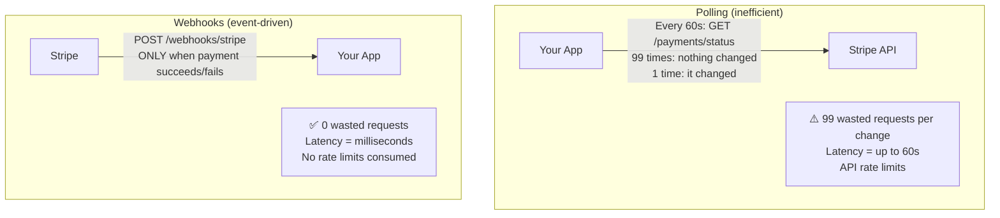
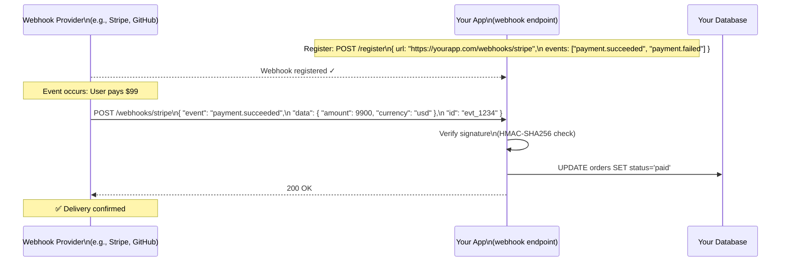
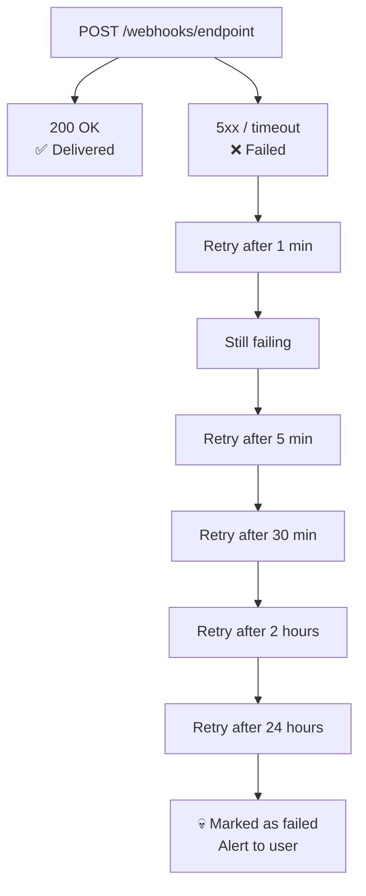
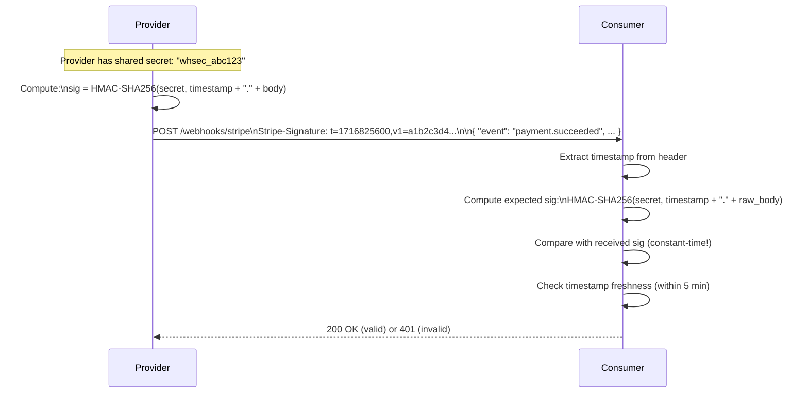
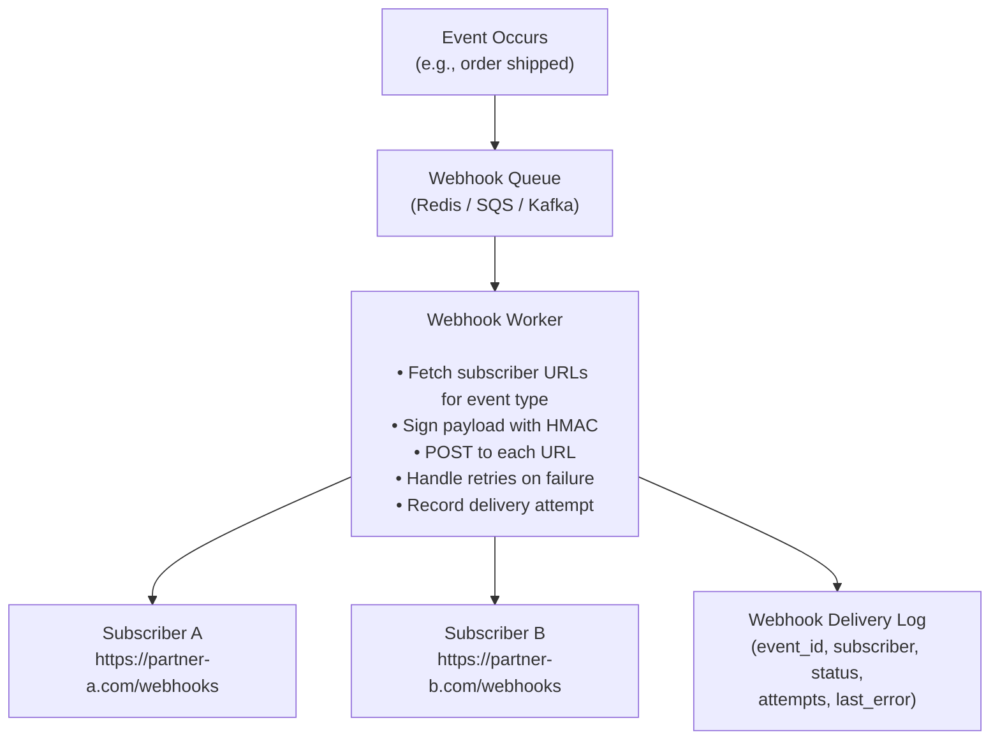

# Webhooks

A webhook is a user-defined HTTP callback — when an event occurs in System A, System A makes an HTTP POST request to a URL registered by System B, delivering event data as the payload. Webhooks are the backbone of event-driven integrations between systems that don't share a common message bus.

> **Webhooks invert the polling model.** Instead of your system asking "did anything change?" every few seconds, the source system tells you "something changed" the moment it happens. This is sometimes called a "reverse API" — the consumer exposes an endpoint, and the provider calls it.

---

## The Polling Problem Webhooks Solve



---

## How Webhooks Work



---

## Webhook Delivery Semantics

Webhooks are delivered over unreliable networks. Production webhook systems must handle delivery failures:

### Retry Logic



**Stripe retries:** Up to 8 times over 3 days with exponential backoff. GitHub retries 3 times over 15 minutes.

**At-least-once delivery:** Providers typically guarantee at-least-once delivery — your endpoint may receive the same event more than once. You must handle duplicates idempotently.

---

## Security — The Non-Negotiable Part

Webhooks are HTTP endpoints open to the internet. Any attacker can POST to them. You **must** verify the origin.

### HMAC Signature Verification



**Implementation:**

```python
import hmac, hashlib, time

def verify_stripe_webhook(payload: bytes, sig_header: str, secret: str) -> bool:
    # Parse: "t=1716825600,v1=abc123...,v1=xyz..." (multiple v1 for key rotation)
    parts = dict(item.split("=", 1) for item in sig_header.split(","))
    timestamp = parts["t"]
    received_sig = parts["v1"]

    # Reject old webhooks (replay attack prevention)
    age = abs(time.time() - int(timestamp))
    if age > 300:  # 5 minute tolerance
        raise ValueError("Webhook timestamp too old (possible replay attack)")

    # Recompute signature
    signed_payload = f"{timestamp}.{payload.decode()}"
    expected_sig = hmac.new(
        secret.encode(),
        signed_payload.encode(),
        hashlib.sha256
    ).hexdigest()

    # Constant-time comparison (prevents timing attacks)
    return hmac.compare_digest(expected_sig, received_sig)
```

**Critical:**

- Use **constant-time string comparison** (`hmac.compare_digest`) — not `==` — to prevent timing attacks
- Check **timestamp freshness** — prevents replay attacks where an attacker records and resends a valid webhook
- Verify against the **raw bytes** — not parsed JSON (JSON serialization order may differ)

---

## Idempotent Webhook Processing

Because webhooks are at-least-once, your handler must be idempotent:

```python
@app.post("/webhooks/stripe")
async def stripe_webhook(request: Request):
    payload = await request.body()
    sig = request.headers.get("Stripe-Signature")

    # 1. Verify signature first — reject if invalid
    if not verify_stripe_webhook(payload, sig, STRIPE_WEBHOOK_SECRET):
        raise HTTPException(status_code=401, detail="Invalid signature")

    event = json.loads(payload)
    event_id = event["id"]

    # 2. Check idempotency — have we processed this event before?
    if await redis.exists(f"webhook:processed:{event_id}"):
        return {"status": "already_processed"}  # Return 200, not error

    # 3. Process the event
    if event["type"] == "payment_intent.succeeded":
        payment = event["data"]["object"]
        await fulfill_order(payment["metadata"]["order_id"])

    # 4. Mark as processed (TTL = 7 days, matching provider's retry window)
    await redis.setex(f"webhook:processed:{event_id}", 7 * 24 * 3600, "1")

    return {"status": "ok"}
```

**Return 200 quickly.** If processing takes time, acknowledge immediately and process asynchronously:

```python
@app.post("/webhooks/stripe")
async def stripe_webhook(request: Request):
    # Verify signature synchronously
    verify_or_raise(...)

    event = await request.json()

    # Enqueue for async processing — respond immediately
    await queue.enqueue("process_webhook", event)

    return {"status": "queued"}  # 200 in < 100ms
```

---

## Building Your Own Webhook System (As a Provider)

If you're building a platform that other systems integrate with, you need to provide webhooks:



### Webhook Registration Model

```sql
CREATE TABLE webhook_subscriptions (
    id          UUID PRIMARY KEY,
    user_id     UUID NOT NULL,
    url         TEXT NOT NULL,
    secret      TEXT NOT NULL,    -- Generated per-subscription for signing
    events      TEXT[] NOT NULL,  -- e.g., ['order.shipped', 'payment.failed']
    is_active   BOOLEAN DEFAULT true,
    created_at  TIMESTAMPTZ DEFAULT NOW()
);

CREATE TABLE webhook_deliveries (
    id              UUID PRIMARY KEY,
    subscription_id UUID REFERENCES webhook_subscriptions,
    event_id        TEXT NOT NULL,
    event_type      TEXT NOT NULL,
    payload         JSONB NOT NULL,
    status          TEXT,   -- 'pending', 'delivered', 'failed'
    attempts        INT DEFAULT 0,
    next_retry_at   TIMESTAMPTZ,
    last_response   TEXT,
    delivered_at    TIMESTAMPTZ
);
```

### Delivery Dashboard for Users

Good webhook systems expose a delivery log UI:

- Every event with its payload
- Each delivery attempt (timestamp, HTTP status, response body, latency)
- "Retry" button for manually retrying failed deliveries
- Subscription management (add/remove/pause URLs, change event filters)

---

## Webhook Challenges and Solutions

| Challenge                       | Solution                                        |
| ------------------------------- | ----------------------------------------------- |
| **Endpoint is down**            | Exponential backoff retry queue                 |
| **Duplicate delivery**          | Idempotency key (event ID) stored in cache      |
| **Slow processing**             | Acknowledge immediately (200) + async queue     |
| **Fake/forged requests**        | HMAC signature verification                     |
| **Replay attacks**              | Timestamp freshness check (±5 minutes)          |
| **Fan-out to many subscribers** | Async worker pool per subscription              |
| **Debugging delivery failures** | Webhook delivery log with full request/response |
| **Secret rotation**             | Support multiple active secrets simultaneously  |

---

## Webhooks vs. Polling vs. Message Queues

| Dimension                    | Polling             | Webhooks                   | Message Queue            |
| ---------------------------- | ------------------- | -------------------------- | ------------------------ |
| **Direction**                | Consumer pulls      | Provider pushes            | Producer pushes to queue |
| **Latency**                  | Up to poll interval | Near-real-time             | Near-real-time           |
| **Wasted requests**          | High (99%+ empty)   | None                       | None                     |
| **Consumer uptime required** | No                  | Yes (must be reachable)    | No (queue buffers)       |
| **Ordering**                 | Depends on API      | Not guaranteed             | Depends on queue         |
| **Coupling**                 | Loose               | Tight (provider knows URL) | Loose                    |
| **Cross-org delivery**       | ✅                  | ✅                         | ❌ (internal only)       |
| **Retry on failure**         | Consumer controls   | Provider retries           | Queue retries            |

**When webhooks are better than a message queue:** When integrating with external organizations (Stripe, GitHub, Shopify, Twilio) — you can't share a Kafka cluster with them. Webhooks are the internet's event notification protocol.

---

## Real-World Webhook Examples

**Stripe:** `payment_intent.succeeded`, `invoice.payment_failed`, `customer.subscription.deleted`. The gold standard for webhook UX — beautiful delivery logs, retry UI, detailed error messages.

**GitHub:** `push`, `pull_request`, `issues`, `release` — powers CI/CD systems (GitHub Actions, Jenkins, CircleCI all listen for push webhooks to trigger builds).

**Shopify:** `orders/create`, `products/update` — third-party apps (inventory systems, CRMs, analytics) react to storefront events.

**Twilio:** `message.received`, `call.completed` — SMS and voice event notifications.

**Slack:** Incoming webhooks (you POST to Slack's URL to send a message), Outgoing webhooks (Slack POSTs to your URL when a keyword is mentioned).

---

## Interview Talking Points

**1. How do you secure a webhook endpoint?**

> "HMAC signature verification. The provider shares a secret when you register. Each webhook delivery is signed: the provider computes HMAC-SHA256 of the raw request body (plus a timestamp) using the secret and includes it in a header. My endpoint recomputes the signature and compares — using `hmac.compare_digest` for constant-time comparison to prevent timing attacks. I also check timestamp freshness (±5 minutes) to prevent replay attacks where an attacker records and re-sends a valid webhook later."

**2. How do you make webhook processing idempotent?**

> "Each webhook event has a unique ID (like Stripe's `evt_1234`). Before processing, I check Redis (or the database) for `webhook:processed:{event_id}`. If found, return 200 immediately — the event was already processed, no action needed. If not found, process the event and store the ID with a TTL matching the provider's retry window (typically 7 days). This handles the at-least-once delivery guarantee without double-processing."

**3. What happens if your webhook endpoint is slow or times out?**

> "The provider marks the delivery as failed and retries (usually with exponential backoff). To avoid this, my webhook handler acknowledges immediately with 200 OK (within 5 seconds) and enqueues the event for async processing. The actual business logic (fulfilling an order, sending email) happens asynchronously. This decouples the webhook acknowledgment from processing time and prevents timeouts."

**4. When would you use webhooks vs. polling vs. a message queue?**

> "Webhooks for cross-organizational event delivery — you can't share infrastructure with Stripe or GitHub. Polling when webhooks aren't available or when you need to control the polling rate and timing. Message queues (Kafka, SQS) for internal service communication — they offer stronger guarantees (exactly-once, ordering, replay), but both services must connect to the same infrastructure. For external integrations, webhooks are the standard."

---

## Key Takeaways

- Webhooks **invert the polling model** — the provider calls you when something happens, eliminating wasted requests
- **HMAC signature verification** is mandatory — validate every incoming webhook before processing
- **Idempotency is required** — providers deliver at-least-once; store processed event IDs to prevent double-processing
- **Acknowledge immediately, process asynchronously** — return 200 within seconds; enqueue for background processing
- When **building a webhook provider**, implement: retry queue, delivery log, HMAC signing, per-subscription secrets
- **Webhooks are for cross-org integration** — use message queues (Kafka, SQS) for internal service communication
- Every webhook system should expose a **delivery dashboard** — delivery logs and manual retry are essential for debugging
