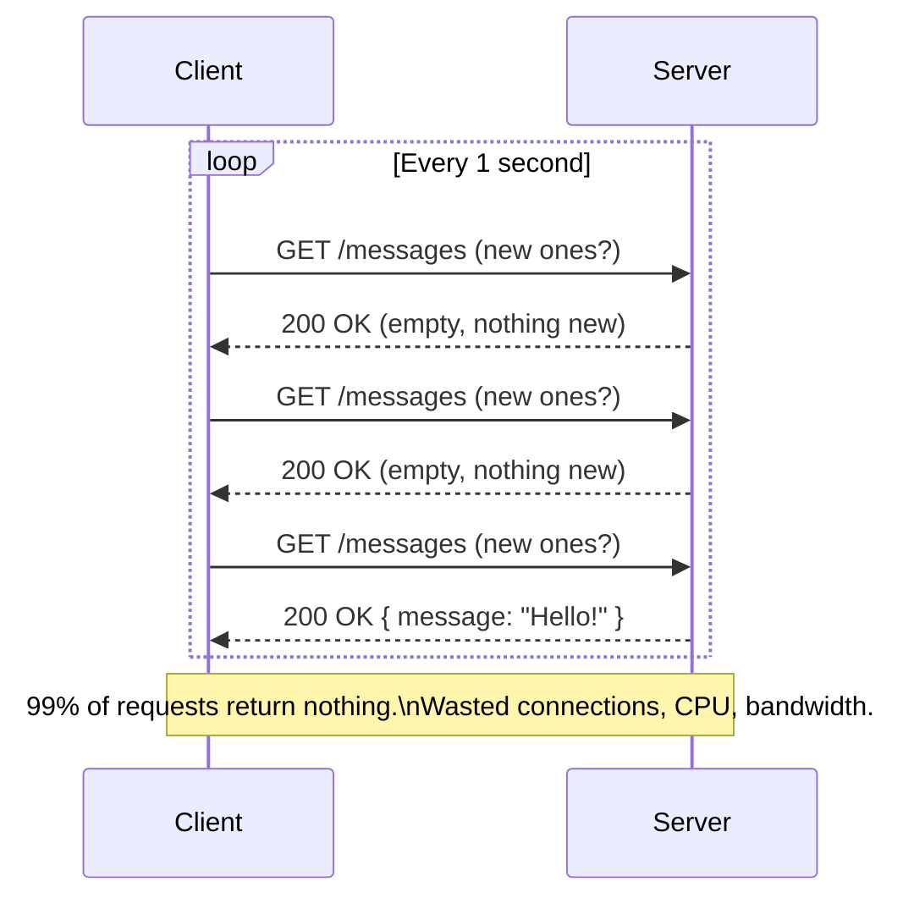
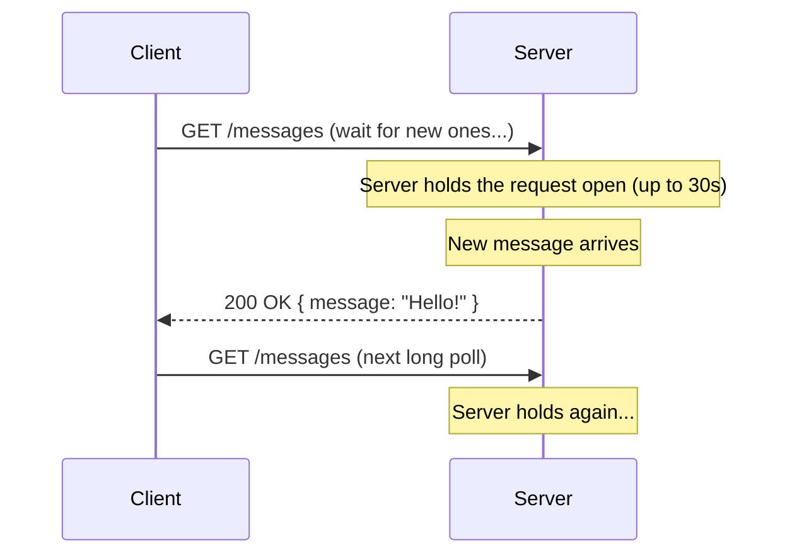
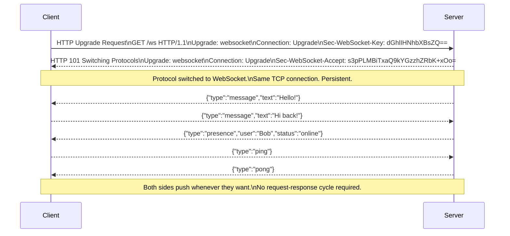
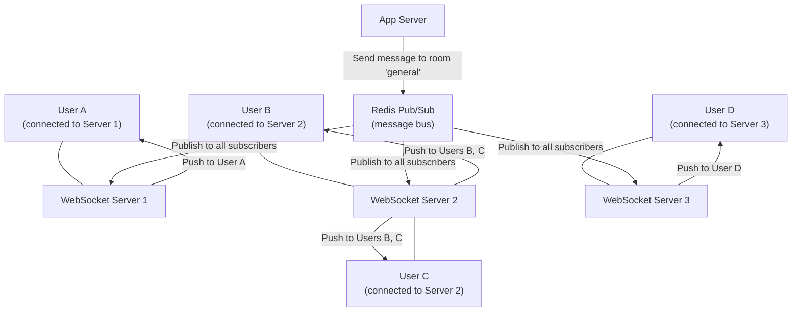
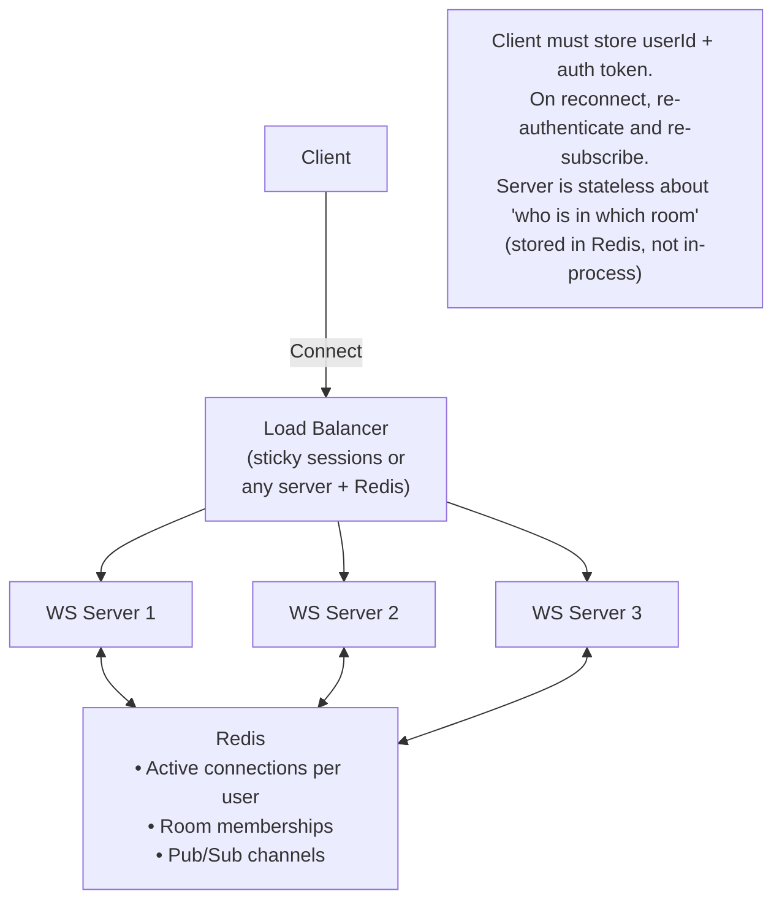

# WebSockets

WebSocket is a communication protocol that provides a **persistent, full-duplex channel** over a single TCP connection. Unlike HTTP's request-response model, WebSocket keeps the connection open — both client and server can send messages at any time, independently of each other.

> **Why WebSocket exists:** HTTP was designed for documents — the client asks, the server answers, the connection closes. Real-time applications (chat, gaming, trading, collaboration) need the server to push data instantly when something changes, not wait for the client to ask again. WebSocket solves this without the overhead of constant HTTP polling.

---

## HTTP Polling vs. WebSocket

The evolution of real-time communication:

### Short Polling (Naive)



### Long Polling (Better)



Better but still expensive — each poll creates a full HTTP connection, and long-held connections consume server resources.

### WebSocket (Optimal)



---

## The WebSocket Handshake

WebSocket begins as a standard HTTP/1.1 request and upgrades the protocol:

```
# Client → Server (HTTP Upgrade Request)
GET /chat HTTP/1.1
Host: chat.example.com
Upgrade: websocket
Connection: Upgrade
Sec-WebSocket-Key: dGhlIHNhbXBsZQ==   ← Random base64, prevents caching
Sec-WebSocket-Version: 13

# Server → Client (101 Switching Protocols)
HTTP/1.1 101 Switching Protocols
Upgrade: websocket
Connection: Upgrade
Sec-WebSocket-Accept: s3pPLMBiTxaQ9kYGzzhZRbK+xOo=   ← SHA-1(key + magic UUID)
```

After the `101` response:

- The TCP connection stays open
- Both sides speak the **WebSocket frame protocol** (not HTTP)
- Either side can send **frames** (text, binary, ping, pong, close) at any time

**WebSocket frame overhead:** 2–10 bytes per frame header (vs. hundreds of bytes for HTTP headers). Extremely efficient for many small messages.

---

## WebSocket Frame Types

| Frame Type       | Opcode | Purpose                                    |
| ---------------- | ------ | ------------------------------------------ |
| **Text**         | 0x1    | UTF-8 text payload (JSON messages)         |
| **Binary**       | 0x2    | Binary payload (images, Protobuf, audio)   |
| **Ping**         | 0x9    | Heartbeat from either side                 |
| **Pong**         | 0xA    | Response to ping (keepalive)               |
| **Close**        | 0x8    | Graceful connection close with status code |
| **Continuation** | 0x0    | Fragment of a previous frame               |

---

## Message Protocol Design

The WebSocket protocol is a raw channel — it carries bytes, not messages with semantics. You must design your own message protocol on top:

```json
// Envelope pattern — every message has a type
{
  "type": "chat.message",
  "payload": {
    "room_id": "room-general",
    "text": "Hello everyone!",
    "user": { "id": "usr_42", "name": "Alice" }
  },
  "id": "msg-abc123",
  "timestamp": "2024-01-15T10:30:00Z"
}

// Server → Client: new message broadcast
{ "type": "chat.message.new", "payload": { ... } }

// Server → Client: typing indicator
{ "type": "chat.typing", "payload": { "user_id": "usr_99", "room_id": "room-general" } }

// Server → Client: presence update
{ "type": "presence.update", "payload": { "user_id": "usr_42", "status": "away" } }

// Client → Server: join a room
{ "type": "room.join", "payload": { "room_id": "room-general" } }
```

**Libraries that implement message protocols on top of WebSocket:**

- **Socket.IO:** Adds rooms, namespaces, auto-reconnect, fallback to polling
- **STOMP:** Simple text protocol for publish/subscribe over WebSocket
- **GraphQL subscriptions:** GraphQL's streaming over WebSocket

---

## Scaling WebSocket Servers

The hardest part of WebSocket at scale: connections are **stateful and sticky**. User A's connection lives on Server 1 — only Server 1 can push to User A.

### The Fan-Out Problem



**Pattern:** Each WebSocket server subscribes to Redis Pub/Sub channels matching the rooms/topics it serves. When a message is published, every server receives it and pushes to connected clients in that room.

**Real-world implementations:**

- Slack uses this pattern with their custom message bus
- Discord used this before migrating to Elixir's process model (Erlang VM handles millions of lightweight processes = persistent connections)

### Connection State Management



---

## Handling Disconnections and Reconnect

Networks are unreliable. Clients must implement reconnect logic:

```javascript
// Client-side auto-reconnect with exponential backoff
class ReconnectingWebSocket {
  constructor(url) {
    this.url = url;
    this.retryDelay = 1000; // Start: 1 second
    this.maxRetryDelay = 30000; // Cap: 30 seconds
    this.connect();
  }

  connect() {
    this.ws = new WebSocket(this.url);

    this.ws.onopen = () => {
      this.retryDelay = 1000; // Reset on successful connect
      this.onOpen?.();
      this.resubscribe(); // Re-join rooms after reconnect
    };

    this.ws.onmessage = (event) => this.onMessage?.(JSON.parse(event.data));

    this.ws.onclose = (event) => {
      if (!event.wasClean) {
        // Abnormal close — reconnect with exponential backoff + jitter
        const jitter = Math.random() * 1000;
        setTimeout(() => this.connect(), this.retryDelay + jitter);
        this.retryDelay = Math.min(this.retryDelay * 2, this.maxRetryDelay);
      }
    };
  }

  resubscribe() {
    // Re-join rooms after reconnect (server doesn't remember)
    this.rooms.forEach((room) =>
      this.send({ type: "room.join", payload: { room_id: room } }),
    );
  }
}
```

**Server-side:** Track `lastSeen` per user. On disconnect + reconnect, send all messages the client missed (using a `since_timestamp` or sequence number).

---

## WebSocket vs. SSE vs. Long Polling

| Feature               | WebSocket                  | Server-Sent Events   | Long Polling         |
| --------------------- | -------------------------- | -------------------- | -------------------- |
| **Direction**         | Bidirectional              | Server → Client only | Server → Client      |
| **Protocol**          | WS (over TCP)              | HTTP                 | HTTP                 |
| **Browser support**   | All modern browsers        | All modern browsers  | All browsers         |
| **Connection**        | Persistent (TCP)           | Persistent (HTTP)    | Reconnects each time |
| **Overhead**          | 2–10 bytes/frame           | ~300 bytes/reconnect | ~300 bytes/request   |
| **Firewall friendly** | Sometimes blocked          | ✅ (pure HTTP)       | ✅                   |
| **Auto-reconnect**    | Manual (client implements) | Built-in             | Manual               |
| **Binary data**       | ✅ Native                  | ❌ (text only)       | ❌                   |
| **Best for**          | Real-time bidirectional    | Server push only     | Simpler, firewalled  |

---

## Real-World WebSocket Use Cases

**Slack:** Every message, typing indicator, reaction, and presence update flows through WebSocket. Their architecture uses Vibes (their internal message bus) + Nginx for WebSocket termination.

**Discord:** Runs on Elixir + Erlang VM. Each WebSocket connection is a lightweight Erlang process. Discord serves 7+ million concurrent WebSocket connections.

**Figma:** Real-time collaborative editing. Operational transforms over WebSocket keep all users' cursors and edits in sync.

**Trading Platforms (Bloomberg, Robinhood):** Real-time price feeds. A new tick must reach all subscribed clients in milliseconds — WebSocket is the only viable protocol.

**Online Gaming:** Player position updates, game state changes, chat — all over WebSocket for latency as low as possible.

---

## Interview Talking Points

**1. When would you use WebSocket over SSE or long polling?**

> "WebSocket is required when the communication is genuinely bidirectional — client and server both send data independently. Chat, multiplayer games, collaborative editors — these need client-to-server messages as well as server-to-client. If I only need the server to push data to the client (live scores, notifications, progress updates), SSE is simpler — it's just HTTP, auto-reconnects, and works through firewalls that block WebSocket upgrades."

**2. How do you scale WebSocket servers when connections are stateful?**

> "WebSocket connections are sticky — User A's connection lives on Server 1. To scale, I use Redis Pub/Sub as the message bus. Each WebSocket server subscribes to channels for its connected clients. When a message needs to reach a user, any server publishes to Redis, which broadcasts to all WebSocket servers, and the server holding that user's connection delivers it. The load balancer uses consistent hashing or sticky sessions so reconnects hit the same server where possible."

**3. What happens when a WebSocket client disconnects and reconnects?**

> "The server detects disconnect via the TCP RST or by missing pings (heartbeat timeout). It marks the user offline in Redis. When the client reconnects (with exponential backoff), it re-authenticates and re-subscribes to rooms. The server delivers any missed messages since the last received sequence number. The client must store a sequence number to enable this. Building robust reconnect logic is one of the hardest parts of WebSocket systems in production."

---

## Key Takeaways

- WebSocket provides **full-duplex, persistent** communication — both sides send at any time without request-response overhead
- The **handshake is HTTP** (101 Switching Protocols) — then the protocol switches to WebSocket frames
- **Frame overhead** is 2–10 bytes vs. hundreds of bytes for HTTP headers — extremely efficient for many small messages
- **Scaling is the hard part** — connections are stateful; use **Redis Pub/Sub** for fan-out across server instances
- Design a **message envelope** (`type` + `payload`) on top of raw WebSocket — the protocol carries bytes, not semantics
- Implement **exponential backoff with jitter** for client reconnect — and re-subscribe to rooms after reconnect
- **Use SSE instead** for server-push-only use cases — simpler, HTTP-native, auto-reconnects, firewall-friendly
