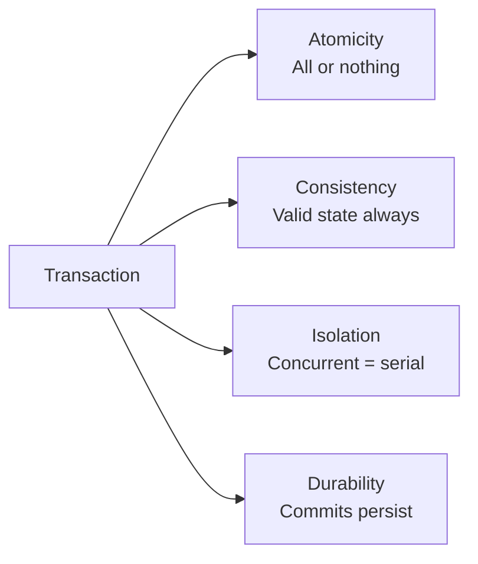
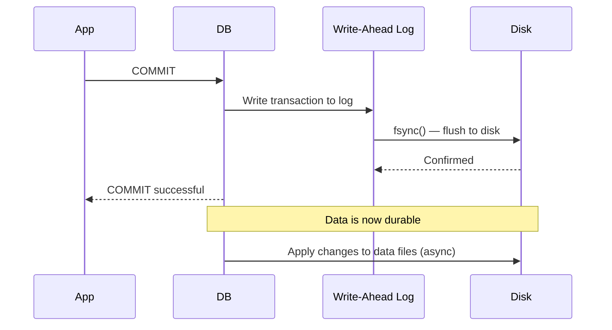
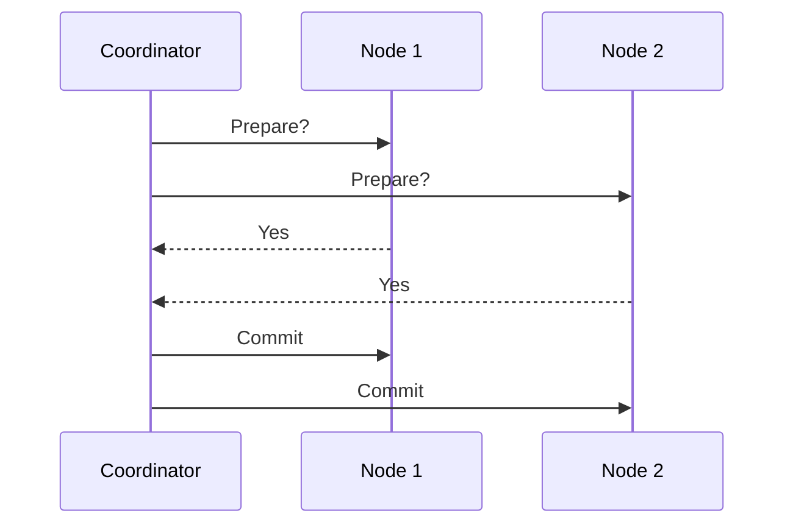

# ACID Properties

ACID is the set of properties that guarantee database transactions are processed reliably. Every time you transfer money, place an order, or update a record, ACID properties are what stand between correct behavior and data corruption.

> **ACID isn't just theory — it's the difference between a bank you can trust and one that randomly loses your money.**

---

## The Four Properties



---

## Atomicity

**"All or nothing."** A transaction either fully completes or fully rolls back. There is no partial state.

```sql
-- Transfer $100 from Alice to Bob
BEGIN;
  UPDATE accounts SET balance = balance - 100 WHERE user = 'Alice';
  UPDATE accounts SET balance = balance + 100 WHERE user = 'Bob';
COMMIT;
```

If the server crashes after deducting from Alice but before crediting Bob — **the entire transaction rolls back**. Alice keeps her $100. Bob gets nothing. No money disappears.

**How it's implemented:** Write-ahead logging (WAL). Changes are written to a log first. On crash recovery, incomplete transactions are rolled back.

---

## Consistency

**"Transactions move the database from one valid state to another."** Constraints, rules, and invariants are never violated.

Consistency is partially the database's job (constraints, foreign keys, triggers) and partially the application's job (business rules).

```sql
-- This will fail — consistency preserved
INSERT INTO orders (user_id, product_id)
VALUES (999, 1);  -- user_id 999 doesn't exist
-- ERROR: foreign key violation
```

> **Important:** The "C" in ACID is different from the "C" in CAP theorem. ACID consistency is about data integrity rules. CAP consistency is about distributed nodes seeing the same data.

**Database-enforced consistency:**

- Primary keys (uniqueness)
- Foreign key constraints
- NOT NULL constraints
- CHECK constraints
- Triggers

---

## Isolation

**"Concurrent transactions execute as if they were serial."** Transactions don't interfere with each other.

Isolation is the most complex ACID property. It's a spectrum — more isolation = more safety but less performance.

### Isolation Levels (weakest → strongest)

| Level                | Dirty Read   | Non-Repeatable Read | Phantom Read | Performance |
| -------------------- | ------------ | ------------------- | ------------ | ----------- |
| **Read Uncommitted** | ✅ possible  | ✅ possible         | ✅ possible  | Fastest     |
| **Read Committed**   | ❌ prevented | ✅ possible         | ✅ possible  | Fast        |
| **Repeatable Read**  | ❌ prevented | ❌ prevented        | ✅ possible  | Moderate    |
| **Serializable**     | ❌ prevented | ❌ prevented        | ❌ prevented | Slowest     |

### The Three Anomalies

**Dirty Read** — reading uncommitted data from another transaction

```
T1: UPDATE balance = 0  (not committed yet)
T2: READ balance → 0    (dirty read!)
T1: ROLLBACK
T2 saw data that never existed
```

**Non-Repeatable Read** — same row returns different values within one transaction

```
T1: READ balance → 100
T2: UPDATE balance = 50, COMMIT
T1: READ balance → 50  (different value!)
```

**Phantom Read** — same query returns different rows within one transaction

```
T1: SELECT * WHERE age > 30 → 5 rows
T2: INSERT new user age=35, COMMIT
T1: SELECT * WHERE age > 30 → 6 rows  (phantom row!)
```

### What PostgreSQL and MySQL Use

| Database       | Default isolation level |
| -------------- | ----------------------- |
| PostgreSQL     | Read Committed          |
| MySQL (InnoDB) | Repeatable Read         |
| Oracle         | Read Committed          |
| SQL Server     | Read Committed          |

Most production systems run **Read Committed** — prevents dirty reads while maintaining good performance.

---

## Durability

**"Committed transactions survive permanently — even system crashes.**"

Once you see `COMMIT` succeed, the data is safe. Crashes, power failures, OS panics — none of them can erase it.

**How it's implemented:**



**The WAL guarantee:** The write-ahead log is written and fsynced before COMMIT returns. Even if the server crashes immediately after, the log exists on disk and will be replayed on restart.

---

## ACID in Distributed Systems

ACID is straightforward for a single database. Distributed ACID is hard:

| Challenge               | Problem                                     | Solution                  |
| ----------------------- | ------------------------------------------- | ------------------------- |
| Distributed atomicity   | Crash after commit on node A, before node B | 2-Phase Commit (2PC)      |
| Distributed isolation   | Concurrent writes across shards             | Distributed locking, MVCC |
| Distributed consistency | Replication lag                             | Synchronous replication   |

**2-Phase Commit (2PC):**



2PC has a fatal flaw: if the coordinator crashes after sending "Prepare" but before "Commit," nodes are stuck waiting forever. This is why distributed transactions are avoided when possible.

---

## ACID vs. BASE

ACID and BASE represent opposite ends of the consistency spectrum:

|                  | ACID                     | BASE                |
| ---------------- | ------------------------ | ------------------- |
| **Consistency**  | Strong, immediate        | Eventual            |
| **Availability** | May sacrifice            | Always available    |
| **Use case**     | Financial, transactional | Social, analytics   |
| **Examples**     | PostgreSQL, MySQL        | Cassandra, DynamoDB |
| **Scalability**  | Harder to scale          | Scales easily       |

---

## Key Takeaways

- **Atomicity** prevents partial writes — either everything happens or nothing does
- **Consistency** enforces database invariants — constraints and rules are never violated
- **Isolation** controls how concurrent transactions interact — more isolation = safer but slower
- **Durability** guarantees committed data survives crashes via write-ahead logging
- Distributed ACID requires 2PC or similar protocols — which introduce latency and new failure modes, which is why most large-scale systems avoid cross-shard transactions
