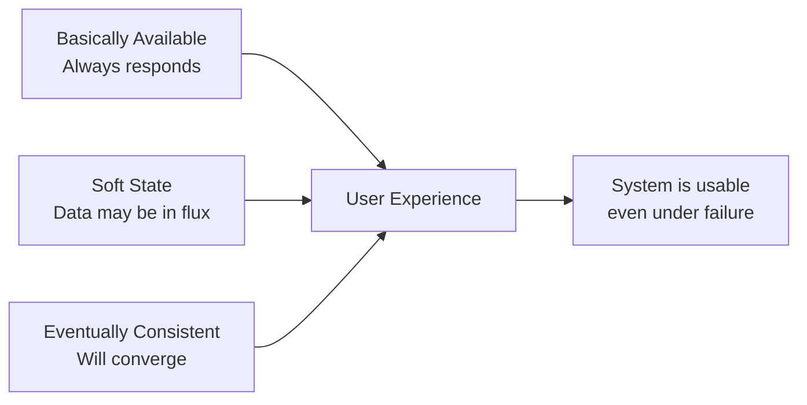
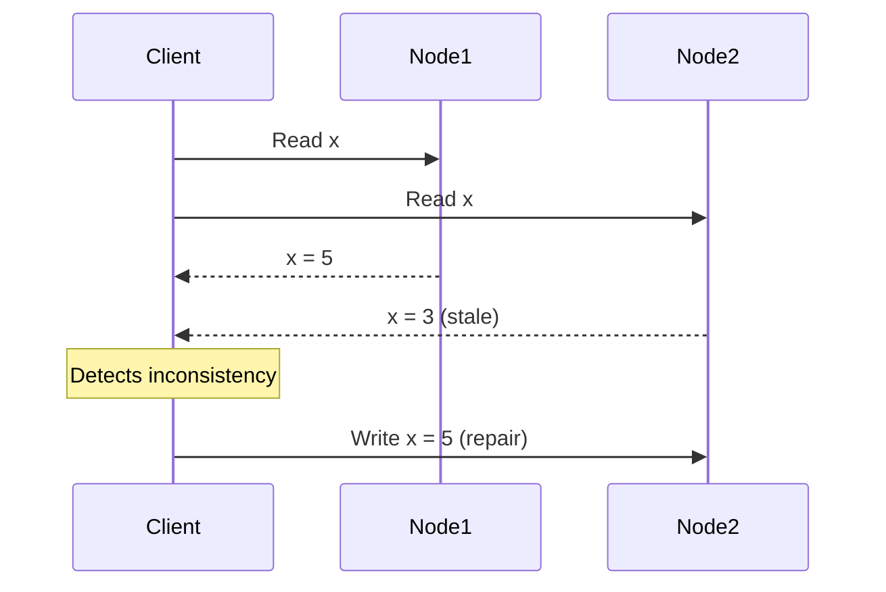
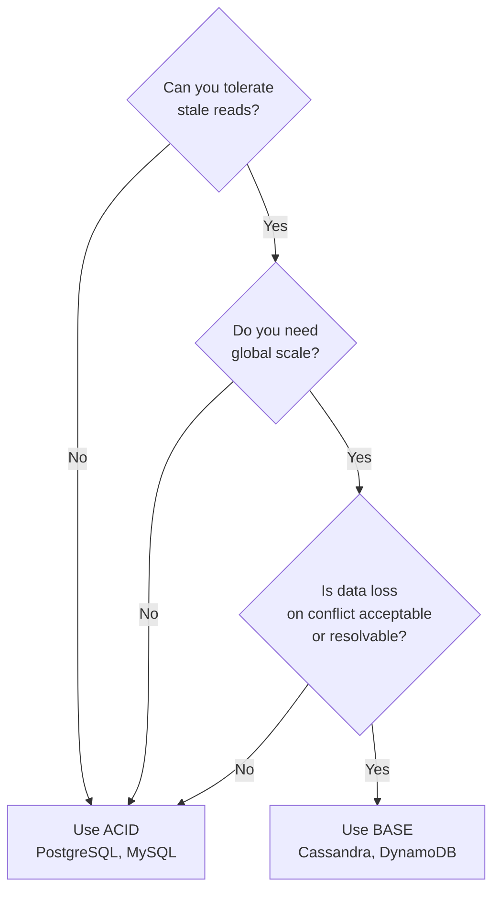

# BASE Properties

BASE is the alternative to ACID for distributed systems that prioritize availability and scale over strict consistency. It's not a compromise — it's a deliberate design choice made by companies like Amazon, Netflix, and Facebook to serve billions of users.

> **"BASE is essentially the opposite of ACID."** — Dan Pritchett, Amazon (2008)

---

## What BASE Stands For

| Letter | Property              | Meaning                                                                             |
| ------ | --------------------- | ----------------------------------------------------------------------------------- |
| **BA** | Basically Available   | The system guarantees availability — it always responds, even if the data is stale  |
| **S**  | Soft State            | The system state may change over time, even without new inputs (due to replication) |
| **E**  | Eventually Consistent | The system will become consistent over time, given no new updates                   |



---

## Basically Available

The system responds to every request — but the response might not reflect the most recent write.

**Real-world example — Amazon shopping cart:**
When Amazon's cart service has a partition, you can still add items. The system accepts writes from multiple replicas. When the partition heals, conflicts are resolved (usually by merging). Occasionally you might see an item appear in your cart that you thought you removed — that's BASE in action.

> Amazon's engineering team explicitly chose this behavior. The cost of losing a sale (cart unavailable) outweighed the cost of a slightly inconsistent cart that needed conflict resolution.

**What "basically available" looks like:**

```
Request  → Available replica responds
Partition → Still responds (with stale data if needed)
Node down → Other nodes absorb the traffic
Peak load → Degrades gracefully, never fully unavailable
```

---

## Soft State

The system's state is not guaranteed to be consistent at any point in time — it's "soft" because it can change without any external input.

This happens because:

- Replicas are being updated asynchronously
- A write on Node A hasn't propagated to Node B yet
- TTL-based caches are expiring entries

**Contrast with ACID hard state:**

```
ACID (hard state):
  Write commits → immediately consistent everywhere
  State is always deterministic

BASE (soft state):
  Write commits on one node → propagates asynchronously
  State is in flux during propagation window
```

Soft state requires that your application handles temporary inconsistencies gracefully — you can't assume that what you wrote is immediately visible to all readers.

---

## Eventually Consistent

Given no new updates, all replicas will converge to the same value — eventually.

**The key questions to always ask:**

1. _How long is "eventually"?_ — usually milliseconds to seconds; rarely minutes
2. _What happens during the inconsistency window?_ — depends on the system
3. _How are conflicts resolved?_ — last-write-wins, vector clocks, CRDTs

### Conflict Resolution Strategies

| Strategy                    | How it works                             | Risk                           |
| --------------------------- | ---------------------------------------- | ------------------------------ |
| **Last-Write-Wins (LWW)**   | Highest timestamp wins                   | Clock skew can lose data       |
| **Vector clocks**           | Track causality between versions         | Complex to implement           |
| **CRDTs**                   | Data structures that merge automatically | Limited to specific data types |
| **Application-level merge** | App decides how to reconcile             | Flexible but requires dev work |

**Example — Cassandra LWW:**

```
Node A: SET user.name = "Alice" at t=100
Node B: SET user.name = "Alicia" at t=101
→ Partition heals
→ t=101 wins → final value: "Alicia"
```

If the timestamps were the same, Cassandra would pick one arbitrarily — this is a real data loss scenario you must design around.

---

## Eventual Consistency Patterns

### Read Repair

When a read detects inconsistency between replicas, it triggers a repair:



### Anti-Entropy (Background Repair)

Nodes periodically compare their state and sync differences. Cassandra uses **Merkle trees** to efficiently find differences between replicas without comparing every record.

### Hinted Handoff

When a node is temporarily down, another node stores writes on its behalf (a "hint"). When the downed node recovers, hints are replayed.

---

## BASE in Real Systems

| System        | BASE behavior                                                                   |
| ------------- | ------------------------------------------------------------------------------- |
| **Cassandra** | Tunable consistency — choose between eventual and strong per-query              |
| **DynamoDB**  | Eventually consistent reads by default; strongly consistent reads at extra cost |
| **CouchDB**   | Multi-master replication with conflict resolution via revision trees            |
| **DNS**       | Classic eventually consistent system — TTL-based propagation                    |
| **CDNs**      | Cache invalidation propagates eventually — stale content is normal              |

---

## When to Choose BASE over ACID



| Use case             | ACID or BASE | Why                             |
| -------------------- | ------------ | ------------------------------- |
| Bank account balance | ACID         | Cannot tolerate wrong balance   |
| Social media likes   | BASE         | Slightly stale count is fine    |
| Inventory management | ACID         | Overselling is a real problem   |
| User session data    | BASE         | Stale session is recoverable    |
| Payment processing   | ACID         | Exactly-once semantics required |
| Product catalog      | BASE         | Eventual price update is fine   |
| Leaderboards         | BASE         | Approximate ranking acceptable  |

---

## ACID vs. BASE: The Full Comparison

| Property           | ACID                               | BASE                               |
| ------------------ | ---------------------------------- | ---------------------------------- |
| Consistency        | Immediate, strong                  | Eventual                           |
| Availability       | May reject requests                | Always available                   |
| Partition behavior | CP — consistency over availability | AP — availability over consistency |
| Transactions       | Multi-record, multi-table          | Usually single-record              |
| Scalability        | Vertical-first                     | Horizontal-first                   |
| Complexity         | Simpler application logic          | Complex conflict resolution        |
| Examples           | PostgreSQL, MySQL, Oracle          | Cassandra, DynamoDB, MongoDB       |

---

## Key Takeaways

- BASE is a **deliberate engineering choice**, not a deficiency — it enables horizontal scalability at the cost of immediate consistency
- **"Eventually consistent" has a real window** — usually milliseconds to seconds; design your application to handle it
- The hardest part of BASE systems is **conflict resolution** — understand LWW, vector clocks, and CRDTs before committing to an eventually consistent store
- Most real systems use **both ACID and BASE** — ACID for financial/transactional data, BASE for social/analytics data
- When using BASE, always ask: _"What is the worst case if a user sees stale data?"_ — if the answer is catastrophic, use ACID
