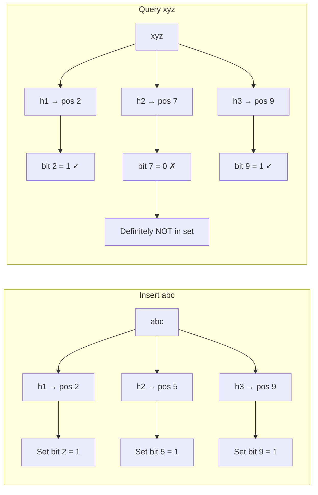

# Bloom Filters

A Bloom filter answers one question with remarkable efficiency: **"Have I seen this item before?"** It uses a fraction of the memory a hash set would require, with one deliberate tradeoff: it can produce false positives but never false negatives.

> **A Bloom filter says "maybe" or "definitely not" — never "definitely yes." That asymmetry is the key to its power.**

---

## The Core Idea

A Bloom filter is a **bit array of m bits** (initially all 0) combined with **k independent hash functions**.

**Inserting an element:**

1. Hash the element with all k hash functions
2. Set bits at those k positions to 1

**Querying an element:**

1. Hash the element with all k hash functions
2. If ALL k positions are 1 → element **might** be in the set
3. If ANY position is 0 → element is **definitely not** in the set



---

## False Positives Explained

False positives occur when a queried element's hash positions all happen to be set by **other elements** that were previously inserted.

```
Inserted: "apple" sets bits 2, 5, 9
Inserted: "banana" sets bits 3, 7, 9
Inserted: "cherry" sets bits 2, 7, 11

Query: "mango" → hashes to positions 2, 7, 9
  bit 2 = 1 (set by apple, cherry)
  bit 7 = 1 (set by banana, cherry)
  bit 9 = 1 (set by apple, banana)
  → ALL bits set → "maybe in set" (FALSE POSITIVE)
  → "mango" was never inserted!
```

**False positive rate formula:**

```
fp_rate ≈ (1 - e^(-kn/m))^k

Where:
  k = number of hash functions
  n = number of inserted elements
  m = size of bit array
```

**Practical numbers:**

| Bits per element (m/n) | Optimal k | False positive rate |
| ---------------------- | --------- | ------------------- |
| 6                      | 4         | 5.6%                |
| 10                     | 7         | 0.8%                |
| 14                     | 10        | 0.15%               |
| 20                     | 14        | 0.006%              |

> **1% false positive rate needs only ~10 bits per element.** A hash set needs ~64 bits (8-byte pointer) per element. Bloom filter is 6x more memory efficient.

---

## What You Cannot Do

- **Cannot delete elements** — clearing a bit would break other elements that hash to the same position. (Counting Bloom filters solve this at higher memory cost)
- **Cannot enumerate elements** — it stores no actual data, just bit positions
- **Cannot guarantee membership** — only guarantee non-membership

---

## Real-World Usage

### Google Bigtable / LevelDB / RocksDB

Before reading from disk (expensive), check the Bloom filter (in memory). If the filter says the key definitely isn't there, skip the disk read entirely.

```
Without Bloom filter:
  Read key → check every SSTable file → expensive disk I/O

With Bloom filter:
  Read key → check Bloom filter → if "definitely not" → skip disk read
  → Eliminates ~99% of unnecessary disk reads
```

### Cassandra

Each SSTable has a Bloom filter. Read requests check all Bloom filters first. Dramatically reduces disk reads for keys that don't exist.

### Chrome's Safe Browsing

Chrome checks if a URL is malicious using a Bloom filter stored locally (~few MB). Only if the filter says "maybe malicious" does it query Google's servers. Saves bandwidth and latency for 99.9%+ of requests.

### Akamai CDN

Bloom filters track whether a URL has been requested before. Only URLs seen at least twice are cached — preventing one-hit wonders from polluting the cache.

### Medium / Reddit (duplicate content detection)

Bloom filters check if a URL has been crawled/shared before. Avoids reprocessing the same content.

---

## Memory Efficiency Comparison

| Structure    | Memory per element    | Supports delete | False positives |
| ------------ | --------------------- | --------------- | --------------- |
| Hash set     | ~64 bytes             | Yes             | Never           |
| Sorted array | ~8 bytes              | Expensive       | Never           |
| Bloom filter | ~10 bits (1.25 bytes) | No              | Yes (~1%)       |

**For 1 billion URLs:**

- Hash set: ~64 GB
- Bloom filter (1% FP rate): ~1.2 GB

---

## Variants

| Variant                   | What it adds                                           | Cost                 |
| ------------------------- | ------------------------------------------------------ | -------------------- |
| **Counting Bloom filter** | Supports deletion (counters instead of bits)           | 4–8x memory          |
| **Scalable Bloom filter** | Grows dynamically as elements are added                | Slightly more memory |
| **Cuckoo filter**         | Supports deletion, better FP rate                      | Slightly more memory |
| **HyperLogLog**           | Estimates cardinality (count distinct), not membership | Ultra-compact        |

---

## Key Takeaways

- A Bloom filter **never has false negatives** — if it says "not in set," that's guaranteed
- **False positives are tunable** — more bits per element = lower false positive rate
- The classic use case: **avoid expensive lookups** (disk reads, network calls, DB queries) by quickly eliminating definite misses
- **Cannot delete** from a standard Bloom filter — use Counting Bloom filter or Cuckoo filter if deletion is needed
- Used in **Cassandra, RocksDB, Chrome, CDNs** — anywhere you need to ask "have I seen this before?" at high speed with minimal memory
