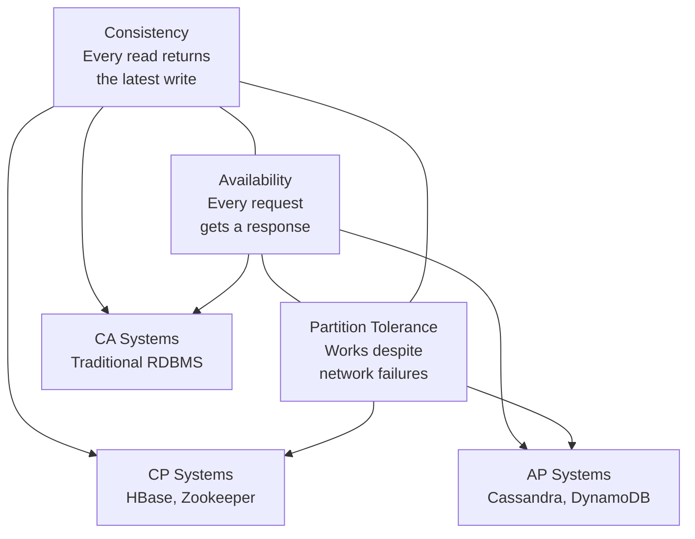
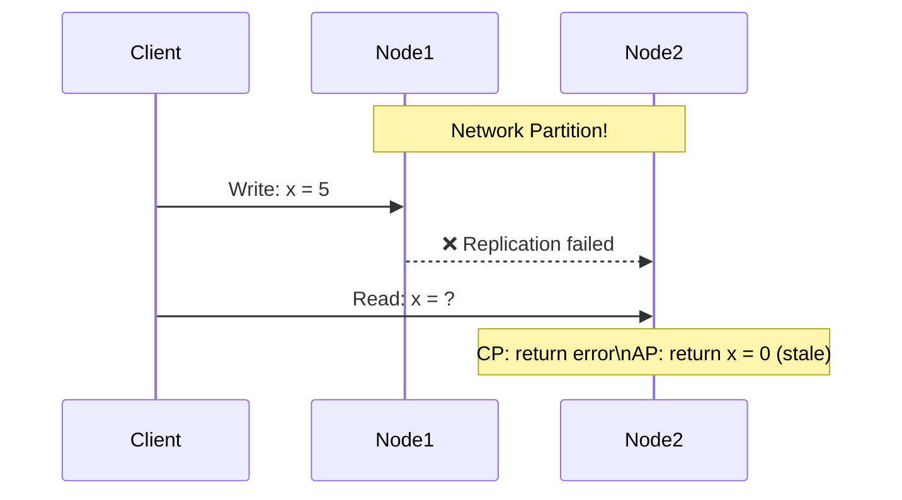

# CAP Theorem

The CAP theorem is the foundational truth of distributed systems. Every architectural decision you make — which database to use, how to replicate data, how to handle failures — is ultimately a CAP tradeoff.

> **In a distributed system, you can only guarantee two of three properties: Consistency, Availability, and Partition Tolerance.**
> — Eric Brewer, 2000

---

## The Three Properties



### Consistency (C)

Every read receives the most recent write or an error. All nodes see the same data at the same time. No stale reads.

### Availability (A)

Every request receives a response — not necessarily the latest data, but _some_ response. The system never refuses to answer.

### Partition Tolerance (P)

The system continues operating even when network messages are lost or delayed between nodes (a network partition).

---

## The Unavoidable Reality

Network partitions **will** happen. They're not theoretical — hardware fails, cables get cut, AWS availability zones lose connectivity. This means:

> **Partition Tolerance is not optional. The real choice is between CP and AP.**

When a partition occurs, you must choose:

- **CP:** Refuse to respond (or return an error) to preserve data consistency
- **AP:** Respond with possibly stale data to stay available

---

## CP vs. AP in Practice

|                  | CP Systems                                | AP Systems                        |
| ---------------- | ----------------------------------------- | --------------------------------- |
| **On partition** | Returns error or blocks                   | Returns stale data                |
| **Guarantee**    | Data is always correct                    | System always responds            |
| **Examples**     | HBase, Zookeeper, etcd, MongoDB (default) | Cassandra, DynamoDB, CouchDB, DNS |
| **Use when**     | Financial transactions, leader election   | Social feeds, shopping carts, DNS |



---

## Real-World Examples

### CP — Apache Zookeeper

Zookeeper is used for distributed coordination (leader election, config management). If a partition occurs, it becomes unavailable rather than risk inconsistent state. Correctness is paramount — you can't have two leaders.

### AP — Amazon DynamoDB (default)

DynamoDB prioritizes availability. During a partition, it serves reads from the available replica, which may be stale. It uses eventual consistency — data will converge, but not immediately.

### The interesting middle — MongoDB

MongoDB is CP by default (strong consistency via primary reads). But you can configure `readPreference: nearest` to read from replicas — trading consistency for lower latency, making it AP in practice.

---

## Beyond CAP: The PACELC Model

CAP only describes behavior during partitions. Eric Brewer later acknowledged a more complete model:

```
PACELC:
  If Partition → choose between Availability and Consistency (like CAP)
  Else (normal operation) → choose between Latency and Consistency
```

| System                   | Partition behavior           | Normal operation                |
| ------------------------ | ---------------------------- | ------------------------------- |
| DynamoDB                 | AP (available, eventual)     | EL (low latency, eventual)      |
| Zookeeper                | CP (consistent, unavailable) | EC (consistent, higher latency) |
| Cassandra                | AP                           | EL                              |
| PostgreSQL (single node) | N/A                          | EC                              |

PACELC matters because latency vs. consistency is the **daily tradeoff** in production systems, even when there are no partitions.

---

## Consistency is Not Binary

CAP uses "consistency" loosely. In reality, consistency exists on a spectrum:

| Level                      | Guarantee                                        |
| -------------------------- | ------------------------------------------------ |
| **Linearizability**        | Strongest — real-time ordering of all operations |
| **Sequential consistency** | Operations appear in program order               |
| **Causal consistency**     | Cause-effect relationships preserved             |
| **Read-your-writes**       | You always see your own writes                   |
| **Eventual consistency**   | Will converge, but no timing guarantee           |

Most "consistent" databases provide linearizability or sequential consistency. Most "available" databases provide eventual consistency.

---

## Practical Decision Framework

When designing a system, ask these questions:

```
1. Does incorrect data cause harm? (finance, inventory, medical)
   → Choose CP

2. Is the user experience severely hurt by unavailability?
   → Choose AP

3. Can the application handle stale data gracefully?
   → AP with eventual consistency is fine

4. Is this for coordination/locking/leader election?
   → Must be CP
```

| Use case          | CAP choice | Reasoning                                          |
| ----------------- | ---------- | -------------------------------------------------- |
| Bank balance      | CP         | Wrong balance = real money lost                    |
| Social media feed | AP         | Slightly stale feed is acceptable                  |
| Shopping cart     | AP         | Amazon showed AP carts are fine                    |
| Inventory count   | CP         | Overselling is a real problem                      |
| DNS               | AP         | Stale DNS is fine; unavailable DNS is catastrophic |
| Distributed lock  | CP         | Two nodes holding same lock = disaster             |

---

## Key Takeaways

- **Partition Tolerance is mandatory** — network failures are real; you're always choosing between CP and AP
- **CP systems** sacrifice availability during partitions to guarantee data correctness — use for financial, coordination, inventory
- **AP systems** sacrifice consistency during partitions to stay available — use for social, analytics, user-facing features
- **PACELC extends CAP** — even without partitions, there's a latency vs. consistency tradeoff in normal operation
- Consistency is a spectrum — most systems sit somewhere between linearizability and eventual consistency
