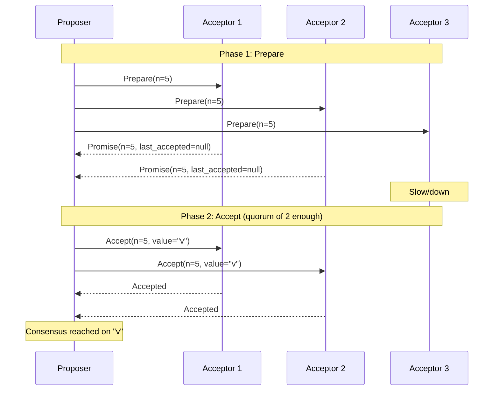
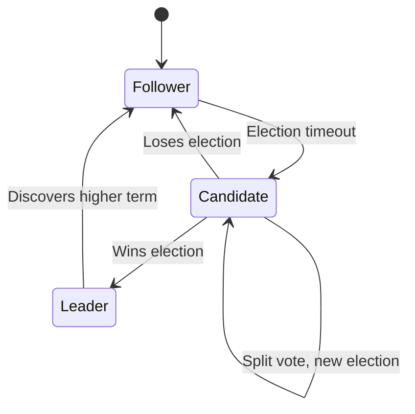
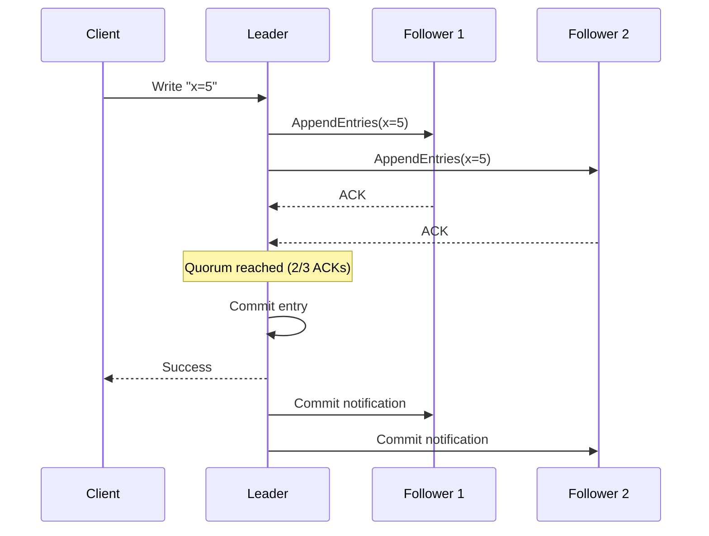

# Consensus Algorithms

Consensus algorithms solve the hardest problem in distributed systems: **how do multiple nodes agree on a single value when any node can fail and messages can be lost?**

This isn't academic — it's the foundation of every distributed database, Kubernetes (etcd), Kafka (KRaft), and any system that needs a single source of truth.

> **Consensus is what separates a cluster of databases from a single reliable database.**

---

## The Consensus Problem

Given a set of nodes, consensus requires:

1. **Agreement** — all non-faulty nodes decide on the same value
2. **Validity** — the decided value was proposed by some node (not invented)
3. **Termination** — all non-faulty nodes eventually decide

This sounds simple. It isn't. The **FLP Impossibility theorem** (Fischer, Lynch, Paterson 1985) proves that in an asynchronous system, no consensus algorithm can guarantee both safety and liveness in the presence of even one faulty process.

Practical algorithms get around FLP by making timing assumptions — they use timeouts to detect failures and retry.

---

## Paxos

Paxos (Lamport, 1989) is the theoretical foundation. It's famously difficult to understand and implement correctly, but it's the basis for nearly all modern consensus algorithms.

### Roles

- **Proposer** — proposes a value
- **Acceptor** — votes on proposals
- **Learner** — learns the decided value

### Two-Phase Protocol



**Phase 1 (Prepare/Promise):**

- Proposer sends `Prepare(n)` with ballot number n
- Acceptors promise not to accept any proposal with number < n
- Acceptors return any previously accepted value

**Phase 2 (Accept/Accepted):**

- Proposer sends `Accept(n, value)` to a quorum
- If no previously accepted value exists, proposer can choose any value
- Acceptors accept if they haven't promised a higher ballot

**Why it's hard to implement:** Multi-Paxos (for a sequence of values, not just one), leader election, reconfiguration, and performance optimizations all add enormous complexity.

---

## Raft

Raft was designed by Ongaro and Ousterhout (2014) explicitly to be **more understandable than Paxos**. It's the dominant algorithm in modern systems.

### Core Decomposition

Raft breaks consensus into three sub-problems:

1. **Leader election** — one node is the leader at any time
2. **Log replication** — leader accepts writes and replicates to followers
3. **Safety** — if a log entry is committed, all future leaders have it

### The Raft State Machine



### Leader Election

- All nodes start as **Followers**
- If a follower doesn't hear from a leader (heartbeat timeout, 150–300ms), it becomes a **Candidate**
- Candidate increments its term, votes for itself, requests votes from others
- First node to get majority votes becomes **Leader**
- Leader sends heartbeats to prevent new elections

### Log Replication



**Key guarantee:** An entry is committed only after a **majority** of nodes have written it to their logs. A committed entry will never be overwritten.

### Term Numbers

Terms are logical clocks in Raft:

- Each election starts a new term
- Nodes always follow the leader with the highest term
- Stale messages from old terms are rejected

---

## Raft vs. Paxos

| Aspect            | Paxos                                     | Raft                                   |
| ----------------- | ----------------------------------------- | -------------------------------------- |
| Understandability | Notoriously complex                       | Designed for clarity                   |
| Leader            | No explicit leader (Multi-Paxos adds one) | Explicit, always one leader            |
| Log ordering      | Complex to ensure                         | Guaranteed by leader                   |
| Reconfiguration   | Under-specified                           | Joint consensus protocol               |
| Implementations   | Chubby, Zab (ZooKeeper)                   | etcd, CockroachDB, TiKV, Consul        |
| Performance       | Higher (no forced leader)                 | Slightly lower (all writes via leader) |

---

## Real-World Implementations

### etcd (Kubernetes)

Uses Raft for all cluster state — pod definitions, secrets, configs. Every Kubernetes operation that changes state goes through etcd's Raft log. etcd recommends 3 or 5 nodes (tolerates 1 or 2 failures).

### Apache Kafka (KRaft mode)

Kafka replaced ZooKeeper with its own Raft implementation (KRaft) for metadata management. The controller uses Raft to replicate partition assignments and broker state.

### CockroachDB

Each range (16MB data shard) in CockroachDB is a Raft group. Writes to a range go through Raft consensus. This gives CockroachDB serializable transactions across distributed nodes.

### TiKV (TiDB storage engine)

Uses Multi-Raft — each region is an independent Raft group. Allows millions of Raft instances running concurrently.

---

## Byzantine Fault Tolerance

Raft and Paxos assume **crash-fault tolerance** — nodes can stop but not lie. For systems where nodes might send incorrect or malicious data (Byzantine faults), you need **BFT algorithms**:

| Algorithm    | Fault model                                  | Use case                  |
| ------------ | -------------------------------------------- | ------------------------- |
| Paxos / Raft | Crash faults                                 | Databases, infrastructure |
| PBFT         | Byzantine faults (3f+1 nodes for f failures) | Permissioned blockchains  |
| Tendermint   | Byzantine faults                             | Cosmos blockchain         |
| Bitcoin PoW  | Byzantine + Sybil                            | Permissionless blockchain |

Byzantine algorithms require 3f+1 nodes to tolerate f failures (vs 2f+1 for crash-fault tolerant). They're used in blockchains and adversarial environments, not typical distributed databases.

---

## Performance Characteristics

```
Raft write latency = network RTT × 1 (single round trip to quorum)
Raft throughput   = leader's network bandwidth / log entry size

Typical etcd write latency (same datacenter): 1-5ms
Typical etcd write latency (cross-region):    50-150ms
```

All writes go through the leader — this is the fundamental bottleneck. Solutions:

- **Partition the key space** — each partition has its own leader (CockroachDB, TiKV)
- **Read from followers** — stale reads, but scales read throughput
- **Batching** — pipeline many writes in one Raft round

---

## Key Takeaways

- Consensus algorithms ensure **multiple nodes agree on a value** despite failures — without consensus, distributed databases would have split-brain
- **Paxos** is the theoretical foundation; **Raft** is the practical choice — Raft's explicit leader and clean decomposition make it far easier to implement correctly
- **Quorum (majority)** is the core mechanism — an operation is committed when >50% of nodes confirm it
- **All writes go through the leader** — this is the throughput ceiling; partition-based systems like CockroachDB create many Raft groups to parallelize
- **etcd, Kafka (KRaft), CockroachDB, TiKV, Consul** all use Raft — understanding Raft means understanding the backbone of modern distributed infrastructure
