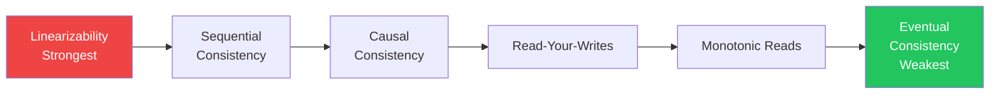
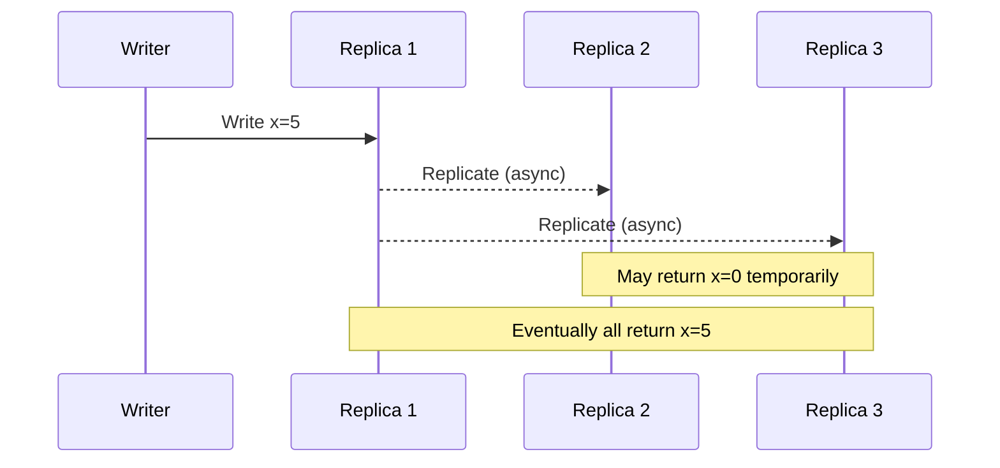
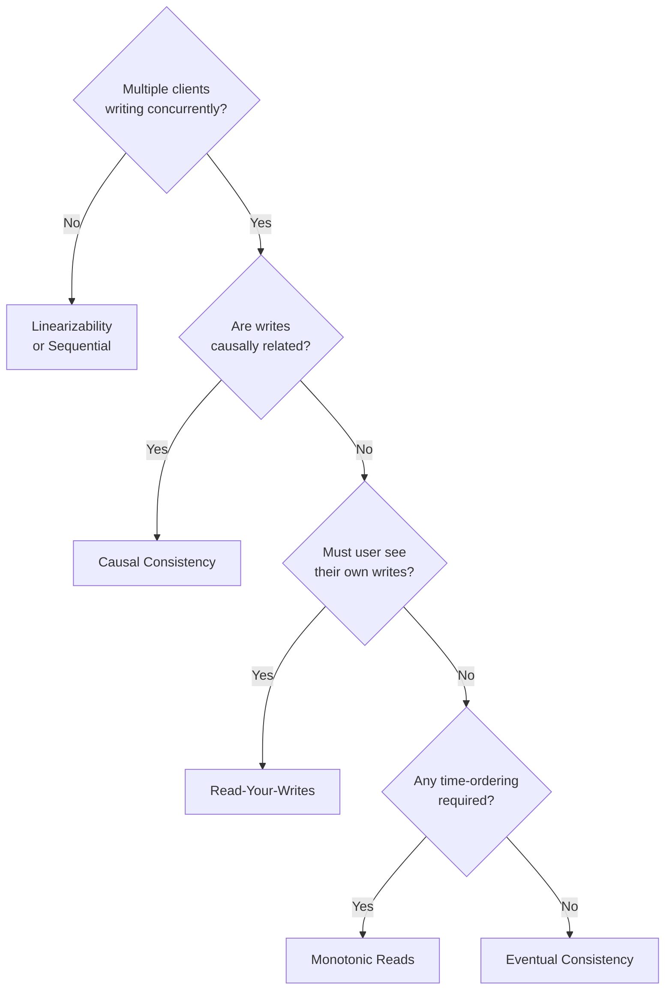

# Consistency Models

Consistency is not binary. Between "every node always agrees" and "anything goes," there's a rich spectrum of consistency models, each offering different tradeoffs between correctness, performance, and availability.

> **Choosing the right consistency model is one of the most impactful architectural decisions you'll make. Get it wrong and you're either losing data or building systems too slow to scale.**

---

## The Consistency Spectrum



Stronger consistency = easier to reason about, harder to scale.
Weaker consistency = harder to reason about, easier to scale.

---

## 1. Linearizability (Strict Consistency)

**The gold standard.** Every operation appears to take effect atomically at some point between its start and end. All clients see the same, real-time-ordered view of the world.

```
Timeline:
Client A: [---Write x=5---]
Client B:           [---Read x---] → must return 5
```

If Client B's read starts after Client A's write completes, it **must** see x=5.

**Properties:**

- Equivalent to a single-copy system
- Real-time ordering of all operations
- No client can observe reordering of operations

**Cost:** Requires coordination (Paxos, Raft, 2PC). High latency. Not partition-tolerant.

**Examples:** etcd, Zookeeper, Google Spanner (using TrueTime), single-node databases

---

## 2. Sequential Consistency

All operations appear in some sequential order, and each client's operations appear in the order the client issued them. But the global order doesn't have to match real time.

```
Client A writes: x=1, then x=2
Client B writes: y=1, then y=2

Valid sequential order: x=1, y=1, x=2, y=2
Also valid:             y=1, x=1, y=2, x=2
Not valid:              x=2, x=1, ...  (violates A's order)
```

**Key difference from linearizability:** Global order doesn't need to match wall-clock time. An operation that "happened first" in real time might appear later in the global sequence.

**Examples:** CPU memory models (x86 provides stronger guarantees), some distributed databases

---

## 3. Causal Consistency

Operations that are causally related must be seen by all nodes in the same order. Concurrent (causally unrelated) operations may be seen in different orders by different nodes.

```
A posts: "I love pizza"
B replies: "Me too!" (causally depends on A's post)

→ Every node must see A's post before B's reply
→ But B's reply and C's unrelated post may appear in any order
```

**Implementation:** Vector clocks or version vectors track causal relationships.

**Why it matters:** Causal consistency is often what you actually need. Comment threads, document edits, and chat messages are all about causal ordering, not global ordering.

**Examples:** MongoDB (causal sessions), COPS system, some CRDTs

---

## 4. Read-Your-Writes (Session Consistency)

After a client writes a value, that same client will always read that value or a more recent one. Other clients may still see stale data.

```
User updates profile photo:
  Write: photo = new_photo.jpg → success
  Read:  photo = ???           → must return new_photo.jpg (not old one)

Other users: may still see old photo for a few seconds
```

**How to implement:**

- Route all reads for a user to the same replica (sticky sessions)
- Attach a write timestamp to reads; replica must be at least that fresh
- Use a single read-write node for the user's session

**Examples:** Most user-facing web applications implement this. It's the minimum acceptable UX — users can't understand why their own changes don't stick.

---

## 5. Monotonic Reads

If a client has seen a value at time T, it will never see an older value in subsequent reads. Time only moves forward for this client.

```
Client reads post count: 150
Client reads again:      must be ≥ 150, never < 150
```

**The problem it prevents:** Without monotonic reads, a client could read from Replica A (count=150), then Replica B (count=148), then A again (150) — appearing to go backwards in time.

**Implementation:** Assign read requests to replicas that have caught up to the client's last seen version.

---

## 6. Eventual Consistency

The weakest model. If no new updates are made, all replicas will **eventually** converge to the same value. No guarantees about when or what you'll see in the meantime.



**When it's acceptable:**

- Like/view counts (off by a few for seconds is fine)
- Product recommendations
- Analytics dashboards
- DNS propagation
- CDN cache invalidation

**When it's NOT acceptable:**

- Account balances
- Inventory counts
- Authentication tokens
- Any operation with financial or safety implications

---

## Consistency Models in Real Databases

| Database       | Default model                | Strongest available          |
| -------------- | ---------------------------- | ---------------------------- |
| PostgreSQL     | Serializable (single node)   | Linearizable (single node)   |
| MySQL          | Repeatable Read              | Serializable                 |
| Cassandra      | Eventual                     | Linearizable (with SERIAL)   |
| DynamoDB       | Eventual                     | Strong (per-item)            |
| MongoDB        | Eventual (replica reads)     | Linearizable (primary reads) |
| Redis          | Sequential (single-threaded) | Linearizable                 |
| CockroachDB    | Serializable                 | Serializable                 |
| Google Spanner | Serializable                 | External consistency         |

---

## Choosing the Right Model



---

## Key Takeaways

- **Linearizability** is the safest but most expensive — use for coordination, locks, financial operations
- **Causal consistency** is often the sweet spot — much cheaper than linearizability, still handles most real-world ordering requirements
- **Read-your-writes** is the minimum for any user-facing feature where users make edits
- **Eventual consistency** is appropriate for analytics, counts, and non-critical data where staleness is tolerable
- Most production systems **mix models** — strong consistency for writes, eventual for reads, with read-your-writes for the writing user
