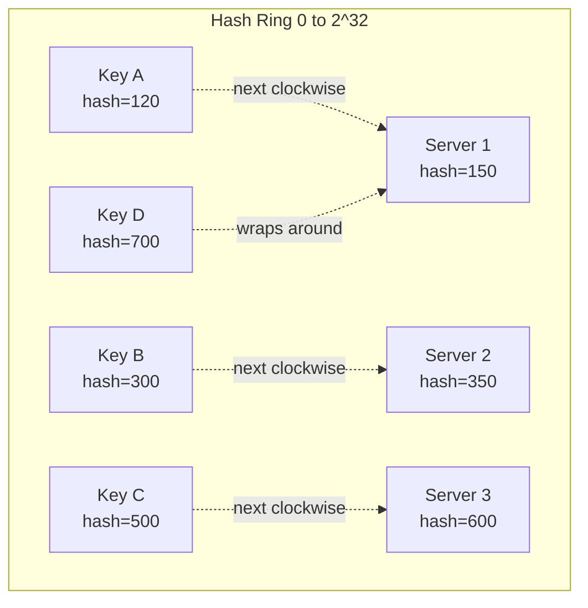
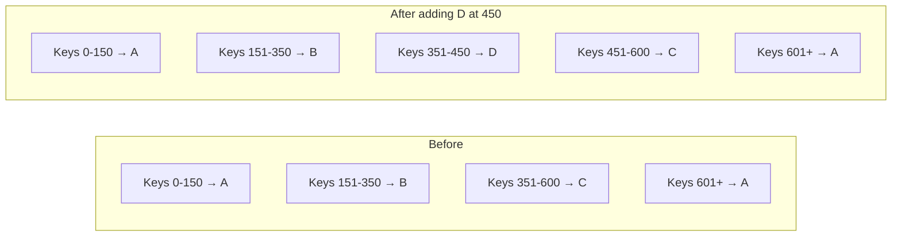

# Consistent Hashing

Consistent hashing solves one of distributed systems' most painful problems: how do you distribute data across N servers, and how do you handle servers being added or removed without reshuffling everything?

> **Without consistent hashing, adding one server to a 10-server cluster causes ~90% of keys to be remapped. With consistent hashing, only ~1/N keys need to move.**

---

## The Problem with Simple Hashing

The naive approach: `server = hash(key) % N`

```
N=3 servers: A, B, C
key "user:123" → hash = 456 → 456 % 3 = 0 → Server A
key "user:456" → hash = 789 → 789 % 3 = 2 → Server C
```

This works until N changes:

```
Add server D: N=4
key "user:123" → 456 % 4 = 0 → Server A  ✓ (same)
key "user:456" → 789 % 4 = 1 → Server B  ✗ (was C!)

75% of all keys now map to different servers!
→ Massive cache invalidation
→ Database thundering herd
→ Potential outage
```

---

## The Consistent Hashing Ring

Consistent hashing maps both servers and keys onto a **circular ring** (hash space from 0 to 2³²).



**Algorithm:**

1. Hash each server to a position on the ring
2. To find a key's server: hash the key → walk clockwise → first server you hit

```python
import hashlib
import bisect

class ConsistentHash:
    def __init__(self, replicas=100):
        self.replicas = replicas  # virtual nodes per server
        self.ring = {}
        self.sorted_keys = []

    def add_server(self, server):
        for i in range(self.replicas):
            key = self._hash(f"{server}:{i}")
            self.ring[key] = server
            bisect.insort(self.sorted_keys, key)

    def remove_server(self, server):
        for i in range(self.replicas):
            key = self._hash(f"{server}:{i}")
            del self.ring[key]
            self.sorted_keys.remove(key)

    def get_server(self, key):
        if not self.ring:
            return None
        h = self._hash(key)
        idx = bisect.bisect(self.sorted_keys, h) % len(self.sorted_keys)
        return self.ring[self.sorted_keys[idx]]

    def _hash(self, key):
        return int(hashlib.md5(key.encode()).hexdigest(), 16)
```

---

## Adding and Removing Servers

### Adding a Server

When a new server D joins the ring, it only affects keys that were previously pointing to the server immediately clockwise from D's position.

```
Before: Ring has A(150), B(350), C(600)
Add D at position 450

Keys 351–450 were going to C
Now they go to D

Only ~1/N of total keys are remapped ✓
```



### Removing a Server

When server B fails, only its keys (151–350) need to move — to C, its clockwise neighbor. Everything else is unaffected.

---

## The Problem: Non-Uniform Distribution

With only 3 physical servers on the ring, data distribution is uneven — it depends on where the servers happen to hash to. Server B might end up handling 50% of keys while A handles 10%.

**Solution: Virtual Nodes (VNodes)**

Each physical server maps to multiple positions on the ring (virtual nodes):

```
Server A → positions: 50, 200, 450, 700, 900 ...  (100 virtual nodes)
Server B → positions: 30, 150, 380, 600, 850 ...
Server C → positions: 80, 250, 500, 750, 950 ...
```

With 100+ virtual nodes per server:

- Distribution becomes statistically uniform (~equal load per server)
- When a server is removed, its keys spread evenly across all remaining servers
- New servers take a proportional share from all existing servers

```mermaid
graph TD
    subgraph Physical Servers
        A[Server A]
        B[Server B]
        C[Server C]
    end
    subgraph Ring Positions
        A --> A1[A@50]
        A --> A2[A@450]
        A --> A3[A@900]
        B --> B1[B@30]
        B --> B2[B@380]
        B --> B3[B@850]
        C --> C1[C@80]
        C --> C2[C@500]
        C --> C3[C@950]
    end
```

**Cassandra uses 256 virtual nodes per server by default.**

---

## Real-World Usage

### Amazon DynamoDB

Uses consistent hashing to distribute data across storage nodes. The partition key is hashed to determine which node stores the data. Virtual nodes ensure even distribution across heterogeneous hardware.

### Apache Cassandra

The token ring is Cassandra's core data distribution mechanism. Each node owns a range of tokens (hash values). VNodes (`num_tokens=256` by default) distribute load and make cluster expansion seamless.

### Content Delivery Networks (Akamai)

Consistent hashing routes requests to the nearest cache server. When a cache server goes down, only the traffic it was handling needs to be rerouted — not all traffic.

### Load Balancers (with sticky sessions)

Nginx and HAProxy use consistent hashing for session affinity — ensuring a user's requests always go to the same backend server without a shared session store.

---

## Consistent Hashing vs. Simple Hashing

| Aspect                            | Simple (modulo)       | Consistent Hashing        |
| --------------------------------- | --------------------- | ------------------------- |
| Keys remapped on add/remove       | ~N-1/N (catastrophic) | ~1/N (minimal)            |
| Implementation complexity         | Simple                | Moderate                  |
| Load distribution                 | Perfectly even        | Even with VNodes          |
| Cache invalidation on scale event | Massive               | Minimal                   |
| Used by                           | Toy projects          | Cassandra, DynamoDB, CDNs |

---

## Key Takeaways

- **Simple `hash(key) % N` breaks catastrophically when N changes** — consistent hashing limits disruption to ~1/N of keys
- **The ring maps both servers and keys** to a circular hash space; each key belongs to the first server clockwise from it
- **Virtual nodes solve load imbalance** — each physical server gets multiple ring positions, ensuring uniform distribution
- **Only adjacent neighbors are affected** when a node joins or leaves — the rest of the ring is untouched
- **Cassandra, DynamoDB, and CDNs all use consistent hashing** — it's the standard for any system that needs to distribute load across a dynamic set of nodes
