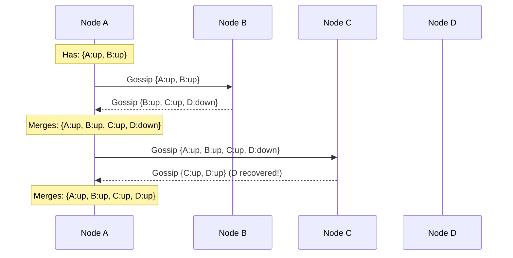
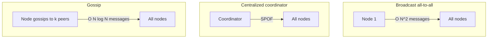

## title: Gossip Protocol

# Gossip Protocol

The gossip protocol is how distributed systems spread information reliably across thousands of nodes without a central coordinator. It's inspired by how rumors spread in a social network — each node tells a few neighbors, who tell a few more, until everyone knows.

> **Gossip is decentralized, fault-tolerant, and scales logarithmically. It's how Cassandra, DynamoDB, and Consul know which nodes are alive.**

---

## The Core Mechanism

Every T seconds (typically 1 second), each node:

1. Picks k random peers from its known node list (typically k=3)
2. Exchanges state information with them
3. Merges received information with its own



---

## Convergence: How Fast Does Information Spread?

With N nodes and each node gossiping to k peers per round:

```
Round 1: 1 node knows
Round 2: ~k nodes know
Round 3: ~k² nodes know
...
After log_k(N) rounds: all nodes know
```

**For N=1,000,000 nodes, k=3:**

```
log₃(1,000,000) ≈ 13 rounds
At 1 round/second → information spreads in ~13 seconds
```

This is why gossip is said to have **O(log N) convergence** — the time to reach all nodes grows logarithmically with cluster size, not linearly.

---

## Failure Detection with Gossip

Gossip protocols use **heartbeat counters** to detect failures:

```
Each node maintains a state table:
  Node  | Heartbeat | Last Updated
  ------+-----------+-------------
  A     | 1052      | 0.3s ago
  B     | 847       | 0.1s ago
  C     | 623       | 5.2s ago   ← suspicious
  D     | 412       | 12.1s ago  ← likely dead
```

If a node's heartbeat hasn't incremented for φ (phi) seconds, it's marked **suspect**. After a longer timeout, it's marked **dead**.

### Phi Accrual Failure Detector (Cassandra)

Rather than a binary alive/dead judgment, Cassandra uses a continuous suspicion value φ:

```
φ = 1 → node is probably alive
φ = 8 → node is likely dead
φ = 16 → node is very likely dead

φ threshold is configurable (default: 8)
```

This approach adapts to network conditions — high latency doesn't immediately kill a node.

---

## Gossip vs. Other Dissemination Approaches



| Approach                | Messages   | SPOF | Fault tolerance          | Scale     |
| ----------------------- | ---------- | ---- | ------------------------ | --------- |
| Broadcast (all-to-all)  | O(N²)      | No   | Medium                   | Poor      |
| Centralized coordinator | O(N)       | Yes  | Poor (coordinator fails) | Medium    |
| Gossip                  | O(N log N) | No   | Excellent                | Excellent |

---

## What Gossip is Used For

### Membership (Who's in the cluster?)

Each node maintains a list of all cluster members. When a new node joins, it introduces itself to a seed node, which gossips its existence to the rest of the cluster.

### Failure Detection (Who's down?)

Nodes continuously exchange heartbeat counters. A node that stops incrementing its heartbeat is eventually marked dead by all other nodes — without any central authority.

### State Dissemination (What state is each node in?)

In Cassandra, nodes gossip their load, token ranges, schema versions, and datacenter information. Any node can answer "which node owns key X?" by using this gossip-maintained view.

### Leader Election

Some systems use gossip as the discovery layer, then run a stronger consensus protocol (Raft/Paxos) on top for leader election.

---

## Real-World Systems Using Gossip

| System          | What gossip does                                                           |
| --------------- | -------------------------------------------------------------------------- |
| **Cassandra**   | Cluster membership, failure detection, token ownership, schema propagation |
| **DynamoDB**    | Membership, routing information                                            |
| **Consul**      | Service discovery, health checks, KV store replication                     |
| **Riak**        | Ring membership, vnodes, cluster topology                                  |
| **Bitcoin P2P** | Transaction and block propagation across the network                       |
| **Amazon S3**   | Internal metadata propagation                                              |

---

## Gossip Variants

| Variant                 | Behavior                                                           |
| ----------------------- | ------------------------------------------------------------------ |
| **Anti-entropy gossip** | Nodes exchange full state and reconcile differences                |
| **Rumor-mongering**     | Nodes spread "hot" updates; stop when everyone knows               |
| **Aggregate gossip**    | Compute distributed aggregates (e.g., average load across cluster) |

---

## Tradeoffs

**Advantages:**

- No single point of failure — fully decentralized
- Self-healing — nodes that recover automatically rejoin
- Scales to thousands of nodes
- Tolerates network partitions gracefully
- Simple to implement

**Disadvantages:**

- Eventual propagation — not suitable for time-critical updates
- Bandwidth overhead — gossip messages are continuous background traffic
- False positives — temporary network blips can mark live nodes as dead
- Not suitable for strong consistency requirements

---

## Key Takeaways

- Gossip spreads information in **O(log N) rounds** — it scales to millions of nodes
- It's **leaderless and decentralized** — no coordinator, no SPOF, no bottleneck
- Used for **membership, failure detection, and state dissemination** in Cassandra, Consul, DynamoDB, and more
- Gossip provides **eventual consistency** for cluster state — not suitable for data requiring immediate agreement
- The phi accrual failure detector makes failure detection **adaptive** — it adjusts to network conditions rather than using fixed timeouts
