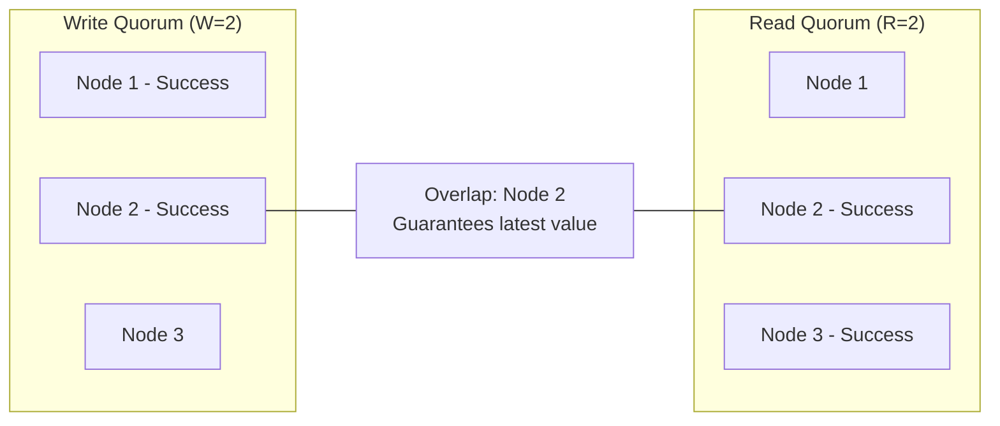
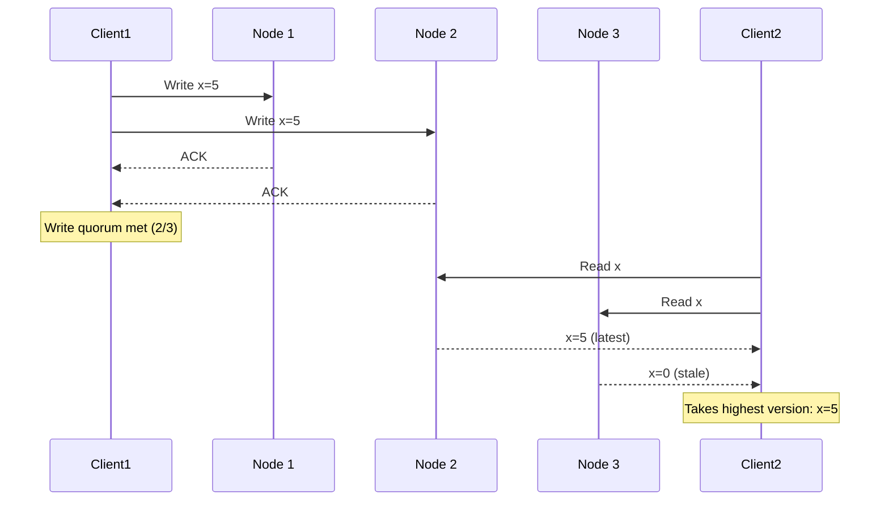
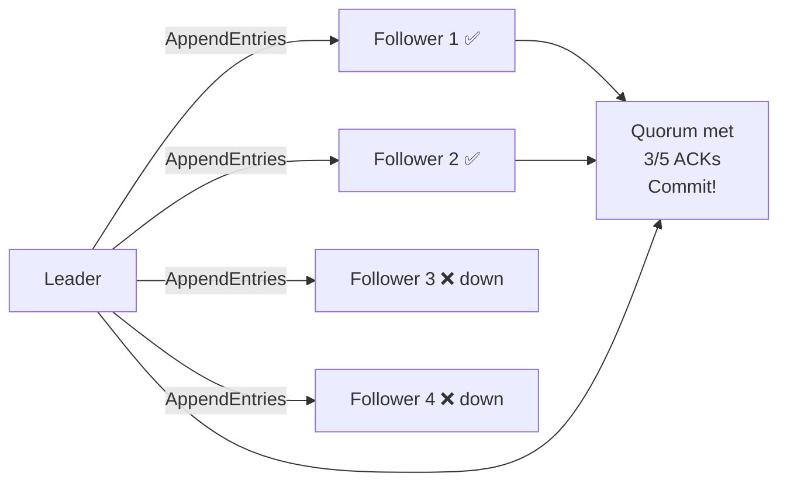
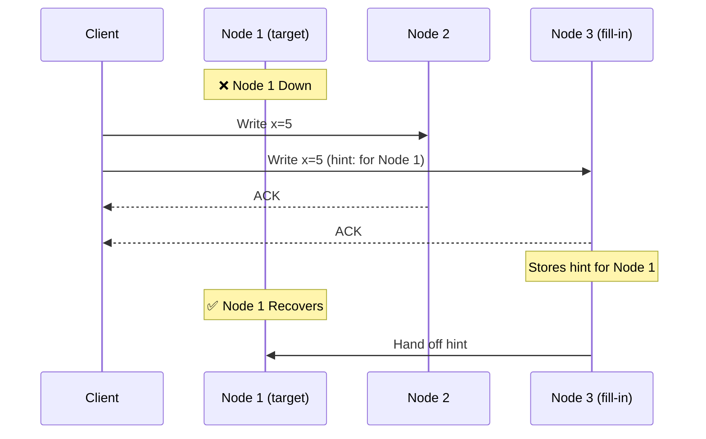

# Quorum

Quorum is the mechanism that allows distributed systems to make consistent decisions without requiring all nodes to be available. It's the mathematical foundation behind how Cassandra, DynamoDB, and Raft-based systems like etcd balance consistency and availability.

> **A quorum is the minimum number of nodes that must agree on an operation before it's considered successful.**

---

## The Core Idea

If you have N replicas, you need to ensure that any read set and any write set overlap by at least one node. That overlapping node guarantees you'll always read the latest write.

```
N = total replicas
W = nodes that must confirm a write
R = nodes that must confirm a read

For strong consistency: R + W > N
```



**With N=3, W=2, R=2:** R + W = 4 > 3 ✓ — strong consistency guaranteed

---

## Quorum Configurations and Tradeoffs

### For N = 3 replicas:

| W   | R   | R+W | Consistency | Write speed           | Read speed |
| --- | --- | --- | ----------- | --------------------- | ---------- |
| 3   | 1   | 4   | Strong      | Slow (all 3 must ack) | Fast       |
| 2   | 2   | 4   | Strong      | Moderate              | Moderate   |
| 1   | 3   | 4   | Strong      | Fast                  | Slow       |
| 1   | 1   | 2   | Eventual    | Fastest               | Fastest    |
| 2   | 1   | 3   | Eventual    | Moderate              | Fastest    |

**The classic configuration: W=2, R=2, N=3**

- Survives 1 node failure for both reads and writes
- Strong consistency
- The most common production choice

---

## How the Overlap Guarantees Consistency

With N=3, W=2, R=2:



Node 2 is in both the write set (N1, N2) and the read set (N2, N3). The overlap guarantees Client2 always gets the latest value.

---

## Quorum in Cassandra

Cassandra exposes quorum as a tunable consistency level per operation:

```
-- Write options:
CONSISTENCY ONE        -- W=1 (fastest, eventual)
CONSISTENCY QUORUM     -- W=ceil(N/2)+1 (strong)
CONSISTENCY ALL        -- W=N (strongest, least available)
CONSISTENCY LOCAL_QUORUM -- Quorum within local datacenter

-- Common production pattern:
  Writes: LOCAL_QUORUM
  Reads:  LOCAL_QUORUM
  → Strong consistency within a DC, fast cross-DC replication
```

### Cassandra Replication Factor

```
Replication factor = N = how many copies of each row

RF=1: No redundancy. Any node failure loses data.
RF=3: Standard. Can lose 1 node with QUORUM reads/writes.
RF=5: High durability. Can lose 2 nodes.
```

---

## Quorum in Leader-Based Systems (Raft/Paxos)

In Raft, quorum means **majority**. The leader must receive acknowledgment from a majority of nodes before committing a log entry:

```
N=5 nodes → quorum = 3
Leader must get 3 ACKs (including itself) to commit

If 2 nodes fail: 3 nodes remain → quorum still met ✓
If 3 nodes fail: 2 nodes remain → no quorum, no commits ✗
```



**This is why Raft needs 2f+1 nodes to tolerate f failures:**

- Tolerate 1 failure: 3 nodes minimum
- Tolerate 2 failures: 5 nodes minimum
- Tolerate 3 failures: 7 nodes minimum

---

## Sloppy Quorum and Hinted Handoff

Strict quorum requires exactly the designated N nodes. **Sloppy quorum** relaxes this: if one of the designated nodes is unavailable, write to a healthy node instead and hand off the data when the original node recovers.



**Sloppy quorum improves availability** at the cost of consistency. Used by default in Cassandra and DynamoDB. Can be disabled for strict quorum semantics.

---

## Read Repair

When a read detects inconsistency between quorum nodes, it triggers a background repair:

```
Client reads from N2 (x=5) and N3 (x=0)
→ Detects inconsistency (different values)
→ Returns x=5 to client (latest wins)
→ Asynchronously writes x=5 to N3 (repair)
```

Read repair is how eventually consistent systems **self-heal** over time without manual intervention.

---

## Choosing Quorum Settings in Practice

| Scenario                         | N   | W   | R   | Strategy             |
| -------------------------------- | --- | --- | --- | -------------------- |
| Strong consistency required      | 3   | 2   | 2   | Classic quorum       |
| Write-heavy, ok with stale reads | 3   | 1   | 3   | Write fast, read all |
| Read-heavy, ok with stale reads  | 3   | 3   | 1   | Write all, read fast |
| Maximum availability             | 3   | 1   | 1   | Eventual consistency |
| Maximum durability               | 5   | 5   | 1   | Write all            |

---

## Key Takeaways

- **R + W > N guarantees strong consistency** — the read and write sets must overlap
- **The classic N=3, W=2, R=2 configuration** tolerates 1 node failure while maintaining strong consistency
- **Quorum is tunable** — Cassandra lets you choose per-query, trading consistency for performance
- **Sloppy quorum improves availability** but weakens consistency guarantees during node failures
- **Read repair and hinted handoff** are the mechanisms that bring eventually consistent systems back into sync after failures
