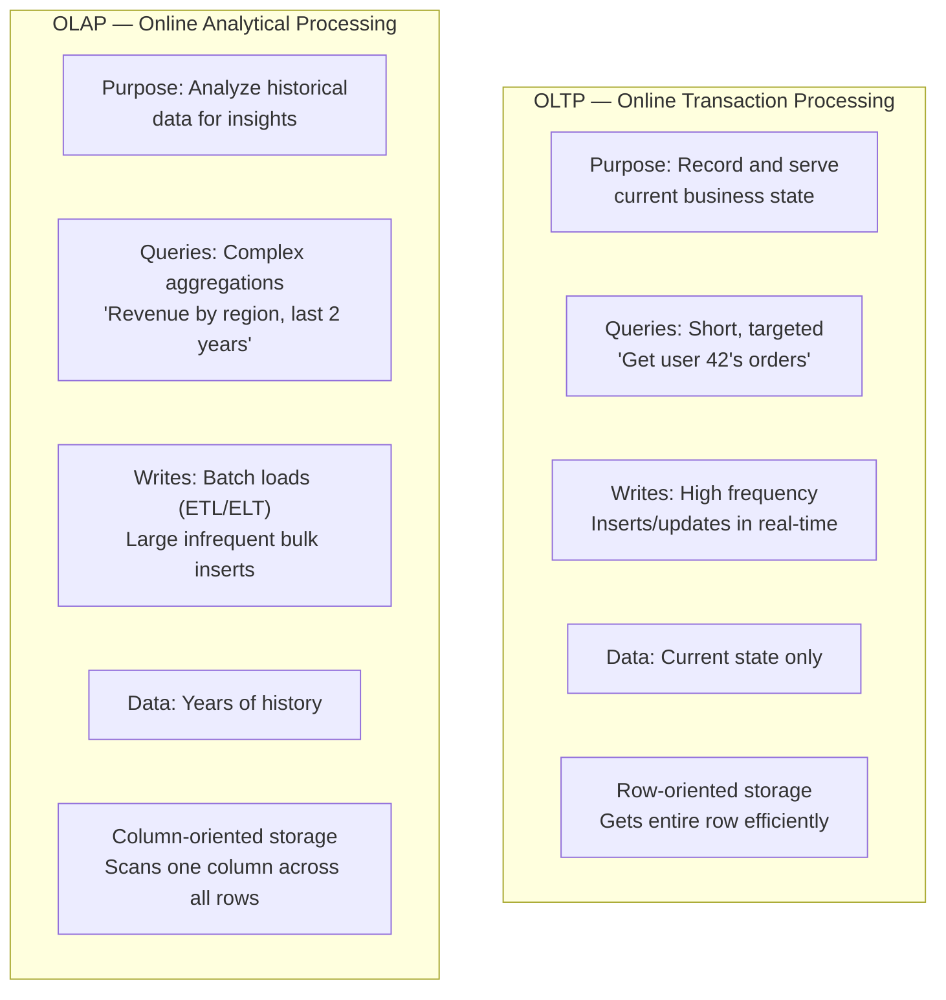
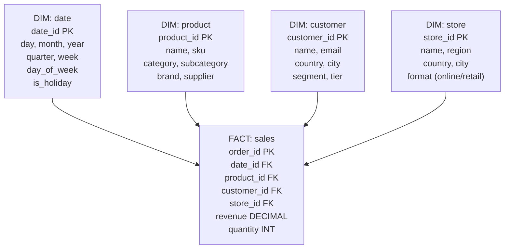
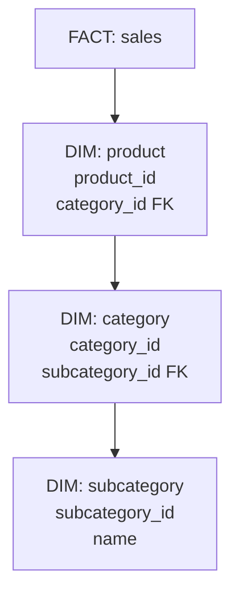
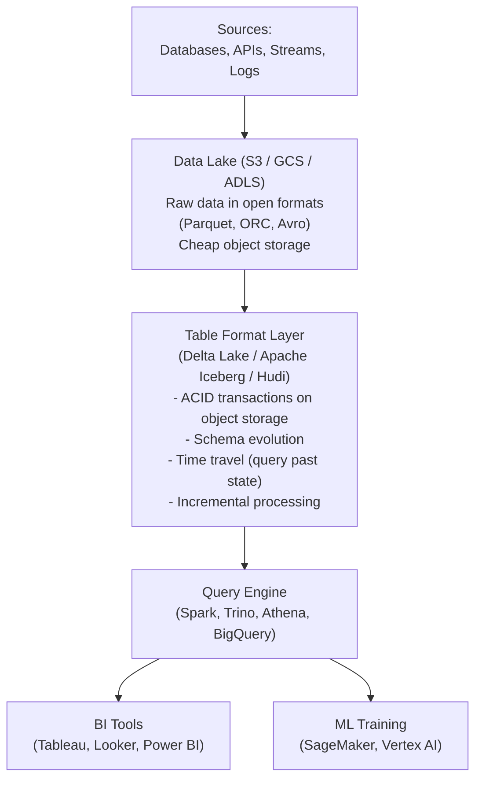

# Data Warehousing

A data warehouse is an analytical database system optimized for querying large volumes of historical data across many dimensions. Where operational databases (OLTP) are optimized for fast, short transactions on current data, warehouses are optimized for complex aggregations over billions of rows of historical data.

> **The core insight:** OLTP and analytics have opposite optimization requirements. An OLTP database row-stores data because you typically need all columns for one row (update a user). An analytics warehouse column-stores data because you typically need one column across all rows (sum of revenue for Q3). They should be different systems.

---

## OLTP vs. OLAP — The Fundamental Divide



| Dimension          | OLTP                          | OLAP                                  |
| ------------------ | ----------------------------- | ------------------------------------- |
| **Query pattern**  | Point lookups + simple joins  | Full table scans + heavy aggregations |
| **Rows per query** | 1–100                         | Millions–Billions                     |
| **Concurrency**    | Thousands of concurrent users | Dozens of analysts                    |
| **Data freshness** | Real-time                     | Delayed (hourly, daily)               |
| **Storage model**  | Row-oriented                  | Column-oriented                       |
| **Examples**       | PostgreSQL, MySQL             | Redshift, BigQuery, Snowflake         |

---

## Why Columnar Storage is Faster for Analytics

The key architectural difference between OLTP and OLAP is storage layout:

### Row Storage (OLTP)

```
Row 1: | user_id=1 | name="Alice" | country="US" | revenue=120.50 | date=2024-01-01 |
Row 2: | user_id=2 | name="Bob"   | country="EU" | revenue=89.99  | date=2024-01-02 |
Row 3: | user_id=3 | name="Carol" | country="US" | revenue=45.00  | date=2024-01-03 |
```

**For:** `SELECT * FROM orders WHERE user_id = 2` — reads exactly one row (fast)  
**Against:** `SELECT SUM(revenue) FROM orders` — reads ALL columns of ALL rows, then discards 4/5 columns (wasteful)

### Column Storage (OLAP)

```
user_id:  [1, 2, 3, 4, 5, ...]      ← one disk block per column
name:     ["Alice", "Bob", "Carol"]
country:  ["US", "EU", "US", ...]
revenue:  [120.50, 89.99, 45.00, ...]
date:     [2024-01-01, ...]
```

**For:** `SELECT SUM(revenue) FROM orders` — reads only the revenue column (1/5 of the data)  
**For compression:** Columns have homogeneous types → run-length encoding, dictionary encoding → 5–10x compression  
**For vectorized execution:** CPU can sum 8 doubles at once with SIMD instructions — no row overhead

**Benchmark:** A `SUM(revenue)` query on 1B rows:

- Row store: reads ~50 bytes/row × 1B rows = 50 GB from disk
- Column store: reads ~8 bytes/row × 1B rows = 8 GB, then 5–10x compressed = ~1 GB

---

## Dimensional Modeling

Warehouses use a specific schema design optimized for analytical queries: **star schema** or **snowflake schema**.

### Star Schema

A central **fact table** (business events: sales, clicks, page views) surrounded by **dimension tables** (the context: who, what, where, when):



**Query example:**

```sql
-- "Total revenue by product category in Q1 2024 for US customers"
SELECT p.category, SUM(f.revenue) AS total_revenue
FROM fact_sales f
JOIN dim_product  p ON f.product_id = p.product_id
JOIN dim_customer c ON f.customer_id = c.customer_id
JOIN dim_date     d ON f.date_id = d.date_id
WHERE d.year = 2024 AND d.quarter = 1
  AND c.country = 'US'
GROUP BY p.category
ORDER BY total_revenue DESC;
```

**Why star schema?** Joins are simple (always fact → dimension). Analytical tools (Tableau, Looker, Power BI) work natively with star schemas. Query optimizers can push down filters to dimension scans efficiently.

### Snowflake Schema

Dimensions are further normalized — subcategories become separate tables:



**Trade-off:** Snowflake schemas save storage (less duplication) but require more JOINs, which are slower in columnar systems. Most modern warehouses prefer the slight denormalization of star schema for query performance.

---

## ETL vs. ELT

**ETL (Extract → Transform → Load):**

Data is transformed before entering the warehouse. A traditional pipeline:

```
Source → Extract (raw) → Transform (clean, join, reshape) → Load (into warehouse)
```

**Used by:** Traditional data warehouses (Redshift with small clusters), on-premise systems, regulated industries (transform before storing to enforce privacy rules)

**ELT (Extract → Load → Transform):**

Raw data lands in the warehouse first. Transformation happens inside the warehouse using SQL:

```
Source → Extract (raw) → Load (raw into staging area) → Transform (SQL inside warehouse)
```

**Used by:** Modern cloud warehouses (BigQuery, Snowflake) where compute is cheap, separation of concerns between ingestion and transformation

**Why ELT is now preferred:**

- Warehouses have massive compute — transforms that took hours on a transform server take seconds in BigQuery
- Raw data is preserved — you can re-run transformations with different logic
- Tools like **dbt** (data build tool) make SQL-based transformations version-controlled and testable

```sql
-- dbt model: transform raw events into cleaned facts
-- File: models/fact_sales.sql
{{ config(materialized='incremental', unique_key='order_id') }}

SELECT
    o.order_id,
    o.created_at::date  AS order_date,
    p.product_key,
    c.customer_key,
    o.amount            AS revenue,
    o.quantity
FROM {{ source('raw', 'orders') }} o
JOIN {{ ref('dim_product') }}  p ON o.product_id = p.product_id
JOIN {{ ref('dim_customer') }} c ON o.user_id = c.user_id
WHERE o.status = 'completed'

    AND o.created_at > (SELECT MAX(order_date) FROM {{ this }})

```

---

## Modern Cloud Data Warehouses

### Amazon Redshift

- MPP (massively parallel processing) — workload distributed across many nodes
- Spectrum: query S3 data directly (data lake integration)
- RA3 nodes: separate storage (S3) from compute — scale each independently
- Best for: AWS shops with moderate query complexity

### Google BigQuery

- Serverless — no cluster to manage or provision
- Separates storage (Colossus) from compute (Dremel)
- Pay per query (bytes scanned) or flat-rate
- Automatic partition/clustering recommendations
- Best for: Ad-hoc analysis, GCP shops, variable workloads

### Snowflake

- Separate storage (S3/GCS/Azure Blob) from compute (virtual warehouses)
- Auto-suspend/resume compute — pay only when querying
- Data sharing: share live data across organizations without copying
- Multi-cloud: runs on AWS, GCP, Azure simultaneously
- Best for: Enterprise data sharing, multi-cloud, workload isolation

| Feature           | Redshift                  | BigQuery              | Snowflake               |
| ----------------- | ------------------------- | --------------------- | ----------------------- |
| **Pricing model** | Provisioned or serverless | Per query / flat-rate | Per compute credit      |
| **Setup**         | Cluster provisioning      | Serverless            | Virtual warehouse       |
| **Multi-cloud**   | AWS only                  | GCP only              | AWS + GCP + Azure       |
| **Scaling**       | Manual resize             | Automatic             | Manual warehouse sizing |
| **Data sharing**  | Limited                   | Analytics Hub         | Native, zero-copy       |

---

## Materialized Views and Pre-Aggregation

When queries are slow because they aggregate billions of rows at query time, pre-aggregate and cache results:

```sql
-- Create materialized view: pre-compute daily revenue by category
CREATE MATERIALIZED VIEW daily_revenue_by_category AS
SELECT
    d.date                    AS report_date,
    p.category,
    SUM(f.revenue)            AS total_revenue,
    COUNT(DISTINCT f.order_id) AS order_count
FROM fact_sales f
JOIN dim_date    d ON f.date_id    = d.date_id
JOIN dim_product p ON f.product_id = p.product_id
GROUP BY d.date, p.category;

-- Query now scans a tiny pre-aggregated result:
SELECT category, SUM(total_revenue)
FROM daily_revenue_by_category
WHERE report_date BETWEEN '2024-01-01' AND '2024-03-31'
GROUP BY category;
```

**Refresh strategies:**

- `FULL REFRESH` — recompute from scratch (slow, always correct)
- `INCREMENTAL REFRESH` — append new data since last refresh (fast, requires unique keys)
- **Scheduled refresh** — run every hour/day (acceptable staleness for dashboards)

---

## Data Lakehouse — The Modern Synthesis

Traditional architectures forced a choice: data lake (cheap, flexible, unstructured) vs. data warehouse (fast, structured, expensive). The **lakehouse** combines both:



**Key formats:**

- **Delta Lake (Databricks):** ACID transactions, time travel, Z-ordering (spatial clustering for faster queries)
- **Apache Iceberg (Netflix):** Partition evolution, schema evolution, hidden partitioning, row-level deletes
- **Apache Hudi (Uber):** Optimized for streaming upserts, record-level index

**The lakehouse advantage:** One copy of raw data serves both warehouse-style analytics and ML training. No data copying between lake and warehouse. Query with standard SQL via Trino/Spark SQL.

---

## Interview Talking Points

**1. What is the difference between a data warehouse and a regular database?**

> "A regular database (OLTP) is optimized for high-frequency, short transactions — it row-stores data so fetching a full row is fast. A data warehouse (OLAP) is optimized for complex analytical queries over billions of rows — it column-stores data so scanning one column (like revenue) across the entire dataset is fast. They serve opposite access patterns, which is why you need both in a production system."

**2. Why is columnar storage faster for analytics?**

> "Two reasons: I/O efficiency and compression. For an analytical query like SUM(revenue), row storage reads all 20 columns per row even though you need 1 — wasted I/O. Columnar storage reads only the revenue column — 5–10x less data. Second, columns have homogeneous types, enabling efficient compression (run-length encoding, dictionary encoding) — often 5–10x compression ratio. Less data on disk = less to read = faster queries."

**3. What is ETL vs. ELT and when would you use each?**

> "ETL transforms data before loading into the warehouse — useful for regulated industries where you must scrub PII before storage, or for legacy systems with limited compute. ELT loads raw data into the warehouse first, then transforms using SQL inside the warehouse. ELT is now the standard because modern cloud warehouses have vast compute, raw data is preserved for re-processing, and tools like dbt make SQL transformations version-controlled and testable."

**4. When would you recommend a data lakehouse over a traditional warehouse?**

> "When you have multiple consumers with different needs — analytical dashboards, ML model training, and ad-hoc exploration — and you don't want to maintain separate copies of data for each. A lakehouse uses open table formats (Iceberg, Delta Lake) on object storage to give ACID transactions, schema evolution, and time travel on cheap S3-like storage. It's also better when you have very large amounts of historical data (petabytes) that a traditional warehouse would be expensive to store."

---

## Key Takeaways

- **OLTP** stores current state for fast transactions; **OLAP** stores history for analytical queries — never use one system for both at scale
- **Columnar storage** is the foundational design of analytics databases — reads only relevant columns, compresses aggressively
- **Star schema** (fact + dimensions) is the standard warehouse data model — optimized for analytical JOINs with BI tools
- **ETL** transforms before loading; **ELT** loads raw data and transforms inside the warehouse — ELT is the modern standard
- **BigQuery**, **Redshift**, and **Snowflake** are the three dominant cloud warehouses — each with different pricing/scaling models
- **Materialized views** pre-aggregate expensive computations for fast dashboard queries
- The **data lakehouse** (Delta Lake, Iceberg) unifies cheap object storage with warehouse-grade ACID transactions and query performance
