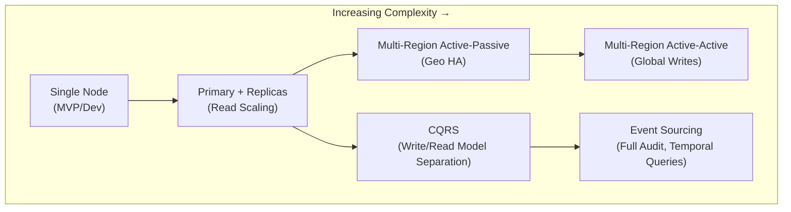
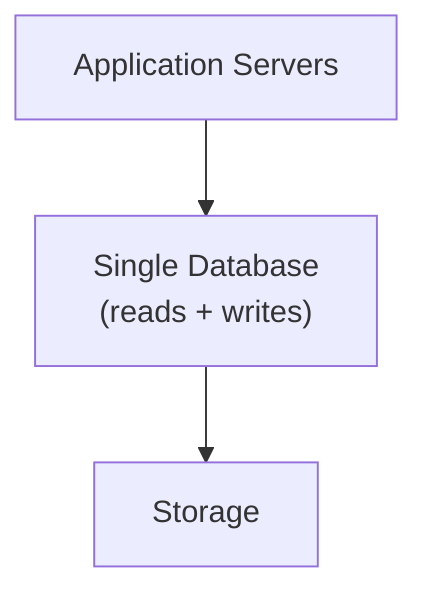
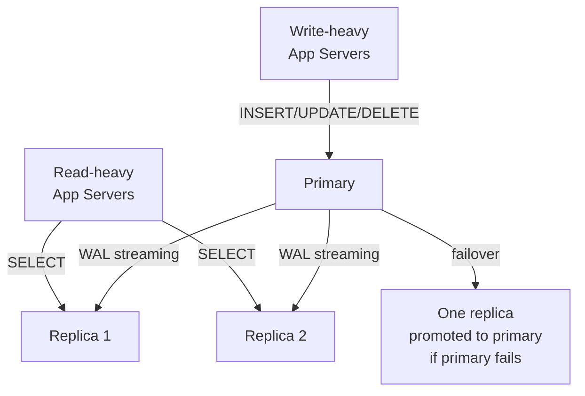
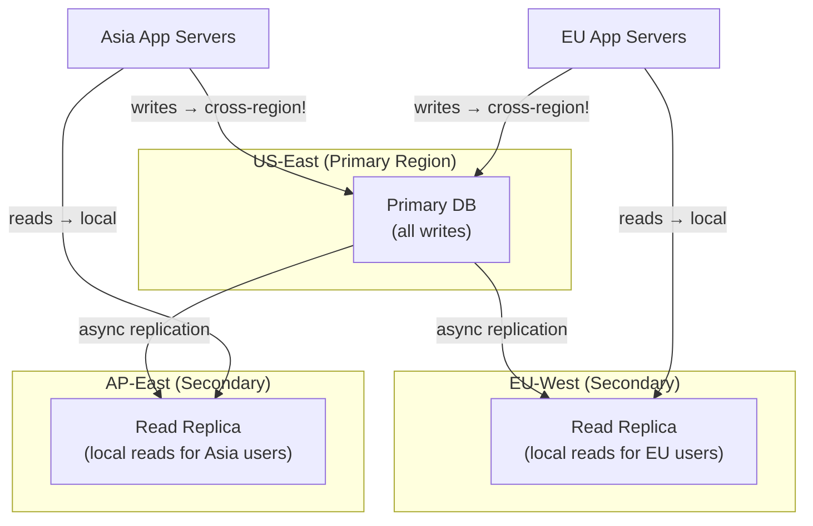
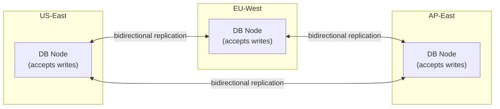
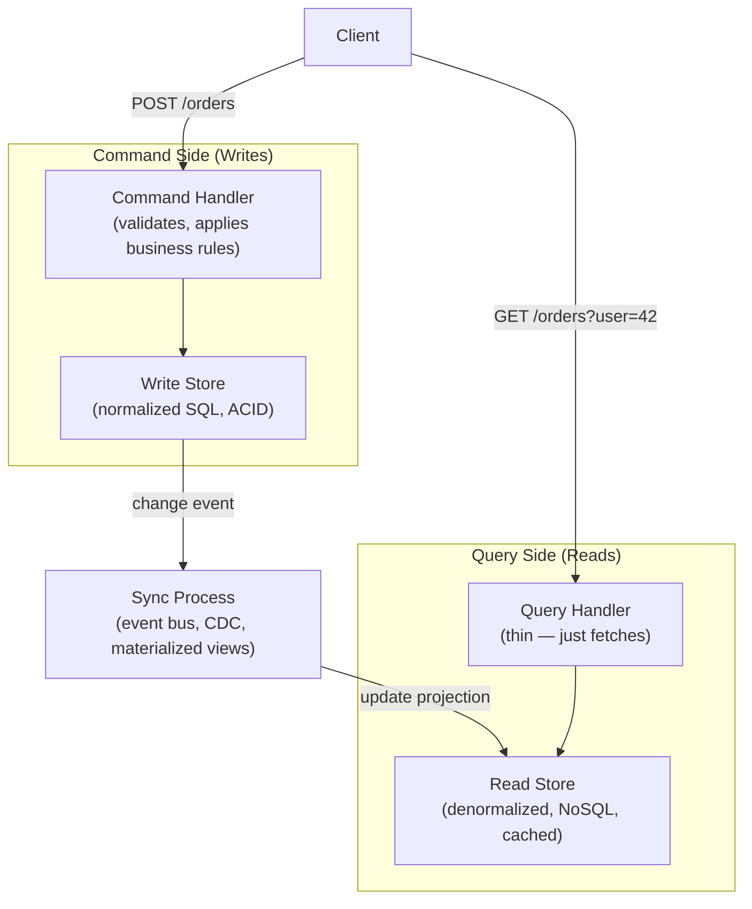
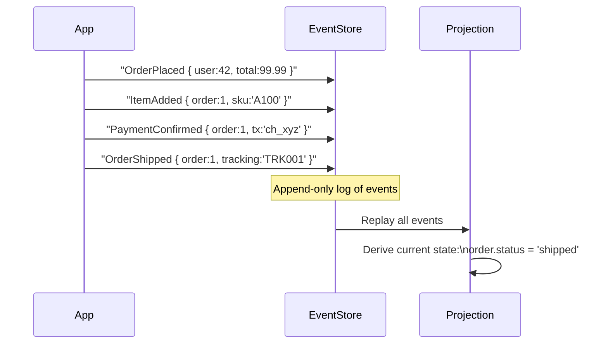
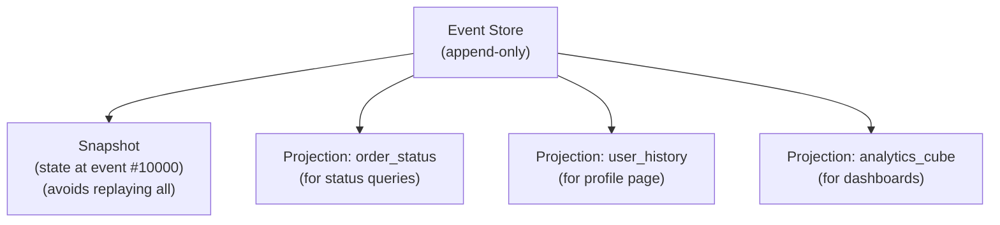

# Database Architectures

A database architecture is the structural pattern that governs how your database tier is deployed, how reads and writes flow, and how the system behaves under failure. Choosing the right architecture is as important as choosing the right database engine — a wrong architecture means you hit a wall at scale that requires painful migration.

> **In a system design interview, every architecture decision you make should be justified by your requirements** — traffic volume, read/write ratio, latency requirements, consistency guarantees, and budget. "We'll use primary-replica" without explaining why is a weak answer.

---

## Architecture Landscape



---

## 1. Single-Node Architecture

The simplest possible deployment: one database instance handles all reads and writes.



**Capacity:** Handles millions of rows, thousands of connections with proper indexes and tuning.

**Failure mode:** The database goes down → the entire application goes down.

**When to use:**

- Early-stage products (< 100K users)
- Internal tools, admin panels
- When simplicity and cost matter more than HA

**Scaling limits:**

- Vertical scaling only (bigger machine) — has a hard ceiling
- One machine = one point of failure
- Backups require downtime or careful PITR setup

---

## 2. Primary-Replica Architecture

The most common production architecture. One primary accepts all writes; one or more replicas serve reads.



**Benefits:**

- Read queries distributed across replicas (scale reads horizontally)
- Replica can be promoted if primary fails (HA)
- Replicas can serve analytics/reporting without impacting primary

**Limitations:**

- Write bottleneck: all writes still go to one node
- Replication lag: replicas can be behind (eventual consistency for reads)
- Failover is not instant (Patroni, PgBouncer, or managed HA takes 30–60 seconds)

**Connection routing pattern:**

```python
# Application-level read/write splitting
class DatabaseRouter:
    def db_for_read(self, model):
        return 'replica'   # Django ORM example

    def db_for_write(self, model):
        return 'primary'
```

**Used by:** The majority of production web applications — Airbnb, GitHub, Shopify all started here.

---

## 3. Multi-Region Active-Passive

The primary lives in one region; replicas live in other regions. Reads can be served locally in each region; writes always cross-region to the primary.



**Benefits:**

- Local read latency for users in each region
- Regional failover — if US-East fails, promote EU replica to primary

**Limitations:**

- Write latency is global — every write must reach the primary (can be 100–200ms cross-region)
- Replication lag is measured in seconds across continents
- Failover promotes one replica — the others must resync

**When to use:**

- Read-heavy global apps (news, media, reference data)
- Apps where write latency can be tolerated or writes are infrequent
- Compliance: data residency (EU data stays in EU for reads)

---

## 4. Multi-Region Active-Active

Every region is both primary and replica simultaneously. Writes are accepted in any region and replicated globally.



**Benefits:**

- Lowest possible write and read latency for global users
- Survives full regional outage with no data loss
- No single point of failure

**Limitations:**

- **Conflict resolution is hard:** Two regions update the same row simultaneously — which wins?
- CAP theorem: you must choose between consistency and availability — most active-active systems choose availability + eventual consistency
- Operationally very complex — debugging replication conflicts is difficult

**Conflict resolution strategies:**
| Strategy | How | Risk |
|---|---|---|
| Last-Write-Wins (LWW) | Highest timestamp wins | Clock skew → wrong winner |
| Application merge | App defines merge logic | Complex, per-field logic |
| CRDT | Data structure auto-merges | Limited data types |
| Avoid conflicts | Route user to same region always | Reduces global flexibility |

**Used by:** Amazon DynamoDB Global Tables, Google Spanner, CockroachDB, Cassandra (multi-datacenter)

---

## 5. CQRS — Command Query Responsibility Segregation

CQRS separates the **write model** (commands) from the **read model** (queries). They can use completely different data stores, schemas, and optimization strategies.



**The key insight:** Your write model is normalized for correctness (foreign keys, constraints, ACID). Your read model is denormalized for speed (pre-joined, pre-aggregated, stored in a shape that matches what the UI needs).

**Example:** An e-commerce order system:

- **Write side:** Orders table, line items table, inventory table — normalized SQL
- **Read side:** A MongoDB document `{ user: {...}, orders: [{items: [...]}] }` — already shaped for the order history page

**Benefits:**

- Read and write stores can scale independently
- Read model can be optimized per query pattern without touching write model
- Multiple read models for different consumers (dashboard view vs. mobile view vs. analytics)

**Limitations:**

- Eventual consistency between write and read models
- Increased infrastructure cost (two stores)
- Sync complexity — what if the sync fails? Idempotency needed

**When to use:** High read-to-write ratios (95% reads), complex domain logic on writes, need for different read projections of the same data.

---

## 6. Event Sourcing

Instead of storing the **current state**, store every **event that led to that state**. The current state is derived by replaying events.



**Benefits:**

- Full audit trail — every change is recorded with who, what, and when
- Time travel — replay events to see state at any point in time
- Event replay — replay events to build new projections/read models
- Natural fit for event-driven microservices

**Limitations:**

- Reading current state requires replaying events (mitigated by snapshots)
- Event schema evolution is hard — old events must still be replayable
- Querying is limited — you can't `SELECT * FROM orders WHERE status='pending'` directly
- Mental model shift — hard for teams used to CRUD



**When to use:**

- Financial systems (transactions are immutable events)
- Audit-required systems (healthcare, compliance)
- Collaborative editing (Google Docs stores operations, not state)
- Gaming (player action log)

---

## Architecture Comparison Table

| Architecture         | Read Scalability        | Write Scalability      | Consistency           | Complexity     | Best For                       |
| -------------------- | ----------------------- | ---------------------- | --------------------- | -------------- | ------------------------------ |
| Single Node          | ❌ Limited              | ❌ Limited             | ✅ Strong             | ✅ Low         | MVP, internal tools            |
| Primary-Replica      | ✅ High                 | ❌ One node            | ⚠️ Lag                | ✅ Low-Medium  | Most production apps           |
| Multi-Region Passive | ✅ Local reads          | ❌ One primary         | ⚠️ Lag                | ⚠️ Medium      | Read-heavy global apps         |
| Multi-Region Active  | ✅ Local reads + writes | ✅ Global writes       | ❌ Eventual           | ❌ High        | Global high-traffic            |
| CQRS                 | ✅ Optimized models     | ✅ Separate write path | ⚠️ Eventual           | ⚠️ Medium-High | Read-heavy, complex domain     |
| Event Sourcing       | ⚠️ Via projections      | ✅ Append-only         | ✅ (events immutable) | ❌ High        | Audit, financial, event-driven |

---

## Interview Talking Points

**1. How would you design the database architecture for a new global SaaS product?**

> "I'd start with primary-replica — one primary, replicas for reads and HA. As the product grows, I'd add read replicas in each region for local latency. If write volume hits limits, I'd look at partitioning, then CQRS to separate read/write stores, and only shard as a last resort. For a global product with significant write volume from multiple regions, I'd evaluate CockroachDB or DynamoDB Global Tables for active-active."

**2. When would you use CQRS?**

> "CQRS makes sense when reads and writes have very different optimization needs. If I have 95% reads, I can maintain a denormalized read model that's already shaped for the UI — no joins, no aggregation at query time. It also helps when the write model has complex business rules (domain logic) that shouldn't be mixed with query concerns. The trade-off is eventual consistency and more infrastructure."

**3. Explain event sourcing and when you'd recommend it.**

> "Event sourcing stores the history of state changes as immutable events rather than storing current state. To read current state, you replay the event log. Key benefits: full audit trail (who changed what and when), time travel to see past state, and the ability to build new projections by replaying events with new logic. I'd recommend it for financial systems, compliance-heavy domains, or collaborative tools. The trade-off is complexity — schema evolution of old events is hard, and you need projections for efficient queries."

---

## Key Takeaways

- Start with **single-node**, evolve to **primary-replica** as you grow — don't over-engineer early
- **Multi-region active-passive** solves read latency globally but write latency still crosses regions
- **Multi-region active-active** solves global write latency but requires conflict resolution — very complex
- **CQRS** separates write and read models — powerful for read-heavy systems with complex write logic
- **Event sourcing** stores events, not state — excellent for audit trails and temporal queries, at the cost of complexity
- Match the architecture to your requirements: consistency needs, traffic pattern, team capability, and budget
