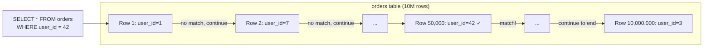
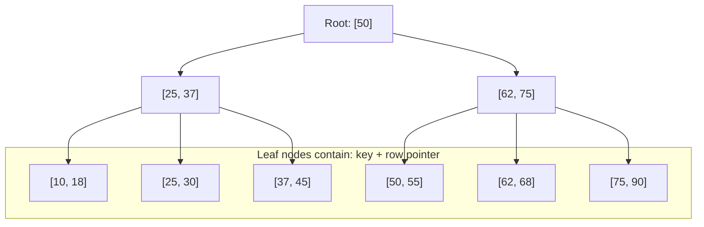
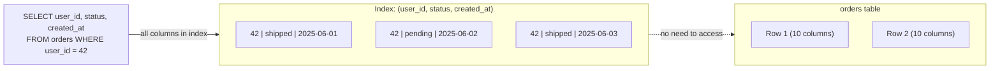

# Database Indexing

An index is a separate data structure that the database maintains alongside your table to make certain queries dramatically faster. The right index turns a query that scans millions of rows into one that reads tens. The wrong index — or missing index — is the single most common cause of database performance problems.

> **The fundamental tradeoff:** Indexes speed up reads but slow down writes. Every INSERT, UPDATE, and DELETE must also update all relevant indexes. Indexes consume disk space. The art of indexing is knowing which queries need indexes, and which are fast enough without them.

---

## Why Tables Are Slow Without Indexes

Without an index, every query requires a **Sequential Scan** — the database reads every row to find matches:



**A 10-million-row table with no index on `user_id` requires reading all 10 million rows for every query.** At 10ms per full scan, that's painfully slow. With an index, the same query reads tens of rows.

---

## B-Tree Index — The Universal Default

B-Tree (Balanced Tree) is the default index type in PostgreSQL, MySQL, and virtually every relational database. It stores keys in a sorted tree structure where every leaf is equidistant from the root.



**B-Tree properties:**

- **Height is O(log N)** — finding any row in 10M rows takes ~24 steps
- **Sorted order** — range queries (`BETWEEN`, `<`, `>`, `ORDER BY`) are efficient
- **Supports equality and range** — `=`, `<`, `>`, `<=`, `>=`, `BETWEEN`, `LIKE 'prefix%'`

```sql
CREATE INDEX idx_orders_user_id ON orders (user_id);

-- All these queries can use the index:
SELECT * FROM orders WHERE user_id = 42;                   -- equality
SELECT * FROM orders WHERE user_id BETWEEN 10 AND 50;      -- range
SELECT * FROM orders WHERE user_id > 100 ORDER BY user_id; -- range + sort
```

---

## Hash Index

Stores a hash of the key. Extremely fast for exact equality lookups — O(1). But useless for range queries or sorting.

```
Hash: user_id → hash(user_id) → bucket → row pointer
Lookup: O(1) for equality
```

```sql
CREATE INDEX idx_orders_hash ON orders USING HASH (user_id);

SELECT * FROM orders WHERE user_id = 42;  -- ✅ uses hash index
SELECT * FROM orders WHERE user_id > 42;  -- ❌ cannot use hash index
```

**When to use:** Equality-only lookup columns, cache key lookups, UUID columns. In PostgreSQL, hash indexes are rarely preferred over B-Trees because B-Trees are nearly as fast for equality and also support ranges.

---

## Composite (Multi-Column) Index

An index on multiple columns. The **column order matters enormously**.

```sql
CREATE INDEX idx_orders_user_status ON orders (user_id, status, created_at);
```

This index can be used for queries that filter on:

- `user_id` alone
- `user_id` + `status`
- `user_id` + `status` + `created_at`

But **NOT** for queries filtering only on `status` or only on `created_at`.

**The left-prefix rule:** A composite index on `(A, B, C)` is usable as an index on `(A)`, `(A, B)`, or `(A, B, C)` — but not `(B)`, `(C)`, or `(B, C)` alone.

```sql
-- ✅ Uses (user_id, status, created_at) index:
SELECT * FROM orders WHERE user_id = 42;
SELECT * FROM orders WHERE user_id = 42 AND status = 'shipped';
SELECT * FROM orders WHERE user_id = 42 AND status = 'shipped' AND created_at > '2025-01-01';

-- ❌ Cannot use the composite index:
SELECT * FROM orders WHERE status = 'shipped';                -- skips user_id
SELECT * FROM orders WHERE created_at > '2025-01-01';         -- skips user_id
```

**Column ordering strategy:**

1. Put equality-filter columns first
2. Then range-filter columns
3. Then sort columns (`ORDER BY`)

```sql
-- Query: "Get user 42's shipped orders sorted by date"
-- Best index: (user_id, status, created_at)
SELECT * FROM orders
WHERE user_id = 42 AND status = 'shipped'
ORDER BY created_at DESC;
```

---

## Covering Index

An index that contains all columns a query needs — so the database can answer the query entirely from the index without touching the main table.



**PostgreSQL syntax (INCLUDE clause):**

```sql
-- Include extra columns so queries are covered
CREATE INDEX idx_orders_covering ON orders (user_id, status)
INCLUDE (created_at, amount);

-- This query is now fully covered — no table heap access:
SELECT user_id, status, created_at, amount
FROM orders WHERE user_id = 42 AND status = 'shipped';
```

**Performance impact:** A covering index can be 10–100x faster because it eliminates random I/O to the table heap.

---

## Partial Index

An index on a subset of rows — only rows matching a `WHERE` condition:

```sql
-- Only index active users (90% of queries are for active users)
CREATE INDEX idx_users_active_email ON users (email)
WHERE status = 'active';

-- Only index unfulfilled orders
CREATE INDEX idx_orders_pending ON orders (created_at)
WHERE status = 'pending';
```

**Benefits:**

- Smaller index → faster scans, less memory pressure
- Queries that include the partial condition can use it
- Fewer writes to maintain (only updated when matching rows change)

**Real-world example:** A soft-delete pattern: `WHERE deleted_at IS NULL`. Most queries filter out deleted rows anyway. A partial index on the active rows makes this dramatically faster and smaller.

---

## Index Types by Database Feature

### Full-Text Search Index (GIN)

```sql
-- PostgreSQL full-text search
CREATE INDEX idx_articles_search ON articles
USING GIN (to_tsvector('english', title || ' ' || body));

-- Use it:
SELECT * FROM articles
WHERE to_tsvector('english', title || ' ' || body) @@ plainto_tsquery('database performance');
```

### JSONB Index (GIN)

```sql
-- Index for querying inside JSONB columns
CREATE INDEX idx_products_specs ON products USING GIN (specs);

-- Query nested JSON:
SELECT * FROM products WHERE specs @> '{"ram_gb": 16}';
```

### Spatial Index (GIST)

```sql
-- PostGIS for geographic data
CREATE INDEX idx_locations_coords ON locations USING GIST (coordinates);

-- Find restaurants within 5km
SELECT * FROM restaurants
WHERE ST_DWithin(coordinates, ST_MakePoint(40.7128, -74.0060)::geography, 5000);
```

---

## Reading EXPLAIN ANALYZE — The Indexing Detective Tool

```sql
EXPLAIN (ANALYZE, BUFFERS)
SELECT * FROM orders WHERE user_id = 42 AND status = 'shipped';
```

**Without index:**

```
Seq Scan on orders  (cost=0.00..45231.00 rows=127 width=248)
                    (actual time=0.15..312.4 rows=127 loops=1)
  Filter: ((user_id = 42) AND (status = 'shipped'))
  Rows Removed by Filter: 4873119
Buffers: shared hit=24218 read=3102          ← 3102 disk reads!
Planning Time: 0.3 ms
Execution Time: 312.7 ms                      ← 312ms!
```

**With `CREATE INDEX idx_orders_user_status ON orders(user_id, status)`:**

```
Index Scan using idx_orders_user_status on orders
            (cost=0.56..684.23 rows=127 width=248)
            (actual time=0.04..1.2 rows=127 loops=1)
  Index Cond: ((user_id = 42) AND (status = 'shipped'))
Buffers: shared hit=133 read=0               ← 0 disk reads!
Planning Time: 0.4 ms
Execution Time: 1.3 ms                        ← 1.3ms!
```

**240x speedup** from one index.

### Key EXPLAIN terms

| Term                | Meaning                                  | What to look for                                  |
| ------------------- | ---------------------------------------- | ------------------------------------------------- |
| `Seq Scan`          | Reading entire table                     | Should only appear on small tables                |
| `Index Scan`        | Using index, then fetching rows          | Good for selective queries                        |
| `Index Only Scan`   | Fully covered by index                   | Best case — no table access                       |
| `Bitmap Index Scan` | Multiple indexes combined                | Good for OR conditions                            |
| `Nested Loop`       | For each row in A, find in B             | Good for small result sets                        |
| `Hash Join`         | Build hash table for B, probe for each A | Good for large joins                              |
| `Merge Join`        | Both inputs sorted, merge together       | Good when both are sorted                         |
| `cost=X..Y`         | Estimated I/O cost (X=startup, Y=total)  | Compare relative costs                            |
| `actual time`       | Real measured time                       | Actual vs estimate divergence signals stale stats |

---

## Index Maintenance and Operational Concerns

### Index Bloat

PostgreSQL's MVCC means deleted rows leave dead tuples behind. Index entries for dead tuples remain until VACUUM runs:

```sql
-- Check index bloat
SELECT schemaname, tablename, indexname,
       pg_size_pretty(pg_relation_size(indexrelid)) AS index_size
FROM pg_stat_user_indexes
ORDER BY pg_relation_size(indexrelid) DESC;

-- Rebuild a bloated index without locking the table
REINDEX INDEX CONCURRENTLY idx_orders_user_id;
```

### Creating Indexes Without Locking

A standard `CREATE INDEX` on a large table **locks the table** for the entire operation — potentially minutes of downtime:

```sql
-- Bad: locks the table for minutes
CREATE INDEX idx_orders_user_id ON orders (user_id);

-- Good: builds index without locking (but takes longer)
CREATE INDEX CONCURRENTLY idx_orders_user_id ON orders (user_id);
```

Always use `CONCURRENTLY` in production.

### Statistics and the Query Planner

PostgreSQL uses statistics about column value distributions to choose query plans. Stale statistics cause poor plan choices:

```sql
-- Refresh statistics on a specific table
ANALYZE orders;

-- Check when stats were last collected
SELECT relname, last_analyze, last_autoanalyze
FROM pg_stat_user_tables WHERE relname = 'orders';
```

If the planner chooses a sequential scan over an obviously useful index, stale statistics are often the culprit.

---

## Index Anti-Patterns

| Anti-Pattern                               | Problem                                            | Fix                                             |
| ------------------------------------------ | -------------------------------------------------- | ----------------------------------------------- |
| Index on every column                      | Writes slowed 5–10x, massive disk usage            | Index only queried columns                      |
| Index on low-cardinality columns           | `status` with 3 values: index not selective enough | Skip or use partial index                       |
| Unused indexes                             | Disk waste, write overhead                         | Drop them (`pg_stat_user_indexes.idx_scan = 0`) |
| `LIKE '%keyword%'` on B-Tree               | Leading wildcard disables index                    | Full-text index (GIN)                           |
| Function in WHERE without functional index | `WHERE LOWER(email) = '...'` skips index           | `CREATE INDEX ON users(LOWER(email))`           |
| Implicit type cast                         | `WHERE user_id = '42'` (string vs integer)         | Ensure types match                              |

---

## Interview Talking Points

**1. What is an index and how does it work?**

> "An index is a separate data structure — typically a B-Tree — built alongside the table. The B-Tree stores sorted values of the indexed column alongside pointers to the actual rows. This lets the database find matching rows in O(log N) time instead of scanning every row O(N). The tradeoff: every write must also update the index, adding write overhead."

**2. When would you add a composite index vs. two separate indexes?**

> "A composite index on `(user_id, status)` is perfect for queries that filter on both columns together. Two separate indexes would require the planner to use a bitmap scan and merge them, which is less efficient. The column order matters — most selective or equality-filtered columns go first."

**3. What is a covering index?**

> "A covering index includes all the columns a query needs, so the database can answer entirely from the index without touching the table heap. This eliminates random I/O to the main table, which is often the bottleneck. In PostgreSQL, you add non-key columns using `INCLUDE`."

**4. How would you investigate a slow query?**

> "Run `EXPLAIN ANALYZE` to see the actual query plan. I look for sequential scans on large tables, high row estimates that don't match actuals (stale statistics), and large numbers of rows removed by filters. If I see a seq scan on a large table with a selective filter, an index is usually the fix. Then verify with `EXPLAIN ANALYZE` after adding the index."

---

## Key Takeaways

- **B-Tree** is the default — excellent for equality, range, sort. Use it for almost everything
- **Composite index column order** follows the left-prefix rule — equality columns first, range/sort columns last
- **Covering indexes** eliminate table heap access — critical for high-frequency read paths
- **Partial indexes** on subsets of rows (e.g., `WHERE status = 'active'`) are smaller and faster
- **`CREATE INDEX CONCURRENTLY`** is mandatory in production — standard `CREATE INDEX` locks the table
- **`EXPLAIN ANALYZE`** is the ground truth — always verify index effectiveness with real plan output, not assumptions
- Too many indexes hurt write performance — regularly audit and drop unused indexes
