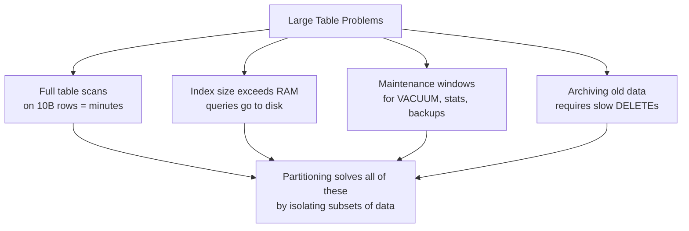
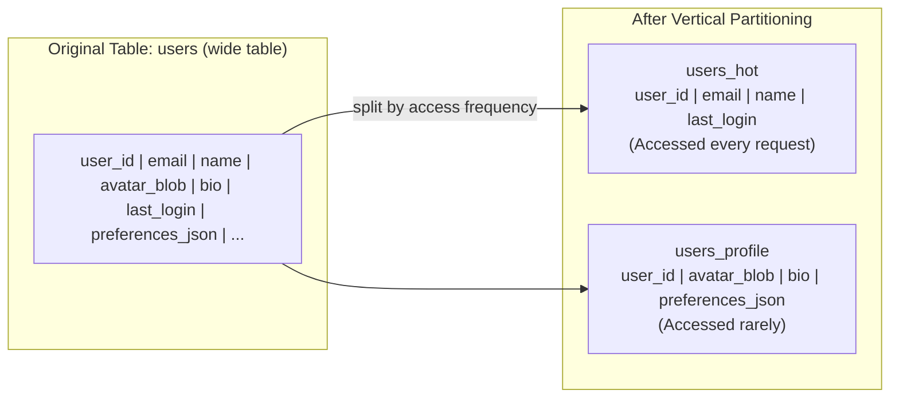

# Database Partitioning

Partitioning divides a large table into smaller, more manageable pieces called **partitions** — but all within the same database instance or cluster. Unlike sharding, partitioning is transparent to the application: the table looks and acts as one logical entity.

> **Partitioning vs. Sharding:** Partitioning splits data within a single node (or across nodes in the same cluster). Sharding splits data across completely independent database instances. Partitioning is a built-in database feature; sharding is an architecture pattern. You should partition before you shard.

---

## Why Partition?



With partitioned tables:

- Queries that filter on the partition key only touch relevant partitions (**partition pruning**)
- Each partition has its own index — index size stays manageable
- You can drop an old partition (instant) instead of deleting millions of rows (slow)
- Maintenance operations can run per-partition instead of locking the whole table

---

## Partition Types

### Range Partitioning

Rows are distributed based on a range of values. Most common for time-series data:

```sql
-- PostgreSQL declarative partitioning (range)
CREATE TABLE orders (
    order_id   BIGINT NOT NULL,
    user_id    BIGINT,
    amount     DECIMAL(12, 2),
    created_at TIMESTAMPTZ NOT NULL
) PARTITION BY RANGE (created_at);

-- Monthly partitions
CREATE TABLE orders_2024_01
    PARTITION OF orders
    FOR VALUES FROM ('2024-01-01') TO ('2024-02-01');

CREATE TABLE orders_2024_02
    PARTITION OF orders
    FOR VALUES FROM ('2024-02-01') TO ('2024-03-01');

-- Create future partitions automatically (pg_partman extension)
```

**Result:**

```
orders (parent — logical)
├── orders_2024_01 (physical partition: Jan 2024)
├── orders_2024_02 (physical partition: Feb 2024)
├── orders_2024_03 (physical partition: Mar 2024)
└── ...
```

**Best for:** Time-series data, audit logs, IoT sensor readings, financial transactions

**Hot spot risk:** All current writes go to the newest partition (same as range sharding). Mitigate by combining with hash sub-partitioning.

### List Partitioning

Rows are distributed based on discrete values — perfect for categorical data:

```sql
CREATE TABLE orders (
    order_id BIGINT NOT NULL,
    region   VARCHAR(10) NOT NULL,
    amount   DECIMAL(12, 2)
) PARTITION BY LIST (region);

CREATE TABLE orders_us  PARTITION OF orders FOR VALUES IN ('US', 'CA', 'MX');
CREATE TABLE orders_eu  PARTITION OF orders FOR VALUES IN ('GB', 'DE', 'FR', 'ES');
CREATE TABLE orders_apac PARTITION OF orders FOR VALUES IN ('AU', 'JP', 'SG', 'IN');
```

**Best for:** Country/region, tenant category, product category, status codes

**Pitfall:** Inserting a row with an unlisted value (`region = 'ZZ'`) fails unless a default partition exists.

### Hash Partitioning

A hash of the partition key value distributes rows evenly across a fixed number of partitions:

```sql
CREATE TABLE users (
    user_id BIGINT NOT NULL,
    email   TEXT,
    name    TEXT
) PARTITION BY HASH (user_id);

CREATE TABLE users_p0 PARTITION OF users FOR VALUES WITH (MODULUS 4, REMAINDER 0);
CREATE TABLE users_p1 PARTITION OF users FOR VALUES WITH (MODULUS 4, REMAINDER 1);
CREATE TABLE users_p2 PARTITION OF users FOR VALUES WITH (MODULUS 4, REMAINDER 2);
CREATE TABLE users_p3 PARTITION OF users FOR VALUES WITH (MODULUS 4, REMAINDER 3);
```

**Best for:** Ensuring even distribution when there's no natural range or category. No hotspots.

**Trade-off:** Range queries scatter across all partitions (no pruning for `WHERE user_id BETWEEN 1 AND 1000`).

### Composite Partitioning (Sub-partitioning)

Combine two partition strategies for fine-grained control:

```sql
-- First partition by range (year), then by list (region)
CREATE TABLE events (
    event_id   BIGINT,
    event_date DATE NOT NULL,
    region     TEXT NOT NULL
) PARTITION BY RANGE (event_date);

CREATE TABLE events_2024 PARTITION OF events
    FOR VALUES FROM ('2024-01-01') TO ('2025-01-01')
    PARTITION BY LIST (region);

CREATE TABLE events_2024_us  PARTITION OF events_2024 FOR VALUES IN ('US');
CREATE TABLE events_2024_eu  PARTITION OF events_2024 FOR VALUES IN ('EU');
```

**Best for:** Complex access patterns that filter on two dimensions (time + region, tenant + date)

---

## Partition Pruning — How the Optimizer Helps You

Partition pruning is the query optimizer's ability to skip irrelevant partitions entirely:

```sql
-- This query only scans orders_2024_03 — other 23 partitions untouched
SELECT SUM(amount)
FROM orders
WHERE created_at BETWEEN '2024-03-01' AND '2024-03-31';
```

**EXPLAIN to verify pruning is happening:**

```sql
EXPLAIN SELECT * FROM orders WHERE created_at = '2024-06-15';

-- Output:
-- Append
--   -> Seq Scan on orders_2024_06  (cost=0.00..52.38 rows=10 width=32)
--        Filter: (created_at = '2024-06-15')
-- (3 partitions pruned; 23 of 24 partitions not scanned)
```

**Pruning requirements:**

- The `WHERE` clause must filter on the partition key column
- The filter value must be a constant or foldable expression (not a function call on another column)
- Static pruning happens at plan time; dynamic pruning happens at execution time (for joins)

**Common mistake:** Using `WHERE date_trunc('month', created_at) = '2024-03-01'` — the function wraps the partition key, preventing pruning. Use `WHERE created_at >= '2024-03-01' AND created_at < '2024-04-01'` instead.

---

## Partition Maintenance Operations

One of the biggest operational benefits of partitioning is efficient data lifecycle management:

### Dropping Old Data (Instant)

```sql
-- Delete all Jan 2022 data — takes milliseconds, no table lock
DROP TABLE orders_2022_01;

-- vs. DELETE without partitioning — takes hours, locks the table
DELETE FROM orders WHERE created_at < '2022-02-01';  -- 500M rows = hours
```

### Archiving (Moving to Cold Storage)

```sql
-- Detach the partition from the parent table
ALTER TABLE orders DETACH PARTITION orders_2022_01;

-- The old partition is now a standalone table
-- Archive it to a cold storage system, compress it, or move to a different tablespace
ALTER TABLE orders_2022_01 SET TABLESPACE cold_storage;
```

### Adding New Partitions (Automated)

Use `pg_partman` to automate partition creation and maintenance:

```sql
-- Install pg_partman extension
CREATE EXTENSION pg_partman;

-- Set up auto-maintenance for monthly partitions
SELECT partman.create_parent(
    p_parent_table := 'public.orders',
    p_control      := 'created_at',
    p_interval     := '1 month',
    p_premake      := 3  -- pre-create 3 future partitions
);
```

---

## Vertical Partitioning

The above types are all **horizontal partitioning** — splitting rows. **Vertical partitioning** splits columns:



**Benefits:**

- Frequently accessed columns stay in a narrow, cache-friendly table
- Large blob/text columns don't pollute the hot path
- Can place cold data in cheaper storage

**In practice:** Vertical partitioning is usually done manually by creating separate tables and using JOINs or separate queries. Object-relational mappers (ORMs) can abstract this with lazy loading.

---

## Comparison: Partitioning vs. Sharding

| Dimension                   | Partitioning                          | Sharding                                    |
| --------------------------- | ------------------------------------- | ------------------------------------------- |
| **Scope**                   | Within one database node (or cluster) | Across independent database instances       |
| **Transparency**            | Transparent — app sees one table      | Requires routing logic in app or middleware |
| **Cross-partition queries** | Efficient (optimizer handles it)      | Expensive scatter-gather                    |
| **Transactions**            | Full ACID across partitions           | Cross-shard transactions are very hard      |
| **Operational complexity**  | Low-Medium                            | Very High                                   |
| **Scale ceiling**           | One server's capacity                 | Theoretically unlimited                     |
| **When to use**             | First step for large tables           | When single node can't handle the load      |

**The rule:** Always partition before you shard. Many systems that think they need sharding actually just need good partitioning + a read replica.

---

## Real-World Partitioning Patterns

### Time-Series Data (IoT, Logs, Metrics)

```
sensor_readings (parent)
├── sensor_readings_2024_w01 (week 1)
├── sensor_readings_2024_w02 (week 2)
...
```

- Retain only 90 days of data: drop oldest partition weekly
- Each week's partition fits in RAM for fast access
- Used by: TimescaleDB (PostgreSQL extension built entirely around partitioning)

### Multi-Tenant SaaS (List Partitioning by Tenant)

```
events (parent)
├── events_tenant_001 (Small Co)
├── events_tenant_002 (Big Enterprise — gets its own partition)
├── events_tenant_other (catch-all for small tenants)
```

- Large tenants get dedicated partitions (own maintenance window, own indexes)
- Small tenants share a "catch-all" partition

### E-Commerce Orders (Range by Year + Hash by Shard)

```
orders_2024 (range partition)
├── orders_2024_p0 (hash partition: user_id % 4 = 0)
├── orders_2024_p1 (hash partition: user_id % 4 = 1)
├── orders_2024_p2 (hash partition: user_id % 4 = 2)
└── orders_2024_p3 (hash partition: user_id % 4 = 3)
```

---

## Interview Talking Points

**1. What is the difference between partitioning and sharding?**

> "Partitioning divides a table within a single database instance — it's a database feature that's transparent to the application. Sharding splits data across completely independent database servers, requiring routing logic in the application or middleware. Partitioning should always be considered first; sharding is a last resort when a single server can't handle the scale."

**2. How does partition pruning work?**

> "The query optimizer examines the WHERE clause at plan time. If the filter is on the partition key and can be evaluated statically, the optimizer marks entire partitions as irrelevant and skips scanning them. A query on a 10-billion-row table with 120 monthly partitions that filters on `created_at` for one month will only scan roughly 1/120th of the data. Common mistake: wrapping the partition key in a function like `date_trunc()` defeats pruning."

**3. Why is dropping an old partition much faster than DELETE?**

> "A `DROP TABLE` on a partition is a metadata operation — it removes a file system reference. The PostgreSQL catalog entry for that physical partition is removed, and the OS releases the disk space. `DELETE FROM orders WHERE created_at < '2023-01-01'` must find and remove each row individually, update all indexes, write UNDO/WAL records for each row, and eventually run `VACUUM` to reclaim space. Dropping a partition for 500 million rows takes milliseconds; DELETE takes hours and locks the table."

**4. When would you choose list partitioning over range?**

> "When the partition dimension is categorical, not ordinal. Country, region, tenant type, product category — these are list partition candidates. Range partitioning is for continuous dimensions: time, numeric IDs, or alphabetical ranges. List partitioning ensures all data for a given category stays in the same physical partition, which is important when you frequently query by that dimension."

---

## Key Takeaways

- Partitioning is **within one node**; sharding is **across nodes** — always partition before sharding
- **Range partitioning** is ideal for time-series data; **list** for categorical; **hash** for even distribution
- **Partition pruning** is the key performance win — design queries to always filter on the partition key
- **Don't wrap partition keys in functions** in WHERE clauses — this defeats pruning
- **Dropping partitions** for data retention is near-instant vs. hours of DELETE operations
- **Composite partitioning** (range + hash/list) handles complex access patterns for large-scale systems
- Tools like **pg_partman** automate partition creation and maintenance — use them in production
