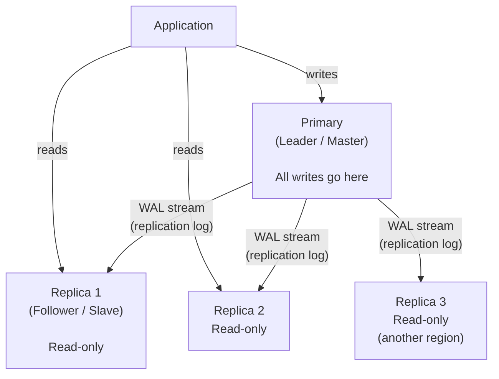
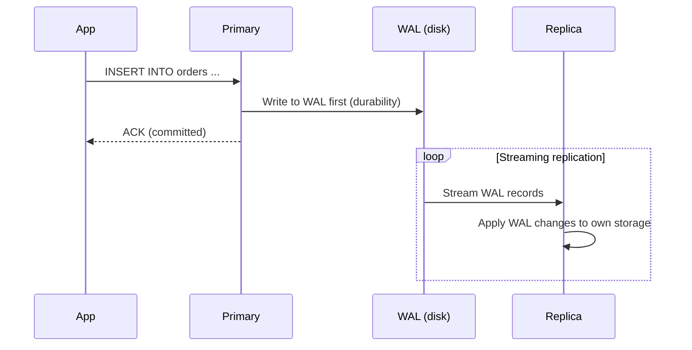
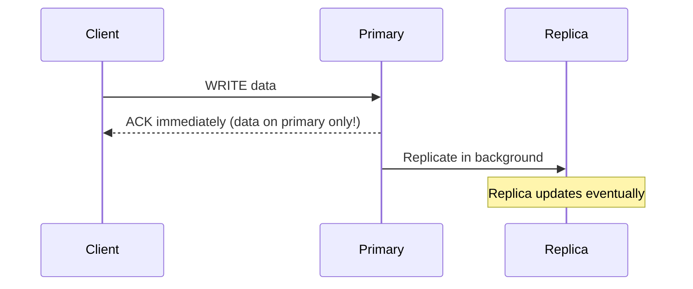
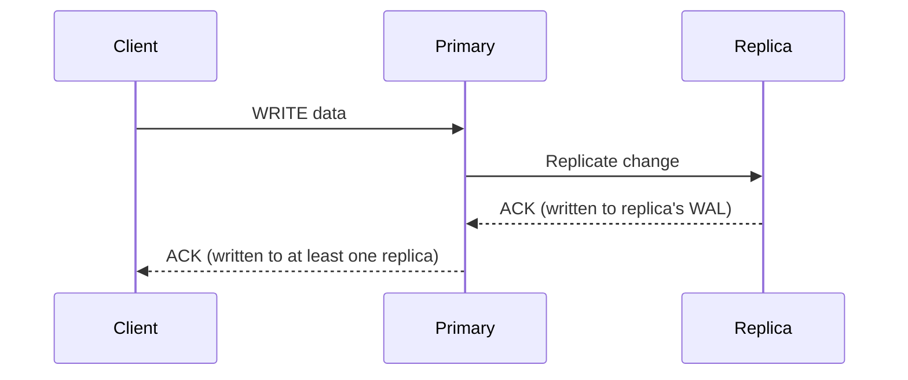
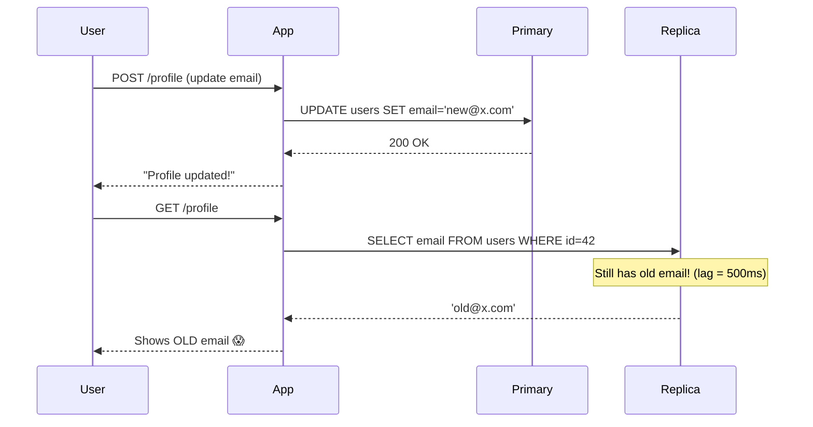
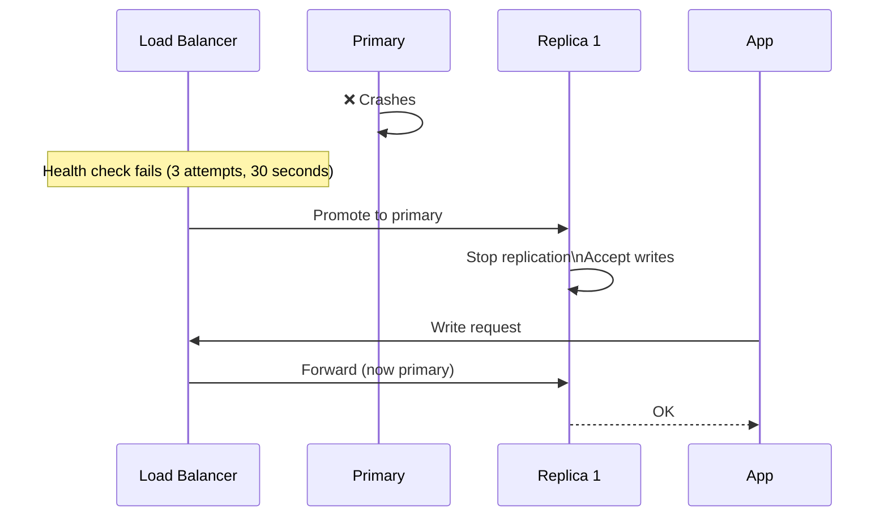
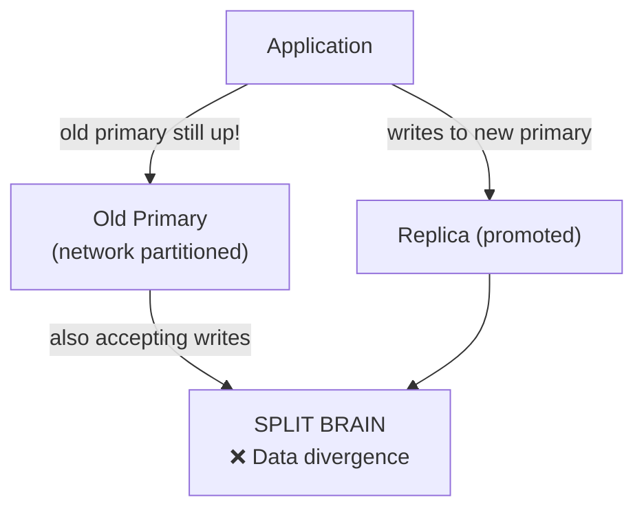
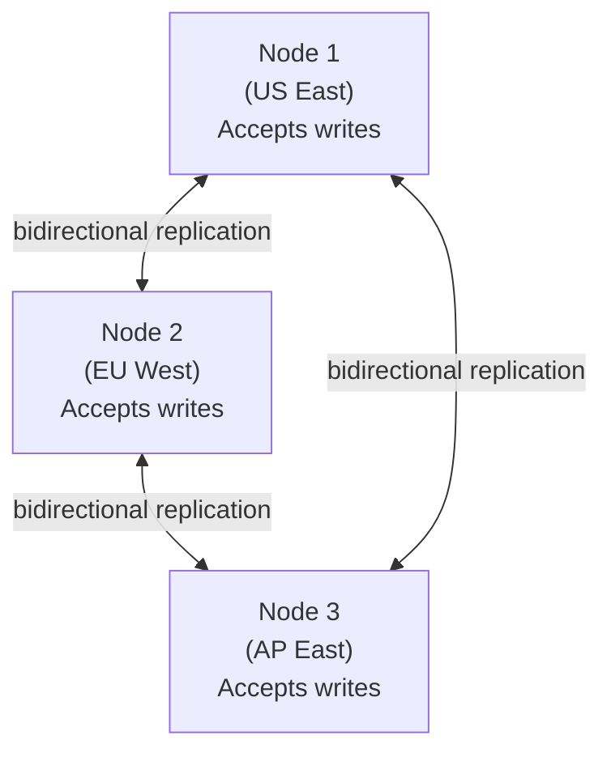
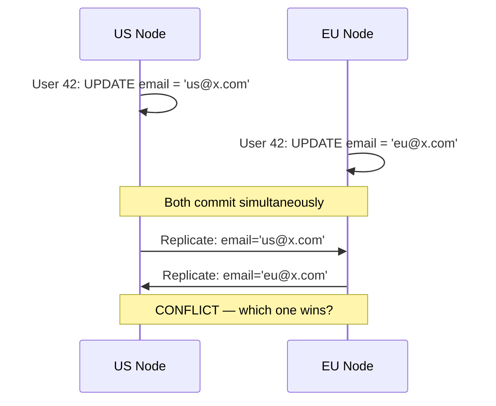

# Database Replication

Replication is the process of copying data from one database server (the **primary**) to one or more others (**replicas** or **secondaries**). It is the foundational technique for achieving read scalability, high availability, and geographic distribution of data.

> **Why it matters:** A single database server is a single point of failure. Replication adds redundancy. At high read volumes, it distributes the load. For global systems, it places data closer to users.

---

## The Core Replication Architecture



**The invariant:** Every write goes to the primary. The primary streams changes to replicas. Replicas serve read traffic.

---

## How Replication Works — Internals

### WAL-Based Replication (PostgreSQL)

PostgreSQL replication is built on the Write-Ahead Log (WAL):



1. Every change is written to the WAL (sequential log file) before the data pages are modified
2. The replica connects to the primary's WAL stream
3. The replica applies WAL records to its own storage in order
4. The replica's data is a mirror of the primary's, delayed by replication lag

### Binlog-Based Replication (MySQL)

MySQL uses a **binary log** (binlog) — a record of all data-changing statements or row events. Replicas connect and apply the binlog to stay in sync.

---

## Synchronous vs. Asynchronous Replication

This is the most critical replication tradeoff — it sits at the heart of durability vs. performance:

### Asynchronous Replication (Default)



**Properties:**

- **Lowest write latency** — primary does not wait for replica
- **Risk:** If the primary crashes after ACK but before replication, committed data is **lost**
- **Replication lag:** Replicas can be milliseconds to seconds behind

**Best for:** High write throughput where losing the last few milliseconds of commits is acceptable (analytics, social feeds, non-financial data)

### Synchronous Replication



**Properties:**

- **Zero data loss** on primary failure — at least one replica always has the data
- **Higher write latency** — must wait for at least one replica to acknowledge
- **Availability risk:** If the synchronous replica is unreachable, the primary may block writes

```sql
-- PostgreSQL: require at least one synchronous replica
ALTER SYSTEM SET synchronous_commit = 'remote_apply';
ALTER SYSTEM SET synchronous_standby_names = 'replica1';
```

**Best for:** Financial systems, billing, inventory — any data where loss is unacceptable

### Semi-Synchronous Replication

A compromise: primary waits for at least one replica to receive (but not apply) the data before ACKing:

```
Write → Primary → ACK from replica receive → ACK to client
                     (not yet applied)
```

Reduces data loss window vs async, lower latency than full synchronous. MySQL 5.7+ supports this natively.

### The Tradeoff Matrix

| Mode          | Write Latency            | Data Loss Risk        | Availability                       |
| ------------- | ------------------------ | --------------------- | ---------------------------------- |
| **Async**     | Lowest (~1ms)            | Yes (lag window)      | Highest                            |
| **Semi-sync** | Low (~2–5ms)             | Minimal (receive lag) | High                               |
| **Sync**      | Higher (~RTT to replica) | None                  | Lower (blocked by replica failure) |

---

## Replication Lag — The Silent Problem

Even with asynchronous replication, replicas are always slightly behind. This lag has real consequences:



**This is the "read-your-own-writes" consistency problem.**

### Solutions

**1. Read from primary for user's own data (session routing):**

```python
# Route reads to primary when session just wrote
if request.user.recently_wrote:
    db = primary_connection
else:
    db = replica_connection
```

**2. Wait for replica to catch up:**

```sql
-- PostgreSQL: wait for this specific LSN to be replicated
SELECT pg_current_wal_lsn();  -- get current WAL position on primary
-- On replica:
SELECT pg_is_wal_replay_paused();
SELECT * FROM pg_wal_replay_wait('0/16A4B20', timeout := 5000);
```

**3. Tolerate staleness by design:**
Social media feeds showing data from 500ms ago is fine. Bank balances are not.

**4. Monotonic reads:**
Route all reads from the same user to the same replica (sticky routing), ensuring they always see data that is at least as fresh as their last read.

---

## Failover — When the Primary Dies

When the primary fails, a replica must be promoted to become the new primary:



**Manual vs. Automatic failover:**

| Approach                                  | RTO     | Risk              | When to Use                    |
| ----------------------------------------- | ------- | ----------------- | ------------------------------ |
| Manual promotion                          | Minutes | Human error delay | Low-criticality, simpler setup |
| Semi-automatic (Pacemaker, Patroni)       | Seconds | Misconfiguration  | Production PostgreSQL          |
| Fully managed (RDS Multi-AZ, CloudSQL HA) | ~30–60s | Vendor dependency | Cloud-native setups            |

### Split-Brain Risk

A critical failure mode: both the old primary and the promoted replica think they're primary. They both accept writes. Data diverges and cannot be easily merged.

**Prevention:**

- **Fencing (STONITH):** Physically kill the old primary before promoting a replica
- **Quorum-based promotion:** Only promote if a majority of nodes agree
- **Epoch/generation numbers:** Reject writes from nodes with old epoch



---

## Multi-Primary (Active-Active) Replication

Every node accepts writes. All nodes replicate to each other.



**Benefits:**

- Write scalability across regions
- Zero-RPO failover (no data loss — all nodes have all data)
- Lowest write latency for global users (write to nearest node)

**The conflict problem:**



**Conflict resolution strategies:**

- **Last-Write-Wins (LWW):** Timestamp-based. Most recent update wins. Risk: clock skew
- **Application-level merge:** Application defines merge logic (e.g., union sets, max values)
- **CRDT:** Conflict-free Replicated Data Types — data structures that merge automatically
- **Optimistic concurrency:** Reject conflicting writes; application must retry

**Real-world multi-primary:** Amazon DynamoDB global tables, CockroachDB, Google Spanner

---

## Replication in Practice — Monitoring

Critical metrics to monitor:

```sql
-- PostgreSQL: replication lag in bytes
SELECT client_addr, state,
       pg_wal_lsn_diff(pg_current_wal_lsn(), sent_lsn) AS bytes_behind,
       write_lag, flush_lag, replay_lag
FROM pg_stat_replication;

-- Replication lag in seconds (on replica)
SELECT EXTRACT(EPOCH FROM (now() - pg_last_xact_replay_timestamp())) AS lag_seconds;
```

**Alerts to set:**

- Replication lag > 30 seconds → Warning
- Replication lag > 5 minutes → Critical (data at risk)
- Replica disconnected → Critical
- Replica promotion event → Immediate investigation

---

## Interview Talking Points

**1. What is replication and why do you use it?**

> "Replication copies data from a primary to one or more replicas continuously. This achieves three things: read scalability (replicas serve reads, freeing the primary for writes), high availability (if the primary fails, a replica can be promoted), and geographic distribution (place replicas near users to reduce read latency)."

**2. Synchronous vs. asynchronous replication — how do you choose?**

> "Asynchronous is the default — it gives lowest write latency but risks losing commits in the lag window if the primary crashes. Synchronous guarantees zero data loss by waiting for at least one replica to acknowledge before returning success, at the cost of write latency equal to the round-trip to the replica. For financial data, I'd use synchronous. For social feeds or analytics, asynchronous is fine."

**3. How do you handle the read-your-own-writes problem?**

> "Three options: route the user's reads to the primary immediately after a write (using a short sticky routing window), include a 'min replication LSN' in the response and wait for the replica to catch up, or accept eventual consistency and design the UI to show optimistic updates until the replica reflects the change."

**4. What is split-brain and how do you prevent it?**

> "Split-brain is when both the old primary and a promoted replica accept writes simultaneously, causing data divergence. Prevention: use STONITH to physically fence (kill) the old primary before promotion, or use quorum-based systems (like Patroni with etcd) where only a node with majority consensus can become primary."

---

## Key Takeaways

- Replication solves **three problems**: read scaling, high availability, and geographic distribution
- **Asynchronous** replication is fast but risks data loss; **synchronous** has zero data loss but higher write latency
- **Replication lag** creates the "read-your-own-writes" problem — route sensitive reads to primary or wait for replication
- **Failover** must be automated for production — manual failover takes too long (minutes vs. seconds)
- **Split-brain** is the deadliest replication failure — always use fencing or quorum-based promotion
- **Multi-primary** enables global writes but requires conflict resolution — Last-Write-Wins is the simplest but requires accurate clocks
