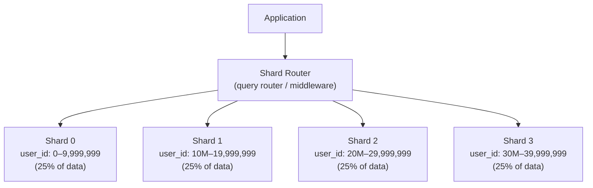
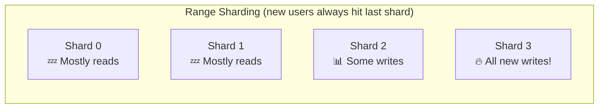
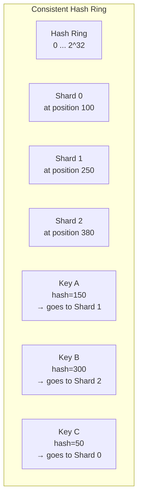
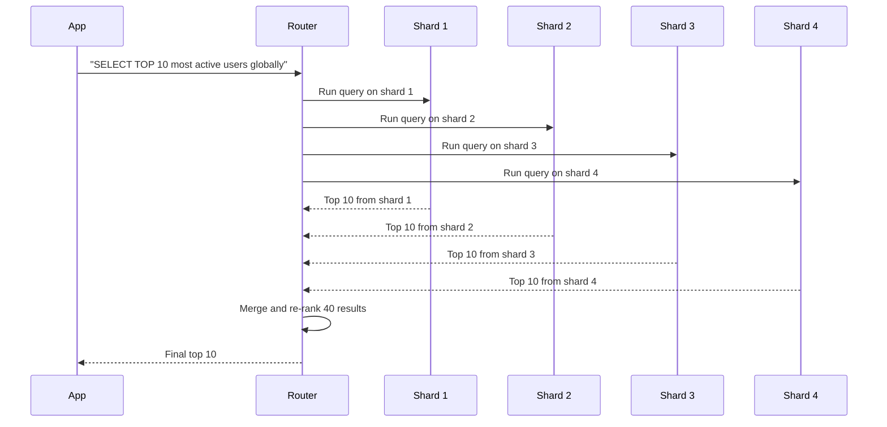
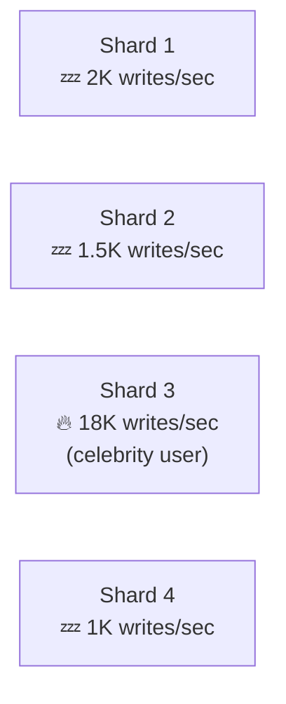
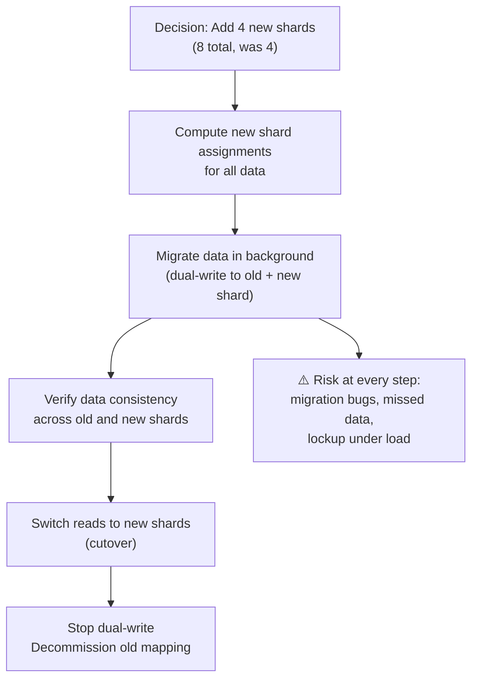
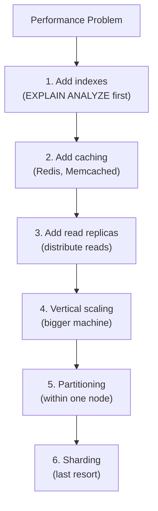

# Database Sharding

Sharding is horizontal partitioning of data across multiple independent database instances (shards). Where replication copies data, sharding **splits** it — each shard owns a subset of the total dataset. Together, the shards form the complete database.

> **Sharding is a last resort, not a first instinct.** It adds profound architectural complexity. Only shard when you've exhausted: query optimization, indexing, caching, read replicas, and vertical scaling. Engineers who shard too early spend months fighting operational complexity that wasn't necessary.

---

## Why Sharding Becomes Necessary

A single database node has hard physical limits:

| Constraint           | Single Node Limit           | Result                          |
| -------------------- | --------------------------- | ------------------------------- |
| **Storage**          | ~10–20 TB (practical)       | Dataset exceeds disk            |
| **Write throughput** | ~10K–100K TPS               | Write bottleneck                |
| **Index size**       | Fits in RAM                 | Index doesn't fit, queries slow |
| **Replication**      | Lag grows with write volume | Replicas can't keep up          |

When these limits are hit, sharding distributes the data so each node handles a fraction of the total load:



---

## Shard Key — The Most Important Decision

The **shard key** (partition key) is the column used to determine which shard a row belongs to. It is the single most important sharding decision, and it cannot be easily changed later.

**A good shard key:**

- Has **high cardinality** — many distinct values (not gender with 3 values)
- Distributes writes **evenly** — no hot shards
- Matches **access patterns** — minimize cross-shard queries
- Doesn't change — routing breaks if the key changes

**Common shard keys:**

- `user_id` — for user-centric applications
- `order_id` / `tenant_id` — for SaaS / e-commerce
- Geographic region — for geo-partitioned data
- `created_at` — for time-series (but causes hot shards!)

---

## Sharding Strategies

### Range-Based Sharding

Each shard owns a contiguous range of shard key values:

```
Shard 0: user_id 0          – 9,999,999
Shard 1: user_id 10,000,000 – 19,999,999
Shard 2: user_id 20,000,000 – 29,999,999
Shard 3: user_id 30,000,000 – 39,999,999
```

**Pro:** Range queries are efficient (`WHERE user_id BETWEEN 5M AND 6M` hits one shard).  
**Con:** Hot shards — new users always go to the highest shard. New user signups create a write hotspot.



### Hash-Based Sharding

Apply a hash function to the shard key, then take modulo the number of shards:

```
shard_id = hash(user_id) % num_shards

user_id=42:   hash(42) % 4 = 2  → Shard 2
user_id=100:  hash(100) % 4 = 0 → Shard 0
user_id=999:  hash(999) % 4 = 3 → Shard 3
```

**Pro:** Distributes writes evenly across all shards (no hotspots).  
**Con:** Range queries scatter across all shards. Adding shards requires resharding.

### Consistent Hashing — Solving the Resharding Problem

Standard hash-based sharding breaks when shards are added/removed (all mappings change → massive data movement). Consistent hashing places shards and keys on a virtual ring:



Each key routes to the **next shard clockwise** on the ring. When a new shard is added, only the keys in the neighboring range must be moved — not all keys.

**Real-world use:** Amazon DynamoDB, Apache Cassandra, Redis Cluster, Memcached (via client-side consistent hashing)

### Directory-Based Sharding

A lookup service (directory) maps each key to a shard:

```
Directory: {
  user_42   → shard_2
  user_100  → shard_0
  user_999  → shard_1
  tenant_xyz → shard_3
}
```

**Pro:** Completely flexible — you can move any key to any shard by updating the directory. Enables heterogeneous shards (large tenants on dedicated shards).  
**Con:** The directory is a single point of failure and a bottleneck. Must cache aggressively.

---

## Cross-Shard Queries — The Core Limitation

The biggest operational pain of sharding: queries that span multiple shards are expensive:



**Scatter-gather** queries hit all shards, collect results, and merge them. This:

- Multiplies query load by the number of shards
- Increases latency (must wait for the slowest shard)
- Complicates pagination (true `OFFSET` pagination across shards is impossible)

**Mitigation strategies:**

- Choose shard key to match your most common query pattern
- Denormalize data that's frequently accessed across shards
- Use a separate aggregation store (Elasticsearch, Redis) for global queries
- Avoid scatter-gather for user-facing queries; use it only for background analytics

---

## Hot Shards — The Write Killer

A **hot shard** is a shard that receives disproportionately more traffic than others:



**Common causes:**

- A viral user (Twitter: one celebrity's tweets = millions of notifications)
- A popular product (flash sale: one item's inventory table hammered)
- Time-based shard key with recent data access patterns

**Solutions:**

- **Shard splitting:** Break the hot shard into smaller shards
- **Compound shard key:** Add a secondary dimension (`user_id + bucket_id` where bucket_id = random 0–9)
- **Celebrity treatment:** Route high-follower accounts to dedicated shards
- **Caching:** Shield the hot shard with an in-memory cache layer

---

## Resharding — The Nightmare Scenario

When you need to add shards (your existing shards are full), you must **reshard** — move data between shards. This is one of the most operationally dangerous database operations:



**Best practices for resharding:**

- Double write to old and new shards during migration
- Use logical replication tools (AWS DMS, Debezium) to stream changes
- Migrate in small batches, not all at once
- Test rollback before cutover
- Schedule during lowest traffic window

---

## Sharding in Real Systems

### Instagram

Instagram shards on `user_id` for user data. Media metadata is on a federated PostgreSQL cluster. When Instagram was acquired by Facebook, they had 13 shards of PostgreSQL. Eventually migrated to a custom sharding layer.

### Discord

Discord shards channels and messages by `guild_id` (server ID). A server's messages always live on the same shard — no cross-shard queries for the core chat use case. A single large Discord server going viral is a hot shard problem they had to solve with read replicas per shard.

### Vitess (MySQL Sharding — Used by YouTube, Slack)

Vitess is a horizontal sharding middleware for MySQL that abstracts sharding complexity:

```
Application → Vitess VTGate (router) → VTTablets (MySQL instances per shard)
```

It handles: query routing, connection pooling, resharding, cross-shard JOINs (with limitations), and monitoring. Slack and YouTube both run Vitess in production.

---

## Sharding vs. Alternatives

Before sharding, exhaust these options:



| Approach         | Complexity    | Fixes                                  |
| ---------------- | ------------- | -------------------------------------- |
| Indexes          | Low           | Slow reads                             |
| Caching          | Low-Medium    | Read load                              |
| Read replicas    | Medium        | Read throughput                        |
| Vertical scaling | Low           | All limits (until hardware ceiling)    |
| Partitioning     | Medium        | Storage, some query patterns           |
| **Sharding**     | **Very High** | **Write throughput, storage at scale** |

---

## Interview Talking Points

**1. When would you shard a database?**

> "When a single node can no longer handle write volume or storage after exhausting optimization, caching, and vertical scaling. Sharding is operationally very complex — it eliminates cross-shard transactions, makes joins difficult, and complicates resharding. I'd only do it when the scale clearly demands it."

**2. How do you choose a shard key?**

> "The shard key must distribute writes evenly (to avoid hot shards), have high cardinality, and match the most common access pattern (to minimize cross-shard queries). For a user-centric app like Twitter, `user_id` is natural. For a multi-tenant SaaS, `tenant_id` keeps a tenant's data co-located. I'd avoid time-based shard keys because recent data is always a hotspot."

**3. What is consistent hashing and why does it matter?**

> "Standard modulo hashing (key % N) maps all keys when you add/remove a shard — requiring full data migration. Consistent hashing places shards and keys on a virtual ring. Adding a shard only requires moving keys from the adjacent segment — typically 1/N of the data. This is how Cassandra and DynamoDB handle topology changes gracefully."

**4. How do you handle cross-shard queries?**

> "I avoid them by choosing the shard key to match the dominant query pattern. For global queries (like 'top users across all shards'), I use scatter-gather — query all shards in parallel, merge results in the application layer. For search, I maintain a separate index (Elasticsearch) that aggregates across shards. These are background jobs, not user-facing queries."

---

## Key Takeaways

- Sharding **splits data** across independent nodes; replication **copies** it
- The **shard key** choice is irreversible and determines everything — choose based on access patterns and cardinality
- **Hash-based sharding** distributes evenly; **range-based** enables efficient range queries but creates hot shards
- **Consistent hashing** minimizes data movement when topology changes — essential for dynamic clusters
- **Cross-shard queries** are expensive — design shard key to keep related data on the same shard
- **Resharding** is dangerous and slow — plan for growth with techniques like virtual shards or a directory
- **Exhaust every alternative** before sharding — it's the most expensive architectural decision you can make
