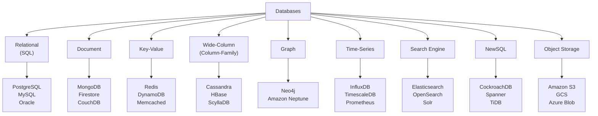
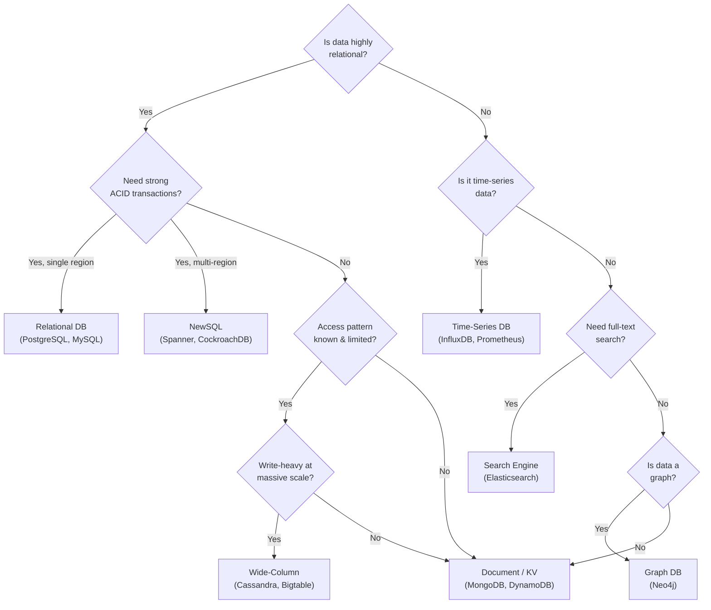
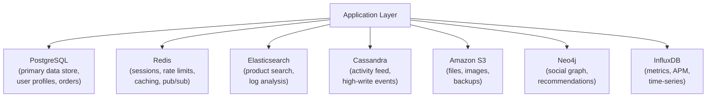

# Database Types

No single database is best for every use case. The landscape of databases has exploded over the past decade — and choosing the wrong one is one of the most expensive technical decisions you can make. Migrating a production database at scale is months of engineering work.

> **The interview framing:** Every system design starts with "what database do I use?" The ability to justify your choice — with tradeoffs — is what separates strong candidates from the rest.

---

## The Database Landscape



---

## 1. Relational Databases (SQL)

**What:** Data stored in tables with rows and columns. Tables are related via foreign keys. Queries written in SQL.

**Core strength:** ACID transactions, rich query language, joins across entities, mature tooling.

```sql
SELECT u.name, COUNT(o.id) as order_count
FROM users u
JOIN orders o ON u.id = o.user_id
WHERE o.created_at > NOW() - INTERVAL '30 days'
GROUP BY u.name
ORDER BY order_count DESC;
```

**Best for:**

- Financial systems (strong consistency required)
- Any data with clear relationships and complex queries
- Applications where schema is well-understood upfront
- Reports and analytics on structured data

**Examples:** PostgreSQL, MySQL, SQLite, Oracle, SQL Server, MariaDB

**Not great for:**

- Unstructured or highly variable data
- Extreme horizontal write scalability
- Hierarchical or graph-shaped data

---

## 2. Document Databases

**What:** Data stored as semi-structured documents (typically JSON/BSON). Schema is flexible — different documents can have different fields.

```json
{
  "_id": "user_42",
  "name": "Alice",
  "email": "alice@example.com",
  "address": {
    "street": "123 Main St",
    "city": "New York"
  },
  "tags": ["premium", "early-adopter"],
  "preferences": { "theme": "dark", "notifications": true }
}
```

**Best for:**

- User profiles, product catalogs, CMS content
- Data with variable schema or nested structures
- Rapid application development (schema flexibility)
- When documents are accessed as a whole (not across many joins)

**Examples:** MongoDB, Firestore, CouchDB, Amazon DocumentDB

**Not great for:**

- Complex joins across many entity types
- Strong consistency requirements
- Highly relational data

---

## 3. Key-Value Stores

**What:** The simplest database model. Every item is a key-value pair. Extremely fast reads and writes.

```
SET session:user_42 '{"userId":42,"role":"admin"}' EX 3600
GET session:user_42  →  '{"userId":42,"role":"admin"}'
```

**Best for:**

- Session storage, caching, shopping carts
- Rate limiting counters
- Feature flags, configuration
- Leaderboards (sorted sets in Redis)
- Pub/sub messaging

**Examples:** Redis, Memcached, DynamoDB (in simple KV mode), Aerospike

**Not great for:**

- Complex queries or filtering
- Relational data
- Large documents requiring partial access

---

## 4. Wide-Column (Column-Family) Databases

**What:** Data organized by rows and dynamic columns, grouped into column families. Optimized for reads and writes across specific columns at massive scale. Think "sparse table" where each row can have different columns.

```
Row Key         | column-family: profile       | column-family: activity
----------------|-----------------------------|-----------------------
user:alice      | name="Alice" city="NY"      | last_login=2025-06-01
user:bob        | name="Bob"                   | last_login=2025-05-28
user:carol      | name="Carol" age=28          | (no activity yet)
```

**Best for:**

- Time-series data, IoT sensor readings
- Write-heavy workloads at massive scale (millions of writes/second)
- Data with a known, limited set of access patterns
- Geographically distributed data

**Examples:** Apache Cassandra, HBase, Google Bigtable, ScyllaDB, Amazon Keyspaces

**Not great for:**

- Ad-hoc queries (no flexible WHERE clauses)
- Data with many joins
- Low-volume use cases (operational overhead is high)

---

## 5. Graph Databases

**What:** Data modeled as nodes (entities) and edges (relationships). Relationships are first-class citizens — traversing them is as efficient as reading data.

```
(Alice) -[FOLLOWS]→ (Bob)
(Alice) -[PURCHASED]→ (Product:Laptop)
(Bob)   -[REVIEWED]→ (Product:Laptop)
```

**Best for:**

- Social networks (friend-of-friend queries)
- Fraud detection (find suspicious transaction chains)
- Recommendation engines ("people who bought X also bought Y")
- Knowledge graphs, identity graphs
- Network topology analysis

**Examples:** Neo4j, Amazon Neptune, TigerGraph, JanusGraph

**The key insight:** A query like "find all friends of Alice's friends who live in New York" is a natural graph traversal. In a relational DB, it requires multiple self-joins that become exponentially expensive as depth increases.

**Not great for:**

- High write throughput
- Simple CRUD operations
- Aggregations on large datasets

---

## 6. Time-Series Databases

**What:** Optimized for data that arrives in time order — metrics, events, measurements. Efficient storage and querying of data points indexed by timestamp.

```
timestamp           | metric          | value | labels
--------------------|-----------------|-------|------------------
2025-06-01 10:00:00 | cpu.usage       | 45.2  | host=web-01
2025-06-01 10:00:01 | cpu.usage       | 46.1  | host=web-01
2025-06-01 10:00:00 | http.requests   | 1243  | host=web-01
```

**Optimizations:**

- **Columnar storage** — compress repeated timestamps and labels heavily
- **Downsampling** — automatically reduce resolution of old data (5s → 1min → 1hr)
- **Retention policies** — auto-delete data older than N days

**Best for:**

- Infrastructure monitoring (CPU, memory, latency)
- IoT sensor data
- Financial market data (tick data)
- Application performance monitoring (APM)

**Examples:** InfluxDB, TimescaleDB (PostgreSQL extension), Prometheus, VictoriaMetrics, ClickHouse

**Not great for:**

- Complex relationships between entities
- Random access patterns (not time-ordered)

---

## 7. Search Engines

**What:** Optimized for full-text search, fuzzy matching, faceted search, and relevance ranking. Data is indexed in an inverted index structure.

```
Query: "fast database for analytics"
Returns: ranked documents containing these terms, weighted by relevance
Supports: fuzzy matching, synonyms, facets, aggregations
```

**Best for:**

- E-commerce product search
- Log and event analysis (Elasticsearch + Kibana)
- Full-text search across large text corpora
- Autocomplete, typeahead
- Security information and event management (SIEM)

**Examples:** Elasticsearch, OpenSearch, Apache Solr, Typesense, Meilisearch

**Pattern:** Almost always used **alongside** a primary database. The primary DB is the source of truth; the search engine is an index. Write to both; search via the search engine.

**Not great for:**

- Primary data storage (no strong ACID guarantees)
- Precise joins or transactional updates

---

## 8. NewSQL Databases

**What:** Combines the relational model (SQL, ACID transactions) with the horizontal scalability of NoSQL systems. The best of both worlds — at a cost of complexity.

**Best for:**

- Global OLTP systems that need strong consistency at scale
- Financial systems spanning multiple regions
- Applications outgrowing PostgreSQL/MySQL but needing SQL semantics

**Examples:** Google Spanner, CockroachDB, TiDB, YugabyteDB, PlanetScale (Vitess)

**The tradeoff:** Higher latency than traditional SQL (cross-shard coordination), more operational complexity, and often higher cost.

---

## Choosing the Right Database — Decision Framework



---

## The Polyglot Persistence Pattern

Production systems at scale almost always use **multiple databases**, each chosen for what it does best:



**Real-world example — Instagram's data stores:**

- **PostgreSQL** — user data, follows, media metadata
- **Cassandra** — activity feeds, notifications
- **Redis** — caching, sessions, leaderboards
- **Solr/Elasticsearch** — media search

---

## Quick Reference — Database Selection

| Use Case               | Database Choice       | Why                    |
| ---------------------- | --------------------- | ---------------------- |
| User accounts, orders  | PostgreSQL            | ACID, complex queries  |
| Shopping cart          | Redis                 | Fast reads/writes, TTL |
| Product catalog        | MongoDB or DynamoDB   | Flexible schema        |
| Chat messages          | Cassandra             | Ordered, write-heavy   |
| Social graph           | Neo4j                 | Graph traversal        |
| Infrastructure metrics | Prometheus + InfluxDB | Time-series optimized  |
| Product search         | Elasticsearch         | Full-text + facets     |
| File storage           | Amazon S3             | Object storage         |
| Global ACID at scale   | CockroachDB / Spanner | NewSQL                 |
| Leaderboard            | Redis sorted sets     | O(log n) rank          |

---

## Key Takeaways

- **No database is universally best** — choose based on data shape, access patterns, consistency requirements, and scale
- **SQL** wins when you have relational data, complex queries, and ACID requirements
- **NoSQL** wins when you prioritize scale, flexibility, or have narrow access patterns
- **Polyglot persistence** — using multiple specialized databases — is the norm at scale, not the exception
- The most common interview mistake: defaulting to one database for everything. Always ask: "What are the access patterns? What's the consistency requirement? What's the scale?"
