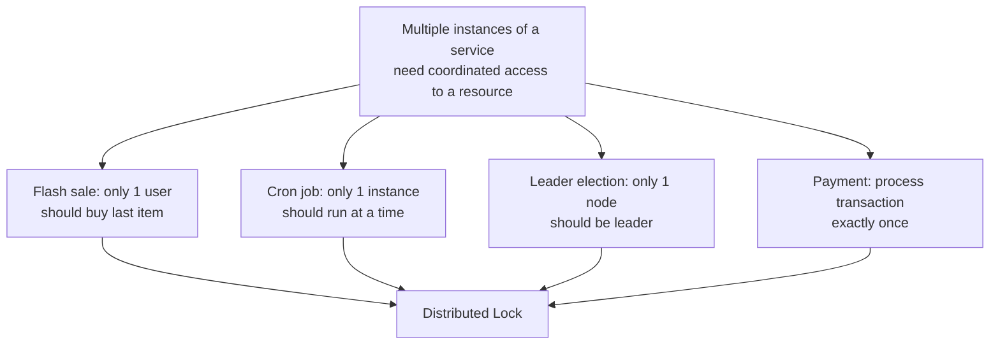
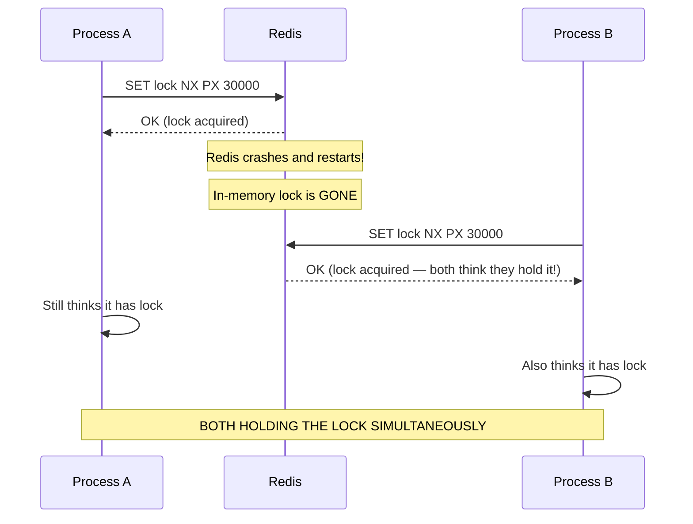
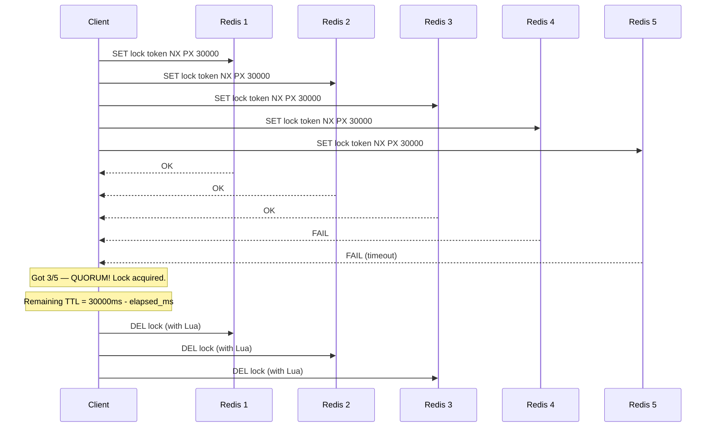
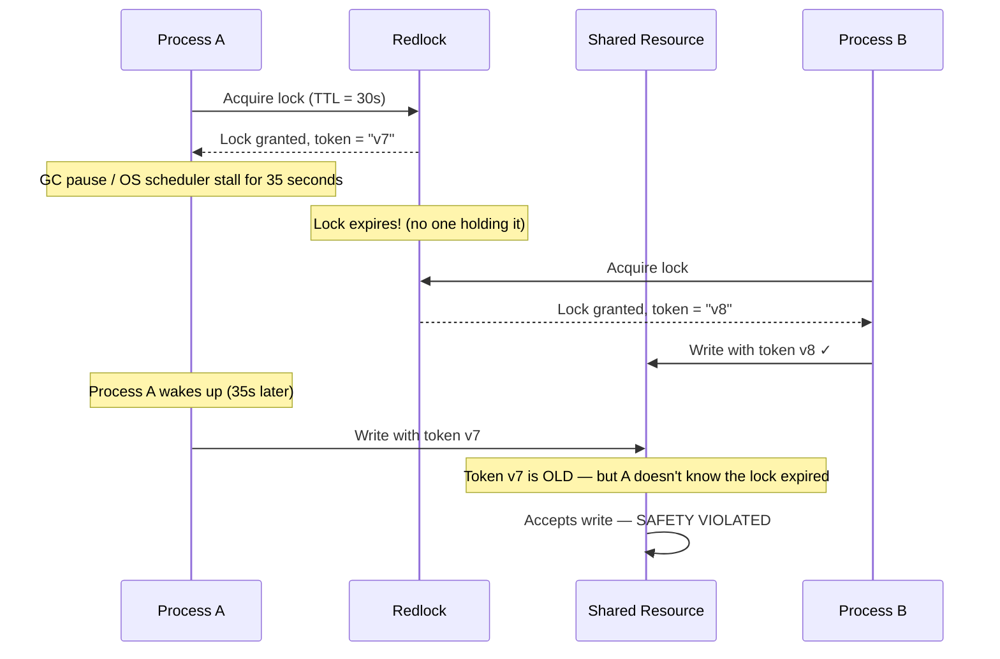
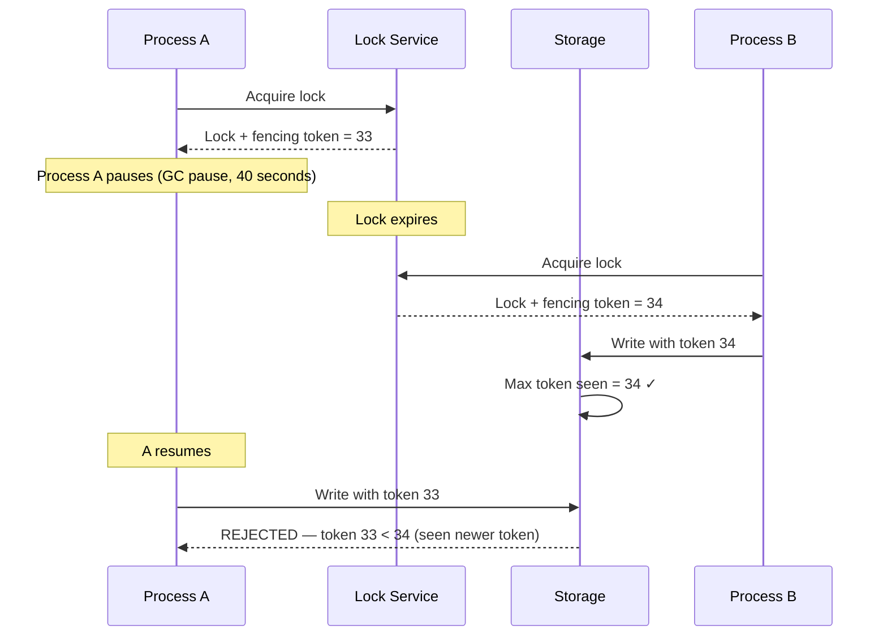
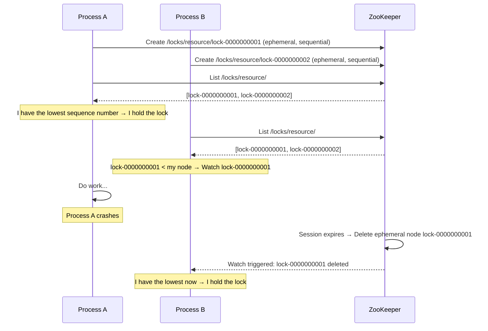

# Distributed Locking

---

## title: Distributed Locking

# Distributed Locking

A distributed lock coordinates access to a shared resource across multiple processes, machines, or services — ensuring only one actor can hold the lock at any given time, just like a mutex but across a network.

> **Why this is hard:** In a single process, a mutex is backed by CPU atomics. Across a network, you have partial failures, clock skew, network partitions, and GC pauses. A distributed lock that seems to work locally will have subtle failure modes at scale. Understanding these failure modes is what interviewers are really testing.

---

## When Do You Need Distributed Locks?



**In-process locks (`synchronized`, `mutex`) don't work** because:

- Each service instance has its own memory
- A lock in Instance A's memory means nothing to Instance B
- You need an external coordinator that all instances agree on

---

## Optimistic vs. Pessimistic Locking

Before reaching for a distributed lock, consider which locking model is appropriate:

### Pessimistic Locking

Acquire a lock before accessing the resource. Assumes conflicts are likely.

```sql
-- PostgreSQL: lock the row for the duration of the transaction
BEGIN;
SELECT * FROM inventory WHERE sku = 'SHOE-42' FOR UPDATE;
-- other transactions block here until this one commits
UPDATE inventory SET quantity = quantity - 1 WHERE sku = 'SHOE-42';
COMMIT;
```

**Pro:** Simple to reason about. No retries. Data is always consistent.  
**Con:** High contention → many transactions block → throughput drops. Not usable across services.

### Optimistic Locking (Version Numbers)

Read and remember the version. Write only if version hasn't changed. No lock held during the operation.

```sql
-- Read with version
SELECT quantity, version FROM inventory WHERE sku = 'SHOE-42';
-- Returns: quantity=5, version=7

-- Update only if version is still 7
UPDATE inventory
SET quantity = 4, version = 8
WHERE sku = 'SHOE-42' AND version = 7;
-- Returns 0 rows updated → someone else already changed it → retry!
```

**Pro:** No blocking. High throughput under low contention.  
**Con:** Retries under high contention → write amplification. Doesn't work for distributed flows spanning multiple services.

---

## Redis Distributed Lock — SETNX Pattern

Redis is the most common distributed lock backend. The key operation is atomic:

```
SET lock_key unique_value NX PX 30000
```

- `NX` — Only set if Not eXists (atomic lock acquisition)
- `PX 30000` — Expire after 30 seconds (automatic release on crash)
- `unique_value` — A unique token per lock holder (prevents releasing someone else's lock)

```python
import redis
import uuid
import time

class RedisLock:
    def __init__(self, client: redis.Redis, lock_name: str, ttl_ms: int = 30_000):
        self.client = client
        self.lock_name = lock_name
        self.ttl_ms = ttl_ms
        self.lock_value = str(uuid.uuid4())  # Unique per lock acquisition

    def acquire(self) -> bool:
        result = self.client.set(
            self.lock_name,
            self.lock_value,
            px=self.ttl_ms,
            nx=True  # Only set if not exists
        )
        return result is True

    def release(self):
        # Use Lua script for atomic check-and-delete
        # Prevents releasing a lock acquired by another holder
        lua_script = """
        if redis.call("get", KEYS[1]) == ARGV[1] then
            return redis.call("del", KEYS[1])
        else
            return 0
        end
        """
        self.client.eval(lua_script, 1, self.lock_name, self.lock_value)
```

**Why the Lua script for release?** Without it:

1. Process A holds lock, value = "token-A"
2. Process A checks: value == "token-A" ✓
3. Lock expires (before A could delete it)
4. Process B acquires lock, value = "token-B"
5. Process A deletes lock — **deleted B's lock!**

The Lua script makes GET + DEL atomic, preventing this race condition.

---

## The Problem with Single-Node Redis Locks



Single Redis node = single point of failure. If Redis restarts, the lock evaporates. If the network partitions, the lock acquirer can't release it.

---

## Redlock — Redis Distributed Lock Algorithm

Martin Salvatore (antirez, Redis creator) proposed **Redlock** for distributed systems using **N independent Redis nodes** (typically 5):



**Redlock rules:**

1. Try to acquire lock on all N nodes with a short timeout (< total TTL / N)
2. If you get majority (N/2 + 1 = 3 of 5) **within the time limit**: you hold the lock
3. Effective TTL = configured TTL − time_to_acquire_all_locks
4. On failure: release on all nodes and retry with random backoff
5. On release: release on all nodes

**Why 5 nodes?** Tolerates 2 failures. Even if 2 nodes are down, 3 agree = quorum.

---

## The Controversy — Martin Kleppmann's Critique

Martin Kleppmann (author of _Designing Data-Intensive Applications_) published a detailed critique of Redlock. The key scenario:



**The fundamental problem:** A process that holds a lock can be paused (GC, OS scheduling, network stall) for longer than the lock TTL. When it resumes, it still thinks it holds the lock, but another process has already acquired it.

**Kleppmann's conclusion:** Redlock is not safe for distributed systems that require strict mutual exclusion for shared storage operations.

---

## Fencing Tokens — The Real Fix

The solution is **fencing tokens**: include a monotonically increasing token with every operation. The resource itself rejects requests with old tokens.



**Implementation:** The storage system tracks the highest fencing token it has seen. Any write with a lower token is rejected. This moves the safety invariant from the lock service to the resource itself.

Fencing tokens are naturally provided by:

- ZooKeeper `zxid` (monotonically increasing transaction ID)
- etcd `revision` (global revision counter)
- Database sequence values

---

## ZooKeeper-Based Distributed Locking

ZooKeeper provides stronger distributed lock guarantees using ephemeral sequential znodes:



**Key properties:**

- **Ephemeral nodes:** Automatically deleted when the client session expires (crash-safe)
- **Sequential nodes:** Natural ordering — lowest sequence number = lock holder
- **Watch notifications:** No polling — ZooKeeper pushes notification when the watched node is deleted
- **Linearizability:** ZooKeeper is CP — all reads and writes are consistent

**ZooKeeper fencing token:** The `zxid` (transaction ID) increases monotonically. Use it as a fencing token.

---

## Database Advisory Locks (PostgreSQL)

For systems already using PostgreSQL, advisory locks provide distributed locking without Redis:

```sql
-- Session-level advisory lock (auto-released when session ends)
SELECT pg_advisory_lock(12345);

-- Do work...
UPDATE inventory SET quantity = quantity - 1 WHERE sku = 'SHOE-42';

-- Release explicitly
SELECT pg_advisory_unlock(12345);

-- Transaction-level advisory lock (auto-released at transaction end)
BEGIN;
SELECT pg_try_advisory_xact_lock(12345);  -- Returns TRUE/FALSE (non-blocking)
-- If returns false, someone else has the lock → abort and retry
COMMIT;  -- Lock released automatically
```

**Benefits:** No extra infrastructure, full ACID, automatic release on crash (session-level locks are session-scoped).

**Limitations:** Only works within the same PostgreSQL cluster. If you need locks across services using different databases, this doesn't help.

---

## Comparison: Lock Implementations

| Implementation       | Guarantees                  | Fault Tolerance    | Throughput | When to Use                                 |
| -------------------- | --------------------------- | ------------------ | ---------- | ------------------------------------------- |
| Redis SETNX (single) | Weak (no crash safety)      | None (SPOF)        | Very High  | Non-critical coordination                   |
| Redlock (5 nodes)    | Stronger, but debated       | 2 node failures    | High       | Simple coordination, tolerate rare failures |
| ZooKeeper            | Strong (CP, linearizable)   | Byzantine-tolerant | Medium     | Leader election, critical coordination      |
| etcd                 | Strong (Raft-based)         | Raft quorum        | Medium     | Kubernetes-native systems                   |
| PostgreSQL advisory  | Strong (within DB)          | DB HA only         | Medium     | Already using Postgres                      |
| Fencing + any        | Strong (resource validates) | Depends on backend | Varies     | Any system requiring true safety            |

---

## Interview Talking Points

**1. How would you implement distributed locking for a rate limiter?**

> "For a rate limiter, I don't actually need a lock — I need an atomic increment. I'd use Redis `INCR` with `EXPIRE`, which is atomic and doesn't require lock semantics. If I genuinely need a lock (say, for exactly-once job execution), I'd use Redis `SET NX PX` with a unique token per acquisition and a Lua script for atomic release."

**2. What is the problem with Redlock?**

> "Redlock can be violated by process pauses — if a process acquires a lock and then experiences a GC pause or OS scheduling delay longer than the TTL, the lock expires. Another process then acquires it, and when the first resumes, both think they hold it. The fix is fencing tokens: the resource rejects writes from older token holders. Systems like ZooKeeper provide fencing tokens via their `zxid`."

**3. Optimistic vs. pessimistic locking — when to use each?**

> "Pessimistic locking (SELECT FOR UPDATE, mutexes) works best under high contention where conflicts are likely — it blocks rather than retrying. Optimistic locking (version numbers, CAS) works best under low contention — reads are cheap, and occasional conflicts trigger retries rather than blocking everyone. Under high contention, optimistic locking degrades due to retry storms."

**4. What is a fencing token and why does it matter?**

> "A fencing token is a monotonically increasing number issued with each lock grant. The shared resource (file system, database) only accepts writes with a token greater than or equal to the highest it has seen. This means a process that holds a stale lock (because it was paused) will have its writes rejected. It moves the safety guarantee from 'trust the lock holder knows it has the lock' to 'the resource enforces who can write'."

---

## Key Takeaways

- Distributed locks are needed when multiple processes across machines share a resource
- **Optimistic locking** (version numbers) is better than distributed locks under low contention
- Redis `SET NX PX` is the standard single-node implementation — use a **unique value** and **Lua script** for safe release
- **Redlock** (5 Redis nodes) improves fault tolerance but is not safe against process pauses longer than TTL
- **Fencing tokens** are the real fix — the resource itself rejects stale lock holders by checking monotonic sequence numbers
- **ZooKeeper/etcd** provide stronger guarantees (linearizability, ephemeral nodes, natural fencing tokens) for critical coordination
- **PostgreSQL advisory locks** are a practical choice if you're already using PostgreSQL and locks are within one service
