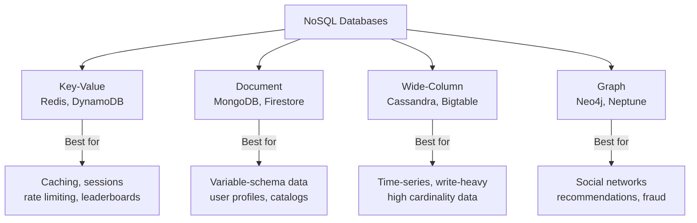
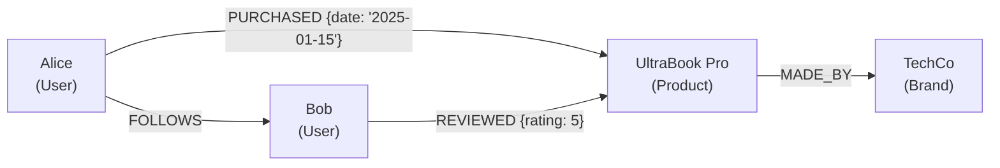
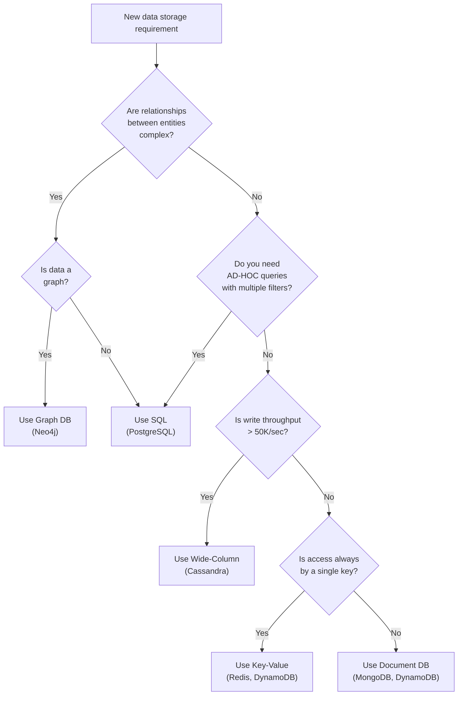
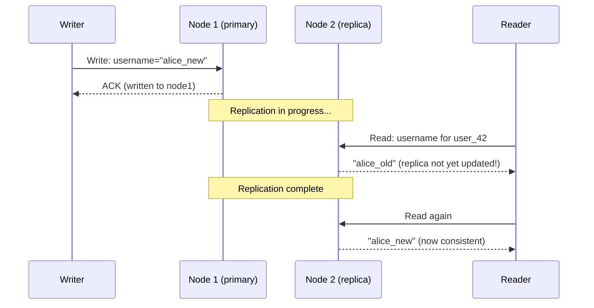

# NoSQL Databases

NoSQL ("Not Only SQL") databases emerged from the need to handle data at scales and shapes that relational databases struggle with. They trade ACID guarantees and flexible querying for horizontal scalability, schema flexibility, and optimized performance for specific access patterns.

> **The critical mindset shift:** NoSQL databases are not worse SQL databases. They are purpose-built tools optimized for specific data models and access patterns. Using MongoDB when you need graph traversal, or Cassandra when you need flexible queries, is the wrong tool for the job.

---

## The Four Core NoSQL Families



---

## Key-Value Stores

### The Model

The simplest database abstraction. A hash table over a network.

```
SET user:42:session  '{"userId":42,"role":"admin","exp":1717200000}'
GET user:42:session  →  '{"userId":42,"role":"admin","exp":1717200000}'
DEL user:42:session

INCR rate_limit:ip:203.0.113.45        → 1
EXPIRE rate_limit:ip:203.0.113.45 60   → expires in 60 seconds
```

### Redis — Far More Than a Cache

Redis is frequently misunderstood as "just a cache." It's a full data structure server:

| Data Structure  | Commands             | Use Case                                     |
| --------------- | -------------------- | -------------------------------------------- |
| **String**      | GET/SET/INCR/EXPIRE  | Sessions, counters, feature flags            |
| **Hash**        | HGET/HSET/HMGET      | User profiles, object fields                 |
| **List**        | LPUSH/RPOP/LRANGE    | Queues, recent activity feeds                |
| **Set**         | SADD/SMEMBERS/SINTER | Unique visitors, tags, followers             |
| **Sorted Set**  | ZADD/ZRANGE/ZRANK    | Leaderboards, rate limiting, priority queues |
| **Stream**      | XADD/XREAD           | Event logs, message queues                   |
| **Bitmap**      | SETBIT/BITCOUNT      | Feature flags at user scale                  |
| **HyperLogLog** | PFADD/PFCOUNT        | Approx. unique count (1% error)              |

**Real-world Redis patterns:**

```
# Rate limiting with sliding window
MULTI
  ZADD ip:203.0.113.45 1717200000 req_id_xyz
  ZREMRANGEBYSCORE ip:203.0.113.45 -inf 1717199940  # remove older than 60s
  ZCARD ip:203.0.113.45
EXEC

# Leaderboard
ZADD game:scores 9850 "alice"
ZADD game:scores 8720 "bob"
ZREVRANGE game:scores 0 9 WITHSCORES  # top 10
ZREVRANK game:scores "alice"           # alice's rank

# Distributed lock (simplified)
SET lock:resource_id "owner_token" NX PX 5000
# NX = only set if not exists, PX = expire in 5000ms
```

### DynamoDB — Managed Global KV

Amazon DynamoDB is a fully managed key-value (and document) database. Its key design insight: you define access patterns upfront and model data around them.

```
Table: Orders
Partition Key (PK): user_id
Sort Key (SK):      order_id

Query: "Get all orders for user 42"
→ PK = "user_42", SK begins_with "order_"
→ Returns all matching rows in PK, sorted by SK
```

**DynamoDB capacity modes:**

- **Provisioned:** Pre-specify Read Capacity Units (RCU) and Write Capacity Units (WCU). Predictable cost.
- **On-Demand:** Pay per request. No capacity planning. Better for spiky workloads.

**DynamoDB consistency options:**

- **Eventually Consistent Reads:** Default. May return stale data. Lower latency.
- **Strongly Consistent Reads:** Always returns latest. Uses more RCU. Higher latency.

---

## Document Databases

### The Model

A document is a self-contained record — typically JSON or BSON — that can have nested structures, arrays, and varying fields:

```json
{
  "_id": "prod_laptop_42",
  "name": "UltraBook Pro 15",
  "brand": "TechCo",
  "price": 1299.99,
  "specs": {
    "cpu": "Apple M3",
    "ram_gb": 16,
    "storage_gb": 512
  },
  "tags": ["laptop", "ultrabook", "apple"],
  "variants": [
    { "color": "silver", "sku": "UP15-SLV", "stock": 42 },
    { "color": "space-gray", "sku": "UP15-SG", "stock": 8 }
  ],
  "reviews_count": 847,
  "avg_rating": 4.6
}
```

This entire product — including nested specs and variants — lives in one document. No joins needed to fetch a product.

### MongoDB — The Most Popular Document DB

**Key concepts:**

```javascript
// Query with nested fields
db.products
  .find({
    "specs.ram_gb": { $gte: 16 },
    price: { $lt: 1500 },
    tags: "laptop",
  })
  .sort({ avg_rating: -1 })
  .limit(20);

// Update nested array element
db.products.updateOne(
  { _id: "prod_laptop_42", "variants.sku": "UP15-SLV" },
  { $inc: { "variants.$.stock": -1 } },
);

// Aggregation pipeline
db.orders.aggregate([
  {
    $match: { status: "shipped", created_at: { $gte: new Date("2025-01-01") } },
  },
  { $group: { _id: "$user_id", total_spent: { $sum: "$amount" } } },
  { $sort: { total_spent: -1 } },
  { $limit: 10 },
]);
```

**MongoDB consistency:** Since MongoDB 4.0, multi-document transactions are supported (ACID). For single-document operations, atomicity is always guaranteed — the entire document write succeeds or fails.

**Schema design principle — embed vs. reference:**

```
Embed when:
  - Data is always accessed together
  - Child data has no independent existence
  - One-to-few relationship (product → variants)

Reference when:
  - Data is accessed independently
  - Data is frequently updated
  - One-to-many/many-to-many (user → orders: user has 10K orders)
```

---

## Wide-Column (Column-Family) Databases

### The Model

Wide-column databases store data in a table structure, but unlike relational databases, each row can have a different set of columns. Data is organized into **column families** and stored in order by row key.

The mental model: think of it as a persistent, distributed, sorted map:

```
Map<RowKey, Map<ColumnFamily, Map<Column, Value>>>
```

### Apache Cassandra — The Write Beast

Cassandra is designed for:

- **Massive write throughput** (hundreds of thousands of writes/second)
- **Linear horizontal scalability** (add nodes, capacity increases linearly)
- **No single point of failure** (peer-to-peer, masterless)
- **Multi-datacenter replication** built-in

**Cassandra data modeling — query-first design:**

Unlike SQL where you model entities and query flexibly, in Cassandra you model the **query** first:

```sql
-- Goal: "Get all messages in a conversation, ordered by time"

CREATE TABLE messages_by_conversation (
    conversation_id UUID,
    created_at      TIMESTAMP,
    message_id      UUID,
    sender_id       UUID,
    content         TEXT,
    PRIMARY KEY (conversation_id, created_at, message_id)
) WITH CLUSTERING ORDER BY (created_at DESC);

-- This query is O(1) — direct partition lookup
SELECT * FROM messages_by_conversation
WHERE conversation_id = 'conv-abc-123'
LIMIT 50;
```

The `PRIMARY KEY` has two parts:

- **Partition key** (`conversation_id`) — determines which node(s) store this data
- **Clustering columns** (`created_at, message_id`) — determine sort order within the partition

**Cassandra consistency levels:**

```
QUORUM write + QUORUM read → Strong consistency
ANY write + ONE read       → Highest availability, weakest consistency
ONE write + ONE read       → Fast, eventually consistent
```

Cassandra uses the formula: `R + W > N` for strong consistency  
where N = replication factor, R = read quorum, W = write quorum.

**What Cassandra cannot do:**

- `JOINs` across tables
- `WHERE` clauses on non-partition-key columns (without secondary indexes, which are expensive)
- Aggregations (`GROUP BY`, `COUNT(*)`) efficiently
- Transactions across multiple partitions

**Real-world Cassandra users:** Discord (messages — trillions of rows), Netflix (streaming history), Uber (trip data), Instagram (activity feeds)

### Google Bigtable / HBase

The original wide-column database, described in Google's 2006 paper. Powers Google Search indexing, Google Analytics, and Gmail:

```
Row key format: reverse domain + timestamp for natural clustering
  "com.example.www/20250601000000"

Column families:
  content:  (HTML, title, metadata)
  anchor:   (inbound links)
  language: (detected language)
```

---

## Graph Databases

### The Model

Nodes (entities) and edges (relationships) are first-class citizens. Relationships have types, directions, and properties:



### Neo4j — The Graph Database Standard

**Cypher query language:**

```cypher
// Find all friends of Alice who also purchased the same laptop
MATCH (alice:User {name: "Alice"})-[:PURCHASED]->(laptop:Product)
      <-[:PURCHASED]-(friend:User)
WHERE (alice)-[:FOLLOWS]->(friend)
RETURN friend.name, laptop.name

// Recommend products: "people who bought X also bought Y"
MATCH (user:User)-[:PURCHASED]->(product:Product)
      <-[:PURCHASED]-(similar_user:User)
      -[:PURCHASED]->(rec:Product)
WHERE user.id = 42
  AND NOT (user)-[:PURCHASED]->(rec)
RETURN rec.name, COUNT(similar_user) AS score
ORDER BY score DESC
LIMIT 10
```

**Why graph DBs beat SQL for graph queries:**

| Query                   | SQL (relational)                | Neo4j (graph)     |
| ----------------------- | ------------------------------- | ----------------- |
| Direct friends          | 1 join                          | 1 hop             |
| Friends of friends      | 2 joins                         | 2 hops            |
| 5 degrees of separation | 5 recursive joins (exponential) | 5 hops (O(log N)) |

A 5-hop friend-of-friend query in a social network with 1 billion users takes **seconds** in Neo4j and is effectively **impossible** in SQL.

**Real-world graph DB users:**

- **LinkedIn** — connection recommendations
- **eBay** — fraud detection (transaction chains)
- **NASA** — knowledge management
- **Airbnb** — search ranking (knowledge graph)

---

## NoSQL vs SQL — The Decision Framework



---

## Eventual Consistency — The Price of Scale

Most NoSQL databases sacrifice strong consistency for availability and partition tolerance (AP in CAP theorem). This means:



**The engineering response:**

- Design UX to tolerate slight staleness
- Use strong consistency selectively (reads from primary when freshness is critical)
- Implement idempotent writes (retry-safe)
- Version/timestamp data to detect and resolve conflicts

---

## Interview Talking Points

**1. When would you use Cassandra instead of PostgreSQL?**

> "When I have massive write volume — millions of writes per second — and my access patterns are well-defined and narrow. Cassandra is designed for write-heavy, time-series-style data like activity feeds, IoT sensor readings, or message history. I'd never use it for ad-hoc queries or data with complex relationships — it's the wrong tool."

**2. MongoDB vs DynamoDB — how do you choose?**

> "MongoDB gives you more flexible querying, a rich aggregation pipeline, and easier schema evolution. DynamoDB is fully managed, scales to any level with zero ops burden, and integrates naturally with AWS. I'd choose DynamoDB for AWS-native applications where I know my access patterns, and MongoDB for teams that need more query flexibility or run outside AWS."

**3. What is eventual consistency, and how do you handle it?**

> "In a distributed NoSQL system, a write to one node may not immediately propagate to all replicas. A subsequent read from a different replica might return stale data. I handle it by: designing the application to tolerate brief staleness, routing reads to the primary for freshness-sensitive data, and using timestamps/versions to resolve conflicts when they occur."

---

## Key Takeaways

- **Key-Value** (Redis) excels at caching, sessions, and simple counters — extremely fast but no complex queries
- **Document** (MongoDB) handles variable-schema, hierarchical data — flexible but joins are expensive
- **Wide-Column** (Cassandra) delivers massive write throughput at scale — but you must design queries first and schema second
- **Graph** (Neo4j) makes multi-hop relationship traversal efficient — otherwise impractical in SQL at depth
- **Eventual consistency** is the price of NoSQL scale — design your application to handle it
- The best architecture often combines multiple database types — choose each for its strength, not out of habit
