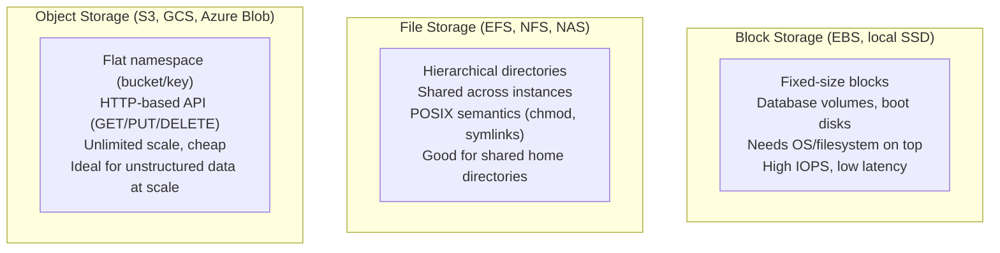
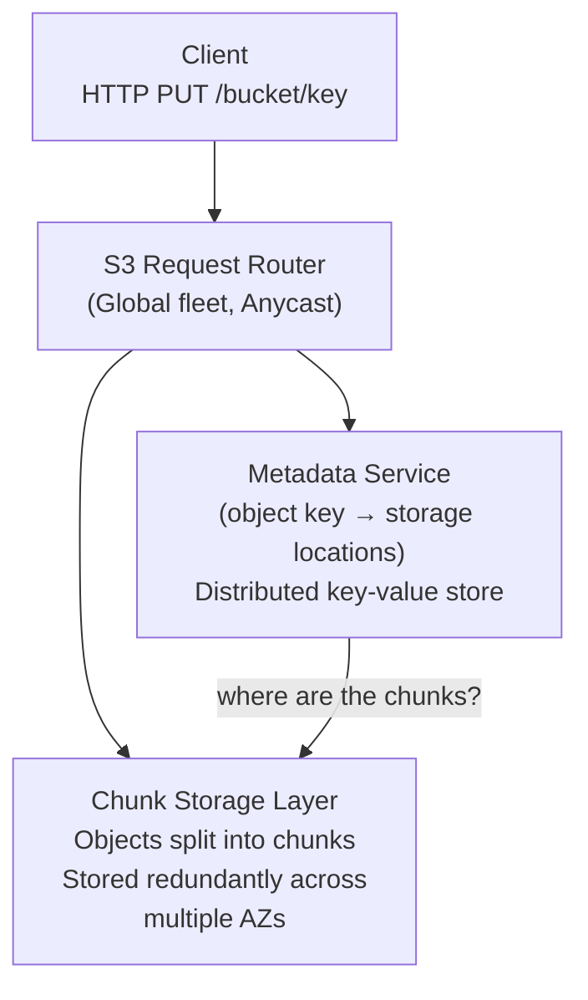
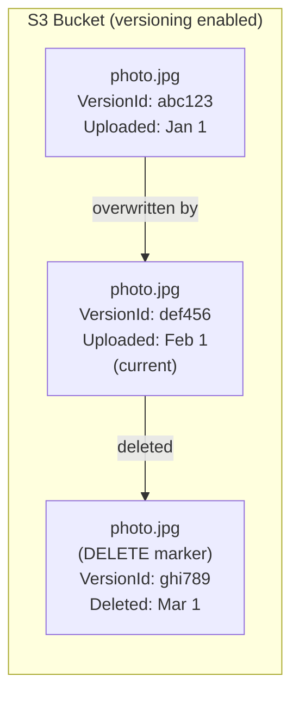
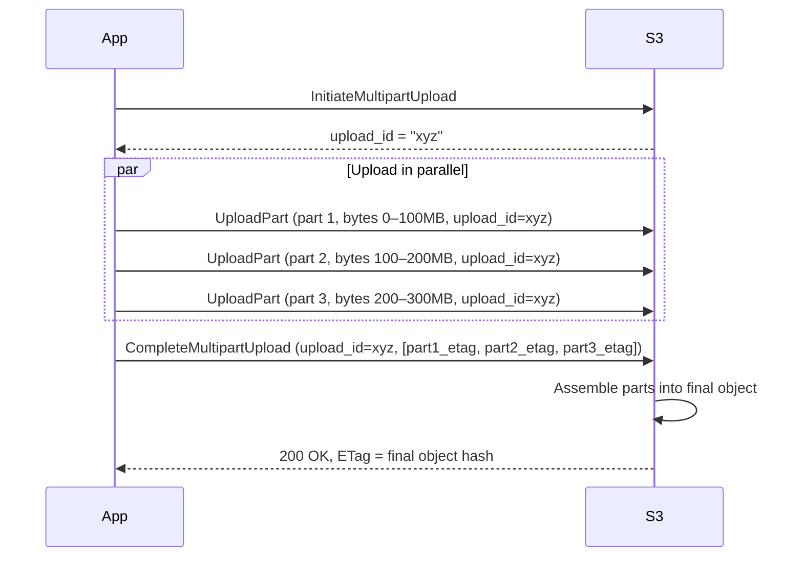
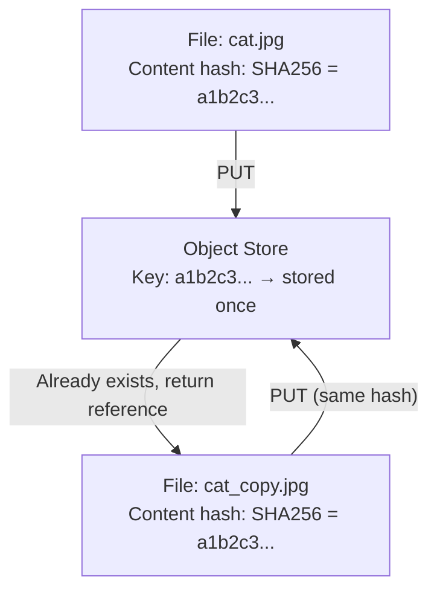
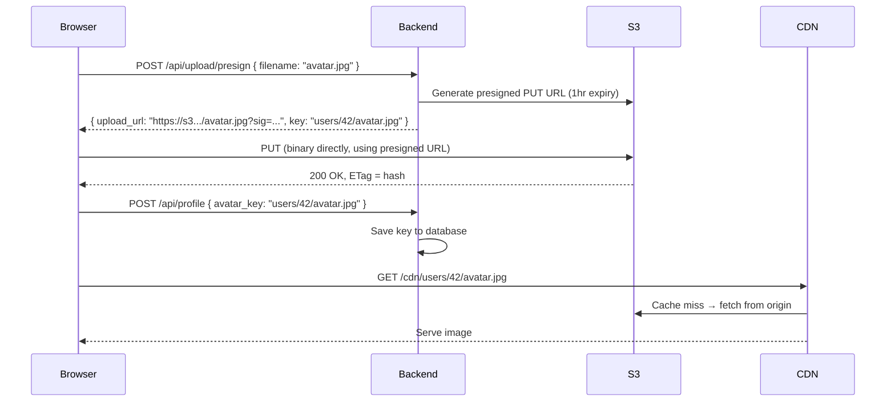
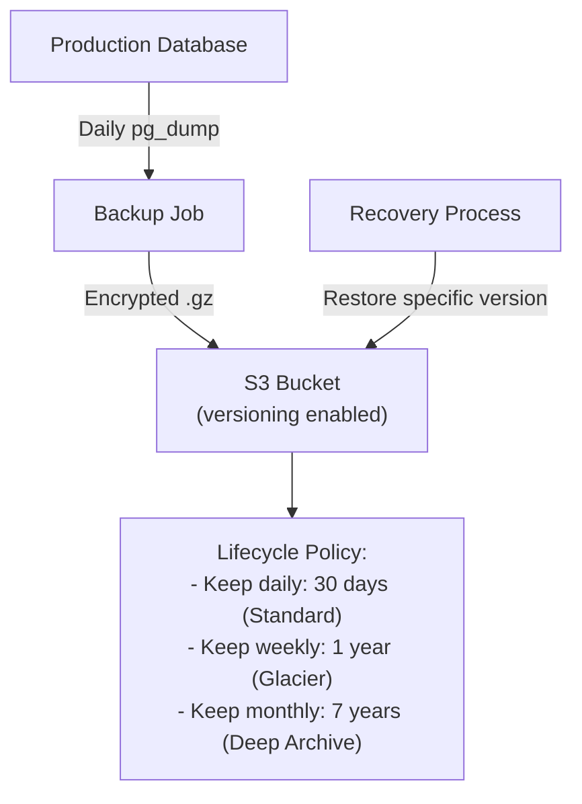
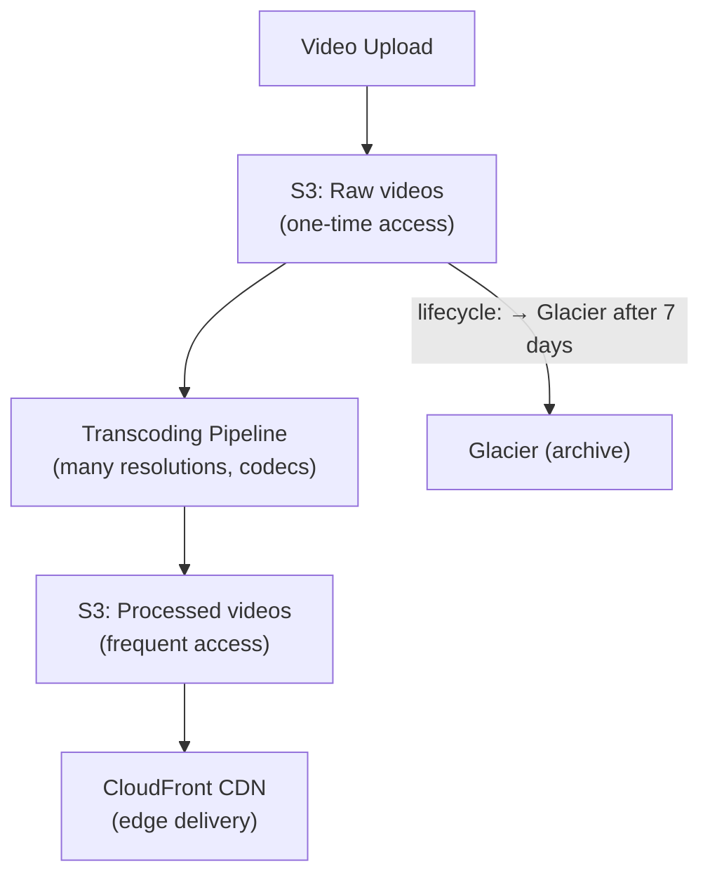

# Object Storage

Object storage persists unstructured data — images, videos, backups, logs, ML model weights — as discrete objects in a flat namespace. Unlike block storage (which looks like a hard drive) or file storage (which organizes data in directories), object storage treats each item as an opaque blob with a unique key and rich metadata.

> **S3 is the reference implementation.** When your interview question involves "where do we store images, videos, or files?", object storage is almost always the answer. It scales to exabytes, costs a fraction of block storage, and requires zero provisioning.

---

## Storage Type Comparison



| Dimension           | Block Storage           | File Storage       | Object Storage                   |
| ------------------- | ----------------------- | ------------------ | -------------------------------- |
| **Access API**      | Read/write byte ranges  | POSIX filesystem   | HTTP REST (GET/PUT)              |
| **Structure**       | Raw blocks              | Directory tree     | Flat (bucket + key)              |
| **Latency**         | Microseconds            | Milliseconds       | Milliseconds–Seconds             |
| **Max size**        | Terabytes (per volume)  | Petabytes          | Exabytes                         |
| **Cost (relative)** | $$$                     | $$                 | $                                |
| **Use case**        | Databases, OS volumes   | Shared file access | Blobs, backups, media            |
| **Mutable?**        | Yes (byte-range writes) | Yes                | Immutable (replace whole object) |

---

## How S3 Works Internally

S3 presents a simple model: `buckets` contain `objects`. Each object is identified by its key (effectively a path). Internally:



**Key internal properties:**

- **Flat namespace:** Despite key names like `photos/2024/jan/profile.jpg`, S3 has no real directory hierarchy. The `/` is just part of the key name. Internally, S3 uses prefixes for efficient listing.
- **Chunked storage:** Large objects are split into chunks, distributed across multiple data centers for redundancy (11 9s of durability)
- **Content-addressed internally:** Chunks are stored by their hash — identical chunks stored once (deduplication)
- **Erasure coding:** S3 uses erasure coding (like RAID across AZs) — can lose several chunks and still reconstruct the object

---

## S3 Consistency Model

**Before December 2020:** S3 was eventually consistent for overwrite PUTs and DELETEs. You could PUT an object, then immediately GET it and get the old version (or 404).

**After December 2020:** S3 provides **strong read-after-write consistency** for all operations — for free, with no performance penalty:

```
PUT  /bucket/photo.jpg → 200 OK
GET  /bucket/photo.jpg → 200 (guaranteed to see the new version)
LIST /bucket/?prefix=photo → guaranteed to include photo.jpg
```

This was a major change — old patterns that worked around eventual consistency (adding delays, using DynamoDB as a consistency layer) are no longer needed.

---

## Key S3 Features

### Versioning

S3 can store every version of an object:



- `GET /bucket/photo.jpg` returns the current version (or 404 if latest is a delete marker)
- `GET /bucket/photo.jpg?versionId=abc123` returns the specific version
- Old versions are retained — you can roll back or audit changes
- **Cost:** You pay for all versions stored

### Presigned URLs

Grant time-limited, capability-limited access to a specific object without exposing credentials:

```python
import boto3

s3 = boto3.client('s3')

# Generate URL valid for 1 hour — client can upload without AWS credentials
presigned_url = s3.generate_presigned_url(
    'put_object',
    Params={'Bucket': 'user-uploads', 'Key': 'user-42/avatar.jpg'},
    ExpiresIn=3600  # 1 hour
)

# The URL contains the signature — anyone with it can PUT for 1 hour
# After expiry, URL is invalid — no revocation needed
```

**Pattern:** Browser uploads directly to S3 using a presigned URL from your backend. Your backend never touches the binary file — only metadata. This is the standard pattern for user file uploads.

### Multipart Upload

For large files (> 100 MB), upload in parallel parts:



**Benefits:** Resume interrupted uploads (only re-upload failed parts). Parallel parts = faster uploads for large objects. Minimum part size: 5 MB (except last part).

### Lifecycle Policies

Automatically transition objects between storage classes or expire them:

```json
{
  "Rules": [
    {
      "Filter": { "Prefix": "logs/" },
      "Transitions": [
        { "Days": 30, "StorageClass": "STANDARD_IA" },
        { "Days": 90, "StorageClass": "GLACIER" },
        { "Days": 365, "StorageClass": "DEEP_ARCHIVE" }
      ],
      "Expiration": { "Days": 2555 }
    }
  ]
}
```

---

## S3 Storage Classes

| Class                   | Access Pattern           | Retrieval Time | Cost (storage) | Cost (retrieval) |
| ----------------------- | ------------------------ | -------------- | -------------- | ---------------- |
| **Standard**            | Frequent                 | Milliseconds   | $$$            | Free             |
| **Standard-IA**         | Infrequent               | Milliseconds   | $$             | $ per GB         |
| **One Zone-IA**         | Infrequent, non-critical | Milliseconds   | $              | $ per GB         |
| **Intelligent-Tiering** | Unknown/changing         | Milliseconds   | $$+ monitoring | Free             |
| **Glacier Instant**     | Archive, occasional      | Milliseconds   | $              | $$ per GB        |
| **Glacier Flexible**    | Archive, rare            | Minutes–hours  | $              | $$$ per GB       |
| **Deep Archive**        | Long-term retention      | 12–48 hours    | ¢              | $$$$ per GB      |

**Cost optimization rule:** Put your hot data in Standard, transition to Standard-IA after 30 days of no access, Glacier after 90 days. Use Intelligent-Tiering if you're unsure of access patterns — it monitors and moves objects automatically.

---

## Content-Addressed Storage Pattern

Store objects by the hash of their content (not by arbitrary name):



**Benefits:**

- **Deduplication:** Same content stored once, regardless of filename
- **Integrity:** Key IS the checksum — retrieve, hash, compare to detect corruption
- **Cache-friendly:** Content never changes (new content = new hash = new key)

**Real-world usage:**

- **Git:** Every blob, tree, and commit is stored by SHA-1 hash of content
- **Docker:** Each layer is stored by SHA256 of its content — identical layers shared across images
- **S3 ETag:** S3 returns the MD5 hash of the object as the ETag — use it to verify uploads
- **npm/yarn:** Package tarballs are content-addressed — lockfiles store hashes for integrity

---

## Real-World Patterns

### Pattern 1: User File Upload Flow



**Why upload directly to S3?** Your backend doesn't become a bottleneck or a bandwidth cost center. S3 handles the binary transfer; your backend only handles metadata.

### Pattern 2: Backup System



### Pattern 3: Netflix / Video Delivery



---

## Interview Talking Points

**1. Where would you store user-uploaded images in a system design?**

> "Object storage — S3 or equivalent. The application uses presigned URLs so the client uploads directly to S3 without going through the backend servers. S3 handles replication across AZs (11 9s durability). Images are served via a CDN (CloudFront) to avoid per-request S3 costs and to reduce latency. Metadata (filename, owner, upload time) is stored in the relational database; only the S3 key is saved."

**2. What is the difference between block, file, and object storage?**

> "Block storage (like EBS) is a raw disk — low latency, high IOPS, ideal for databases. File storage (like EFS) is a shared POSIX filesystem — useful for shared home directories or legacy apps. Object storage (like S3) is a flat HTTP-based store — infinite scale, cheap, and ideal for unstructured data like images, videos, and backups. Object storage is immutable — you replace whole objects, not byte ranges."

**3. How would you handle large file uploads?**

> "Multipart upload. The client initiates with `CreateMultipartUpload`, then uploads individual 5–100MB parts in parallel. Each part gets an ETag. The final `CompleteMultipartUpload` call with all ETags assembles the object. This allows parallelism (faster uploads), resumability (re-upload only failed parts), and avoids memory constraints (you don't load the whole file into memory)."

**4. How do you reduce S3 storage costs over time?**

> "Lifecycle policies. For example: keep objects in Standard for the first 30 days, transition to Standard-IA (infrequent access) after 30 days, Glacier after 90 days, Deep Archive after 365 days, and expire (delete) after 7 years. For access patterns I don't know in advance, Intelligent-Tiering monitors access and moves objects automatically without a retrieval penalty."

---

## Key Takeaways

- **Object storage is the default choice** for unstructured data: images, videos, logs, backups, ML models
- S3 provides **strong read-after-write consistency** (since Dec 2020) — no need for workarounds
- **Presigned URLs** enable direct browser-to-S3 uploads — backend never touches the binary data
- **Multipart upload** enables parallel, resumable uploads for large files
- **Lifecycle policies** automate cost optimization — move cold data to cheaper storage classes
- **Content-addressed storage** (hash as key) enables deduplication and integrity verification
- **CDN + object storage** is the canonical pattern for serving static assets globally at scale
